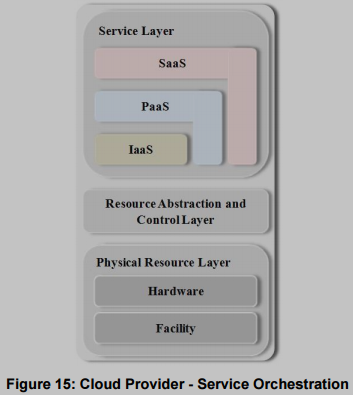
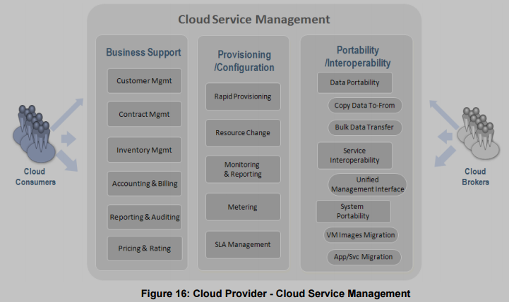

<!-- KaTeX auto-render header -->
<link rel="stylesheet" href="https://cdn.jsdelivr.net/npm/katex@0.16.0/dist/katex.min.css">

# Summary of NIST SP Documents: Cloud Computing Reference Architecture

* **NIST SP 800-145** defines cloud computing
* **NIST SP 500-292** (document on which this notes are based on) provides a reference architecture for cloud computing
* **NIST SP 500-322** provides a methodology to evaluate whether a specific service offering truly aligns with the NIST definition of cloud computing outlined in SP 800-145, so it offers criteria and worksheets to assess if a service exhibits the five essential characteristics.

In essence, 800-145 sets the foundational definition, and 500-292 uses that definition to create a blueprint for implementing and managing cloud systems, while 500-322 offers the tools and criteria to determine if a given service actually is a cloud service according to that initial definition.

## 1. Conceptual Reference Model & Major Actors
The reference architecture is actor/role-based and identifies **five** major actors which roles and responsibilities vary based on the service mode (IaaS, PaaS, SaaS):

* **Cloud Consumer:**
    * **Person/Organization** that maintains a business relationship and uses services from Cloud Providers.

* **Cloud Provider (CSP):**
    * **Person/Organization/Entity** responsible for making a service available to Cloud Consumers.
    * Major activity areas: Service Deployment, Service Orchestration, Cloud Service Management, Security, and Privacy.

* **Cloud Auditor:**
    * Independent **third-party entity** that assesses cloud services for performance, security, and conformance to standards and policies (e.g., security controls, privacy impact).

* **Cloud Broker:** 
    * **Entity** that manages the use, performance, and delivery of cloud services, and negotiates relationships between Cloud Providers and Cloud Consumers.
    * Can offer services in **three categories**:
        * **Service Intermediation:** Enhances a given service or provides value-added services (e.g., identity management, security enhancements).
        * **Service Aggregation:** Combines and integrates multiple services into new services, ensuring data integration and security.
        * **Service Arbitrage:** Similar to aggregation but services are not fixed; the broker has flexibility to choose services from multiple providers (e.g., for best pricing or performance).

* **Cloud Carrier:** Intermediary that provides connectivity of cloud services from Cloud Providers to Cloud Consumers (e.g., network providers).

* **Interactions between roles:**
    * Consumers can request services directly from Providers or via Brokers.
    * Auditors interact with Consumers and Providers for assessments.
    * Carriers provide the network link between Consumers and Providers.

## 2. Scope of Control (Provider vs. Consumer)
The level of control a consumer has over resources depends on the service model:
* **Application Layer:** Used by SaaS consumers; installed/managed by PaaS/IaaS consumers and SaaS providers.
* **Middleware Layer:** Used by PaaS consumers; installed/managed by IaaS consumers or PaaS providers; hidden from SaaS consumers.
* **Operating System Layer:** Hidden from SaaS/PaaS consumers. IaaS consumers manage guest OS(s); IaaS providers control the host OS.
    * **SaaS:** Consumer has minimal control (user-specific application configurations).
    * **PaaS:** Consumer controls deployed applications and some hosting environment configurations.
    * **IaaS:** Consumer controls OS, storage, deployed applications, and some networking components.

## 3. Architectural Components (Cloud Provider Activities)

### 3.1. Service Deployment
**Refers to how the cloud infrastructure is operated and made available**. 

The **four** deployment models are:
* **Public Cloud:** Infrastructure is available to the general public, owned by a cloud services seller.
* **Private Cloud:** Infrastructure is for exclusive use by a single organization. Can be on-site or outsourced (on-premises and off-premises, respectively).
* **Community Cloud:** Infrastructure is shared by several organizations with common concerns (e.g., mission, security). Can be on-site or outsourced (on-premises and off-premises, respectively).
* **Hybrid Cloud:** Composition of two or more distinct cloud infrastructures (private, community, or public) bound by technology enabling data/application portability.

### 3.2. Service Orchestration

***Service Orchestration*: Coordination and Management of computing resources to support Cloud Providers to provide cloud services.** 

It involves a **three-layered** model:
* **Service Layer: Defines interfaces for consumers to access SaaS, PaaS, and IaaS.**

    Services can be:
    * **Interdependent**:  Operating in a connected way, where one cloud service layer relies on or utilizes functionalities provided by other cloud service layers within the same orchestration model. 
        * ***Example**: SaaS application can be built on top of virtual machines from an IaaS cloud*
    * **Standalone**: Operating independently and without requiring or relying on other cloud service layers within the same orchestration model. 
        * ***Example:** SaaS application can be built directly on top of cloud resouces without using IaaS virtual machines*
* **Resource Abstraction and Control Layer:** Contains software components (e.g., hypervisors, VMs, virtual storage) that abstract physical resources (*Resource Abstraction*) and manage their access, allocation, and monitoring (*Control Layer*). This layer enables *resource pooling, dynamic allocation, and measured service*.
* **Physical Resource Layer:** Includes all physical computing resources (hardware: CPUs, memory, networks, storage) and facility resources (HVAC, power, communications).

### 3.3. Cloud Service Management
Cloud Service Management includes all of the service-related functions that are necessary for the 
management and operation of those services required by or proposed to cloud consumers. 

It includes:
* **Business Support:** Business Support entails the set of business-related services dealing with clients and supporting processes. It includes the components used to run business operations that are client-facing:
    * *Customer Management*: Manage customer accounts, open/close/terminate accounts. 
    * *Contract Management*: Manage service contracts
    * *Pricing & Rating*: Evaluate cloud services and determine pricing rules based on a user's profile, etc.
* **Provisioning and Configuration:**
    * *Rapid Provisioning*: (automated deployment)
    * *Resource Changing* (upgrades, repairs, adding nodes)
    * *Monitoring & Reporting* (virtual resources, cloud operations, performance)
    * *Metering* (tracking usage for billing)
    * *SLA Management* (definition, monitoring, enforcement)
* **Portability and Interoperability:**
    * *Data Portability:* Ability to copy data into/out of a cloud or use disk for bulk data transfer.\
    (*Bulk data transfer: Trasferimento in blocco*)
    * *Service Interoperability:* Ability to use data and services across multiple clouds with a unified interface.
    * *System Portability:* Ability to migrate VM instances or images, applications, and services between providers.

### 3.4. Security
* **Service Model Perspectives:** Different service models (SaaS, PaaS, IaaS) present different attack surfaces and security needs.
    * *Example: Browser security for SaaS, Hypervisor security for IaaS.*

* **Deployment Model Implications:** Security concerns vary by deployment model. 
    * *Example: Workload isolation is more critical in public clouds than private clouds* 
    * *Example: Access boundaries differ for on-site vs. outsourced clouds.*
    
* **Shared Security Responsibilities:** Both providers and consumers share security responsibilities. The split depends on the service model and who has control over specific resources.

### 3.5. Privacy
Cloud providers must protect:
* **Personal Information** (*PI*): A broad category and encompasses any data that can lead to the identification of an individual.
    * *Example:*: browsing history, location data, purchase history.

* **Personally Identifiable Information** (*PII*): information that can be used to trace an individual's identity 
    * *Example*: name, social security number, biometric 
