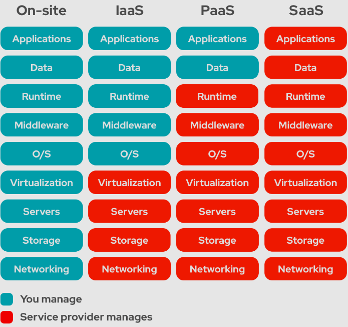

<!-- KaTeX auto-render header -->
<link rel="stylesheet" href="https://cdn.jsdelivr.net/npm/katex@0.16.0/dist/katex.min.css">

# Study Questions for NIST SP 500-322: Evaluation of Cloud Computing Services

## Purpose and Approach of NIST SP 500-322

### NIST Cloud Computing Definition
Cloud computing is a model for enabling ***ubiquitous***, convenient, on-demand network access to a shared pool of configurable computing resources (e.g., networks, servers, storage, applications, and services) that can be rapidly provisioned and released with minimal management effort or service provider interaction.

***Ubiquitous***: server and data can be located anywhere and accessed from anywhere.

### According to NIST SP 500-322, what is the fundamental requirement for a computing capability to be qualified as a "cloud service"?
A computing capability must exhibit all **five essential characteristics** (On-demand self-service, Broad network access, Resource pooling, Rapid elasticity, and Measured service) to be qualified as a "cloud service."

## Five Essential Characteristics of Cloud Computing

* ***On-demand self-service***: A consumer can unilaterally provision computing capabilities (server time, network storage) as needed automatically without requiring human interaction with each service provider.
    * *Example: A developer provisioning a new virtual server from a web console without needing to call or email the provider.*

* ***Broad network access***: Capabilities are available over the network (LAN, WAN) and accessed through standard mechanisms (standard internet protocols) that promote use by heterogeneous thin or thick client platforms (e.g., mobile phones, tablets, laptops, and workstations). 
    * *Example: Accessing cloud-based email (SaaS) from a smartphone, laptop, or tablet through a web browser or dedicated app.*

* ***Resource pooling***: The provider's computing resources (e.g., storage, processing) are pooled to serve multiple consumers using a multi-tenant model with different physical and virtual resources dynamically assigned and reassigned according to consumer demand. \
 There is a sense of location independence, where the customer generally has no control or knowledge over the exact location of the provided resources but may be able to specify location at a higher level of abstraction (e.g., country, state, or datacenter). 
 
    The key is the *ability* to serve **multiple tenants** using shared resources, each tenant has its own logically dedicated instance and is unaware of other tenants.\
    It requires **strong isolation mechanisms** to ensure that one tenant's activities do not negatively impact or compromise another tenant.

    * *Example: Multiple customers' virtual machines running on the same physical server, or their data stored on a shared storage system, without them knowing the exact physical location.*

* ***Rapid elasticity***: Capabilities can be elastically provisioned and released, in some cases automatically, to scale rapidly commensurate with demand. To the consumer, the capabilities available for provisioning often appear to be unlimited.\
The scaling should be rapid, automated and near-real-time, or at least fast enough to support the requirements of the CSC.

    * *Example: An e-commerce website automatically scaling up the number of web servers during a holiday sale and scaling down after the peak.*

* ***Measured service***: Cloud systems automatically control and optimize resource use by leveraging a metering capability appropriate to the type of service (e.g., storage, processing, bandwidth, and active user accounts). \
Resource usage can be monitored, controlled, and reported, providing transparency for both the provider and consumer of the utilized service. \
This allows for things like *pay-per-use billing*.

    * **Resilience:** The monitoring and reporting capabilities of measured services also contribute to increased **resilience**, this is the ability to provide and maintain an acceptable level of service in the face of faults and challenges to normal operation.
    By continuously tracking resource usage and performance metrics, consumers can proactively identify potential issues (e.g., approaching capacity limits, performance degradation) and take corrective actions before failures occur. This enables the implementation of automated responses (like autoscaling) to maintain application availability and responsiveness, enhancing the overall resilience of the cloud solution.

    * *Example: Paying for cloud storage based on the gigabytes consumed per month, or for compute instances based on hours of usage.*

Okay, here's a brief summary of the evaluation methodology from NIST SP 500-322 that you can add to your notes. This focuses on how the document approaches determining if a service is a true cloud service according to the NIST definition.

---

## NIST SP 500-322: Cloud Service Evaluation Methodology

NIST SP 500-322 provides a framework and detailed analysis to help **evaluate whether a given computing capability qualifies as a "cloud service"** according to the definition in NIST SP 800-145, and to categorize it by service or deployment model. 

The core principle is that a service **must demonstrate all five essential characteristics** of cloud computing to be considered a cloud service.

The methodology involves:

* **Decomposition of Essential Characteristics**: Each of the five essential characteristics (On-demand self-service, Broad network access, Resource pooling, Rapid elasticity, and Measured service) is broken down into **primary criteria**.
* **Evaluation Options (Option A & Option B)**: For many criteria within each characteristic, SP 500-322 offers two evaluation options:
    * **Option A**: This is generally a **more objective measure**, often based on capabilities common to all Cloud Service Customers (CSCs) or verifiable by the Cloud Service Provider (CSP).
    * **Option B**: This is often **more subjective** and depends on the specific requirements of the individual CSC. If a CSC uses Option B, the evaluation is specific to their needs and may not be directly comparable with evaluations done by other CSCs with different requirements.
* **Entity for Confirmation**: The document often specifies whether the Cloud Service Customer (CSC), the Cloud Service Provider (CSP), or a third party is best positioned to confirm if a criterion is met. 
    * *Example*, internal architectural details like resource pooling are typically confirmed by the CSP, while aspects like broad network access from required locations might be confirmed by the CSC based on their needs.
* **Worksheets**: The document provides worksheets to systematically assess a service against the essential characteristics, service models, and deployment models.

This approach allows for flexibility in interpretation while providing a structured way to determine alignment with the NIST cloud computing definition, recognizing that the final determination can involve both objective assessments and subjective judgments based on a consumer's specific needs.

---

## Cloud Service Models

Roles and responsibility of both roles are shown in blue and red</h5>

 

* ***Software as a Service (SaaS):*** Consumer use the provider's applications running on a cloud infrastructure.

    **Consumers** control is typically limited to application configuration. \
    **Provider** manages almost everything: application, OS, servers, storage, and networking.

    The applications are **accessible from various client devices** through either a thin client interface (like a web browser) or a program interface.
    
    * *Example: Google Workspace, Salesforce, Microsoft 365 (web versions).*
* ***Platform as a Service (PaaS):*** Consumer can deploy applications onto the provider cloud infrastructure.

    **Consumers** control the applications they deploy and can configure the environment settings. \
    **Provider** control OS, physical and virtualization layer.
    
    * *Example: AWS Elastic Beanstalk, Google App Engine, Heroku.*
* ***Infrastructure as a Service (IaaS)*:** Delivers fundamental computing resources like virtual machines, storage, and networks.

    **Consumers** manage the applications, OS, and have some control over networking components (like firewalls). \
    **Provider** manages the physical and virtualization layer.

    * *Example: Amazon EC2, Microsoft Azure Virtual Machines, Google Compute Engine.*

## Cloud Deployment Models

* **Public Cloud:** Services offered over the public internet and available to anyone who wants to purchase them.
    * *Examples: Amazon Web Services (AWS), Microsoft Azure, Google Cloud Platform (GCP).*
    
* **Private Cloud:** Cloud infrastructure operated solely for a single organization. It can be managed by the organization or a third party and may exist on-premises, so it is directly managed by the organization, or off-premises, so the organization typically have less control over the infrastructure. 
    * *Example: A company's internal data center running cloud technologies (like OpenStack or VMware vCloud) exclusively for its own business units.*

* **Hybrid Cloud:** A composition of two or more distinct cloud infrastructures (private, community, or public) bounded together by standardized or proprietary technology enabling data and application portability (e.g., cloud bursting for load balancing or workload migration). 
    * *Example: An organization uses its private cloud for sensitive data and core applications, but uses a public cloud for development/testing, disaster recovery, or to handle peak loads.*

* **Community Cloud:** Cloud infrastructure shared by several organizations and supports a specific community that has shared concerns (e.g., mission, security requirements, policy, and compliance considerations). It may be managed by the organizations or a third party. 
    * *Example: A cloud platform built for exclusive use by several government agencies to share specific applications and data related to a common mission, or a cloud for universities in a specific research field.*

