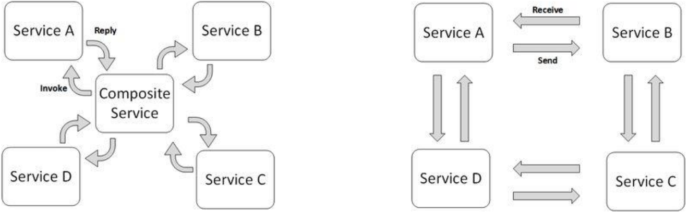
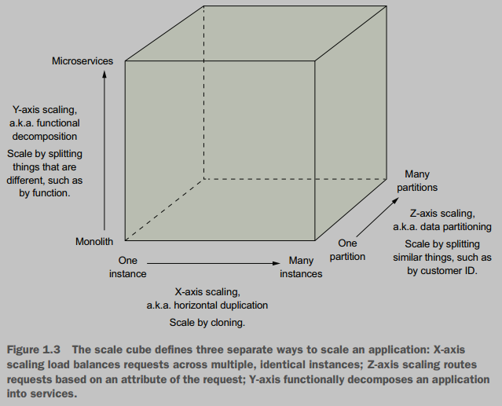

# Chapter 2: Enabling Technologies for Cloud Computing

This chapter explores the fundamental technologies and architectural concepts that underpin cloud computing. These include distributed computing principles, various architectural styles, service-oriented approaches like SOA and microservices, and the concept of autonomic computing for self-managing systems.

## 1. Distributed Computing

Distributed computing is a foundational model for cloud computing. It involves breaking down computation into units that can be executed concurrently on different computing elements, which may be in different locations and have heterogeneous hardware/software.

**Key Definitions:**

* **DEFINITION**: A distributed system is a collection of independent computers, connected by a network, which communicates only by passing messages, that appears to its users as a **single coherent system**.

**Tanenbaum:** "A distributed system is a collection of independent computers that appears to its users as a **single coherent system**." (Focuses on unified usage and resource aggregation).

**Coulouris:** "A distributed system is one in which components located at networked computers communicate and coordinate their actions only by passing messages." (Focuses on the networked nature and message-based communication).

**Characteristics often implied by "Distributed":**
* **Computation spread** across different computing elements (processors on different nodes, same computer, or cores).
* Computing elements may be in **different physical locations**.
* **Heterogeneity** in hardware and software features is common (Different hardware and software (OS, Programming Languages)).

**Components of a Distributed System (Layered View):**
1.  **Applications:** End-user applications and services.
2.  **Middleware:** Provides a uniform environment for developing and deploying distributed applications, hiding the heterogeneity of underlying layers.
3.  **Operating System:** Manages hardware resources, provides basic IPC services, process scheduling, and management. \
Allows easy harnessing of heterogeneous components and their organization into
a coherent and uniform system.
4.  **Hardware & Networking:** Physical infrastructure including computers, servers, and network components (routers, switches, etc.). \
Taken together these two layers become the platform on top of which software is deployed to turn a set of networked computers into a distributed system.

**Cloud Computing as a Specialized Distributed System:**
Cloud computing is a form of distributed computing that introduces specific utilization models for remotely provisioning scalable and measured resources. 

The layered view maps to cloud service models:
* Applications (SaaS)
* Middleware/Frameworks for Cloud Application Development (PaaS)
* Hardware, OS, Virtual Hardware, Networking, OS Images, Storage (IaaS)

## 2. Architectural Styles for Distributed Systems

Using Client-Server, P2P and Message Message Queuing as architectural styles examples, Architectural styles define:
* **Components** (unit of software that encapsulates a function of the system) and **Connectors** (communication mechanism between components) **Vocabulary**
    * *Example*: Client and Servers, Peers, Producer and Consumer; Network Protocols to handling requests and response, Message Queue and Message Broker.
* Components and Connectors **roles**
    * *Example*: Initiate requests, Presenting user interface, Handling user interaction, Create and send or Receive and process messages.
* **Components distribution** among multiple machines
    * *Example*: Centralized or Distributed Servers, Producers and Consumers on separate machines, Message Queue/Broker on dedicated or distributed infrastructure.
* **Pattern for structural organization**.
    * *Example*: 
        * Hierarchical, centralized server(s) in Client-Server; 
        * Decentralized, symmetric roles, direct peer-to-peer interaction in P2P; 
        * Decoupled, asynchronous communication managed by the message queue/broker in Message Queuing.

### A. Software Architectural Styles (Logical Organization)

Software architectural styles are based on the **logical arrangement** of components. They are helpful because they provide an **intuitive view** of the whole system, **despite its physical deployment**. They also identify the **expected interaction patterns** between them.

The following are common software architectural styles that focus on the logical arrangement of software elements:

1.  **Data-Centered Architectures:** Data is fundamental element of the system, Access to shared data is core characteristic.
    * **Repository Style:** Features a central data structure (repository) and independent components that operate on this data.
        * **Database Systems**: Components triggers operations on central data structure (Database).
        * **Blackboard Systems**: Central data structure (blackboard) triggers components operation to execute. 
            * Used in AI, speech recognition.
2.  **Data-Flow Architectures:** Orderly motion of data from component to component, output of one is input to the next.
    * **Batch Sequential Style:** Ordered sequence of separate programs; Whole output is required to be processed as input. 
        * *Common in scientific computing for pre-filter, analyze, post-process workflows.*
    * **Pipe-and-Filter Style:** Data processed a sequence of "filters" (components of the processing chain) connected by "pipes" (data streams, often in-memory buffers); As long as a consumable amount of output data is ready, it can be used as input.
        * *Examples:*  MapReduce paradigm (Input -> Splitting -> Mapping -> Shuffling -> Reducing -> Final Result).
3.  **Virtual Machine Architectures:**
    * An abstract execution environment (virtual machine) simulates features not available in the hardware/software, making applications portable.
    * **Rule-Based Style:** An inference engine uses rules/predicates and input facts/assertions to transform data or infer properties. Used in process control, network intrusion detection.
    * **Interpreter Style:** An engine interprets a pseudo-program. Used for high-level programming languages (Java, C#) and scripting languages.
4.  **Call and Return Architectures:**
    * Systems organized by components connected mainly by method calls.
    * **Top-Down Style (Main Program and Subroutine):** A main program calls subprograms/procedures. Tree-like execution structure.
    * **Object-Oriented Style:** Systems are classes and objects; data and operations are coupled. Encapsulation and integrity are key.
    * **Layered Style:** System designed in layers, each providing a different level of abstraction and interacting primarily with adjacent layers via defined protocols/interfaces. *Examples:* OS kernels, TCP/IP stack.
5.  **Independent Components Architectures:**
    * Systems modeled as independent components with their own lifecycles, interacting to perform activities.
    * **Communicating Processes:** Independent processes use IPC facilities (RPC, Web Services, REST, Distributed Objects) for coordination. Can be physically organized as Client/Server, P2P, SOA.
    * **Event-Based Systems (Publish-Subscribe):** Loosely coupled components. Components publish events; other components subscribe and provide callbacks that execute when events are activated. Promotes open systems. *Example:* A component `P1` emits event `e1`, an event/message broker delivers it to subscribed services `S1`, `Sn`.

### B. System Architectural Styles (Physical Organization)

These describe the physical organization and deployment of components.

1.  **Client/Server Architecture:**
    * **Components**: Clients and a Server, interacting over a network.
    * **Communication** is typically client-initiated (request-response).
    * **Conceptual Tiers:** 
        * Presentation: Interaction with the user.
        * Application Logic: Core functionality of the application.
        * Data Storage: Management and persistance of data.
    * **Thin-Client Model:** Application logic and Data Storage (Server); Presentation (Client).
    * **Fat-Client Model:** Data Storage (Server); Application and Presentation (Client).
    * **Multi-Tiered Models:**
        * **Two-Tier (Classic Model):** Client (presentation) and Server (application logic + data storage). Suffers scalability issues.
        * **Three-Tier:** Separates presentation, application logic, and data storage into distinct tiers. More scalable as tiers can be distributed. 
            *Example:* Web browser (client), application server (business logic), database server (data storage).
        * **N-Tier**: Tree-tier with load balancers, multiple app servers, and sharded/replicated databases.

2.  **Peer-to-Peer (P2P) Architecture:**
    * Symmetric architecture where all components (peers) play the same role, acting as both clients and servers.
    * Suitable for highly decentralized systems, offering better scalability in terms of the number of peers.
        * *Examples:* File-sharing applications (BitTorrent).

### C. Models for Interprocess Communication (IPC)

**IPC** (Interprocess Communication) are mechanisms that allow different processes running on a computer system to **communicate** and **share data** with each other, it is what test together different components of a distributed system making them to act as a single system.

1.  **Message-Based Communication:**
    * A foundational concept where discrete amounts of information (messages) are passed between entities.
    * **Message Passing:** Explicit encoding of data into messages (e.g., MPI).
    * **Remote Procedure Call (RPC):** Extends procedure calls across processes. Messages convey procedure info, parameters, and return values (marshaling/unmarshaling).
    * **Distributed Objects:** RPC for object-oriented paradigms (e.g., CORBA, Java RMI, .NET Remoting). Messages handle remote method invocation.
    * **Web Services:** RPC over HTTP (e.g., SOAP, REST). Messages (often XML/JSON) for requests and responses.

2.  **Interaction Patterns for Message-Based Communication:**
    * **Point-to-Point:** Direct addressing between a sender and a receiver. Can be direct communication or queue-based.
    * **Publish-Subscribe** (Called "Event-Based" in slides): Publishers emit messages on specific topics/events; subscribers register interest and receive relevant messages. Decouples publishers and subscribers. Uses push (publisher notifies) or pull (subscriber checks) strategies.
    * **Request-Reply:** For each message sent, a reply is expected. Common in point-to-point models.

## 3. Service-Oriented Architecture (SOA)

SOA is an architectural style that structures an application as a collection of interacting services. It emphasizes **service-orientation**, where services are the primary building blocks.

**What is a Service (in SOA)?**
* A logical representation of a repeatable activity with a specified outcome (e.g., check customer credit).
* **Self-contained** (does not rely on other services) and often a "**black box**" to consumers (which interact using exposed interface, like API).
* May be **composed** of other services.
* **Characteristics:**
    * **Interfaces** to interact with the service are kept minimal to foster **reuse** and **simplify interaction**.
    * **Autonomous services**, they can be integrated in different systems at the same time and indipendently can handle failures.
    * Services share **schema** and **contracts**, not interfaces and classes (like OOP), so heterogeneity of distributed systems is promotod.
        * Sceham: Defines structure of data exchanged between services.
        * Contract: Defines structure of messages the service can send and receive.
    * **Compatibility** is determined by policy (semantic compatibility beyond structural).

**SOA Principles & Guiding Concepts:**
* **Standardized Communication:** Services adhere to a communication agreement.
* **Loose Coupling:** Services are self-contained, minimizing dependencies.
* **Abstraction:** Services hide their logic; defined by contracts.
* **Reusability:** Designed as components, services can be reused.
* **Autonomy:** Services control their encapsulated logic.
* **Lack of State (Statelessness):** Services ideally maintain no state between requests from consumers, enhancing reusability and scalability.
* **Discoverability:** Services defined by discoverable metadata (e.g., via UDDI registry).
* **Composability:** Services can be *orchestrated* or *choreographed* to create complex operations.

**Roles in SOA:**
1.  **Service Provider:** Maintains and makes services available. Defines and publishes service **contracts** (communication system) in a registry along with service **schemas** (data formats).
2.  **Service Consumer:** Locates service descriptors in registry, develops client components to bind and use the service.
3.  **Service Registry:** Stores **service descriptors** which defines everything a consumer need to know to use the service, it also provide **service discovery** mechanism to allow consumer to search for specific service.

Service Providers and Consumer can belogn to different organizations or business domains.

**Service Coordination:**

* **Service Orchestration:** A central entity (*orchestrator*) coordinates the interaction of services to execute a business process. 
    * *Example*: Travel planner service invoking flight, hotel, and car rental services.
* **Service Choreography:** Coordinated interaction (message exchange) of services **without a single point of control**. \
Each service knows its part in the overall flow and reacts to events or messages from other services.
    * *Example*: Online payment involving a seller service and a credit card company service.

## 4. Web Services (SKIPPABLE)

Web services are a prominent technology for implementing SOA, enabling interoperability across platforms using internet standards.
* **SOAP (Simple Object Access Protocol):** XML-based protocol for exchanging structured information in Web service communication (method invocation, results).
* **WSDL (Web Service Description Language):** XML-based language to describe the interface of a Web service (operations, parameters, data types).
* **UDDI (Universal Description, Discovery, and Integration):** A registry for businesses worldwide to list themselves and their Web services. (Less common now).
* **REST (Representational State Transfer):** An architectural style often used as a simpler alternative to SOAP for web services. Uses standard HTTP methods (GET, POST, PUT, DELETE) and typically JSON or XML for data exchange. Focuses on resources identified by URIs.

Web 2.0 technologies (AJAX, JSON) further enhance web applications that consume these services, providing richer user experiences.

## 5. Microservice Architecture

An architectural style that structures an application as a collection of small, autonomous, and independently deployable services. Services are typically organized around business capabilities and often owned by small, dedicated teams.

 

**Core Ideas (from "Microservices Patterns" by Chris Richardson & "The Art of Scalability"):**
* **X-axis Scaling (Duplication):** Cloning the application across multiple identical instances. Each instance runs the entire application code and handles a portion of the overall load, typically behind a load balancer.
    * *Example:* If one instance of your microservice can handle 100 requests per second, adding three more identical instances behind a load balancer theoretically allows you to handle 400 requests per second.
* **Y-axis Scaling (Functional Decomposition):** Splitting application (*Monolith*) into services (*Microservice*) based on function.
    * *Example:* Instead of a monolithic "*Order Management*" service, you might break it down into "*Order Processing*," "*Inventory Management*", "*Payment Processing*," and "*Shipping Management*" microservices.
* **Z-axis Scaling (Data Partitioning):** Splitting data across multiple istances of the application.
    * *Example:* Customer database can be splitted based on the first letter of the customer's last name, each letter is handled by an instance.

**Benefits of Microservices:**

* **Enables continuous delivery/deployment of large, complex applications:** Achieved through the breakdown into **services as units of modularity**, where each small, focused service with a well-defined **API** and impermeable boundary improves testability and maintainability.
* Services are **small** and **easily maintained** due to their focused functionality and clear API boundaries.
* Services are **independently deployable** and scalable, allowing resources to be allocated precisely where they are needed.
* Enables **autonomous**, **loosely coupled** (minimal dependencies on each other) teams.
* Allows easier experimentation with and adoption of new technologies for different services, fostering innovation and preventing technology lock-in.
* **Better fault isolation** (failure in one service is less likely to bring down the entire system): Enhanced by **each service having its own database** (logically distinct datastore, not different RDBMS), which promotes deep **loose coupling** and prevents cascading failures or resource contention at the data layer.

**Drawbacks of Microservices:**
* **Complexity of Distributed Systems:** Developers must handle inter-service communication, partial failures, and latency.
* **Finding right set of services:** Decomposing a system into the "right" set of services is challenging. Incorrect decomposition can lead to a "*distributed monolith*."
* **Data Management:** Implementing queries that span multiple services is complex.
* **Deployment Complexity:** Managing many moving parts in production requires a high level of automation (e.g., using PaaS, Docker orchestration like Kubernetes).
* **Coordinating Multi-Service Deployments:** Deploying features that span multiple services requires careful coordination.

**Microservices vs. Monolithic Architecture:**
* **Monolith:** Single deployable unit.
    * *Pros (initially):* Simple to develop, test, deploy, and scale (only horizontally).
    * *Cons (as it grows):* Becomes complex, slow to develop/build/start, difficult to scale components with conflicting needs, poor fault isolation, technology stack lock-in ("monolithic hell").
* **Microservices:** Collection of small, independent services.
    * Addresses many cons of large monoliths but introduces distributed system complexities.

### Comparison: SOA vs. Microservices Architecture

#### Service Characteristics

* **Service Taxonomy:**
    * Refers to how services are classified within an architecture.
    * Classifications can be by service type (e.g., business service, infrastructure service) or by business area/function.
    * Helps in organizing and understanding the roles different services play.
* **Service Ownership and Coordination:**
    * **Service Ownership:** Identifies the team responsible to manage a specific service.
    * **Coordination:** Refers to the level of collaboration required between different teams (responsible for one or more different services) to fulfill a single business request or to make changes to the system.
* **Service Granularity:**
    * Describes how much business functionality a service encapsulates.
    * From **fine-grained** (small, single-purpose services) to **coarse-grained** (larger services encompassing broader functionality).
    * Impacts performance, transaction management, and development/deployment agility.

| Feature                       | SOA (Service-Oriented Architecture)                                                                                       | Microservices Architecture                                                                          |
| :---------------------------- | :------------------------------------------------------------------------------------------------------------------------ | :-------------------------------------------------------------------------------------------------- |
| **Service Taxonomy** | **More formal and layered**   <li> Business services <li> Enterprise services <li> Application services <li> Infrastructure services.                               | **Simpler**, often two main types:   <li> **Functional services** supporting business operations <li> **Infrastructure services** for non-functional tasks like logging or security).          |
| **Service Ownership & Coordination** | Often **different owners for different service types** <li> business users for Business services <li> Shared services teams for Enterprise services <li> Development teams for Application services.   This typically **requires significant coordination** across teams for request processing and changes. | Typically, **small development teams** own **both functional and related infrastructure services**.   This model promotes **minimal coordination** between teams. |
| **Service Granularity** | From small application services to very large, coarse-grained enterprise services.   It's common for enterprise services to represent large products or subsystems.                          | Generally **emphasizes small, fine-grained, single-purpose** services."                    |

#### Architecture Characteristics

* **Component Sharing:**
    * **Degree of reusage** of common functionalities or data models accross different services.
* **Service Orchestration vs. Choreography:**
    * **Orchestration:** Involves a central controller that coordinates the interactions between multiple services.
    * **Choreography:** Services interact with each other directly without a central controller.
* **Middleware and API Layer:**
    * **Middleware (typically in SOA):** Refers to an intermediary software layer, often an Enterprise Service Bus (ESB) or integration hub, that facilitates communication between services. It can handle message routing, transformation, protocol conversion, and service orchestration.
    * **API Layer (typically in Microservices):** An optional layer, often an API Gateway, that acts as a single entry point for external clients. It can handle request routing, composition, and cross-cutting concerns like authentication and rate limiting, but is generally "dumber" than an ESB.
* **Inter-service Communication (Access to remote services):**
    * Defines how services interact with each other, including the communication protocols (e.g., HTTP/REST, gRPC, messaging queues like AMQP/JMS) and patterns (synchronous request/response, asynchronous messaging).

| Feature                                  | SOA (Service-Oriented Architecture)                                                                                                | Microservices Architecture                                                                                                   |
| :--------------------------------------- | :--------------------------------------------------------------------------------------------------------------------------------- | :--------------------------------------------------------------------------------------------------------------------------- |
| **Component Sharing** | **Share-as-much-as-possible** architecture style (e.g., enterprise services, global data model, shared databases).                     | **Share-as-little-as-possible** architecture style (favors bounded contexts, each service typically owns its own data/datastore). |
| **Service Orchestration vs. Choreography** | **Uses both**.   Middleware often acts as a central orchestrator for complex processes.           | **Choreography over Orchestration** prefered.     |
| **Middleware and API** | Relies on **messaging middleware** to coordinate service calls.   This middleware provies additional architectural capabilities such as mediation and routing. | Doesn't support messaggins middleware;   May use an **API Layer** to access the service.                       |

#### Architecture Capabilities

* **Application Scope:**
    * Overall size of the application that an architecture pattern can support
        * *Example*: Microkernel architecture are better suited for smaller applications, event-driven architecture are well-suited for larger, more complex applications.
* **Heterogeneous Interoperability:**
    * The ability of the architecture to effectively integrate systems and services that are implemented in **different programming languages**, run on **different platforms**, or use **different communication protocols**.
* **Contract Decoupling:**
    * The degree to which a service consumer and a service provider can **evolve their respective data formats and message structures** (contracts) independently of each other, **without breaking the interaction**. This often involves a **mediation layer** that can transform messages.

| Feature                          | SOA (Service-Oriented Architecture)                                                                                                   | Microservices Architecture                                                                                                     |
| :------------------------------- | :------------------------------------------------------------------------------------------------------------------------------------ | :----------------------------------------------------------------------------------------------------------------------------- |
| **Application Scope** | **Large and complex systems** that require integration with many heterogeneous applications and services.     | **Smaller and well-partitioned web-based systems**, or **applications where independent scaling/deployment is critical.** |
| **Heterogeneous Interoperability** | Support by **no limit** on multiple choices.   **Strong support via Middleware** supporting *protocol-agnostic heterogeneous interoperability*, not even communication protocol need to be known.   | Support by **reducing** number of choices for service integration.   Supports *protocol-aware heterogeneous interoperability*, communication protocol between services need to be known (e.g. REST) |
| **Contract Decoupling** | **Supported** via ESB capabilities (e.g., message transformation, data mapping, versioning abstraction). **Contract Decoupling** is common.            | **Less supported**, Services and their consumers are expected to adhere to well-defined contracts. **Contract decoupling** is less common. |

**Key Distinguishing Concepts:**
* **Bounded Context (Microservices):** Coupling of a service and its associated data as a self-contained unit with minimal dependencies.
* **API Gateway (Microservices):** An optional layer that acts as a single entry point for client requests, routing them to appropriate backend services. Can handle concerns like authentication, rate limiting.
* **Enterprise Service Bus (ESB) (SOA):** A middleware component that facilitates communication and integration between services, often handling message routing, transformation, and orchestration.

## 6. Autonomic Computing

Autonomic computing systems are **systems that can manage themselves**, administrators gives broad desidered outcomes and the autonomic system figures how to achieve them on its own, **reducing the need for manual intervention**.

* **Why Autonomic Computing?**: Modern IT systems are becoming **exceedingly complex**, involving millions of lines of code and heterogeneous components.
* **Goal:** Create computing systems that can:
    * Install, configure, tune, and maintain **themselves**.
    * **Adapt** to changing conditions, workloads, and demands.
    * **Handle** hardware/software failures and security threats with minimal human oversight.

### The Autonomic Manager and MAPE-K Cycle
___

Core of an autonomic system is the **Autonomic Manager**, an intelligent component that oversees a **Managed Element** which can be an hardware (such as a CPU or a Printer), software resource (such as DB) or even an application service. \
The Autonomic Manager operates through a **continuous control loop**, referred as the **MAPE-K cycle** to oversee the Managed Element.

**MAPE-K Cycle:** The core control loop for an autonomic manager:
1.  **Monitor (M):** Collects data (metrics, system states) from the Managed Element using sensors.
2.  **Analyze (A):** Processes and interprets monitored data to detect patterns, anomalies, predict future states, and identify issues or opportunities for optimization. Compares data with thresholds or desired states.
3.  **Plan (P):** Develops a strategy or a sequence of actions to achieve the desired objectives or to correct deviations, based on the analysis.
4.  **Execute (E):** Implements the planned actions, interacting with the Managed Element through **Effectors** to apply necessary changes (e.g., allocate/deallocate VMs, reroute traffic).
5.  **Knowledge (K):** A **shared** knowledge base containing policies, system models, historical data, and other information **used** by the M, A, P, and E components **to make decisions**.

**Autonomic Element:** Consists of one or more managed elements controlled by an autonomic manager. It uses sensors to monitor and effectors to act upon the managed element.

### "Self-*" Properties 
___

* **Self-Configuration:** The ability of components and systems to **automatically configure themselves** according to high-level policies that specify what is desired, not necessarily how to achieve it. \
New components should integrate **seamlessly**, and the rest of the system should adjust automatically.
    * **In Cloud:** Adapting to changes in the environment, such as installing missing or outdated components based on alerts, without human intervention.

    * *Example (Kephart): When a new component is introduced, it learns about the system, registers itself, and other components adapt.*
    * *Example (FC2): An Autonomic Manager (AM) installing missed or outdated components based on system alerts.*

* **Self-Healing:** Ability to detect, diagnose, and repair hardware and software problems to remain functional when faults arise.
    * *Example (Kephart): A system detecting a faulty software module, reverting to an older version, diagnosing the issue, and alerting a developer.*
    * *Example (FC2, Scenario 2): An AM monitors the health of image recognition app instances, checks if the number of healthy instances is above a threshold (e.g., seven), and starts new instances if needed, adding them to a load balancer.*

    * **In Cloud:** Identifying, analyzing, and recovering from faults automatically to improve performance through fault tolerance and reduce the impact of failures.
        * **Common Cloud Failures:** Unexpected configuration changes, resource unavailability, overloading, memory shortages, network failures. (Source: FC2 Answers, Q2.11)
    * **Handling Techniques:** Check-pointing (restarting failed tasks on other resources), failure forecasting, replication. (Source: FC2 Answers, Q2.11)

* **Self-Protection:** Ability to automatically detect threats or failures that remain uncorrected by self-healing measures and take appropriate actions to protect the system from attacks or unauthorized access. Involves anticipating problems based on early warnings and taking steps to avoid or mitigate them.
    * **In Cloud:** Protecting against intrusions and threats by detecting malicious attacks and maintaining system security and integrity.
    * **Handling Techniques:** Secure scheduling policies, trust management systems (behavioral auditing), intrusion detection techniques. (Source: Singh and Chana, Sec 6.5.4)
    
* **Self-Optimization:** The ability of components and systems to continually seek opportunities to improve their own performance and efficiency (in terms of performance or cost). They monitor, experiment with, and tune their own parameters.
    * **In Cloud:** Improving performance, such as by dynamically scheduling tasks to optimize resource utilization and complete workloads efficiently, reducing overloading or underloading.
    * *Example (Kephart): Systems proactively seeking and applying the latest updates to improve function.*
    * *Example (FC2, Scenario 1): An AM monitors web app metrics (CPU, response time), analyzes SLO violations, plans the number of VMs to add/remove to meet SLOs while minimizing costs, and executes the VM allocation/deallocation.*

### Autonomic Manager Configuration Policies
___

High-level objectives and constraints that guide the Autonomic Manager's behavior are defined through policies.

1.  **Event-Condition-Action (ECA) Policies:**
    * Format: `WHEN event OCCURS AND condition HOLDS THEN execute action`.
    * *Example:* "When 95% of Web servers' response time exceeds 2s AND there are available resources, THEN increase the number of active Web servers."
    * Can lead to conflicts as the number of policies increases.
2.  **Goal Policies:**
    * Specify criteria that characterize desirable states, leaving the system to determine how to achieve them.
    * *Example:* "The response time of the web server should be under 2s."
    * Require planning to determine how to achieve the goal. May only distinguish between desirable/undesirable states.
3.  **Utility Function Policies:**
    * Define a quantitative level of desirability (utility) for each possible system state. The system aims to maximize this utility.
    * Takes various parameters as input and outputs a utility value.
    * *Example:* A function `U = F(ResponseTime_Web, ResponseTime_App)` returns the utility for given response times.
    * Can be very complex to define accurately, as all influencing factors must be quantified.

**Planning in Autonomic Systems:**
* Involves using monitoring data (from sensors) to produce a series of changes (actions) to be effected on the managed element.
* **Model-Driven Approach:**
    * A model of the managed system (reflecting its behavior, requirements, goals) is created and maintained.
    * The model is updated with sensor data.
    * The model is used to reason about the system and plan adaptations.
    * If the model is invalidated, ECA-like rules can serve as repair strategies.
* **Planning Techniques:** Optimization (linear/non-linear programming), heuristics, metaheuristics (e.g., genetic algorithms), Markov Decision Processes (MDP), Machine Learning/Deep Learning techniques.