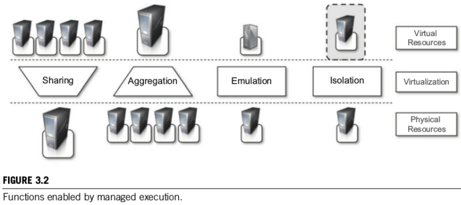
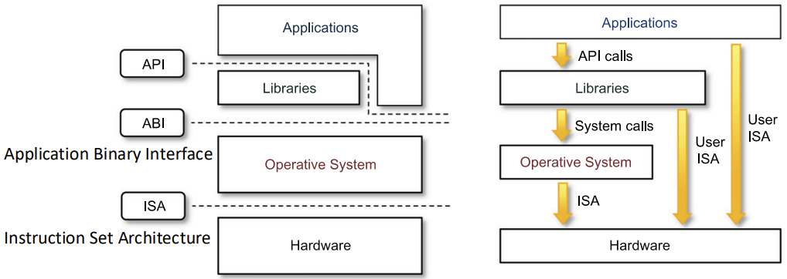
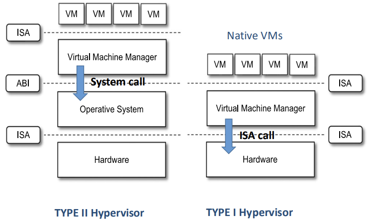

# Enabling Technologies: Virtualization and Containerization

## Virtualization

Virtualization allows running **multiple operating systems or applications** on a **single physical machine**. \
It creates a virtualization layer between the guest (virtual image, applications) and the host (physical hardware, storage, networking).

### Characteristics of Virtualization

* **Increased security**: 
    * The *virtual machine monitor* (VMM) or *hypervisor*, which is the component that allow communication between VMs and host machine, **controls and filters guest activity**, preventing harmful operations against host machine. \
    Operations are executed only on VM which then execute them of host machine.
    * Resources from host machine can be hidden or protected. 
        
        * *Examples*: Completely separated virtualized Java Virtual Machines (JVM) and file systems in hardware virtualization.

* **Managed execution**: Provides following resource capabilities:
    * **Sharing**: Creation of a separate computing environments within the same host by sharing same hardware resources.
    * **Aggregation**: Opposite of sharing, allow multiple host machine to be tied together in a single virtualized computing enviroment.
    * **Emulation**: Completely different enviroment w.r.t. to host enviroment can be emulated (Linux VM on Windows host machine).
    * **Isolation**: Provide to each guest a completely separate enviroment.

* **Portability**: Allows **transferring data and applications** between computing platforms because VMs are booted from **VM images** stored in specific disk formats (e.g., aki, ari, ami, vdi, vhd, vhdx, vmdk) that can be moved or converted. \
**Docker containers** can run on any platform with the Docker engine.

### Machine Reference Model

To understand how the different virtualization techniques work it is fundamental to recall the *layered structure of a computer system*.

* **Ring 0**: **Most privileged** (*Supervisor/Kernel mode*).
* **Ring 3**: **Least privileged** (User mode).

Rings 1 and 2 are not used in modern systems.

There are **two types** of instructions:

* **Nonprivileged**: can be used **without interfering with other tasks** (e.g., arithmetic, floating-point). 

* **Privileged**: instructions have restrictions and are for **sensitive operations** (e.g., I/O, changing CPU state).

* Computer systems have a **layered structure**: 
    * **Hardware**
    * **Operating System**
    * **Libraries** and **Applications**.

* These layers communicate using **interfaces**:

    * **ISA - Infrastructure Set Architecture**: defines the instruction set for the hardware (CPU, Memory, ...) and is the interface between Hardware and Software. OS use ISA to interact with hardware and execute privileged instructions.
    * **ABI - Application Binary Interface**: defines low level interface between the OS and applications and libraries, which interact with OS using **System Calls**.
    * **API - Application Programming Interface**: used by applications to access libraries functionalitites. 

Wwhile the OS uses the **full, privileged ISA** to control hardware, user-level applications operate with a **restricted subset of the ISA** (non-privileged instructions). 

They rely on the OS (via system calls) to perform operations that require privileged access to the hardware. 

The thick yellow arrows emphasize how both the OS and Applications ultimately have their instructions executed by the Hardware, but through **different privilege levels and pathways**.

### Hypervisor (Virtual Machine Monitor - VMM)

The **hypervisor runs in Supervisor/Kernel Mode**, so can run instruction with highest level of privilege, while a VM operating system, called *guest OS*, **runs in User Mode**.

The hypervisor controls how the VM use the hardware resources.

The **challenge** is to emulate/manage the CPU state for guest OS, requiring sensitive instructions to run in Supervisor Mode. 

VMMs allow **several operating systems to run concurrently** on a single hardware platform; at the
same time, VMMs **enforce isolation** among these systems, thus enhancing security, by ensuring that operations done by a guest OS does not affected other VM.

Original ISAs had sensitive instructions executable in user mode, preventing guest OS isolation. Intel VT and AMD-V redesigned instructions as privileged.

Set of **sufficient conditions** for a computer architecture to support virtualization and allow a VMM to operate efficiently are:

* **Equivalence**: Guest behavior should be the same as on physical hardware.
* **Resource control**: VMM has complete control of virtualized resources.
* **Efficiency**: Most instructions run without VMM intervention. (Popek and Goldberg requirements).

### Hypervisor Types

* **Type II Hypervisor (Hosted VMs)**
    * A **standard OS** is installed directly on hardware, it manages hardware resources using ISA calls, so using privileged instructions.
    * Hypervisor is installed like an application on top of the OS, it interacts with the OS using **System Calls via ABI**. It does not execute privileged instruction but need to pass through OS to do it.
    * **Multiple VMs** can be managed by the Hypervisor, each VM believes it is interacting directly with hardware but this iteraction is mediated by Hypervisor, which present ISA to VMs.
        * **Example:** VMware, VirtualBox.

* **Type I** Hypervisor (Traditional or *Bare Metal* VMs)
    * Hypervisor is directly installed on hardware so it's not dependent from OS, so it can interact directly with hardware using ISA calls, this result in **better performance**.
    * Hypervisor can be: **microkernel** (e.g., Xen, MS Hyper-V) or **monolithic** (e.g., VMware ESX).
        * Microkernel VMMs **handle CPU/memory**; device drivers are in a privileged guest OS (Domain 0).
        * Monolithic VMMs **handle everything**.
    * Multiple VMs can be managed by the Hypervisor which directly allocate resources to VMs, which is generally more efficient. ISA is presented to VMs.
    * **Trap on Privileged Instructions**: When a virtualized OS tries to execute a kernel-only instruction, because it thinks that can interact directly with Hardware (given ISA presented by VMM), it causes a trap which transfer control to the hypervisor (if hardware virtualization is present). \
    This **prevents** virtualized OS to access hardware or compromise other VM. \
    The hypervisor inspects the instruction :
        * if **from guest OS**, it performs it.
        * if **from user program**, it emulates hardware behavior.

Examples of Hypervisors (Type 1 and Type 2):
* Virtualization without HW support: ESX Server 1.0 (Type 1), VMware Workstation 1 (Type 2).
* Paravirtualization: Xen 1.0 (Type 1), VirtualBox 5.0+ (Type 2).
* Virtualization with HW support: vSphere, Xen, Hyper-V (Type 1), VMware Fusion, KVM, Parallels (Type 2).

### Full Virtualization (CONTINUE FROM HERE)

The VMM (Hypervisor) scans the instruction stream.
Noncritical instructions run directly on hardware. Critical (privileged, control- and behavior-sensitive) instructions are trapped to the VMM, which emulates their behavior.
Uses binary translation or hypercalls, .
Guest OS is unaware of virtualization and its codebase is unmodified.

### Challenges of Virtualization on x86

* Original x86 architecture was not fully virtualizable because sensitive instructions weren't a subset of privileged ones.
* Complexity of the x86 architecture.
* Diverse x86 peripherals.
* Need for a simple user experience.

### Binary Translation

Involves rewriting binary code before execution and emulating sensitive instructions.
Guest OS privileged instructions trap to the hypervisor, which performs them after checks. Guest OS sensitive instructions trigger the hypervisor to rewrite code blocks, replacing sensitive instructions with hypervisor calls. Branches are replaced with calls to the hypervisor to continue translation.
Dynamic binary translation is not overly expensive due to caching. Most code blocks do not contain sensitive/privileged instructions and run natively. User processes can be ignored as hardware ignores sensitive instructions in user mode. Guest OS code (Ring 1) is translated to avoid expensive traps.

### Hardware-supported Virtualization Technology

Intel VT-x (2005) and AMD-v made sensitive instructions a subset of privileged instructions.
Sensitive instructions now trap to the hypervisor, which handles them. (Note: Many traps can slow performance compared to binary translation).

### Paravirtualization

Guest OS is modified to be aware it's running in a VM.
Nonvirtualizable instructions are replaced by hypercalls.
Hypervisor exposes an API that the guest OS uses instead of standard syscalls. Sensitive instructions are replaced by hypercalls.
Requires the guest OS to support paravirtualization.
Often leveraged by Microkernels, which handle core OS functions and interact with the hypervisor.
Examples: Xen, KVM (Linux), Hyper-V.

## Containerization

Containerization is Operating System-level virtualization. It leverages multiprogramming techniques at the OS level. Containers are often mistakenly thought of as lightweight virtual machines. They are fundamentally isolated groups of processes on a single host. No virtual machine manager or hardware emulation is used.

### What is a Container

Isolated groups of processes running on a single host, sharing the same host OS kernel.
No virtual machine manager or hardware emulation is used.
Based on core Linux technologies: Namespaces, Cgroups, and UnionFS.
Four major requirements for containers: run on a single host, are groups of processes (with a root), need isolation, and must fulfill common features.

### Fundamental Technologies for Containerization

* **chroot & pivot_root**
    * Containerization evolved from the `chroot` mechanism, introduced in UNIX Version 7 (1979), later adopted in BSD and Linux.
    * `chroot` allows changing the root directory of a process and its children to a specific directory, isolating their filesystem view. It's also known as "jail" and was used historically for security and early "microservices".
    * Basic `chroot` involves creating a new root directory, copying necessary binaries/libraries, and running `chroot`.
    * However, a simple `chroot` jail is limited, not a strong standalone security feature, and root users can easily escape. It doesn't provide process or network isolation.
    * Modern container runtimes use `pivot_root(2)` instead of `chroot(2)`, which offers better isolation by moving old mounts to a separate directory.
    * Obtaining a usable root filesystem (rootfs) from an OCI container image using `skopeo` and `umoci` is necessary for these mechanisms.

* **Namespace**
    * Wraps a global system resource in an abstraction layer.
    * Processes within a namespace perceive their own isolated instance of the resource.
    * Changes in a namespace are visible to other members but invisible outside the namespace.
    * Namespaces were introduced in the Linux kernel starting in 2002 (Linux 2.4.19). Full "container ready" support was achieved in kernel 3.8 (2013) with the user namespace.
    * Key namespaces include:
        * **Mount (mnt)**: First implemented (2002). Isolates mount points. Used for secure jail-like environments. Allows creating separate mount spaces (e.g., with `unshare -m` and `tmpfs`). `mountinfo` in `/proc` can show mounts. Supports different mount flavors (shared, slave, private, unbindable).
        * **UNIX Time-sharing System (uts)**: Introduced in Linux 2.6.19 (2006). Isolates the domain name and hostname.
        * **Interprocess Communication (ipc)**: Introduced in Linux 2.6.19 (2006). Isolates IPC resources (System V IPC objects, POSIX message queues). IPC objects are destroyed with the namespace.
        * **Process ID (pid)**: Introduced in Linux 2.6.24 (2008). Gives processes independent sets of PIDs, allowing duplication across namespaces. Namespaces can be nested. The first process gets PID 1. `/proc/$PID/ns/pid` links to the namespace. Demonstrates creating isolated PID views using `unshare -fp --mount-proc` and remounting `/proc`.
        * **User ID (user)**: Isolation introduced in Linux 3.5 (2012), unprivileged creation in 3.8 (2013). Isolates user and group IDs, allowing processes to be privileged inside while unprivileged outside. `/proc/$PID/{u,g}id_map` control mappings. The `setgroups` security issue is addressed with `/proc/$PID/setgroups`. Essential for rootless containers.
        * **Cgroup**: Namespace added in Linux 4.6 (2016) to prevent leaking host information.
    * System calls for namespace management:
        * `clone()`: Creates a new process in one or more new namespaces.
        * `unshare()`: Allows a process to disassociate from shared execution context, creating new namespaces for itself.
        * `setns()`: Joins an existing namespace via a file descriptor (e.g., from `/proc/$PID/ns/*`).
    * The `/proc` filesystem provides magic links (`/proc/$PID/ns/*`) that act as handles to namespaces for use with `setns(2)`.
    * Tools from the `util-linux` package (like `lsns`) provide command-line wrappers for namespace operations.

* **Cgroups (Control Groups)**
    * Primary goal: Resource limiting, prioritization, accounting, and controlling.
    * Organizes processes into hierarchical groups.
    * Interface provided through a pseudo-filesystem called `cgroupfs` (`/sys/fs/cgroup`).
    * Allows setting limits (e.g., memory limits via files like `memory.limit_in_bytes`, `memory.swappiness`) and assigning processes to groups (`cgroup.procs`) by writing the PID.
    * Cgroup v2 (2013) introduced major redesigns. The cgroup namespace was added in Linux 4.6 (2016). Demonstrates creating and managing cgroups manually via the filesystem.

* **UnionFS**
    * Allows logically merging several underlying directories or filesystems (branches) into a single virtual view (a union).
    * Enables keeping related files in separate physical locations while presenting them together logically.
    * A collection of merged directories is called a union, and each physical directory is a branch.
    * Layers on top of multiple filesystems or directories within the same filesystem (stacking).
    * Acts as a filesystem interface to the kernel and presents itself as the kernel's VFS to the filesystems it stacks on.
    * A true "fan-out" filesystem, capable of directly accessing many underlying branches.
    * Assigns precedence to branches; higher precedence overrides lower.
    * Combines directory contents and attributes, removing duplicates, when directories exist in multiple branches.
    * If a file exists in multiple branches, the version in the higher-priority branch is used.
    * Demonstrates how to mount Unionfs using the `mount` command with the `dirs` option, showing precedence and recursive merging.
    * Supports mixing read-only and read-write branches, with the union being read-write overall.
    * Uses copy-on-write semantics: writes to read-only branches are copied up to a higher-priority read-write branch (a copyup operation). Demonstrates patching a CD-ROM using this.
    * Can explicitly mark branches read-only using `=ro` in the mount option, useful for source code versioning.
    * Supports overlay mounts to replace the original directory with the unified view.
    * Implementation details: Operations often traverse high-to-low (LOOKUP, CREATE), but UNLINK goes low-to-high. Uses "whiteouts" (e.g., `.wh.FILENAME`) in higher branches to hide files in lower branches, even read-only ones, maintaining UNIX semantics and handling errors.
    * File Deletion Semantics:
        * `DELETE_ALL`: Default, attempts to delete all instances.
        * `DELETE_WHITEOUT`: Creates a whiteout instead of deleting lower files.
        * `DELETE_FIRST`: Removes only the highest-priority entry, allowing lower files to show through (departs from standard UNIX, useful for versioning).
    * Unionfs Snapshots: The `unionctl` utility allows dynamic branch changes (add/remove, change mode). Demonstrates creating and viewing snapshots using layers and merging changes with `snapmerge`.
    * Suitable for various applications like merged ISOs, unified home directories, source versioning, snapshotting, and patching CD-ROMs. Performance shows low overhead.

* **Composing Namespaces**
    * Namespaces are composable, enabling complex isolation scenarios like Kubernetes Pods (isolated PIDs sharing a network interface).
    * Demonstrates using `nsenter` with `/proc/$PID/ns/pid` to join an existing PID namespace.

* **Demo Application**
    * A simple C application can use the `clone(2)` syscall with various `CLONE_NEW*` flags to create a child process in new mount, network, UTS, IPC, PID, and user namespaces.
    * This shows how container runtimes leverage namespaces, although it's not a working container itself.

### Application Containers vs System Containers

* **Application containers**:
    * Contain a single process.
    * Use a layered filesystem.
    * Run microservices/applications.
    * Used for distributing applications.
    * Implementations: Docker, CRI-O.
* **System containers**:
    * Contain an entire operating system.
    * Filesystem neutral.
    * Run a lightweight virtual machine.
    * Used for providing underlying infrastructure.
    * Implementations: LXC/LXD, OpenVZ/Virtuozzo, BSD jails, Linux vServer.

## Docker

Docker is a popular containerization platform.

### Docker Architecture

Docker engine is a Client/Server application.
* **Client (docker CLI)**: Command line interface to interact with the server.
* **Server (Docker daemon)**: Creates and manages Docker objects (containers, images, networks, data volumes).
The CLI uses the Docker REST API to communicate with the daemon.

### Images and Containers

* **Image**: A read-only template with instructions for creating a container. They are layered, defined by a Dockerfile.
* **Container**: A runnable instance of an image. Managed with the CLI or API.
When running a container (e.g., `docker run -i -t ubuntu /bin/bash`), the daemon locates/downloads the image, creates a new container, allocates a R/W filesystem layer on top of the image, creates a network interface, and starts the command. The container's R/W filesystem is isolated.

### Storage Options

* **Container writable layer**: Does not persist after termination. Tightly coupled with the host, reducing portability. Reduced performance.
* **Volumes**: Created and managed by Docker. Stored in a directory on the host but managed by Docker (isolated access). Can be mounted R/W or R in multiple containers simultaneously. Easier to back up/migrate, safer to share among containers. Volume drivers allow storage on remote/cloud providers, encryption, etc. Content can be pre-populated. Work on Linux and Windows. Managed via CLI or API.
* **Bind mounts**: Mount any host filesystem area (file or directory) into a container, referenced by its host path. Can be created by the container if they don't exist. Shared with host processes. Not portable. Usually higher performance than volumes.
* **Tmpfs mount**: Mounts a temporary memory area outside the container's writable layer. Persisted only in host memory. Removed when the container stops. Available only in Linux hosts. Not sharable among containers.

Activity cases for storage options:
* Backing up/migrating data: Volumes.
* Sharing data among multiple running containers: Volumes.
* Sharing configuration from host to containers: Bind mount (if host path is guaranteed).
* Data shouldn't persist: Tmpfs mount.
* Sharing source code/build artifacts: Bind mount (if host path is guaranteed).
* Storing data on remote/cloud: Volumes.
* Host filesystem structure guaranteed: Bind mount.
* Host filesystem structure NOT guaranteed: Volumes.

### Networking

Containers can connect to each other or non-Docker workloads.
Containers don't need to be aware they are on Docker.
Types of network drivers:
* **Bridge**: Default driver. For standalone containers communicating with each other.
* **Host**: Removes network isolation, container uses host networking directly. For standalone containers.
* **Overlay**: Connects multiple Docker daemons for swarm services or standalone containers on different hosts to communicate.
* **Macvlan**: Assigns a MAC address to a container, making it appear as a physical device on your network. Useful for legacy applications expecting direct physical network connection.
* **None**: Disables networking for the container.

Activity cases for networking drivers:
* Migrating from VM setup: Macvlan.
* Network stack not isolated: Host networks.
* Containers on different hosts communicate: Overlay networks.
* Multiple containers on same host communicate: User-defined bridge networks.
* Containers look like physical hosts (unique MAC): Macvlan networks.

### Outcome

* Covered Docker and its underlying technologies: Namespace, Cgroup, Union FS.
* Explained roles of Docker daemon, CLI, and API.
* Discussed Layered images.
* Reviewed Storage options: volume, bind, tmpfs.
* Outlined Networking concepts and drivers.