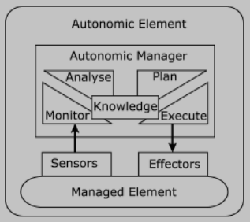
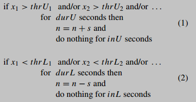
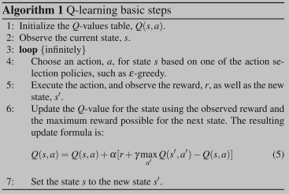
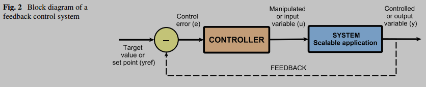

## Autonomic Computing

Autonomic computing systems are **systems that can manage themselves**, administrators gives broad desidered outcomes and the autonomic system figures how to achieve them on its own, **reducing the need for manual intervention**.

* **Why Autonomic Computing?**: Modern IT systems are becoming **exceedingly complex**, involving millions of lines of code and heterogeneous components.
* **Goal:** Create computing systems that can:
    * Install, configure, tune, and maintain **themselves**.
    * **Adapt** to changing conditions, workloads, and demands.
    * **Handle** hardware/software failures and security threats with minimal human oversight.

### The Autonomic Manager and MAPE-K Cycle
___

Core of an autonomic system is the **Autonomic Manager**, an intelligent component that oversees a **Managed Element** which can be an hardware (such as a CPU or a Printer), software resource (such as DB) or even an application service. \
The Autonomic Manager operates through a **continuous control loop**, referred as the **MAPE-K cycle** to oversee the Managed Element.

**MAPE-K Cycle:** The core control loop for an autonomic manager:
1.  **Monitor (M):** Collects data (metrics, system states) from the Managed Element using sensors.
2.  **Analyze (A):** Processes and interprets monitored data to detect patterns, anomalies, predict future states, and identify issues or opportunities for optimization. Compares data with thresholds or desired states.
3.  **Plan (P):** Develops a strategy or a sequence of actions to achieve the desired objectives or to correct deviations, based on the analysis.
4.  **Execute (E):** Implements the planned actions, interacting with the Managed Element through **Effectors** to apply necessary changes (e.g., allocate/deallocate VMs, reroute traffic).
5.  **Knowledge (K):** A **shared** knowledge base containing policies, system models, historical data, and other information **used** by the M, A, P, and E components **to make decisions**.

**Autonomic Element:** Consists of one or more managed elements controlled by an autonomic manager. It uses sensors to monitor and effectors to act upon the managed element.

### "Self-*" Properties 
___

* **Self-Configuration:** The ability of components and systems to **automatically configure themselves** according to high-level policies that specify what is desired, not necessarily how to achieve it. \
New components should integrate **seamlessly**, and the rest of the system should adjust automatically.
    * **In Cloud:** Adapting to changes in the environment, such as installing missing or outdated components based on alerts, without human intervention.

    * *Example (Kephart): When a new component is introduced, it learns about the system, registers itself, and other components adapt.*
    * *Example (FC2): An Autonomic Manager (AM) installing missed or outdated components based on system alerts.*

* **Self-Healing:** Ability to detect, diagnose, and repair hardware and software problems to remain functional when faults arise.
    * *Example (Kephart): A system detecting a faulty software module, reverting to an older version, diagnosing the issue, and alerting a developer.*
    * *Example (FC2, Scenario 2): An AM monitors the health of image recognition app instances, checks if the number of healthy instances is above a threshold (e.g., seven), and starts new instances if needed, adding them to a load balancer.*

    * **In Cloud:** Identifying, analyzing, and recovering from faults automatically to improve performance through fault tolerance and reduce the impact of failures.
        * **Common Cloud Failures:** Unexpected configuration changes, resource unavailability, overloading, memory shortages, network failures. (Source: FC2 Answers, Q2.11)
    * **Handling Techniques:** Check-pointing (restarting failed tasks on other resources), failure forecasting, replication. (Source: FC2 Answers, Q2.11)

* **Self-Protection:** Ability to automatically detect threats or failures that remain uncorrected by self-healing measures and take appropriate actions to protect the system from attacks or unauthorized access. Involves anticipating problems based on early warnings and taking steps to avoid or mitigate them.
    * **In Cloud:** Protecting against intrusions and threats by detecting malicious attacks and maintaining system security and integrity.
    * **Handling Techniques:** Secure scheduling policies, trust management systems (behavioral auditing), intrusion detection techniques. (Source: Singh and Chana, Sec 6.5.4)
    
* **Self-Optimization:** The ability of components and systems to continually seek opportunities to improve their own performance and efficiency (in terms of performance or cost). They monitor, experiment with, and tune their own parameters.
    * **In Cloud:** Improving performance, such as by dynamically scheduling tasks to optimize resource utilization and complete workloads efficiently, reducing overloading or underloading.
    * *Example (Kephart): Systems proactively seeking and applying the latest updates to improve function.*
    * *Example (FC2, Scenario 1): An AM monitors web app metrics (CPU, response time), analyzes SLO violations, plans the number of VMs to add/remove to meet SLOs while minimizing costs, and executes the VM allocation/deallocation.*

### Autonomic Manager Configuration Policies
___

High-level objectives and constraints that guide the Autonomic Manager's behavior are defined through policies.

1.  **Event-Condition-Action (ECA) Policies:**
    * Format: `WHEN event OCCURS AND condition HOLDS THEN execute action`.
    * *Example:* "When 95% of Web servers' response time exceeds 2s AND there are available resources, THEN increase the number of active Web servers."
    * Can lead to conflicts as the number of policies increases.
2.  **Goal Policies:**
    * Specify criteria of the **desirable states**, leaving the system to determine how to achieve them.
    * *Example:* "The response time of the web server should be under 2s."
    * Require planning to determine how to achieve the goal. **May only distinguish between desirable/undesirable states**.
    * *Example:* "How a given goal can be achieved."
3.  **Utility Function Policies:**
    * Define **level of desirability** (*utility*) for each possible system state. The system aims to **maximize utility**.
    * Takes various parameters as input and outputs a utility value.
    * *Example:* A function `U = F(ResponseTime_Web, ResponseTime_App)` returns the utility of each combination of web and server application response time.
    * Can be **very complex to define** accurately, as all influencing factors must be quantified.

**Planning in Autonomic Systems:**
* Involves using monitoring data (from sensors) to produce a series of changes (actions) to be performed on the managed element to **achieve desired goals** or **maintain stability**.
* **Model-Driven Approach:**
    * A **model of the managed system** (reflecting its behavior, requirements, goals) is **created and maintained** within Knowledge base.
    * The model is **updated with sensor data**.
    * The model is used by the Autonomic Manager to reason about the system and **plan adaptations**.
    * If the model is invalidated (e.g., due to unforeseen changes), ECA-like rules can serve as **repair strategies** or to trigger model relearning.
* **Planning Techniques:** Optimization (linear/non-linear programming), heuristics, metaheuristics (e.g., genetic algorithms), Markov Decision Processes (MDP), Machine Learning/Deep Learning techniques.

## Autonomic Computing in the Cloud Context (SKIP? TO REVIEW)

Applying autonomic principles to cloud computing aims to manage the inherent complexity, dynamism, and scale of cloud environments effectively.

### Need for Autonomic Cloud Computing
(Source: Singh and Chana, Sec 1.1 [source: 2863-2864])
* Cloud services depend on QoS, but heterogeneity, dynamism, and resource dispersion make fulfilling QoS requirements challenging with traditional methods.
* Autonomic cloud computing can:
    * Effectively allocate resources based on user QoS requirements.
    * Heal unexpected failures automatically.
    * Optimize QoS parameters (e.g., execution time, cost, reliability, resource utilization).
    * Identify and schedule suitable resources for workloads to maximize resource utilization efficiency.
    * Manage scheduling for both homogeneous and heterogeneous workloads.

### QoS Parameters in Autonomic Cloud Computing
(Source: Singh and Chana, Sec 6.6, Fig 16 [source: 2951-2953]; FC2 Answers, Q2.1, Q2.3 [source: 2997, 2999])
Research in autonomic cloud computing considers various QoS parameters. The most frequently considered (according to Singh and Chana's review) are:
1.  **Cost** (e.g., monetary cost of resources, execution cost) - *Top considered (20%)*
2.  **Resource Utilization** (e.g., CPU utilization, memory utilization) - *(17%)*
3.  **Execution Time** (e.g., time to complete a workload) - *(17%)*
4.  **Response Time** (e.g., time taken to respond to a user request) - *(16%)*
5.  **Energy** (e.g., energy consumed by resources) - *(15%)*
Others include: Reliability, Accuracy, Deadline, Computation Overhead, CPU speed, Scalability, Availability, Security, SLA Violation rate.

### Service Level Agreements (SLAs) and QoS
(Source: Singh and Chana, Sec 3.5 [source: 2880-2882])
* SLAs are crucial agreements between cloud consumers and providers, specifying QoS parameters (price, time, reliability, etc.).
* **Main reasons for SLA violation:** (Source: FC2 Answers, Q2.2 [source: 2998])
    * Unexpected events (Hardware/Software failures).
    * Unstable demand (workload fluctuations).
    * Service composition complexities (degradation in one component affects the whole).
    * Under-provisioning of resources.
    * Conflicting consumer needs or provider/consumer objectives.
* Autonomic systems aim to monitor QoS continuously to detect and prevent SLA violations.

### Phases of Autonomic Resource Management in Cloud
(Source: Singh and Chana, Sec 6, Fig 10 [source: 2926-2927])
Autonomic resource management in the cloud can be categorized into several interconnected phases:

1.  **Design of Application:** (Source: Singh and Chana, Sec 6.1 [source: 2927-2935])
    * **Type of Application:** Workload (set of tasks) vs. Workflow (interrelated tasks, often represented by DAGs).
    * **Domain of Application:** Scientific, business, healthcare, HTC, HPC. Different domains have different QoS needs (e.g., healthcare: high throughput, availability; geoscience: security, processing speed, large storage).
    * **Application Presentation:** Language-based (e.g., XML) or Tool-based (e.g., GUI, Petri Nets).
    * **I/O Data Requirements:** Large vs. Small datasets; sequential vs. parallel data input.

2.  **Workload Scheduling:** (Source: Singh and Chana, Sec 6.2 [source: 2936-2937]; FC2 Answers, Q2.5, Q2.6, Q2.7 [source: 3001-3005])
    * Involves two main functions:
        * **Resource Allocation:** Assigning appropriate resources to suitable workloads on time for effective utilization.
        * **Resource Mapping:** Matching workloads with appropriate resources based on QoS requirements (from SLAs) to optimize objectives like cost, execution time, and profit.
    * **Scheduling Architecture:**
        * **Hierarchical:** Multi-level schedulers; higher-level controls lower-level. *Pros:* Can use different scheduling techniques. *Cons:* Central controller is a single point of failure.
        * **Centralized:** A single central controller makes all scheduling decisions. *Pros:* Single point of control. *Cons:* Not scalable, single point of failure.
        * **Decentralized:** Resources assigned based on individual workload requirements; decisions made locally. *Pros:* Scalable. *Cons:* Hard to coordinate decisions, works best for homogeneous workloads/resources.
    * **Scheduling Objective:** Typically optimizing for cost, time, resource utilization, or load balancing.
    * **Scheduling Decision (Timing):**
        * **Static:** Matchmaking of workload to resources based on requirements and availability, decided offline.
        * **Dynamic:** Mapping and execution based on resource provisioning at runtime; provides scalability and reduces resource wastage.
    * **Integration:** Combining results from different execution units or schedulers (especially in SOA-like environments).

3.  **Resource Allocation (Mechanisms):** (Source: Singh and Chana, Sec 6.3 [source: 2939-2940]; FC2 Answers, Q2.8, Q2.9 [source: 3006-3009])
    * Managed by a Cloud Resource Manager (CRM).
    * **Decision Criteria (in distributed scheduling):**
        * **Independent:** Each scheduler acts independently without considering overall resource utilization status.
        * **Mutual:** Schedulers coordinate their decisions (e.g., low-level and high-level schedulers), which can reduce resource contention.
    * **Coordination Mechanism:**
        * **Group-Based:** Resources shared among groups of users with similar requirements. SLAs often defined at the group level. Aims for better performance and fault tolerance.
        * **Market-Based:** Uses negotiation (based on SLAs) for resource provision. Economic entities buy/sell computing resources in a virtual market.
    * **Intercommunication Protocol:** One-to-one (consumer-provider) vs. One-to-many (provider to multiple users).

4.  **Monitoring:** (Source: Singh and Chana, Sec 6.4 [source: 2943-2944]; FC2 Answers, Q2.10 [source: 3010-3013])
    * Essential for performance optimization by tracking resource utilization, system status, and service execution.
    * **Levels of Monitoring:**
        * **Execution Monitoring (Process/Task Level):** Tracks status (started, queued, completed, failed). Can be *active* (agent continually checks and modifies) or *passive* (local agent monitors against QoS in SLAs).
        * **Status Monitoring (Infrastructure Level):** Autonomic Elements monitor system performance (resource/memory utilization, network usage, SLA deviations, resource uptime) to avoid SLA violations.
        * **Service Monitoring (Workload as Service Executions):** Collects info on free resources, utilization, and load. Checks if execution meets QoS in SLAs.
        * **Resource Usage Monitoring (Infrastructure Level):** Collects usage via metrics (resource/memory utilization) to avoid under/overloading and manage QoS (security, availability, performance). Balances consumer goals (min cost/time) and provider goals (min resources used).

5.  **Self-Management (applying the self-* properties):** (Source: Singh and Chana, Sec 6.5 [source: 2946-2947])
    * This phase applies the four self-* properties (Healing, Configuration, Optimization, Protection) using the insights from Monitoring and decisions from Planning.
    * The most investigated properties in autonomic cloud research are Self-Optimization and Self-Configuration, followed by Self-Healing and Self-Protection. (Source: FC2 Answers, Q2.4 [source: 3000])

## Architectural Considerations for Autonomic Systems
(Source: Kephart and Chess [source: 2835-2840])
* Autonomic systems are envisioned as interactive collections of **autonomic elements**.
* System self-management arises from both the internal management of individual elements and the interactions *between* these elements.
* **Life Cycle of an Autonomic Element:** Includes design, implementation, test/verification, installation, configuration, optimization, upgrading, monitoring, problem determination, recovery, and uninstallation. Each stage presents unique challenges.
* **Relationships Among Autonomic Elements:** Also have a life cycle:
    * **Specification:** Describing capabilities and requirements in standard formats.
    * **Location:** Discovering needed services/partners (e.g., via directory services).
    * **Negotiation:** Reaching agreements (SLAs) for service provision (can range from simple posted-price to complex multi-attribute negotiations).
    * **Provision:** Allocating internal resources based on agreements.
    * **Operation:** Operating under the agreement, with ongoing monitoring.
    * **Termination:** Ending the agreement and releasing resources.
* **System-Wide Issues:** Security, privacy, trust, and the emergence of "middle agent" services (brokers, matchmakers, monitors).
* **Goal Specification:** A critical human role is providing high-level goals and policies. Ensuring these are correct and that systems behave reasonably even with imperfect goals is a major challenge.

## Challenges and Future Directions
(Source: Kephart and Chess [source: 2840-2844]; Singh and Chana, Sec 9 [source: 2972-2976])
* **Engineering Challenges (Kephart):** Programming autonomic elements, testing/verification in complex environments, installation/configuration bootstrapping, monitoring without excessive overhead, problem determination, graceful recovery, managing upgrades, handling complex life cycles of elements and their relationships, system-wide security/privacy/trust, robust goal specification by humans.
* **Scientific Challenges (Kephart):** Developing behavioral abstractions and models for emergent behavior, theories of robustness, learning and optimization in multi-agent adaptive environments, negotiation theory, automated statistical modeling.
* **QoS-Aware Autonomic Cloud Computing Challenges (Singh & Chana):**
    * Effective SLA management and violation detection.
    * Dynamic and efficient autonomic resource provisioning.
    * Ensuring diverse QoS requirements are met.
    * Optimizing resource scheduling in heterogeneous and dynamic environments.
    * Addressing energy efficiency.
    * Improving decision-making with advanced data mining/machine learning.
    * Developing decentralized, scalable autonomic techniques.
    * Need for real-world testing and validation of proposed mechanisms.

Okay, here is a resume of the two papers you provided, following your specific instructions for the first paper.

## Resume of "6.1 A Review of Auto-scaling Techniques for Elastic Applications in Cloud Environments.pdf"

This paper reviews **auto-scaling techniques** for elastic applications in cloud computing environments. 

The central challenge is determining the **optimal amount of resources to lease on a pay-as-you-go** basis to meet **Service Level Agreements (SLAs)** while minimizing costs. 

The review focuses on the IaaS client's perspective, typically a company hosting an application and leasing resources.

### 1. Introduction
Cloud computing allows easy deployment of **elastic applications**, simplifying resource acquisition and release. Elasticity, however, makes deciding the right resource amount difficult, it would be desiderable to have a system that automate this adjustment with minimal or without human intervention.

This are the **Auto-Scaling Systems** or **Auto-Scaler**, focus of the review.

Resource scaling can be:
* **Horizontal** (adding/removing server replicas)
* **Vertical** (changing resources of an existing VM)

Most cloud providers primarily offers horizontal scaling because most common OS do not allows machine resources update without reboot of the machine.

Auto-scaler must be aware of the economical cost of its decisions to reduce the total expenditure.
Auto-scaler must, also, secure the correct functioning of the application by mantaining an acceptable Quality of Service (QoS) which dependes on **2 types** of Service Level Agreement (**SLA**):

* **Application SLA**: contract between application owner and the user.
* **Resource SLA**: contract between cloud (?) provider and the application owner

The review's contributions include defining:
* Auto-scaling process
* Classifying techniques 
* Reviewing literature based on this classification

### 2. Scenario: Elastic Applications

In Elastic applications, Auto-Scaler manage adjustament, **without human intervention**, to variable workloads and are typically based on a **load balancer** and a **collection of identical servers** (VMs in cloud environments). 

### 3. Auto-Scaling Process: The MAPE Loop
The auto-scaler aims to dynamically adapt resources based on input workload, **trading off between meeting the SLA and minimizing cloud resources rental costs**. 

**Key challenges** include:
* **Under-provisioning:** Insufficient resources leading to SLA violations, especially with sudden traffic bursts, as new resources take time to become available.
* **Over-provisioning:** More resources than needed, incurring unnecessary costs.
* **Oscillation:** Rapid scaling actions causing alternating under and over-provisioning; often **mitigated** by *capacity buffers* or *cooldown periods*.

The auto-scaling process follows the **MAPE** (Monitor, Analysis, Planning, Execution) **loop** of autonomous systems and, in particular, encompasses Analyze and Plan phases:

* **Monitor:** Gathers metrics (from CPU, OS, load balancer, ...) about application state, when working with cloud application, this are generally provided by Cloud Provider.
* **Analyze:** Processes monitored metrics to understand current utilization and optionally predict future needs. Auto-Scaler can be:
    * **Reactive** systems respond to current status, without predictions. However, given that resource provisoning takes time, scaling action may not be fast enough to prevent performance issues.
    * **Proactive** systems predict future demands to provision resources in advance, avoiding delay and ensure better performance that lack in Reactive Auto-Scaler.
* **Plan:** Auto-Scaler is in charge of **decides scaling actions** (e.g., add/remove VM, change memory) to find a satisfactory balance between SLA compliance and costs.
* **Execute:** Implements scaling actions via the cloud provider's API, considering delay in resources provisoning.

### 4. A Classification of Auto-Scaling Techniques
The paper classifies auto-scaling techniques based on the underlying theory or technique used to build the auto-scaler. This approach helps understand the concepts, advantages, and limitations of each category. 

The **main categories** are:
1.  **Threshold-based** rules
2.  **Reinforcement learning**
3.  **Queuing theory**
4.  **Control theory**
5.  **Time series analysis**

#### 5. Review of Auto-Scaling Techniques**

#### Threshold-Based Rules

Decision-making technique used in **Planning phase** of MAPE loop. This approach is popular among cloud providers due to its simplicity even tought that effectively setting the thresholds is application-specific and requires deep understanding of workloads trends.

In this technique, the quantity of Virtual Machines (VMs) (**Horizontal**) or the amount of resources assigned (**Vertical**) to an application is adjusted according to a set of **predefined rules**. Typically, there are one for scaling up/out (increasing resources or VM instances) and one for scaling down or in (decreasing resources or VM instances).

Rules are structured like the image below:

Each rule consist of **two parts**:
1. Condition: use one or more metrics and a two threshold for each, upper and lower. Conditions are satisfied if metrics are above or below, respectively, upper and lower threshold for a specific duration.
2. Action: when condition is met, a corresponding action is triggered.

After an action, a **cooldown period** often applies to **prevent oscillation**. 

* *Example*: add 2 VMs if average CPU > 70% for 5+ minutes, then do nothing for 10 minutes.

#### Reinforcement Learning

Reinforcement Learning (RL) involves an autoscaler to learn the best scaling from experience given from trial-and-error action through interaction with its environment (the application). 

The autoscaler receives a reward (e.g., performance improvement) after an action, so the auto-scaler will tend to execute actions that yield a high rewards. The goal is to find a policy that maps every `state 's'` to optimal actions, that maximize rewards.

<h2>ENOUGH?</h2>

This policy is often based on a **Q-value function**, `Q(s,a)`, estimating future rewards for taking `action 'a'` in `state 's'`. 

Q-learning is a **common algorithm** to derive this function, often stored in a lookup table and updated iteratively using the formula:

$$Q(s,a) = Q(s,a) + \alpha[r + \gamma \max_{a'}Q(s',a') - Q(s,a)]$$

* $r$ is the immediate reward received after taking action $a$ in state $s$ and transitioning to state $s'$.
* $\alpha$ is the learning rate, determining how much new information overrides old information.
* $\gamma$ is the discount factor, valuing immediate rewards more than future rewards.
* $\max_{a'}Q(s',a')$ is the maximum expected future reward from the new state $s'$.

**Action Selection (Exploration vs. Exploitation):** To choose an action, policies like ε-greedy are often used. Most of the time (with probability 1-ε), the agent exploits current knowledge by choosing the action with the best known Q-value. Occasionally (with probability ε), it explores by choosing a random action to discover potentially better actions.

**SARSA Algorithm:** A similar algorithm to Q-learning is SARSA. The main difference is in the Q-value update rule. Instead of using the maximum possible reward for the next state ($\max_{a'}Q(s',a')$), SARSA uses the Q-value of the actual next state-action pair ($Q(s',a')$) that was chosen by the current policy. The update formula is:
    $Q(s,a) = Q(s,a) + \alpha[r + \gamma Q(s',a') - Q(s,a)]$

**Proactive Nature:** RL approaches are generally considered proactive because scaling decisions are made based on the current state to optimize future rewards, and the impact of an action (and its reward) is often observed after a delay.

**MAPE Loop Integration:** RL techniques typically cover both the analysis phase (collecting reward data and updating Q-values) and the planning phase (using the learned policy to decide the best scaling action) of the auto-scaling process.

The aim is for the Q-learning or SARSA process to converge to an optimal policy, meaning the Q-table accurately reflects the long-term value of each state-action pair, allowing the auto-scaler to make the best decisions. However, since the auto-scaling environment is dynamic, the learning process is continuous to adapt to changes in workload or system behavior.

#### 5.3 Queuing Theory

Queuing theory mathematically studies waiting lines (queues) and is used in the **Analysis phase** of MAPE loop to estimate metrics like **queue length** or **average waiting time** of servers which can then inform scaling decisions. 

A basic queuing model consists of:
* **Arrivals:** Requests arrive at the system at a mean arrival rate ($\lambda$).
* **Queue:** Arriving requests are enqueued if servers are busy.
* **Servers:** One or more servers process the requests at a mean service rate ($\mu$). 

***Kendall's notation*** describes queues based on:
* **A**: Inter-arrival time distribution
* **B**: service time distribution
* **C** number of servers
* **K**: system capacity, max number of customers **(Default Infinite)** **(Optional)**
* **N**: calling population size, finite or **infinite (Default)** **(Optional)**
* **D**: Service discipline (e.g FIFO, LIFO, ...), **Default LIFO** **(Optional)**

Common distributions for A and B are **M** (*Markovian/Poisson*), **D** (*deterministic*), and **G** (*general*). 

Elastic applications can be modeled with a single queue (load balancer) and 'n' VMs (servers); multi-tier apps can use queuing networks. 

Queuing theory traditionally assumes stationary conditions, so for dynamic cloud scenarios, model parameters must be periodically recalculated. 

Models are solved analytically (for simple cases like M/M/1, G/G/1, or using Mean Value Analysis for networks) or via simulation. 

#### 5.4 Control Theory**

Control theory is applied to automate the management (e.g., scaling) of a target system, such as a cloud application, **by combining both the analysis and planning phases** of the auto-scaling task.

The primary objective is to maintain a **controlled variable 'y'** (e.g., CPU load, response time) close to a desired level or **set point 'y_ref'**. This is achieved by adjusting a **manipulated variable 'u'** (e.g., number of VMs, allocated memory). 

The **manipulated variable 'u'** is the **input** to the system, and the **controlled variable 'y'** is the **measured output**.

<h2>ENOUGH?</h2>

There are **three types of control systems**:
1.  **Open-loop controllers:** Compute input 'u' based only on the current state and a system model, **without feedback** to check if the `output 'y'` reached the `set point 'y_ref'`.
2.  **Feedback controllers:** Observe the system `output 'y'` and correct deviations from the `desired value 'y_ref'`. These are **common in auto-scaling**.
3.  **Feed-forward controllers:** Try to anticipate errors by **predicting system behavior using** a model and reacting before an error occurs. They are often combined with feedback controllers.

**Feedback Controllers** are classified in:
* **Fixed gain controllers:** Parameters are set and remain fixed. The most common is the **Proportional-Integral-Derivative (PID) controller**. It calculates the new manipulated variable $u_k$ based on the current error $e_k$ (difference between $y_k$ and $y_{ref}$) using proportional ($K_p$), integral ($K_i$), and derivative ($K_d$) gains:
    $u_k = K_p e_k + K_i \sum_{j=1}^{k} e_j + K_d (e_k - e_{k-1})$
    Variants include Proportional-Integral (PI) and Integral (I) controllers.
* **Adaptive controllers:** Adjust their parameters online to adapt to changing environmental conditions. Examples include self-tuning PID controllers and gain-scheduling. They are suitable for slowly varying workloads but may struggle with sudden bursts.
* **Model Predictive Controllers (MPC):** These are proactive. They predict the future behavior of the system based on a model and the current output. The controller then solves an optimization problem, considering a predefined cost function, to determine the control actions. An example is a look-ahead controller.

A crucial element for control theory is a formal relationship (often called a **transfer function** or **performance model**) between the input 'u' and output 'y', which describes how changes in 'u' affect 'y'. PID controllers often assume a simple linear model, but non-linear models and Multiple-Input Multiple-Output (MIMO) controllers (handling several input/output variables) exist. The paper lists several types of performance models used in the literature:
* ARMA(X) (Auto-Regressive Moving Average with eXogenous input)
* Kalman filter
* Smoothing splines
* Kriging model (Gaussian Process Regression)
* Fuzzy model (using fuzzy rules and membership functions)

#### 5.5 Time Series Analysis

Time series analysis is used in the **analysis phase** of the auto-scaling process. 

It involves examining sequences of measured data taken at uniform time intervals (e.g., average CPU load per minute, input workload) to **find repeating patterns** or **forecast future values**. 

This forecasting ability allows for **proactive auto-scaling decisions**, enabling resource provisioning in advance to accommodate delays like VM startup times.

Given a time series $X = x_t, x_{t-1}, ..., x_{t-w+1}$ (where `w` is the time series length), the goal is to forecast a future value $\hat{x}_{t+r}$ (r intervals ahead) based on the last 'q' observations (the history window, where $q \le w$).

**Machine Learning-based Techniques:**
* **Regression:** Determines the polynomial function that best fits the data points in the history window. Linear regression is a special case (polynomial of order 1).
* **Neural Networks:** Consist of interconnected artificial neurons in layers (input, hidden, output). For time series, the input layer takes history window values, and the output layer gives the predicted value. They are trained to adapt weights until the desired output is achieved for given inputs.

In essence, Regression and Neural Networks, within the context of Time Series Analysis for auto-scaling, provide the foresight (predictions). This foresight is then leveraged by the auto-scaler's planning component to make timely, proactive decisions, aiming to have the right amount of resources available when they are actually needed, rather than reacting after the fact.

<h2>ENOUGH?</h2>

The techniques are broadly classified into two groups:

**1. Direct Prediction of Future Values:**

* **Moving Average (MA):**
    * Calculates the forecast $\hat{x}_{t+1}$ as a weighted average of the last 'q' consecutive values.
    * **Simple Moving Average MA(q):** Assigns equal weight (1/q) to all 'q' observations.
    * **Weighted Moving Average WMA(q):** Assigns different weights, typically giving more importance to recent data.
* **Exponential Smoothing (ES):**
    * Calculates a weighted average of all past 'w' observations, with weights decreasing exponentially over time, controlled by a smoothing factor $\alpha$.
    * **Simple ES:** $\hat{x}_{t+1} = s_t = \alpha x_t + (1-\alpha)s_{t-1}$. Suitable for series with no significant trend.
    * **Brown's Double ES:** Handles linear trends by calculating two smoothed series to estimate the level and trend for forecasting.
* **Auto-Regression AR(p):**
    * The prediction $\hat{x}_{t+1}$ is a linear weighted sum of the 'p' previous terms in the series (plus an optional white noise term $\epsilon_t$): $\hat{x}_{t+1} = b_1 x_t + ... + b_p x_{t-p+1} + \epsilon_t$.
    * Coefficients $b_i$ are derived using methods like least squares or Yule-Walker equations based on auto-correlation functions.
* **Auto-Regressive Moving Average ARMA(p,q):**
    * Combines an AR(p) model with an MA model of 'q' past error terms (innovations): $x_t = b_1 x_{t-1} + ... + b_p x_{t-p} + \epsilon_t + a_1 \epsilon_{t-1} + ... + a_q \epsilon_{t-q}$.
    * Suitable for stationary processes (constant mean and variance).
    * **ARIMA (Auto-Regressive Integrated Moving Average):** An extension for non-stationary time series.
    * **ARMAX (ARMA with eXogenous inputs):** Incorporates external time series data.

**2. Pattern Identification Techniques:**

These techniques try to identify patterns (trend, seasonality, cyclical, randomness) in the time series and then extrapolate them to predict future values.
* **Pattern Matching:** Searches for past patterns in the history that are similar to the current pattern.
* **Signal Processing Techniques (e.g., Fast Fourier Transform - FFT):** Decomposes a signal time series into components of different frequencies. Dominant frequencies correspond to repeating patterns.
* **Auto-correlation:** Calculates the correlation between the time series and its shifted versions. A high correlation after 's' shifts indicates a repeating pattern of duration 's'.
* **Histograms:** Distributes time series values into equal-width bins to represent the frequency of values in each bin, which can reveal usage patterns.

## Resume of "6.2 Evaluating Auto-scaling Strategies for Cloud Computing Environments.pdf" (TO DO)

This paper evaluates various auto-scaling strategies for cloud environments using log traces from a Google data center, focusing on resource utilization as a performance indicator. It argues that improperly configured auto-scaling can lead to poor Quality of Service (QoS) and resource waste.

**1. Introduction & Problem Description**
Auto-scaling adjusts resources to meet demand, keeping performance indicators (like utilization) within user-defined bounds (L for lower, U for upper). Users often set these parameters (L, U, and step size 's') ad-hoc, leading to deviations from target intervals[cite: 9, 10]. The paper introduces the **Auto-scaling Demand Index (ADI)**, a metric that penalizes differences between actual and desired utilization levels[cite: 18, 28, 29, 32]. ADI increases if utilization is above U (QoS penalized) or below L (IT costs penalized/resource underutilization)[cite: 33, 35]. Key challenges are deciding when to trigger auto-scaling and the step size 's' for adding/removing resources[cite: 38]. Small step sizes can lead to slow convergence to the target utilization, while large step sizes can cause overshooting[cite: 39, 40, 41, 43].

**2. Contributions & Modelling**
The paper's main contributions include the ADI metric, an "Adaptive" step size strategy, and an extensive performance study using real-world Google cluster data[cite: 18, 19, 20, 21].

* **Formal Model:** A discrete-time model is used, with jobs requiring resources ($w_j$), total resources used ($w_t$), active machines ($m_t$), and system utilization ($u_t = w_t / m_t$)[cite: 46, 47, 51, 52, 53, 54, 56, 57]. The ADI ($\sigma$) is the sum of deviations ($\sigma_t$) from the target interval [L,U] over time[cite: 58, 59, 60].
* **Triggering Strategies:**
    * **Reactive:** Triggers if utilization $u_t$ is outside [L,U][cite: 61, 62].
    * **Conservative:** Triggers only if utilization is consistently outside [L,U] for the last four time-steps[cite: 63, 64].
    * **Predictive:** Triggers based on an estimated utilization for the next time-step ($u'_{t+1}$), calculated using exponential smoothing[cite: 66, 67].
* **Step Size Strategies:**
    * **Fixed:** Uses a constant, user-defined step size 's'[cite: 68, 71].
    * **Adaptive:** A novel strategy that computes step size $s_t$ at each time-step based on current utilization $u_t$, L, U, and an "aggressiveness level" parameter $\alpha$. It calculates lower and upper bounds for 's' intended to bring utilization within [L,U] for the current workload $w_t$, and then selects $s_t$ within these bounds based on $\alpha$[cite: 72, 73, 76, 77, 78, 80, 82].

**3. Evaluation**
The study used Google cluster trace logs, from which eight distinct workloads with varying CPU usage patterns were derived using k-means clustering[cite: 83, 86, 89, 90, 92, 93, 94, 97]. Experiments combined the three triggering strategies with the two step size strategies across different L and U values[cite: 99, 101, 102]. The Adaptive strategy used $\alpha=0.5$ (neutral aggressiveness)[cite: 106]. For the Fixed strategy, the step size 's' that minimized ADI for each (L,U) pair was chosen for fair comparison[cite: 105, 112].

* **Results Analysis:**
    * **Step Size Strategy:** No single clear winner between Fixed and Adaptive; each performed best in 4 out of 8 workloads[cite: 115]. Adaptive was better for workloads with bursty and peaky behaviors as it could resize the resource pool more quickly to reach the desired utilization[cite: 131, 132]. Fixed performed better when workloads had abrupt changes followed by quick normalization, as Adaptive could overreact[cite: 133, 134]. For predictable workloads, differences were marginal[cite: 128]. Configuring Fixed step sizes is challenging and requires workload knowledge, especially for irregular variations[cite: 119, 120, 126, 127].
    * **Triggering Strategy:** Reactive strategy showed consistently good performance by reacting immediately to deviations[cite: 117, 135, 136, 137]. Conservative performed poorly as it waits for four consecutive undesired utilization levels, incurring ADI penalties[cite: 145]. Predictive was generally worse than Reactive, with its performance highly dependent on the accuracy of workload prediction; it performed poorly on more "predictable" workloads where the exponential smoothing estimations were inaccurate[cite: 147, 148, 149, 150].
    * **Utilization Interval [L,U]:** ADI penalties increase as the interval (U-L) decreases[cite: 152]. Performance is sensitive to how L and U align with the workload's typical utilization range; if [L,U] is too narrow or misaligned with common utilization levels, ADI increases significantly[cite: 153, 154, 155, 156, 158, 159].

**4. Related Work**
The paper positions itself against existing commercial solutions like Amazon CloudWatch and Microsoft Azure Auto-scaling (which require users to specify parameters) and research projects like Netflix Scryer (predictive) and other academic works on auto-scaling with various focuses (deadlines, costs, MapReduce, etc.)[cite: 171, 172, 173, 174, 175, 176, 177, 178, 179, 180, 181, 182]. This work aims to enhance understanding of parameter definition and its impact on ADI[cite: 184].

**5. Conclusion**
The study investigated auto-scaling strategies using real-world data, introducing the ADI metric and an Adaptive step size strategy[cite: 187, 190, 191]. Key lessons include: Fixed step sizes can work for regular workloads, while Adaptive is better for irregular ones but may overreact to short peaks[cite: 193, 194, 197, 198, 199]. Predictive strategies are highly dependent on prediction accuracy, whereas Reactive strategies can be more precise if resource provisioning is fast[cite: 200, 201, 202]. Defining appropriate L and U bounds is critical and workload-dependent, suggesting a need for recommender systems[cite: 203, 204, 205, 206].