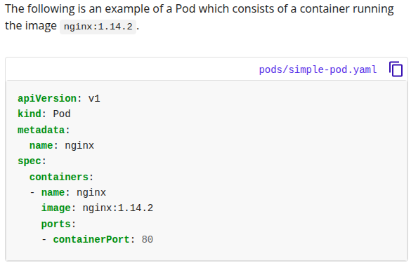
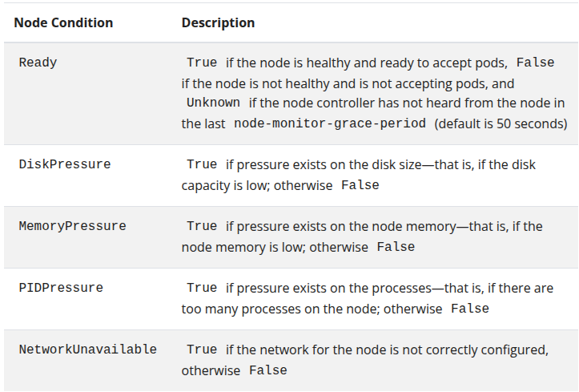

<!-- KaTeX auto-render header -->
<link rel="stylesheet" href="https://cdn.jsdelivr.net/npm/katex@0.16.0/dist/katex.min.css">

These slides introduce the concepts of IT automation and orchestration, contrasting them with autonomic computing, and then provide practical examples using Ansible for automation and Kubernetes for orchestration.

# Automation & Orchestration
## Autonomic Computing, Automation and Orchestration
* **Autonomic Computing** Aims to create self-managing systems with properties like self-configuration, self-healing, self-optimization, and self-protection. The goal is to keep humans out of the loop, providing only high-level objectives.
* **IT Automation (ITOA):** Focuses on reducing human interaction and manual processes in IT operations. It uses software tools to automate repetitive tasks, orchestrate workflows, and integrate automation into existing systems.
    * **Benefits:** Improved **efficiency/productivity** (freeing up IT staff), **reduced human error** (leading to more accurate/consistent results), and **saved time/costs**.
* **Orchestration**: It builds upon automation. While automation focuses on making individual tasks self-operating, orchestration is concerned with **automating a sequence of these tasks** to work **cohesively as a larger process** or **workflow**. 

    This concept applies to various contexts:
    * **Service** orchestration: Service orchestration involves coordinating multiple distinct services (often microservices) to work together to fulfill a larger business process or application functionality.
        * *Example*: Apache Airflow, Netflix Conductor, AWS Step Functions
    * **IT infrastructure** orchestration: IT infrastructure orchestration focuses on automating the provisioning, configuration, and management of the underlying IT infrastructure components such as servers (virtual or physical), storage, networks, and load balancers.
        * *Example*: **Ansible**, Terraform, AWS CloudFormation, Azure Resource Manager, Google Cloud Deployment Manager.
    * **Container** orchestration:  Container orchestration automates the deployment, scaling, management, and networking of containerized applications.
        * *Example*: Kubernetes, Docker Swarm, Amazon ECS/EKS, Azure Kubernetes Service (AKS), Google Kubernetes Engine (GKE). 

## Infrastructures Challenges Addressed by Automation & Autonomic Computing
Various challenges in managing datacenters and large-scale cloud application deployments can be addressed by applying automation and autonomic principles.
* **Datacenter Challenges:** Server consolidation (VM migration), guaranteeing SLAs, managing failures (discover, remediate, fix), software updates, and vulnerability/bug fixes.
* **Large-Scale Infrastructure/Cloud Application Challenges:** Infrastructure node configuration, application component configuration, updates/patching (in the right order), backup, and CI/CD (Continuous Integration/Continuous Delivery).

Automation can handle many of the procedural aspects, while autonomic computing would aim for more self-driven management of these issues, often using automation as its execution mechanism.

## Automation Tools and Data Center Automation
A wide array of automation tools are listed (Ansible, Terraform, Chef, Jenkins, Kubernetes, Docker, etc.), highlighting the rich ecosystem available.

In **data centers**, **specialized platforms** automate tasks like provisioning, configuration, patching, and monitoring. CI/CD is a key area of automation. 

## Ansible as an Automation Example
Ansible is an example of IT automation tool, widely used for configuration management, application deployment, and task automation. 

Key characteristics of Ansible include:
* **Agentless Architecture:** No software needs to be installed on managed hosts.
* **Push Model:** By default, Ansible operates on a push model, where the control server **sends modules** (small pieces of code performing specific tasks) **and instructions** (defined in Playbooks) to managed hosts, typically **over SSH** (Linux/Mac) or WinRM (Windows). After modules have been executed, they are removed.
* **Network Automation (Slide 13):** For devices that can't run code (like network devices), module code is executed locally on the Ansible control node, interacting with the device via its API.
For other devices, push model is used.
* **Playbooks:** **Core of Ansible automation**, written in YAML. They define a series of ***plays***,  which consist of multiple ***'tasks'***, targeting a set of hosts (***'inventory'***).

    Playbooks allow for the **declaration of desired states**, **orchestration of ordered processes**, and can be designed to be **idempotent**, meaning they can be run multiple times with the same outcome.

    Each task is a call to an Ansible module, a small piece of code for a specific task.

* **Ansible Modules:** Designed for easy desired state configuration. They check if a task needs to be done before executing (e.g., only starts a webserver if it's not already running). This **idempotency ensures efficiency**.

### Ansible Automation Examples

#### Simple Example

#### Playbook Example (Slide 17)
A YAML playbook (ABOVE) with two plays:

##### Update web servers: 
1. Targets `webservers` 
2. Ensures `httpd` (Apache) is at the latest version using the `ansible.builtin.yum` module
3. Writes an Apache config file using `ansible.builtin.template`.

##### Update db servers: 
1. Targets `databases` 
2. Ensures `postgresql` is at the latest version using the `ansible.builtin.yum` module
3. Ensure `postgresql` started using `ansible.builtin.service`.

#### Complex Automation Example (Slides 18-20)

Illustrates a multi-tier web application (load balancers, application servers, database servers, content servers, monitoring system). 

Ansible can automate a complex **rolling update process** across this cluster, involving steps like:
* Consulting configuration repositories for info about involved servers.
* Configuring base OS on all machines and enforcing desidered state.
* Identifying servers to update.
* Signaling monitoring/load balancers for outage/removal from pool to bring the servers offline.
* Stopping/updating/starting application servers.
* Running tests.
* Signaling load balancers/monitoring to re-integrate or exclude servers.
* Sending email reports and logging when updates are complete.

### Ansible Automation and Autonomic Computing (Slide 21)s**

* **Self-configuration:** Once a reconfiguration is decided (by an autonomic manager), a playbook can deploy the new system configuration.
* **Self-optimization:** If the decision is to add new servers, a playbook can execute all required actions.
* **Self-healing:** If server/application performance degrades, a playbook can detach and restart it.
* **Self-protection:** If a system is under attack due to a vulnerability, a playbook can deploy a rolling update to patch it.

The **key idea** is that the "Execute" phase of the MAPE-K loop can be implemented using automation tools like Ansible.

## Kubernetes as an Orchestration example

**Kubernetes** (K8s) is a platform for container orchestration, designed to manage containerized workloads and services at scale. It automates the deployment, scaling, and operational aspects of container-based applications.

### What does it means to manage a Containerized Workload?

#### Service Discovery
In a dynamic environment where containers (running parts of your application) can start, stop, or move, other parts of your application or external users need to be able to find them. 

**Service discovery** is the mechanism that allows services to locate each other without needing to know their exact IP addresses, which can change. This is often done using internal DNS or a service registry.

#### Load Balancing

When you have multi*ple instances (containers) of a service running to handle load or provide redundancy, load balancing **distributes incoming network traffic across these instances**. 

This **prevents** any single container from being **overwhelmed** and **ensures high availability** and **responsiveness**.

#### Storage orchestration

Containers are often **ephemeral** (their data is lost when they stop). 

For applications that need persistent data (like databases), storage orchestration **manages how storage volumes** (like disk space) **are provided to containers**.

This includes automatically provisioning the storage, attaching it to the correct node where a container is running, and mounting it into the container so the application can read and write data that persists even if the container is restarted or moved.

#### Automated rollouts and rollbacks

##### Automated Rollouts
When you want to deploy a new version of your application, an orchestrator can automate the update process. 

This might involve gradually **replacing old containers with new ones** (e.g., rolling updates) to ensure no downtime. You describe the desired state (e.g., "I want version 2 of my app running with 5 instances"), and the orchestrator makes it happen.

##### Automated Rollbacks
If a new deployment has issues, the orchestrator can **automatically revert to the previous stable version**, again minimizing downtime and manual intervention. The system constantly works to ensure the deployed containers match the desired state you've defined.

#### Automatic bin packing

"Bin packing" is an analogy for efficiently **placing containers** (items) onto your **cluster nodes** (bins/servers).

The orchestrator automatically decides **which node a container should run on**, considering the **resources requested** by the container (CPU, memory) and the **resources available** on each node.

The **goal** is to make the **best use of available hardware resources**, packing containers densely but without overloading any single node, thus optimizing cost and resource utilization.

#### Self Healing

The orchestrator continuously monitors the health of containers and nodes.

* If a **container fails**, the orchestrator can automatically restart it.
* If a **node fails**, the orchestrator will **reschedule** the containers that were running on it onto healthy nodes.
* It can **replace containers** that are not responding or **kill containers** that are stuck.
* Importantly, it will also **ensure that traffic is not routed to faulty or unready containers** (i.e., "don't advertise" them to service discovery and load balancing mechanisms).

#### Secret and Configuration management

Applications often require sensitive information like passwords, API keys, or tokens (secrets), as well as non-sensitive configuration data.

An orchestrator provides **secure ways to store and manage these secrets** and configurations, making them available to containers at runtime without having to hardcode them into container images or expose them insecurely. 

This allows for **better security** and easier updates to configuration without rebuilding images.

##### In essence

In essence, **managing containerized workloads** means **automating and simplifying all these operational aspects**, allowing developers and operators to focus on the application itself rather than the complexities of deployment, scaling, resilience, and resource management in a distributed environment.

### Key Kubernetes Components

#### Objects
**Entities representing the cluster's state**, specifically they can describe:

* What **containerized applications** are running (and **on which nodes**)
* The **resources available** to those applications
* The **policies** around how those applications behave, such as restart policies, upgrades, and fault-tolerance.

An object contains two fields: `spec` and `status`.

Users define a `spec` (**desired state**), and Kubernetes controllers work to ensure the `status` (**current state**) matches the `spec`.

###### Object Example

**Deployement** is an object that can represent an application running on a cluster.

Workflow:
* You create the Deployement and set the Deployment spec.
    * `spec`: 2 replicas of nginx
* Kubernetes read the Deployment specs, starts 2 instances of nginx (2 Pods) and updates the `status` to match `spec`.
* If any of those instances fails, `status` change so, to restore the desidered state, `spec`, it start a replacement instance.

#### Pods

The **smallest deployable units in Kubernetes**. 

A Pod encapsulates one or more containers, sharing network,  storage resources and specification for how to run the containers.

They represent a "**logical host**" for an application.

A Pod is similar to a set of containers with shared namespaces and filesystem volumes.

#### Nodes

Worker machines, managed by the control pane and contains the services necessary to run containerized workloads (**Pods**). 

A Node became member of Kubernetes Cluster in two ways:
* **Self-Registration**: `kubelet` of the node self-register to the control pane (API-Server)
* **Manual-Registration**: Human user manually add the node to the control pane (API-Server)

**Node status** includes: 
* **Addresses**: Hostname, External (externally routable node) or Internal IP (node routable only within the cluster).
* **Conditions**: describe status of all running nodes

* **Capacity**: describes the resources available on the node: CPU, memory, and the maximum number of pods that can be scheduled onto the node. 

    Indicate the **total amount of resources that a Node has**.
* **Allocable Resources**: Indicate the **amount of resources on a Node that is available to be consumed by normal Pods**.
* **General information**: kernel and Kubernetes version, etc.

#### Controllers

In Kubernetes, controllers are **control loops** that watch the state of your cluster, then **make or request changes where needed** to move the current cluster state closer to the desired state.

Controllers track resource type (Containers, Volumes, iptable rules) and send message to Control Pane (API-Serve) to change current state toward desired state.

##### Example of Control Loop

1.  A user defines a desired state using a Kubernetes Object (e.g., "I want 3 nginx Pods").
2.  A Controller specific to that object type (e.g., ReplicaSet controller, which is managed by a Deployment controller) notices this desired state.
3.  The Controller checks the current actual state (e.g., "There is only 1 nginx Pod running").
4.  The Controller takes action to reconcile the difference (e.g., creates 2 more nginx Pods by interacting with the API server, which leads to container creation on nodes).
5.  The status of the Kubernetes Object is updated to reflect the new actual state (e.g., "3 nginx Pods are now running").
6.  The Controller continues to watch for any deviations between the desired state (`spec`) and the actual state (`status`) and acts to correct them.

### Kubernetes Cluster Components

A Kubernetes cluster consists of a **Control Plane** and **Worker Nodes**.

#### Control Plane: 

**What it does?**: Manages the cluster. 

Its components include:
* `kube-apiserver`, server that expose the **Kubernetes API** and scale horizontally.
* `etcd`, a **key-value store** for Kubernetes cluster data. 
* `kube-scheduler`, manage newly created Pods and assign them to Nodes by following a multi-stage process: Filtering, Scoring and Building.

    1. **Filtering**: Scheduler identifies a set of feasible Nodes where Pod could potentially run, applies some Filters to each node of the cluster that check if a node meets all mandatory requirements for the Pod.
    
        Some example of **Filters** are: 
        * **Node Affinity** rules: A set of rules that **influences the placement of Pods onto specific Nodes**, making certain Nodes preferred or required for scheduling based on node labels. \
        Useful for:
            * **Ensuring compliance with Data Sovereignty Laws**: Node affinity can ensure that pods handling sensitive data are scheduled on nodes located in compliant regions.
            * **Optimizing network layency** for distributed systems: Node affinity allows to locate interdependent service in the same region to minimize latency.
            * **Supporting Multi-Tenancy** and **Resource Isolation**: Node affinity can isolate workloads to dedicated nodes.
                
        * **Node Anti-Affinity**: A set of rules that **prevents** Pods from being scheduled on certain Nodes or co-located on the same Node, often used for high-availability or workload separation. Useful for:
            * Spreading Pods across nodes: Ensuring that multiple instances of an application are spread across different nodes.
            * Separating workloads: Keeping certain pods from being co-located on the same node for performance and security reasons.

        * **Hardware/Software/Policy costrains**.
        * `PodFitsResources` **filter**: check if a node has enough available resources to meet Pod requirements.
    
    2. **Scoring**: Once the feasible nodes are identified, the scheduler ranks them to find the best one by running a series of "Priority" and "Scoring" functions. \
    Some examples are:
        * Data Locality: preferring nodes where the Pod's data already resides.
        * Inter-workload interference considerations: nodes where, if pod is placed there, are less likely to get performance reduction.
        * Anti-Affinity.

    3. **Binding**: Scheduler picks the node with the highest total score among the feasible ones.

    So, factors influencing these filtering and scoring decisions are comprehensive and include:   

    * Individual and collective resource requirements of the Pod.
    * Hardware, software, and policy constraints.
    * Affinity and anti-affinity specifications (rules for co-locating or separating Pods from certain nodes or other Pods).
    * Data locality.
    * Inter-workload interference.
    * Deadlines.
* `kube-controller-manager`, runs various controllers to mantain desidered state of cluster:
    * **Node** Controller: tracks health of Nodes in the cluster.
    * **Job** Controller: **Job** is a K8s resource that runs one or several pods to carry out a task and then, when a specified number of them successfully complete, it stops (on-off task).\
    **Job Controller**, manages Jobs by monitoring Jobs, creating pods and ensuring task completetion.
    * **EndpointSlice** Controller: Populate EndpointSlice objects, these provides a link between Services and Pods that make up the service. \
    Essentially, when a Service selects a set of Pods, the EndpointSlice controller creates EndpointSlice objects that list the network endpoints (IP addresses and ports) of those Pods. This allows network traffic directed to the Service to be routed to the correct backend Pods.
    * **ServiceAccount** Controller: Create default ServiceAccounts for new namespaces. \
    ServiceAccounts provide an identity for processes that run in a Pod. When a new namespace is created, this controller ensures that a default ServiceAccount is available, which can be used by Pods in that namespace if no specific ServiceAccount is assigned to them. This is important for managing access and permissions within the cluster. 
* `cloud-controller-manager`: (OPTIONAL) link kubernetes cluster with a specific cloud provider's API.

#### Nodes or Worker Machines
**What are**: Physical or virtual machines that **run the containerized application** assigned to each node. 

Each node runs a:
* `kubelet`, primary node agent that runs on each node. Ensure that containers, described in `PodSpecs`, are running and healthy on the node.
    * `PodSpecs` serve as input of `kubelet` and is provided by the API-Server (Control Pane) when a Pod is scheduled to a the node.
* `kube-proxy`: network proxy that runs on each node, ensure inner and outer cluster communication and is responsble for the correct routing to the appropriate Pods, which may be running on this or other nodes.  
* **Container Runtime**: Software that is reasponsible for running containers (e.g., Docker). \
`kubelet` interacts with the it to start, stop and manage containers based on the `PodSpecs` instructions.