# Cloud Storage

## Introduction to Data Storage in the Cloud 
Cloud systems utilize various forms of data storage:
* **Distributed file systems:** Examples include **Google File System** (GFS) and **Hadoop Distributed File System** (HDFS). These often build on concepts from Network File Systems and Parallel File Systems.
* **SQL and NoSQL databases** 
* **Key-value storage systems:** Examples include **BigTable** and **Dynamo**.

Common goals for these cloud storage solutions include:
* Massive scaling on demand 
* High availability 
* Simplified application development and deployment 

---

## Atomic Transaction 
It is a multi-step operation (transaction) that **should complete entirely without any interruption** (atomic).
* **Atomicity Requires:**
    * **Hardware (HW) support:** Non-interruptible ISA (Instruction Set Architecture) operations.
        * **Test-and-set:** Writes to a memory location and returns its old content as a non-interruptible operation.
        * **Compare-and-swap:** Compares a memory location's content to a given value and, only if they match, modifies the content to a new given value.
    * **Mechanisms for shared resource access** and critical section creation (e.g., Locks, semaphores, monitors).

### Types of Atomicity
#### All-or-nothing atomicity

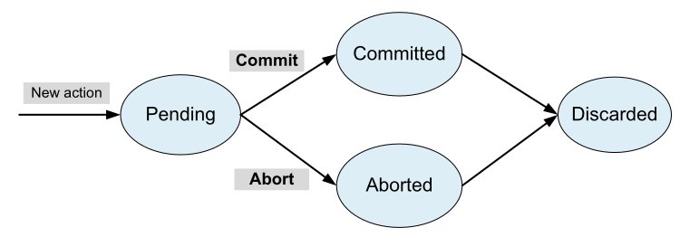

*All-or-nothing* means that either the entire atomic action is **carried out**, **or** the system is **left in the same state** it was before the atomic action was attempted.

Consists of two (main) phases:
1.  **Pre-commit phase:** **Preparatory actions** that can be **undone** (e.g., resource allocation, fetching a page, memory allocation).
2.  **Commit-point:** The transition between pre and post phases.
3.  **Post-commit phase:** Irreversible actions (e.g., altering the only copy of an object).

Maintaining a history of changes and a log of actions allows for dealing with system failures and ensuring consistency.

A **transaction lifecycle** goes from **Pending** to either **Committed**, so changes are applied (via Commit), or **Aborted**, so changes are undone using history of changes or log of action (via Abort), both leading to a Discarded state, this means the end of the transaction lifecycle.

#### Before-or-after atomicity:

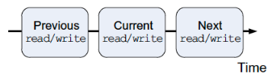

From the point of view of an external observer, the effect of multiple actions is as though these actions have occurred one after another, in some order.

* *Example*: the concurrent execution of operations within a transaction should produce the same result as if the transaction were executed serially.

---

## Storage Models & Desired Properties
* **Physical Storage:** Can be local disk, removable USB disk, or network-accessible disk; either solid-state (SSD) or magnetic (HDD).
* **Storage Model:** Describes the layout of a data structure in physical storage. Two main types:
    * **Cell** storage
    * **Journal** storage
* **Desired Properties for Storage Models:**
    * **Read/write coherence**: Ensures that the result of reading a memory cell is the same as the value from the most recent write to that specific cell. It focuses on the freshness and correctness of the data returned by a single read operation relative to previous write operations on that same location
    * **Before-or-after atomicity**: Ensures that concurrent operations appear to execute in some serial order, without their individual steps interleaving in a way that produces an inconsistent state. Each operation is treated as an indivisible unit.
    * **All-or-nothing atomicity**: Ensure that an operation is completely carried out or aborted.

### Cell Storage Model 
* **Assumptions:**
    * Storage is composed of **cells of the same size**.
    * **Exactly an object** into a cell.

The unit for read/write operations is a sector or block, reflecting the physical organization of common storage media (e.g., primary memory (RAM) as an array of cells, secondary storage (DISK, SSD) in sectors/blocks).

* **Guarantees:**
    * **Read/write coherence**
    * **Before-or-after** atomicity.
* **Does not Guarantee:**
    * **All-or-nothing** atomicity: Once the content of a cell is changed, there is no way to abort the action and restore the original content of that cell via the cell storage model itself.

### Journal Storage Model 

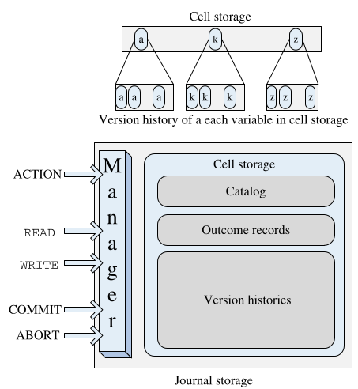

* A model for storing objects like records consisting of multiple fields.
* Comprises a **manager** and uses **cell storage** as its underlying persistent store.
* The entire **history of a variable** (not only its current value) is **maintained** in the cell storage (often as version histories).

#### User Interaction 
Users interact with the journal manager, not directly with the cell storage. User requests include:
* **ACTION**: Start a new action
* **READ**: Read the value of a cell
* **WRITE**: Write the value of a cell
* **COMMIT**: Commit an action
* **ABORT**: Abort an action

The journal manager translates these user requests into commands for the cell storage, such as: read a cell, write a cell, allocate a cell, or deallocate a cell.

#### The Log

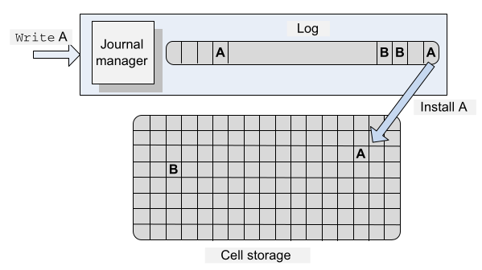

* Contains the **history of all variables** in the cell store. Each update is a record appended to the log.
* The log is **authoritative**, meaning that it is considered the primary and most trustworthy record of all changes, and **allows reconstruction** of the cell store.
* For an all-or-nothing action, the action is:
    * **First**, recorded in the log (in journal storage)
    * **Then**, the change is installed in the cell storage by overwriting the previous version.
* The log is always kept on **nonvolatile storage**. 
* The cell storage also typically resides on nonvolatile memory but **can be held in volatile memory** for real-time access or by using a write-through cache.

#### Guarantees
**All-or-nothing atomicity:** Achieved because an action first modifies the version history (log), and only then modifies the cell store (commit step). If any part of this process fails, the **action is discarded** (aborted).

All-or-nothing atomicity **implies read/write coherence and before-or-after atomicity**, so journal storage also guarantees these.

---

## Consensus Protocols
**Consensus:** The process where a number of agents (e.g., processes in a distributed system) agree on one of several proposed alternatives, aiming for a single proposed value.

Consensus protocols aim to guarantee: 
* **Consistency** and **Reliability (safety)**: Ensure that all nodes in a distributed system agree on a common state or decision, crucial for mantaining data intergrity and preventing conflicting updates.

Consensus protocols cannot guarantee:
* **Progress**: Cannot ensure that the process involved in trying to reach an agreement will eventually decide a value.

### Paxos
A family of protocols for reaching consensus, often based on a finite state machine approach. It is core in supporting eventual consistency in NoSQL data stores.

**Basic Paxos Goal** is to enable a set of processes to reach consensus on a single proposed value. Clients send requests to processes, proposing a value, and then await a response.

### Paxos protocol assumption

Basic Paxos protocol is based on several assumption about the processor and the network:
* Processors and the network may experience failures, but not **Byzantine failures** (where failed components can generate arbitrary, malicious data).
* **Processors:** Operate at arbitrary speeds, possess stable storage, may rejoin the protocol after failures, and can send messages to any other processor.
* **Network:** May lose, reorder, or duplicate messages; message delivery is asynchronous and can take an arbitrary amount of time.

### Paxos Entities (Agents)

* **Client:** Issues a request and waits for a response.
* **Proposer:** Advocates a client's request, attempts to convince acceptors to agree on the proposed value, and acts as a coordinator to move the protocol forward, especially during conflicts.
* **Acceptor:** Acts as the fault-tolerant "memory" of the protocol.
* **Learner:** Acts as the replication factor; takes action once a request has been agreed upon.
* **Leader:** A distinguished proposer.
* Typically, a single entity in a deployment plays the roles of proposer, acceptor, and learner.
* **Quorum and Proposal:**
    * A **quorum** is a subset of all acceptors (typically a majority).
    * A **proposal** consists of a pair: a unique proposal number (`pn`) and a proposed value (`v`). Multiple proposals may suggest the same value.
    * A value is **chosen** if a simple majority of acceptors have accepted it.

### Basic Paxos Algorithm

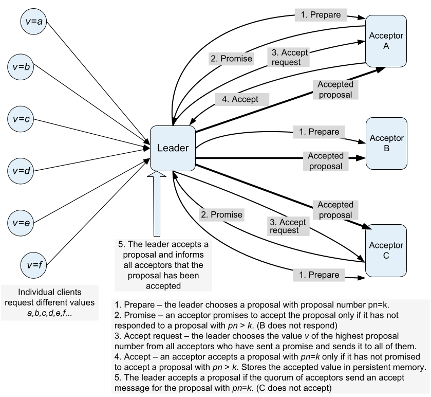

#### Phase 1: Proposal Preparation and Promise
1.  **Proposal Preparation (Proposer):** A proposer (**leader**) selects a proposal number `pn=k` and sends a `prepare` message to a majority of acceptors.

    This message requests that acceptors:
    * **Do not accept** any proposal with a number less than `k`
    * Respond with the highest-numbered proposal (with `pn < k`) they have **already accepted**, if any.

2.  **Proposal Promise (Acceptor):** An acceptor remembers the highest proposal number it has ever accepted and the highest proposal number it has ever responded to in a `prepare` request. It can promise to accept proposal `k` if and only if it has not already responded to a `prepare` message for a proposal with a number greater than `k`. If it has already replied to a higher proposal, it should not reply to the current one. 

    * **Lost messages** are treated as if the acceptor chose not to respond.

#### Phase 2: Accept Request and Accept
1.  **Accept Request (Proposer):** If the proposer receives promises from a majority of acceptors, it chooses a value `v` for its proposal as follow:
    * If any acceptors reported **previously accepted proposals**, the proposer must choose the value `v` associated with the highest proposal number among those responses. 
    * If **no proposals were previously accepted** by the responding acceptors, the proposer can choose an arbitrary value (typically the one it originally wanted to propose). 
    
    The proposer then sends an `accept request` message `(pn=k, v)` to a quorum of acceptors.

2.  **Accept (Acceptor):** If an acceptor receives an `accept request` message for proposal `pn=k`, it must accept it if and only if it has not already promised (in Phase 1) to only consider proposals with a number greater than `k`. 

    * If it **accepts**, it registers the value `v` (often in persistent storage) and sends an `accept` message to the proposer and to every learner. 
    * If it **does not accept** the proposal, it should ignore the request.

---

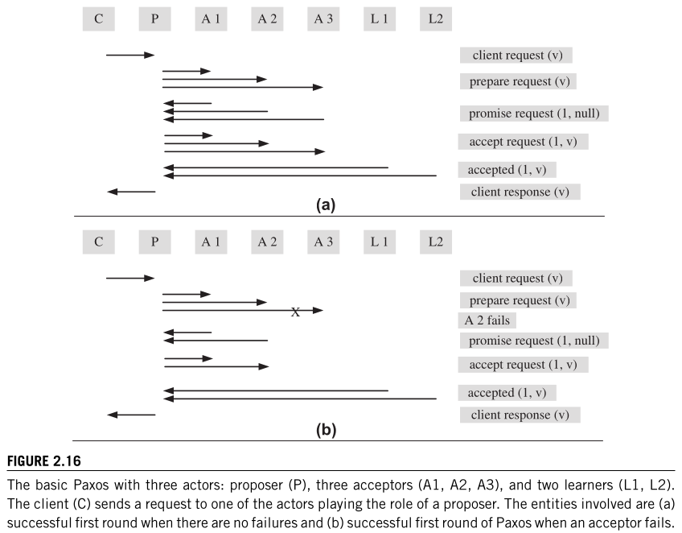

#### Algorithm Properties (Correctness)
*  A proposal number (`pn`) is **unique**.
*  Any two **quorums** (sets of acceptors) have **at least one acceptor in common**.
*  The value sent out in an `accept request` (Phase 2) by a proposer is the value of the **highest-numbered proposal** reported by acceptors in their Phase 1 `promise` responses (or the proposer's original value if no prior proposals were reported).
* **Message Flow and Failures:** The protocol is **designed to reach consensus** even if some messages are lost or some (non-Byzantine) nodes fail, as long as a proposer can communicate with a quorum of acceptors.

---

## Google File System (GFS) 

A **distributed file system** designed to provide petabytes of storage using thousands of storage systems built from inexpensive commodity components.
* **Example**: Standard cheap and inexpensive HDD as opposed to expensive and high-end storage hardware. 

### Design Principles

Given the usage of many standard storage system, main concern was about **High Reliability** and **Fault Tollerance** against various failures (hardware, software, human error).

Careful **analysis of typical file characteristics** and **access models** in Google's environment led to the derivation of the most important aspects of GFS design.

### Characteristic 
* Files are very large (GBs to hundreds of TBs).
* Most common operations are dominated by appends rather than random writes.
* Sequential reads are common.
* High sustained throughput is more critical than low latency for individual operations, as data is often processed in bulk.
* A relaxed consistency model is used to simplify implementation without overburdening application developers.

### Design

Above characteristic led to following design decisions:
* **File Structure:**
    * Files are divided into fixed-size segments called **chunks** (typically 64MB, much larger than traditional file system blocks).
    * Chunks are stored as files on standard Linux file systems on **chunk servers**.
    * Each chunk is **replicated on multiple chunk servers** (default is 3, configurable) for fault tolerance.
    * **Advantages of large chunk size:** 
        * **Optimizes performance** for large files
        * **Reduces metadata** maintained by the master
        * Increases **likelihood of multiple operations** targeting the same chunk (reducing network overhead by maintaining persistent connections)
        * **Reduces disk fragmentation**: small files or the last chunk of a large file may only partially fill a chunk.
* **Architecture:**

    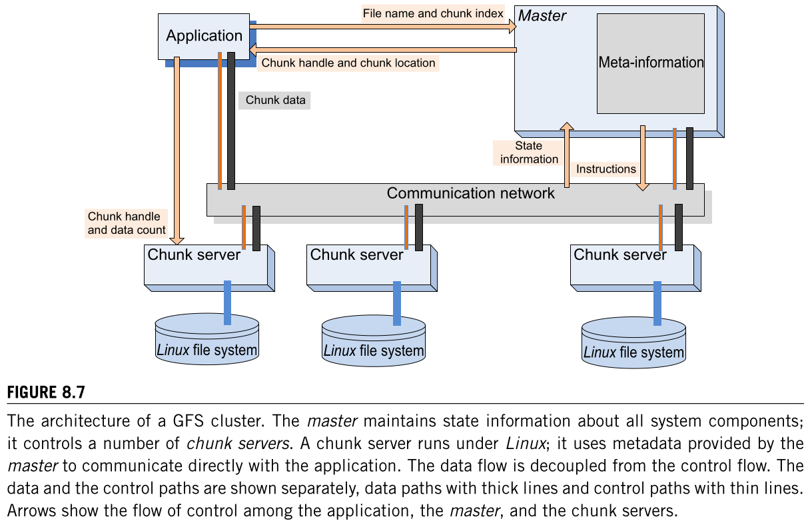

    * A single **Master** node:
        * Controls a large number of **Chunk Servers**.
        * Maintains all **filesystem metadata**, including filenames, access control information, the mapping from files to constituent chunks, the **locations of all replicas for every chunk**, and the state of individual chunk servers.
        * **Chunk locations** are stored only in the master's memory for fast access and are **updated at system startup** or **when a new chunk server joins**, this allows the master to have up-to-date info. about location of the chunks.
    * **Chunk Servers:** Store chunks on their local disks and handle read/write operations on these chunks as directed by clients or the master.
* **Reliability and Recovery:**
    * The master maintains an **operation log** for all metadata changes. 
    
        These **changes are atomic** and made visible to clients only after being recorded durably on multiple replicas.
    * In case of **master failure**, it can be recovered by replaying this operation log.
    * To **minimize recovery time**, the master periodically **checkpoints** its state, so only log records after the last checkpoint need to be replayed.

### File Access and Write Operations:
* **File Access (Reads):** The client asks the master for chunk locations. The master replies with the locations of replicas. The client then contacts a chunk server directly to read the data. The master is not involved in data transfer for reads.

* **File Creation:** Handled by the master.

* **Leases for Writes:** For mutations (writes or appends), the master grants a **lease** to one of the chunk replicas, designated as the **primary**. The primary is responsible for **serializing all mutations** to that chunk.

* **Write Process (Simplified):**
    1.  The client asks the master to **identify the primary** and **secondary replicas** for the target chunk. The master **grants a lease** to the primary if one **doesn't exist**.
    2.  The client pushes the data to **all replicas** (primary and secondaries). Data is temporary stored in an buffer on each chunk server.
    3.  Once all replicas acknowledge receiving the data, the client sends a **write request** to the primary.
    4.  The primary determines a serial order for mutations and applies the write to its local state.
    5.  The primary forwards the write request (and the serial order) to all secondary replicas.
    6.  Secondaries apply the mutation in the same order and acknowledge completion to the primary.
    7.  The primary replies to the client after receiving ACKs from all secondaries (or on error).

## Hadoop
An Apache Hadoop core component (along with **MapReduce** and YARN) designed to support distributed applications processing extremely large datasets (Big Data applications) based on MapReduce programming model.

Open-source framework for distributed storage and processing based on MapReduce programming model.
Its main cores are **MapReduce** (Processing), **HDFS** (Storage) and **YARN** (Resource manager and Job Scheduler).

### MapReduce

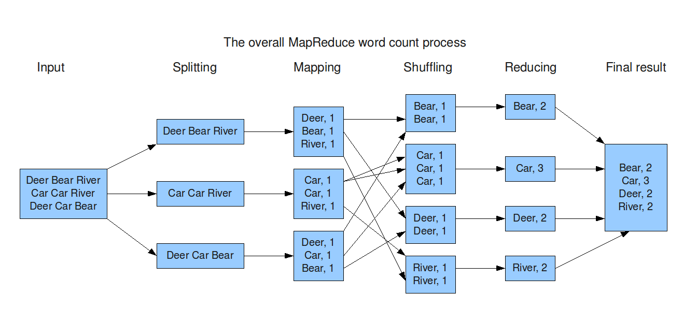
 

1.  **Input Splitting:** The input data is divided into smaller chunks called splits.
2.  **Mapping:** Each split is processed by a **Mapper** function, which transforms the input into **key-value pairs**.
3.  **Shuffling:** The key-value pairs from all Mappers are sorted and **grouped by key**.
4.  **Reducing:** Each unique key and its associated list of values are processed by a **Reducer** function to produce the final output.
5.  **Output:** The results from the Reducers are written to the output storage.

### HDFS

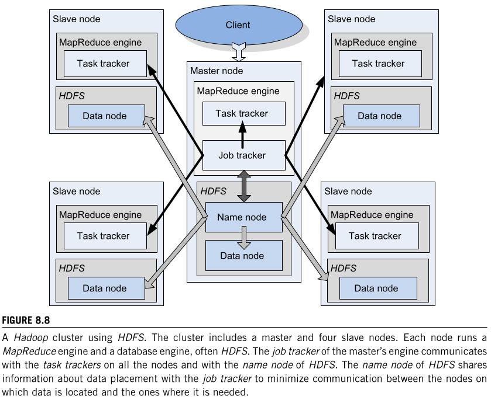
 

**Distributed file system** written in Java, making it portable across various platforms but cannot be directly mounted on an existing OS because not POSIX compliant. 

#### Characteristics
* Uses **large block sizes** (typically 64MB or 128MB).
* **Distribute** large dataset on multiple nodes (default 3 replicas) for fault tolerance.

#### Architecture

HDFS follows a Master/Slave architecture, where a cluster comprise a single **NameNode** (Master) and all the other **DataNodes** (Slave).

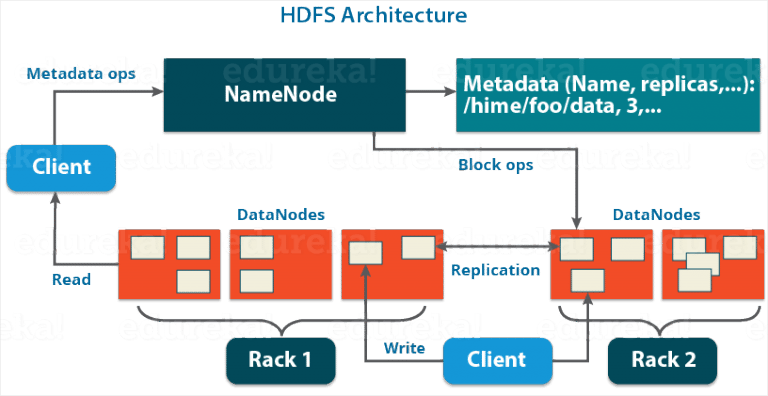

* **NameNode (Master):**
    * Manage DataNodes.
    * Keep record of all the blocks in HDFS and in which nodes these blocks are located.
    * Manages the **file system namespace** (directory tree, file-to-block mapping).
    * Stores all **metadata** for the file system (e.g location of stored blocks, size of the files, etc.), there are 2 files associated with the metadata:
        * FsImage: Contains complete state of the file system namespace since the start of the DataNode
        * EditLogs: Contains recent modification w.r.t. to most recent FsImage.
    * Records all **changes to metadata** in an operation log (***EditLog***).
    * Monitors **DataNode liveness** through heartbeats.
        * *Example*: if a file is deleted in HDFS, the NameNode will immediately record this in the EditLog.
* **Secondary NameNode**:
    * Read and write file systems and metadata from Primary NameNode and writes it into the hard disk.
    * Responsible for combining, at regular intervals, the EditLogs with FsImage. Hence, it performs regular **checkpoints**.
* **DataNodes (Slaves):**
    * Manage storage attached to the nodes they run on.
    * Perform low-level r/w operations on data blocks as instructed by clients or the NameNode.
    * Store the actual data blocks.
    * Send heartbeats to the NameNode periodically to report overall HDFS health (default, 3 seconds).

#### Replication Management

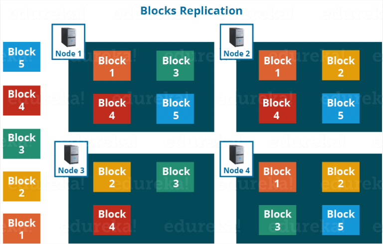

HDFS provides a reliable way to store huge data in a distributed environment as data blocks. The blocks are also **replicated to provide fault tolerance**. 

Each block is replicated three times (default) and stored on different DataNodes.

Therefore, if you are storing a file of 128 MB in HDFS using the default configuration, you will end up occupying a space of 384 MB (3*128 MB) as the blocks will be replicated three times and each replica will be residing on a different DataNode.

The NameNode collects block report from DataNode periodically to maintain the replication factor. Therefore, whenever a block is over-replicated or under-replicated the NameNode deletes or add replicas as needed. 

#### Rack Awareness

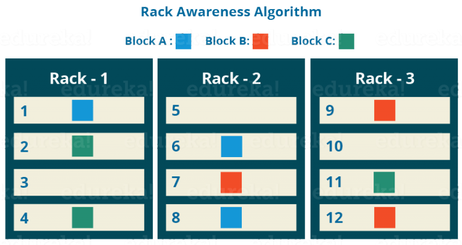

HDFS's replica placement policy is typically rack-aware. It tries to place replicas on different racks to ensure data availability even if an entire rack fails. 
* *Example*: with 3 replicas, one might be on a local rack node, and two on nodes in a different rack.

#### HDFS Write Protocol (Pipelined)
1.  **Setup of Pipeline:** 
    * Client, wanting to write a block, requests the NameNode to **choose DataNodes for replicas**. 
    * NameNode, provides a list of DataNodes **forming a pipeline** (e.g., DN1, DN4, DN6).
2.  **Data Streaming and Replication:**
    * Client writes data packets for the block to the first DataNode (DN1) in the pipeline.
    * DN1 stores the packet and forwards it to the second DataNode (DN4) in the pipeline.
    * DN4 stores the packet and forwards it to the third DataNode (DN6), and **so on, for N replicas**.
3.  **Shutdown of Pipeline (Acknowledgement):**
    * Acknowledgement packets flow back up the pipeline in the **reverse direction**. DN6 sends an ACK to DN4, DN4 to DN1, and DN1 to the client.
    * Once the client receives an ACK for the entire block from the first DataNode, it notifies the NameNode that the block write is complete. The **NameNode then updates its metadata**.
* For files larger than one block, this process is **repeated for each block**, and clients can pipeline writes for multiple blocks to improve throughput.

More at: https://www.edureka.co/blog/apache-hadoop-hdfs-architecture/

---

## NoSQL Data Stores 

* **Cloud Application Needs:** Cloud applications often require databases with low latency, high scalability, high availability, and specific consistency models.
* **DBMS Role:** A Database Management System (DBMS) should enforce data integrity, manage data access and concurrency control, and support recovery after failures.
* **Relational DBMS (RDBMS):** Typically guarantee ACID (Atomicity, Consistency, Isolation, Durability) properties but are often not easily scalable (in speed and size) for large cloud workloads.
* **NoSQL Database Models:** Suited for scenarios where:
    * The data structure does not require a rigid relational model.
    * The amount of data is very large (Big Data).
    * They may not guarantee full ACID properties, often opting for weaker consistency models like eventual consistency.
    * Include key-value stores, document store databases, and graph databases.
* **NoSQL Transaction Processing Characteristics:**
    * Designed for good scalability and no single point of failure.
    * Often have built-in support for consensus-based decisions (e.g., decisions based on a majority of votes).
    * Support partitioning and replication as fundamental primitives.
    * Employ a "soft-state" approach, allowing data to be temporarily inconsistent. The responsibility for implementing stricter ACID properties may fall on the application developer.
    * Data typically becomes **"eventually consistent"** at some future point, rather than enforcing immediate consistency upon transaction commit.
    * Data partitioning and replication enhance availability, reduce response time, and improve scalability.

## Google BigTable 

Bigtable is a **distributed storage system** developed at Google for managing massive amounts of structured data, scaling to petabytes across thousands of commodity servers.

### Data Model
Bigtable is a sparse, distributed, persistent, multi-dimensional sorted map.

Data is indexed by a unique tuple: $$(row key:string, column key:string, timestamp:int64)$$ the value is an uninterpreted string (array of bytes).

#### Rows 
* Row keys are arbitrary strings (typically 10-100 bytes, up to 64KB). 
* Data is maintained in **lexicographical order** by row key. 
* Operations (reads/writes) under a single row key are **atomic**. 
* A table's row range is dynamically partitioned into **tablets** (or *data chunks*), which are the **units of distribution** and **load balancing**, enabling efficient reads of short row ranges. 
* Clients can choose row keys to **optimize data locality**.
    * *Example*: Web Pages in the same domain (.com, .it, .org) are grouped together into contigous rows by **reversing the components of URLs**.
#### Column Families 
* Column keys are grouped into sets called **column families**, which are the basic **unit for access control** and **compression**. 
* A column family must be created before data storage and is intended to be small in number (hundreds at most) and change rarely. 
* A table can have a virtually **unbounded** number of columns within these families (**bounded** number), named using `family:qualifier` syntax. 
* Access control, disk, and memory accounting are managed at the column-family level.

#### Timestamps 
* Each cell (intersection of a row and column) can contain multiple versions of data, indexed by a 64-bit timestamp. 
* Timestamps can be **auto-assigned** by Bigtable (microseconds "real time") or **manually assigned** by client applications. 
* Versions are stored in **decreasing timestamp order**, allowing the most recent to be read first.
* **Garbage collection** for cell versions can be configured per column family (e.g., keep only the last 'n' versions or versions within a certain time window).

### API
* Provides functions to **create/delete tables** and **column families**, and **modify metadata** like access control rights.
* Clients can **write**, **delete**, **lookup** values from individual rows, or **iterate** over data subsets.
* **RowMutation** allows **atomic** modifications to a single row.
* **Scanner** enables iteration over data, with various filtering options[cite: 67, 68].
* Supports **single-row transactions** (atomic read-modify-write sequences). 
* General cross-row transactions are **not supported**, but client-side write batching is available.
* Cells can be used as atomic integer counters.
* Supports server-side execution of **client-supplied scripts** using Sawzall programming language for data transformation, filtering, and summarization (read-only access to Bigtable).
* Integrates with **MapReduce** as both an input source and an output target.

### Building Blocks
* **Google File System (GFS):** Used for storing log and data files (SSTables).
* **SSTable File Format:** 
    * Internally used **data format** to store Bigtable data as a persistent, ordered, immutable map from keys to values. 
    * SSTables consist of **blocks** (e.g., 64KB) with an index for efficient lookups (typically one disk seek). 
    * They can be **memory-mapped** for diskless access.
* **Cluster Management System:** 
    * **Job scheduling**
    * **Resource management** on shared machines
    * Machine **failure handling** and **status monitoring** .
* **Chubby:** 
    * A highly-available, persistent distributed lock service. 
    * Uses **Paxos algorithm** for replica consistency. 
    * Provides a namespace for small files and directories usable as **locks**, with **r/w atomic operations** to file. 
    * Bigtable uses Chubby for: 
        * Ensuring a **single active master**
        * Storing **bootstrap data** location
        * **Tablet server discovery** and **death finalization**
        * **Schema storage**
        * **Access control lists**.

### Bigtable Implementation Details

#### Major Components
* **Client Library:** Linked into every client application.
* **Master Server (One):** 
    * **Assigns tablets** to tablet servers 
    * Detects server addition/expiration
    * **Load balancing**
    * Handles GFS **garbage collection** 
    * Manages **schema changes** (e.g., table/column family creation). 
    
    Clients rarely communicate with the master for data operations, as tablet locations are cached, resulting in light loaded master.
* **Tablet Servers (Many):** 
    * **Manage** a set of tablets (10-1000 per server) 
    * Handle read/write requests for (N.B.) **their tablets**
    * Split tablets that grow too large (default 100-200MB).

    A Bigtable cluster store a number of **tables**, which consists of set of tablets, each tablet constains all data associated with a row range.

    Initially, each table consist of a single tablet. As table grows, it is automatically split into multiple tablets 
    
#### Tablet Location

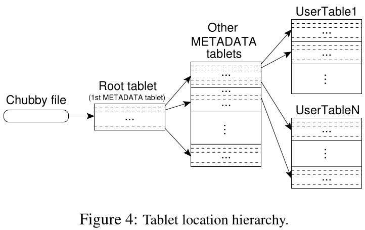

A **three-level tree** hierarchy is used to store tablet location info:
1.  A **Chubby file** points to the **root tablet**.
2.  The root tablet (first tablet of the METADATA table, **never split**) contains locations of all **METADATA tablets**.
3.  METADATA tablets store locations of user tablets, keyed by 

* **(table identifier, end row)**.
    * **Table Identifier**: Unique ID of the table
    * **End Row**: Each tablet contains data for a countigous range of rows (row range), the last row tell us where this range stop.

Clients cache these locations and prefetch them to reduce lookup latency.

#### Tablet Assignment
* The master assigns each tablet to one tablet server.
* The master keeps track of the set of live tablet server and their current tablet assignment. 
* If a tablet is **unassigned**, the master assign it to a Tablet Server based on how much tablets are already assigned to it.
* The master uses **Chubby** to track live tablet servers (servers create an **exlusive lock on**, a uniquely-named files in a Chubby directory). 
* The master detects **Tablet Server failures** (by asking for lock status or if unreachable) and reassigns their tablets after ensuring the failed server cannot serve **by deleting its Chubby file**.

#### Tablet Serving

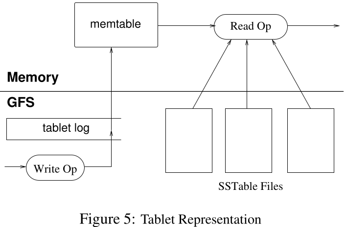

* Data for a tablet is stored in GFS as **SSTables**. 
* Updates are written to a commit log and then to an in-memory (RAM) sorted buffer called a **memtable**. Older updates reside in SSTables (Disk). 
* To **recover a tablet**, a tablet server reads its SSTable list and redo points from METADATA, then reconstructs the memtable by applying updates from commit logs. 
* **Writes** are logged then put into the memtable.
* **Reads** operate on a merged view of SSTables and the memtable.

#### Compactions
* **Minor Compaction:** When a memtable fills, it's frozen, converted to an SSTable, and written to GFS. This frees memory and reduces recovery time.
* **Merging Compaction:** **Periodically** merges a few SSTables and the memtable into a new SSTable to limit the number of SSTables that read operations need to consult.
* **Major Compaction:** A merging compaction that rewrites all SSTables for a tablet into a single SSTable. This reclaims space from deleted data (as non-major compactions can contain deletion entries) and ensures timely removal of deleted data.

#### Refinements for Performance and Reliability

* **Locality Groups:** Column families can be grouped. A separate SSTable is generated per locality group per tablet, improving read efficiency for unrelated data. Groups can be declared "in-memory," causing their SSTables to be lazily loaded for diskless reads of **frequently accessed small data** (e.g., METADATA table's location info).
* **Compression:** Clients can specify compression format per locality group, applied to each SSTable block. This achieves good compression ratios, especially for pages from the same host or with multiple versions.
* **Caching:** Tablet servers use a two-level cache: 
    * **Scan Cache** (key-value pairs) for repeated data reads.
    * **Block Cache** (SSTable blocks from GFS) for data locality reads.
* **Bloom Filters:** Can be created per SSTable in a locality group to quickly check if an SSTable **might contain data for a specific row/column**, reducing disk seeks for reads, especially for non-existent data.
* **Commit Log Implementation:** A single commit log per tablet server (co-mingling mutations) improves performance and group commit effectiveness. For recovery, this log is sorted in parallel by (table, row, sequence number) so each new tablet server can efficiently read entries for its assigned tablets. Each tablet server uses two log writing threads, switching if the active one performs poorly.
* **Tablet Recovery Speedup:** Before a tablet is moved, the source server performs minor compactions to reduce uncompacted state in the commit log, allowing the new server to load the tablet without log recovery.
* **Exploiting SSTable Immutability:** Simplifies concurrency (no locks needed for reading SSTables), allows efficient row concurrency control (memtable rows are copy-on-write), transforms permanent deletion into garbage collection of obsolete SSTables (master performs mark-and-sweep), and enables fast tablet splits (child tablets share parent's SSTables).

## Amazon Dynamo 
* A highly available and scalable distributed key-value store developed by Amazon for its e-commerce platform.
* Used for services needing primary-key access, such as shopping carts, customer preferences, session management, etc., where traditional RDBMS might be inefficient or limit scalability and availability.
* Emphasizes reliability and availability, trading off strict consistency for these properties.
* **Consistency Model:** **Eventually consistent**. Updates propagate to all replicas eventually, not necessarily immediately.
* **Replication:** Uses **optimistic replication**, where changes are allowed to propagate to replicas in the background. Reads/writes are successful if a minimum number of nodes (R/W quorum) complete the operation. This can lead to conflicting changes that must be detected and resolved (often at read time). The system is "always writable".
* **Key Requirements and Design Principles:**
    * **Query Model:** Simple read (`get(key)`) and write (`put(key, context, object)`) operations based on a unique key.
    * **ACID:** Sacrifices strong ACID properties (particularly strict consistency) for higher availability.
    * **Efficiency:** Designed to run on commodity hardware with low latency and high throughput.
    * **Scalability:** Incrementally scalable by adding one storage host (node) at a time.
    * **Symmetry & Decentralization:** Every node has the same responsibilities (peer-to-peer) rather than centralized control.
    * **Heterogeneity:** Can account for varying capacities of nodes in the infrastructure.
* **System Architecture Components:**
    * **System Interface:**
        * `get(key)`: Locates object replicas and returns a single object or a list of objects with conflicting versions along with a `context`.
        * `put(key, context, object)`: Determines replica placement and writes them. The `context` is opaque system metadata (including version information) obtained from a previous read or an empty context for new writes.
    * **Partitioning Algorithm:**
        * Uses **consistent hashing** to distribute data (keys) across nodes arranged in a logical ring. Each data item's key is hashed to determine its position and thus its responsible node on the ring.
        * To handle non-uniform data distribution and node dynamism, **virtual nodes** are used. Each physical node can be responsible for multiple virtual nodes on the ring. This helps in evenly dispersing load when nodes join or leave, and accounts for node heterogeneity (nodes with higher capacity can own more virtual nodes).
    * **Replication:**
        * Each data item is replicated on N hosts (N is a configurable parameter) for high availability and durability.
        * Each key `k` is assigned to a **coordinator node** (typically the first node encountered when walking the ring clockwise from the key's position).
        * The coordinator stores the key locally and replicates it at the N-1 clockwise successor nodes in the ring, forming a **preference list** for each key 100].
    * **Data Versioning:**
        * To handle concurrent updates in an eventually consistent system, Dynamo treats each modification as a new, immutable version of the data].
        * **Vector clocks** `([node_id, counter], ...)` are used as part of the `context` to capture the version history and causality between different versions of an object].
        * When a client reads an object, it may receive multiple divergent versions (if concurrent writes occurred). These versions, along with their vector clocks, are returned to the client]. The client (or application) is often responsible for "reconciling" these conflicts and writing back a resolved version]. If the system resolves conflicts, it might use a simple "last write wins" based on physical timestamps, but vector clocks allow for more sophisticated reconciliation.

---

## Amazon S3 (Simple Storage Service)
* **Storage Model:** Data is stored as named **"objects"** which are grouped into named **"buckets"**. It can be conceptualized as a map: `bucket_name + object_key + version_id -> object_data`.
* **Buckets:**
    * Bucket names are globally unique, 105].
    * Users can create up to 100 buckets by default].
    * Must be explicitly created via API before use].
    * Can be listed and deleted via API]. Access Control Lists (ACLs) control read/write permissions].
* **Objects:**
    * Can store any sequence of bytes, from 1 byte up to 5TB].
    * The **object key** (or key name) is unique within a bucket and serves as the identifier]. It can be thought of as a URI path name].
    * Objects are stored and retrieved in their entirety or by specific byte ranges using PUT and GET operations respectively].
* **Failure/Error Handling]:**
    * Applications using S3 must be designed to handle read/write failures and errors, typically by retrying requests].
    * S3 returns an **ETag** (which is the MD5 checksum of the object) with write acknowledgments and read responses. Clients should compute the MD5 of objects they write and compare it with the ETag to ensure data integrity against corruption during transmission or storage, 107, 108]. If a mismatch occurs, the operation should be retried.
* **Data Consistency Model for Objects]:**
    * **Strong read-after-write consistency** for PUTs of new objects and for PUT requests that overwrite existing objects, as well as for DELETE requests]. This means after a successful write or delete, any subsequent read request will immediately receive the new version or see the object as deleted.
    * Updates to a single key are **atomic**]. If two threads concurrently PUT and GET the same key, the GET will return either the old data or the new data, but never partial or corrupt data].
    * A PUT request returns successfully after all replicas are updated].
    * Strong consistency also applies to read operations on access control lists (ACLs), Object Tags, and object metadata].
* **Concurrency and Locking]:**
    * Amazon S3 **does not support object locking** for concurrent writers].
    * If two PUT requests are made simultaneously to the same key, the request with the **latest timestamp wins** (last-writer-wins semantics), 111]. Applications needing stricter concurrency control must implement their own locking mechanisms].
    * Updates are key-based; there is no way to make atomic updates across multiple keys unless built into the client application, 113, 114].
* **Data Consistency Model for Buckets]:**
    * Bucket configurations (e.g., listing buckets after deletion, enabling versioning) exhibit an **eventual consistency model**]. Changes might take a short time to fully propagate across the system, 116]. A 15-minute waiting period is sometimes suggested before performing object operations after certain bucket configuration changes].
* **Concurrent Application Behavior Examples, 118, 119]:** The slides illustrate scenarios with concurrent writes, emphasizing the last-writer-wins semantics and the unpredictability of the order in which S3 receives requests or applications receive acknowledgments. The best way to determine the final value after concurrent writes is to perform a read after both writes have been acknowledged].