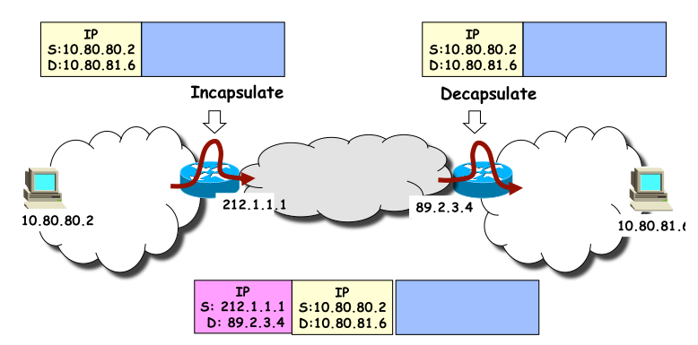

<!-- KaTeX auto-render header -->
<link rel="stylesheet" href="https://cdn.jsdelivr.net/npm/katex@0.16.0/dist/katex.min.css">

# Data Center Networks (DCN): Structure and Components

A Data Center (DC) is not a single, monolithic super-computer. Instead, its massive processing power and storage capacity are achieved by aggregating a vast number of **Commercial Off-The-Shelf (COTS)** components.

The **Data Center Network (DCN)** is the critical infrastructure that interconnects all these components, allowing them to work together as a cohesive whole. The design of this network is essential for applications to run efficiently and predictably.

## Key Physical Components

The fundamental building blocks of a modern data center are standardized and modular, designed to be stacked and scaled massively.

### Servers and Racks
* **Servers:** These are the computers that provide processing and storage services. 
    * In data centers, they are often **blade servers**, stripped-down computers with a modular design optimized for density.
* **Racks:** Servers are mounted in standardized frames called racks. A single 42U rack, for example, can hold up to 42 1U-sized servers. Multiple blade servers can be housed in a single **blade enclosure**, which provides shared power, cooling, and network interfaces for the servers it holds.

### Ethernet Switches
Used to interconnect the thousands of servers within a data center.
* **Top-of-Rack (ToR) Switch:** A common design practice is to place a switch at the top of each rack. This ToR switch connects all the servers within that rack.
* **Commodity Hardware:** These are typically COTS Ethernet switches, with a standard number of ports such as 24, 48, or 64.
* **Higher-Level Switches:** ToR switches are then connected to higher-level switches (sometimes called **Aggregation** or **End-of-Row (EoR)** switches) that link multiple racks together.

### The Data Center Environment & Connectivity

Beyond the computing hardware, a data center is a highly controlled physical facility that includes:
* **Power:** Redundant power supplies, including Uninterruptible Power Supplies (**UPS**) and **backup generators**, are critical for continuous operation.
* **Cooling:** Massive air conditioning systems are required to dissipate the heat generated by the servers and keep them within their recommended temperature range.
* **Security and Safety:** This includes physical security systems, fire protection, and environmental monitoring.
* **External Connectivity:** Data centers connect to the external internet via high-capacity **border routers** and use **load balancers** to distribute incoming traffic among the servers.

### Data Center Traffic Patterns

A key characteristic of data center traffic is that the vast majority of it is internal.
* **East-West Traffic:** This is communication between servers *within* the data center. It accounts for the bulk of the traffic, with some studies indicating it makes up around 80% of all packets. This traffic is generated by applications that require coordination between many servers, such as distributed databases or big data analytics jobs.
* **North-South Traffic:** This is traffic that enters or leaves the data center from or to the external internet (e.g., a user requesting a web page).

Understanding that most traffic is internal is fundamental to designing an efficient DCN topology.

Because the internal, East-West traffic pattern is dominant, the primary goal of modern DCN topology design has shifted. Instead of just efficiently getting traffic in and out of the data center, the goal is to provide high, uniform, and predictable bandwidth between any two servers in the facility.

This is why newer topologies like ***Fat-Tree*** and ***Clos Networks*** have become standard. 
* They are specifically designed to solve the East-West bottleneck by providing many parallel paths and much higher bisection bandwidth, ensuring that internal communication does not get choked at the core of the network.

## DCN Addressing and Routing Basics

Once the physical components are in place, the core networking challenge is deciding how to address the thousands of servers and route traffic between them efficiently. This choice has major implications for *scalability*, *flexibility*, and support for critical data center features like live *Virtual Machine (VM) migration*.

A key concept to remember is that a data center network primary purpose is to interconnect **racks of servers via their switches**, not to connect individual end-user hosts like in a traditional office network. 
* This focus on providing high-bandwidth, server-to-server (***East-West***) communication heavily influences the design choices that follow.

## The Core Dilemma: IP vs. Ethernet

Data center networks can be designed using **two primary** packet-switching technologies, each with its own set of **trade-offs**.

### IP Networking (Layer 3)
* Developed for ***WANs***.
* **Addressing:** Uses **hierarchical IP addressing**. An **IP address is tied to its topological location** in the network.
    * **Hierarchical IP**: An address that doesn't just uniquely identify a device, but also tells you where that device is located within the network structure. It functions as both an identifier and a locator. Think of it like a postal address:
    * `Country > State > City > Street > House Number`
    * You do not have to know the exact location of the house on the planet to send the letter, you just have to know which country, state, city, ..., the address itself provides a hierarchical path.
    * The same is true for an IP address, which is split into a **network prefix part** (the location) and a **host part** (the specific device).
* **Pros:**
    * **Highly scalable**. The hierarchical structure allows routers to **aggregate routes**, keeping forwarding tables **small and manageable even in very large networks**.
    * Standard routing protocols like the **Link-State** (e.g., OSPF) and **Distance-Vector** families can efficiently find the best paths.
    * **Programmability with Software-Defined Networking (SDN)**. Modern IP networks are increasingly managed using the **SDN paradigm**. 
        * This approach separates the network's "brain" (the control plane, decide where to send packets) from the packet-forwarding hardware "muscle" (the data plane, effectively send packets). 
            * (`Brain-Muscle > Cervello-Braccio`)
        * A central software controller gets a global view of the network and can dynamically manage traffic flow, which is ideal for the complex and changing demands of a data center.
* **Cons:** **Poor support for VM migration**. 
    * If a VM moves from a server in one rack to another, its **IP address must change to reflect its new location**. 
    * This breaks active TCP connections and adds significant management overhead.

### Ethernet Networking (Layer 2)
* Developed for ***LANs***.
* **Addressing:** Uses **flat MAC addressing**. 
    * A device's MAC address is **permanent and not tied to its location**.
* **Pros:** ***Excellent support for VM migration***. 
    * A VM can move anywhere within the same Layer 2 domain and keep its IP address, as the address is not tied to the physical location. 
    * It is also *plug-and-play*, requiring no address configuration on servers.
* **Cons:** ***Not scalable or efficient for large networks***.
    * **Flooding:** Unknown destinations require flooding frames to all ports, creating unnecessary traffic.
    * **Spanning Tree Protocol (STP):** To prevent routing loops in topologies with redundant paths, STP disables links. This is extremely wasteful, as it prevents the network from using all its available capacity.

## Hybrid Solutions and Tunneling

Since **neither pure IP nor pure Ethernet is ideal**, modern data centers use a **hybrid approach** that combines the strengths of both. 
* The key technology that enables this is **tunneling** (or **encapsulation**).

The basic idea is to create a virtual Layer 2 network that spans across a physical Layer 3 network. A packet from a VM is **wrapped inside another packet** for transport across the core network.

* **Inner Packet:** Contains the **original** source and destination MAC/IP addresses used by the VMs.
* **Outer Packet:** Contains source and destination addresses that are **routable** across the physical data center network.

This technique abstracts the VM's location from the physical network, allowing a VM to move freely while still benefiting from the scalable and efficient routing of an IP-based core network. 
* Standards like **VXLAN** (Virtual Extensible LAN) and **TRILL** (Transparent Interconnection of Lots of Links) are built on this principle.

### Example - Encapsulation Concept

#### Step 1: The Original Packet

* On the far left, a source VM with the IP address **10.80.80.2** wants to send a packet to a destination VM with the IP address **10.80.81.6**.
* These addresses are the permanent, **application-specific addresses (AAs)**. They identify the VMs themselves, regardless of where they are physically located in the data center.
* The core data center network, however, may not know how to route packets based on these "AA" addresses. It is structured to route based on physical location.

#### Step 2: Encapsulation ("Incapsulate")

* Before the packet is sent into the main network, a "shim layer" or agent on the source server's hypervisor intercepts it.
* It takes the **entire original IP packet** and wraps it inside a **new IP packet**. This new packet gets a new, "outer" IP header.
* **Outer Source IP:** The source address of this new header is the IP of the physical hardware the VM is running on, such as its Top-of-Rack (ToR) switch. In the diagram, this is **212.1.1.1**. This is known as the **location-specific address (LA)**.
* **Outer Destination IP:** The destination address is the LA of the hardware hosting the destination VM. In the diagram, this is **89.2.3.4**.
* The original packet is now the payload of the new, larger packet. This is often called IP-in-IP encapsulation.

#### Step 3: Transit Through the Network

* The encapsulated packet is sent into the data center network.
* The core switches and routers only look at the **outer IP header**. They see a simple request to route a packet from `212.1.1.1` to `89.2.3.4` and forward it accordingly using their efficient, scalable routing logic. They are completely unaware of the inner packet and its addresses.

#### Step 4: Decapsulation ("Decapsulate")

* When the packet arrives at the destination hardware (the ToR switch with IP `89.2.3.4`), the process is reversed.
* The network agent at this end **strips off the outer IP header**.
* This reveals the original, untouched inner packet with the destination IP `10.80.81.6`.

#### Step 5: Final Delivery

* The decapsulated, original packet is now delivered to the final destination VM on the local network.

By using this encapsulation process, the data center achieves the best of both worlds: VMs can migrate freely within the network while keeping their stable IP addresses (the AAs), and the physical network can use a highly scalable and efficient hierarchical routing scheme based on physical location (the LAs).

## Case Study: VL2 Addressing

VL2 is a well-known architecture that demonstrates the **hybrid IP/Ethernet approach**. It achieves seamless VM mobility by separating a service's identity from its physical location using several key components.

### Core Concepts: AAs and LAs

VL2 uses two types of IP addresses:

* **Application-specific Addresses (AAs):** These are **permanent, portable** addresses assigned to VMs. They function as the stable endpoint identifiers and do not change when a VM migrates.
* **Location-specific Addresses (LAs):** These are standard IP addresses assigned to the physical network hardware, such as the ToR switches. They are used for the actual routing of packets through the data center.

### The VL2 Directory System

To manage the crucial mapping between AAs and LAs, VL2 uses a centralized but highly-available Directory System. This system is composed of two specialized tiers of servers:

* **Replicated State Machines (RSMs):** A small, highly reliable cluster of servers (e.g., 5-10 servers for 100k servers) that acts as the **database** for all AA-to-LA mappings.
* **Directory Servers:** A larger set of servers (e.g., 50-100 for a 100k-server DC) that act as a **distributed cache**. 
    * They hold copies of the mappings from the RSMs to provide fast query responses to the VL2 agents.

This system has two primary operations:
* **Update Process:** When a VM moves, its new mapping is sent to a random directory server, which forwards the update to an RSM server. The RSM layer then replicates this change across all its nodes to ensure consistency before confirming the update.
* **Consistency:** To ensure the caches are up-to-date, the directory servers periodically synchronize their local mappings with the authoritative data held by the RSMs.

### The Packet Forwarding Process

The actual packet handling combines these components into a clear, step-by-step process:

1.  A **VL2 agent** (a shim layer) on a source server intercepts an outgoing packet addressed to an AA.
2.  The agent queries a **Directory Server** to find the corresponding LA for the destination AA.
3.  The agent then **encapsulates** the original packet (using AAs) inside a new IP packet with the source and destination LAs.
4.  The physical network routes the packet using the LAs.
5.  When the packet arrives at the destination ToR switch, it is decapsulated.
6.  The original packet is forwarded to the correct destination VM using its AA.

### Leveraging Multiple Paths with ECMP

Data center topologies are intentionally designed with rich connectivity, meaning there are often many paths of the same cost (length) between any two servers. 
* This redundancy is great for fault tolerance, but it presents a routing challenge: ***how do you effectively use all these paths without causing problems and selecting minimum cost route?***

Simple approaches are not ideal:
* **Round-Robin:** Sending packets sequentially across different paths would evenly distribute the load, but it would also cause packets within a single TCP connection to arrive **out of order**, breaking the connection.
* **Random Selection:** Randomly choosing a path for each packet also spreads the load but suffers from the **same reordering problem**.

The solution to this is **Equal Cost Multi-Path (ECMP)** routing. ECMP is designed to distribute traffic across all available equal-cost paths while ensuring connection integrity.

* **Mechanism:** To prevent packet reordering, ECMP ensures that all packets belonging to the **same logical "flow"** are **always sent down the same path**. It does this by applying a consistent hashing algorithm to each packet on a per-packet basis:

    1.  A **flow identifier `x`** is associated with the packet (e.g., derived from the source/destination IPs and ports).
    2.  A hash function `h(•)` is applied to compute **`y = h(x)`**.
    3.  The resulting bit string `y` is converted to a **modulo-`r` integer, `k`**, where `r` is the number of available equal-cost routes.
    4.  The packet is sent to the selected **route `#k+1`**.

* **Ideal Hash Function:** An ideal hash function ensures a **perfectly uniform and random-like distribution** of flows across the output paths. This means the probability of any given hash output is independent of all previous outputs, as described by the formula:

    $$\large \mathcal{P}(h(x_{j+1})=y_{j+1}|h(x_{1})=y_{1},...,h(x_{j})=y_{j})=\frac{1}{2^{m}}, \forall j\ge1$$

    In simpler terms, this ensures that every flow has an equal chance of being mapped to any of the available paths, which is key to achieving good load balancing.

## The Adopted Solution: Enhanced Ethernet

Despite the classic debate over the pros and cons of IP versus Ethernet, the technology that has been most widely adopted for building the internal data center network is a **highly enhanced version of Ethernet**.

The choice is often driven by practical factors like technological availability and economic opportunities (e.g., the low cost of COTS Ethernet switches) rather than pure conceptual superiority.

It is crucial to understand that this is **NOT** the traditional Ethernet used in a simple office LAN. The Ethernet used in data centers has been extensively enhanced to overcome its classic limitations. This can be understood by debunking some common myths:

* **Myth:** Ethernet uses the inefficient Spanning Tree Protocol (STP), which disables links to prevent loops.
    * **Reality:** Data Center Ethernet uses advanced **multipathing solutions** (like TRILL or Layer 3 routing with ECMP) that allow all available links to be used simultaneously, maximizing network capacity.

* **Myth:** Ethernet uses the old CSMA/CD protocol for collision detection.
    * **Reality:** Modern data centers use **fully-switched, full-duplex Ethernet**. Devices can send and receive data at the same time without collisions.

* **Myth:** Ethernet is purely "best-effort" and cannot provide performance guarantees.
    * **Reality:** Enhanced Ethernet includes mechanisms for **Quality of Service (QoS)**. It supports features like strict priority queues and has dedicated **congestion control protocols** designed for the data center environment.

In short, while the foundation is Ethernet, the protocols and capabilities layered on top make it a far more robust, scalable, and high-performance solution tailored specifically for the demanding data center environment.

## Latency in Data Centers

In the context of a data center, latency is composed of three main factors:
* **Propagation Delay:** The time it takes a signal to travel across the physical medium (copper or fiber). 
    * Given the relatively short distances inside a data center (a few hundred meters at most), this is essentially zero (less than a few microseconds).
* **Switching Latency:** The time a switch takes to process a packet and forward it. 
    * This is a small but significant component, typically a few microseconds per switch.
* **Queuing Latency:** The time a packet spends waiting in a buffer inside a switch because of congestion. 
    * This is the **most significant and variable** component of latency in a data center.

Understanding and managing queuing latency is the primary goal of congestion control protocols, which we will cover later.