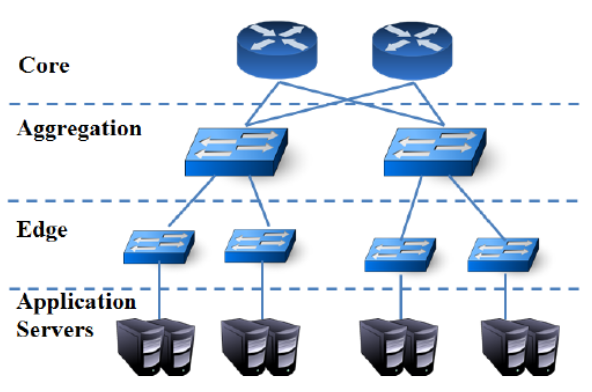
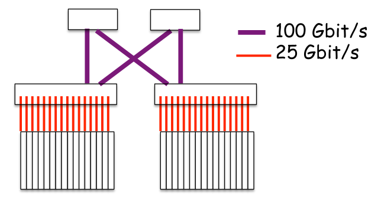
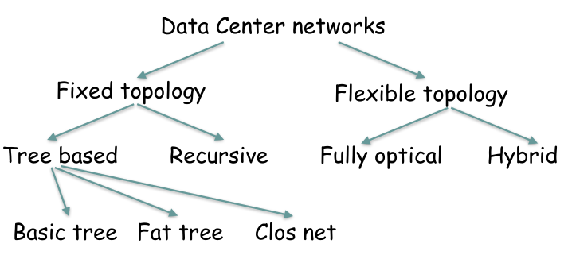

# Data Center Topology: Introduction

The **topology** of a data center network describes how its components—the switches and servers—are interconnected. It is the architectural blueprint of the network, and choosing the right topology is critical for achieving high performance, scalability, and reliability.

## The Canonical Three-Tier Tree Topology

The traditional and most straightforward DCN design is the **canonical three-tiered tree topology**. This hierarchical structure consists of three layers of network devices:

1.  **Edge Layer:** Composed of **Top-of-Rack (ToR)** switches. 
    * Each ToR switch connects directly to the servers within a single rack.
2.  **Aggregation Layer:** Interconnects groups of ToR switches. 
    * A single aggregation switch typically connects to multiple racks, acting as a traffic concentration point.
3.  **Core Layer:** Forms the backbone of the data center. 
    * It connects all the aggregation switches and provides connectivity to the external internet.

While simple to understand, this design suffers from **major limitations** in modern data centers, particularly the problem of **oversubscription**, where the links higher up in the tree become bottlenecks for the massive amount of East-West (server-to-server) traffic.

### The Problem of Oversubscription

***Oversubscription***: occurs when the total potential bandwidth of the devices in a lower network tier exceeds the available uplink bandwidth connecting to the next higher tier. 

This is not an accident; it is often a deliberate design choice to reduce the cost of expensive high-capacity switches and links. However, it is the primary cause of performance bottlenecks in traditional tree topologies.

#### Example

**Scenario Setup:**
* A rack has one **Top-of-Rack (ToR) switch**.
* **16 servers** are connected to this ToR switch, each with a 25 Gbps link.

**Calculating the Bandwidth Mismatch:**

1.  **Total Downstream Bandwidth:** The maximum possible traffic that all servers in the rack can generate at once is:
    $16 \text{ servers} \times 25 \text{ Gbps/server} = 400 \text{ Gbps}$

2.  **Total Upstream Bandwidth:** This ToR switch is connected "up" to two separate aggregation switches, using one 100 Gbps link for each. The total exit bandwidth from the rack is:
    $2 \text{ uplinks} \times 100 \text{ Gbps/uplink} = 200 \text{ Gbps}$

**Result: The Oversubscription Ratio**

There is a clear mismatch: 400 Gbps of potential traffic from the servers must compete to exit through a 200 Gbps bottleneck. This is an oversubscription ratio of **2:1**.

This problem gets **worse as you move higher up the tree**. 
* For example, a core switch that aggregates traffic from 4 aggregation switches might be handling 800 Gbps of potential traffic, creating even heavier oversubscription and congestion for any traffic that needs to cross the data center core (i.e., East-West traffic).

## Classifying DCN Topologies

To overcome the limitations of the basic tree, many alternative topologies have been proposed. They can be classified in several ways:

### 1. By Reconfigurability
* **Fixed Topologies:** The physical network structure is static once deployed.
    * **Tree-based:** Includes the basic tree and more advanced multi-rooted trees like **Clos Networks** and **Fat-Trees**.
    * **Recursive:** Built by repeatedly connecting smaller, identical units (cells) to form a larger network. Examples include **DCell** and **BCube**.
* **Flexible Topologies:** The network topology can be reconfigured during operation to adapt to traffic demands, often using optical switching technology.

### 2. By Networked Elements
* **Switch-Centric:** The interconnection network is built entirely from switches. This is the most common approach (e.g., Fat-Tree).
* **Hybrid (Server + Switch):** Both servers and switches participate in forwarding packets. In these designs, servers are equipped with multiple network ports.
* **Server-Centric:** The network is built using only servers, which are directly connected to each other and are responsible for all packet forwarding.

## Key Performance Indicators (KPIs) for Evaluation

Different topologies are compared based on a number of key metrics that determine their suitability for a data center environment:

* **Bandwidth & Connectivity:** The amount of communication capacity available between any two servers and the number of alternative paths.
* **Reliability & Resiliency:** The ability of the network to withstand and recover from component failures (links or nodes) without losing connectivity.
* **Scalability & Expandability:** The ability to support a massive number of servers and, crucially, to allow for easy, incremental growth without requiring a complete redesign.
* **Deployment Cost & Complexity:** The total cost of the hardware (switches, cables) and the physical complexity of wiring the data center according to the topology.

## Other Critical DCN Design Issues beyond topology

The topology defines *what* is connected, but these other issues define *how* it operates. The key considerations beyond the physical layout include:

### Core Network Functions
* **Addressing:** How servers are identified and located within the network (e.g., the hierarchical vs. flat addressing problem).
* **Routing:** The protocols and algorithms used to calculate and forward traffic along the best paths provided by the topology.

### Performance and Resource Management
* **Scheduling and Resource Allocation:** How user tasks and VMs are assigned to physical machines, and how network bandwidth is allocated among them.
* **Congestion Control:** The mechanisms used to prevent network links and switch buffers from being overwhelmed by traffic, which is crucial for maintaining low latency.

### Operational and Reliability Concerns
* **Ease of Deployment and Expansion:** How easily the network can be physically built and, more importantly, how it can grow over time without requiring a complete overhaul.
* **Survivability and Fault Tolerance:** How the network detects and automatically recovers from the inevitable failures of links and switches.
* **Energy Consumption:** The strategies and technologies used to operate the network in a power-efficient manner, which is a major operational cost.

### Security and Monitoring
* **Security:** How tenants are isolated from one another in a multi-tenant environment and how the infrastructure is protected from attacks.
* **Performance Metering:** The tools and processes used to monitor network performance, ensuring that service-level agreements (SLAs) are being met.