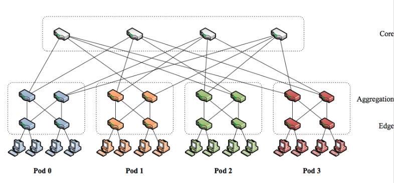

# Data Center Topology

The **topology** of a data center network describes how its components—the switches and servers—are interconnected. It is the architectural blueprint of the network, and choosing the right topology is critical for achieving high performance, scalability, and reliability.

## The Canonical Three-Tier Tree Topology

The traditional and most straightforward DCN design is the **canonical three-tiered tree topology**. This hierarchical structure consists of three layers of network devices:

1.  **Edge Layer:** Composed of **Top-of-Rack (ToR)** switches. 
    * Each ToR switch connects directly to the servers within a single rack.
2.  **Aggregation Layer:** Interconnects groups of ToR switches. 
    * A single aggregation switch typically connects to multiple racks, acting as a traffic concentration point.
3.  **Core Layer:** Forms the backbone of the data center. 
    * It connects all the aggregation switches and provides connectivity to the external internet.

While simple to understand, this design suffers from **major limitations** in modern data centers, particularly the problem of **oversubscription**, where the links higher up in the tree become bottlenecks for the massive amount of East-West (server-to-server) traffic.

### The Problem of Oversubscription

***Oversubscription***: occurs when the total potential bandwidth of the devices in a lower network tier exceeds the available uplink bandwidth connecting to the next higher tier. 

This is not an accident; it is often a deliberate design choice to reduce the cost of expensive high-capacity switches and links. However, it is the primary cause of performance bottlenecks in traditional tree topologies.

#### Example

**Scenario Setup:**
* A rack has one **Top-of-Rack (ToR) switch**.
* **16 servers** are connected to this ToR switch, each with a 25 Gbps link.

**Calculating the Bandwidth Mismatch:**

1.  **Total Downstream Bandwidth:** The maximum possible traffic that all servers in the rack can generate at once is:
    $16 \text{ servers} \times 25 \text{ Gbps/server} = 400 \text{ Gbps}$

2.  **Total Upstream Bandwidth:** This ToR switch is connected "up" to two separate aggregation switches, using one 100 Gbps link for each. The total exit bandwidth from the rack is:
    $2 \text{ uplinks} \times 100 \text{ Gbps/uplink} = 200 \text{ Gbps}$

**Result: The Oversubscription Ratio**

There is a clear mismatch: 400 Gbps of potential traffic from the servers must compete to exit through a 200 Gbps bottleneck. This is an oversubscription ratio of **2:1**.

This problem gets **worse as you move higher up the tree**. 
* For example, a core switch that aggregates traffic from 4 aggregation switches might be handling 800 Gbps of potential traffic, creating even heavier oversubscription and congestion for any traffic that needs to cross the data center core (i.e., East-West traffic).

## Classifying DCN Topologies

To overcome the limitations of the basic tree, many alternative topologies have been proposed. They can be classified in several ways:

### 1. By Reconfigurability
* **Fixed Topologies:** The physical network structure is static once deployed.
    * **Tree-based:** Includes the basic tree and more advanced multi-rooted trees like **Clos Networks** and **Fat-Trees**.
    * **Recursive:** Built by repeatedly connecting smaller, identical units (cells) to form a larger network. Examples include **DCell** and **BCube**.
* **Flexible Topologies:** The network topology can be reconfigured during operation to adapt to traffic demands, often using optical switching technology.

### 2. By Networked Elements
* **Switch-Centric:** The interconnection network is built entirely from switches. This is the most common approach (e.g., Fat-Tree).
* **Hybrid (Server + Switch):** Both servers and switches participate in forwarding packets. In these designs, servers are equipped with multiple network ports.
* **Server-Centric:** The network is built using only servers, which are directly connected to each other and are responsible for all packet forwarding.

## Key Performance Indicators (KPIs) for Evaluation

Different topologies are compared based on a number of key metrics that determine their suitability for a data center environment:

* **Bandwidth & Connectivity:** The amount of communication capacity available between any two servers and the number of alternative paths.
* **Reliability & Resiliency:** The ability of the network to withstand and recover from component failures (links or nodes) without losing connectivity.
* **Scalability & Expandability:** The ability to support a massive number of servers and, crucially, to allow for easy, incremental growth without requiring a complete redesign.
* **Deployment Cost & Complexity:** The total cost of the hardware (switches, cables) and the physical complexity of wiring the data center according to the topology.

## Other Critical DCN Design Issues beyond topology

The topology defines *what* is connected, but these other issues define *how* it operates. The key considerations beyond the physical layout include:

### Core Network Functions
* **Addressing:** How servers are identified and located within the network (e.g., the hierarchical vs. flat addressing problem).
* **Routing:** The protocols and algorithms used to calculate and forward traffic along the best paths provided by the topology.

### Performance and Resource Management
* **Scheduling and Resource Allocation:** How user tasks and VMs are assigned to physical machines, and how network bandwidth is allocated among them.
* **Congestion Control:** The mechanisms used to prevent network links and switch buffers from being overwhelmed by traffic, which is crucial for maintaining low latency.

### Operational and Reliability Concerns
* **Ease of Deployment and Expansion:** How easily the network can be physically built and, more importantly, how it can grow over time without requiring a complete overhaul.
* **Survivability and Fault Tolerance:** How the network detects and automatically recovers from the inevitable failures of links and switches.
* **Energy Consumption:** The strategies and technologies used to operate the network in a power-efficient manner, which is a major operational cost.

### Security and Monitoring
* **Security:** How tenants are isolated from one another in a multi-tenant environment and how the infrastructure is protected from attacks.
* **Performance Metering:** The tools and processes used to monitor network performance, ensuring that service-level agreements (SLAs) are being met.

## Fat-Tree Networks Topology

To overcome the bottlenecks of the canonical tree topology, modern data centers use a smarter design. Instead of using a few, very powerful, and expensive switches at the core, this approach uses a large number of identical, commodity switches to build a rich, multi-path network fabric. The most common and important of these designs is the **Fat-Tree**.

### The Clos Network Heritage

The DCN Fat-Tree is a modern application of a much older concept from telephony called a **Clos Network**. 

A Clos network is a multi-stage switching architecture designed to provide high connectivity in a scalable way. 

The Fat-Tree topology used in data centers is technically a **folded-Clos** network (also called a **leaf-spine** architecture). 
* It takes a 3-stage feed-forward network and "folds" it in the middle, creating bidirectional paths between the edge and the core.

### Fat-Tree Construction

A Fat-Tree network is built in a structured, pod-based manner using a single type of building block: a commodity **n-port switch**.

The construction proceeds as follows:
1.  **Pods:** The network is organized into **`n` pods**. 
    * A pod is the fundamental building block of the network. Each pod contains two layers of `n/2` switches each:
        * **Aggregation Switches:** `n/2` switches in the upper layer of the pod.
        * **Edge Switches:** `n/2` switches in the lower layer of the pod.

2.  **Switch Connectivity within a Pod:**
    * Each of the `n/2` **Edge switches** uses half its ports (`n/2`) to connect down to servers and the other half (`n/2`) to connect up to *every one* of the `n/2` aggregation switches within that same pod.
    * Each of the `n/2` **Aggregation switches** uses half its ports (`n/2`) to connect down to *every one* of the `n/2` edge switches in the pod. The other half of its ports (`n/2`) are used to connect up to the core switches.

3.  **The Core Layer:**
    * There is a core layer consisting of **`(n/2)²`** n-port switches.
    * Each core switch has `n` ports, and each port is connected to a different pod. 
        * This ensures a direct link from every core switch to every pod in the network.

#### Fat-Tree Properties

This structured design results in the following key properties:
* **Total Servers:** $\Large \frac{n^3}{4}$
* **Total Switches:** $\Large \frac{5n^2}{4}$

**Key Advantage:** This topology provides a **large number of parallel, equal-cost paths** between any two servers, even if they are in different pods. This massive path diversity eliminates the bottlenecks of the traditional tree design and is ideal for handling heavy East-West traffic.

#### Example: A Fat-Tree with n=4 Switches

Let's use 4-port switches (`n=4`) as an example:
* **Pods:** There are `n=4` pods.
* **Switches per Pod:** Each pod has `n/2=2` edge switches and `n/2=2` aggregation switches.
* **Servers per Edge Switch:** Each edge switch connects down to `n/2=2` servers.
* **Core Switches:** There are `(n/2)² = 2² = 4` core switches.
* **Total Servers:** `4³/4 = 16` servers.
* **Total Switches:** `5 * 4² / 4 = 20` switches.

#### Example: A Fat-Tree with n=8 Switches

### Routing in Fat-Tree Networks (skip to slides 92-93)

The structured design of the Fat-Tree topology allows for deterministic and efficient routing strategies. The **primary goal** is to **leverage the rich path diversity** to evenly **distribute traffic and avoid bottlenecks**.

#### Path Characteristics
The routing path depends on whether the traffic is staying within a pod or traveling between pods.

* **Intra-Pod Traffic:** If a server communicates with another server in the same pod, the traffic path is simple. 
    * The packet travels from the source server up to its Edge switch, then to a common Aggregation switch within the pod, and back down to the destination Edge switch and server. The Core layer is not used.
    
* **Inter-Pod Traffic:** This is the more complex case. For any two servers located in different pods:
    * All traffic must traverse the **Core layer**.
    * There are exactly **`(n/2)²`** equal-cost shortest paths between them (one for each switch of the core layer).
    * Each of these paths has a fixed length of **6 hops** (in a standard 3-layer Fat-Tree):
        
        **Upstream Path (Source to Core)**

        * **Hop 1:** Source Server → Edge Switch
        * **Hop 2:** Edge Switch → Aggregation Switch
        * **Hop 3:** Aggregation Switch → **Core Switch (Turning Point)**

        **Downstream Path (Core to Destination)**

        * **Hop 4:** **Core Switch** → Aggregation Switch
        * **Hop 5:** Aggregation Switch → Edge Switch
        * **Hop 6:** Edge Switch → Destination Server

    

#### The Routing Goal and a Proposed Mechanism
The main objective of the routing algorithm is to **distribute traffic evenly across all available core switches**. 
* This prevents any single core switch from becoming a **bottleneck** and ensures that the network's **full bisection bandwidth** can be utilized.

While ECMP is a general way to achieve this, one specific mechanism proposed for Fat-Trees uses custom **two-level routing tables** in the switches:
* **Primary Table:** Works like a standard routing table, matching the **prefix** of a destination address to determine if the traffic is local to the pod or needs to go to the core.
* **Secondary Table:** For inter-pod traffic, the primary table points to a secondary table. 
    * This table uses the **suffix** of the destination address to deterministically select one of the `n/2` uplinks to the core. 
    * By using different suffixes to select different core switches, traffic is effectively spread across the entire core layer.

### Fat Tree Case Study: The Facebook "4-Post" Data Center Network

This is a practical example of a large-scale data center network design. It shows how the general concepts of layered topologies are implemented with specific hardware choices, oversubscription ratios, and redundancy mechanisms.

The architecture is built around three main types of switches:

* **Rack Switch (RSW):** This is the Top-of-Rack (ToR) switch that connects directly to up to 48 servers in a rack via 10G links.
* **Cluster Switch (CSW):** This is an aggregation-layer switch. A group of RSWs are connected to a group of CSWs to form a "cluster".
* **Fatcat Switch (FC):** This is the core-layer switch that interconnects all the different clusters. The design uses four of these core switches, which is where the "4-post" name comes from.

#### Connectivity and Oversubscription

The links between these layers are designed with specific oversubscription ratios to balance cost and performance:

* **From Rack to Cluster (RSW → CSW):** Each RSW has 4 to 8 10G uplinks to the CSWs in its cluster. This results in a **10:1 oversubscription ratio**, meaning the total bandwidth of the servers is 10 times greater than the uplink capacity of their rack.
* **From Cluster to Core (CSW → FC):** Each CSW has four 40G uplinks, with one link going to each of the four core Fatcat switches. This layer has a lower **4:1 oversubscription ratio**.

#### Redundancy and Protection

To ensure high availability, the design uses "protection rings" for redundancy at the higher layers:

* **Cluster Ring:** Within a single cluster, the CSW switches are connected to each other in a high-capacity ring (e.g., 10G x 8).
* **Core Ring:** The four core Fatcat (FC) switches are also connected to each other in a larger, higher-capacity ring (e.g., 10G x 16).

This ring structure at both the aggregation (CSW) and core (FC) layers provides alternative paths for traffic if a switch or link fails.

## Clos Networks Topology

The Fat-Tree topology is a modern, practical application of a much older and more fundamental concept in network switching theory known as the **Clos Network**. Understanding this theory explains *why* the Fat-Tree is designed the way it is.

### The Motivating Problem: Switch Complexity

The simplest conceptual model for a switch that can connect any of its `N` inputs to any of its `N` outputs is a **crossbar switch**.

* A crossbar is an `N x N` grid of connection points (crosspoints).
* Its primary drawback is its high complexity. The number of crosspoints required grows with the square of the number of ports, a **complexity of $O(N^2)$**.
* This becomes prohibitively expensive and physically large for switches with many ports.

The key question that led to the Clos network was: ***can we build a switch with the same non-blocking capability as a crossbar, but with significantly lower complexity?***

### The 3-Stage Clos Network Solution

In 1953, Charles Clos proposed a solution using a modular, three-stage design:

1.  **Ingress Stage:** Composed of `r` smaller switches, each of size `n x m`.
2.  **Middle Stage:** Composed of `m` switches, each of size `r x r`.
3.  **Egress Stage:** Composed of `r` switches, each of size `m x n`.

In this design, the total number of input/output lines for the entire system is `N = n * r`. Each switch in the ingress stage has a connection to every switch in the middle stage, which in turn has a connection to every switch in the egress stage.

### Non-Blocking Properties

The performance of a Clos network is defined by its ability to make connections without being "blocked." 

A path between input $i$ and output $j$ is an ordinate sequence of switch cross points and inter-stage links that connects $i$ to $j$; when connected, path $(i, j)$ cannot be used by others.

There are **two main types**:

* **Strictly Non-Blocking:** A new connection between an idle input and an idle output can *always* be made instantly, without having to alter any existing connections.
    * This is achieved when $\large m \ge 2n - 1$.
* **Rearrangeably Non-Blocking:** A new connection can always be made, but it might require re-routing (rearranging) existing connections to free up a path. This is acceptable for packet networks.
    * This is achieved with a less strict condition: $\large m \ge n$.

For data center networks, the **rearrangeably non-blocking property is sufficient**.

### Justification for Non-Blocking Conditions

#### Strictly Non-Blocking: $m \ge 2n - 1$

The goal is to prove that you can always find a free path from an idle input to an idle output without rearranging any existing connections. We do this by considering the "worst-case scenario" for path availability.

Let's say you want to connect an idle input $i$ (on ingress switch $S_i$) to an idle output $j$ (on egress switch $S_j$). A path is only available if there is at least one middle-stage switch that is free to connect to *both* $S_i$ and $S_j$.

1.  **Paths used by the ingress switch ($S_i$):**
    * The ingress switch $S_i$ has $n$ inputs. Since input $i$ is idle, at most $n-1$ other inputs can be busy.
    * In the worst case, these $n-1$ busy inputs are connected to $n-1$ different middle-stage switches.

2.  **Paths used by the ingress switch ($S_j$):**
    * The egress switch $S_j$ has $n$ outputs. Since output $j$ is idle, at most $n-1$ other outputs can be busy.
    * In the worst case, these $n-1$ busy outputs are connected to $n-1$ different middle-stage switches.

3.  **The Worst-Case Collision:** The absolute worst case for finding a common free path is if the $n-1$ middle-stage switches used by $S_i$ are **completely different** from the $n-1$ middle-stage switches used by $S_j$.

4.  **Finding a Free Path:** In this worst-case scenario, the total number of middle-stage switches that could be occupied is $(n-1)$ (from $S_i$) + $(n-1)$ (from $S_j$), which equals $2n - 2$.

To guarantee that there is **at least one** middle-stage switch left over that is completely free, the total number of middle-stage switches, $m$, must be greater than the maximum possible number of busy ones.

Therefore, the condition is:
$m > 2n - 2$, which is equivalent to $m \ge 2n - 1$.

#### Rearrangeably Non-Blocking: $m \ge n$

For this property, the condition is less strict because the network has the added flexibility of being able to tear down and re-establish existing connections to make room for a new one.

While a formal proof is not provided in the course slides, the intuition is that you no longer need to account for the worst-case scenario where all paths from the input and output switches are disjoint and fixed. Because paths can be rearranged, you only need to ensure there are enough middle-stage switches ($m$) to accommodate all the potential connections from a single ingress or egress switch ($n$).

### From Clos Network to Fat-Tree

The final conceptual step is to see how this theoretical 3-stage design becomes the Fat-Tree topology we use in data centers:

1.  We start with a rearrangeably non-blocking Clos network where $\large m = n$.
2.  We can recursively apply the Clos design to the large middle-stage switches to create a deeper, multi-stage network.
3.  We then take this feed-forward network and **"fold" it in half** around the central axis.

This "folded-Clos" network is exactly the **Fat-Tree topology**. The ingress and egress stage switches become the **Edge and Aggregation** layer switches within the pods, and the middle stage becomes the **Core** layer. The separate input and output ports become single, bidirectional ports.

### Clos Network: Optimization and the Link to Fat-Tree

This section covers the mathematical details behind the Clos network design, explaining why it's more efficient than a simple crossbar switch and how the theory directly leads to the practical Fat-Tree construction formulas.

#### Optimizing Switch Complexity

The primary motivation for the Clos network was to reduce the high complexity of a fully-connected crossbar switch.

* **Baseline (Crossbar Switch):** A crossbar switch that connects $N$ inputs to $N$ outputs requires $N^2$ crosspoints. Its complexity grows as $O(N^2)$, which is not scalable.
* **Clos Network Complexity:** For a 3-stage, rearrangeably non-blocking Clos network (where $m=n$), the total number of crosspoints, $X$, is given by the formula:
    $X = 2rn^2 + nr^2$
* **The Optimization:** For a fixed total number of ports $N$ (where $N=nr$), we can choose the parameters $n$ and $r$ to minimize the complexity $X$. The optimal complexity for a Clos network is approximately:
    $X^* = 2N\sqrt{2N}$
* **The Result:** For a large number of ports $N$, the complexity of $2N\sqrt{2N}$ is significantly lower than the $N^2$ complexity of a crossbar switch, making it a much more scalable and cost-effective design.

#### The Mathematical Link to the Practical Fat-Tree

The final theoretical step is to show how the general Clos network parameters lead directly to the simple `S = n³/4` formula for the number of servers in a Fat-Tree. This is done by adding one practical constraint: **all switches in the network must be identical commodity `n`-port switches**.

The derivation proceeds as follows:

1.  We start with the parameters of a recursively built Clos network topology.
2.  To enforce the use of a single switch type, the parameters must satisfy certain relationships. From the example construction in the slides, these are $k=n$ and $r/k = n/2$.
3.  Solving these for $r$ (the number of ingress/egress switches in the original Clos model, which corresponds to the number of edge switches per pod multiplied by the number of pods in the Fat-Tree) gives us $r = n^2/2$.
4.  We know the total number of servers $S$ is the number of edge switches ($r$) multiplied by the number of servers per edge switch ($n/2$). So, $S = r \times (n/2)$.
5.  Substituting the value of $r$ from step 3 into this equation gives the final result:
    $S = (\frac{n^2}{2}) \times (\frac{n}{2}) = \frac{n^3}{4}$

This proves that the practical Fat-Tree construction is a direct and optimized application of general Clos network theory.

### Theoretical Performance Bounds

Beyond just the structure, we can analyze topologies mathematically to understand their theoretical performance limits. The slides present a way to calculate an upper bound on network throughput that is "application-oblivious," meaning it doesn't depend on a specific traffic pattern.

#### An Application-Oblivious Throughput Bound

The normalized throughput ($TH$) of a network is limited by the total number of links, the number of flows, and the average length of the paths those flows take. The relationship is given by the formula:

$$TH \le \frac{l}{\overline{h}\nu_{f}}$$

Where:
* $TH$ is the **Normalized Throughput**, representing the minimum guaranteed data rate of any flow, relative to the link capacity.
* $l$ is the **total number of links** in the network.
* $\overline{h}$ is the **average path length** (in hops) taken by the flows.
* $\nu_{f}$ is the **total number of active flows** in the network.

**The Intuition:** This formula shows that to maximize throughput, you need to minimize the denominator. This means building networks where the average path length ($\overline{h}$) is as short as possible for the number of flows it needs to support.

#### Proof of the Bound

The proof relies on comparing the total available network capacity to the total consumed capacity.

1.  **Total Available Capacity:** If each of the $l$ links has a capacity of $C$, the total capacity of the entire network is $l \times C$.
2.  **Total Consumed Capacity:** A single flow with rate $x_i$ that travels over a path of $h_i$ hops consumes $x_i \times h_i$ of the network's total capacity. The total consumed capacity is the sum over all flows: $\sum x_i h_i$.
3.  **The Bound:** Since the consumed capacity cannot exceed the available capacity, we have $\sum x_i h_i \le l \times C$. By the definition of normalized throughput, the rate of every flow $x_i$ is at least $TH \times C$. Substituting this gives the final bound.

#### Application to r-Regular Graphs

This theoretical bound can be applied to specific types of graphs, such as **r-regular graphs**, where every node (switch) has the same number of connections, $r$. This is a common way to model data center topologies. The slides also mention the **Moore Bound**, which provides a theoretical lower limit on the average shortest path length ($\overline{h}$) for such graphs, reinforcing that path length is a fundamental parameter for performance.