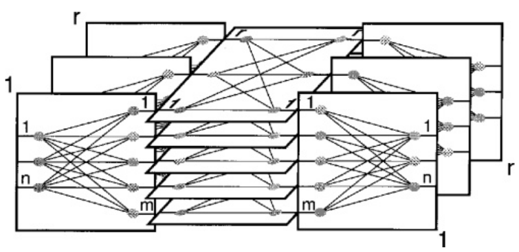

<!-- KaTeX auto-render header -->
<link rel="stylesheet" href="https://cdn.jsdelivr.net/npm/katex@0.16.0/dist/katex.min.css">

# Advanced Network Theory

## Clos Networks Topology

The Fat-Tree topology is a modern, practical application of a much older and more fundamental concept in network switching theory known as the **Clos Network**. Understanding this theory explains *why* the Fat-Tree is designed the way it is.

### The Motivating Problem: Switch Complexity

The simplest conceptual model for a switch that can connect any of its `N` inputs to any of its `N` outputs is a **crossbar switch**.

* A crossbar is an `N x N` grid of connection points (crosspoints).
* Its primary drawback is its high complexity. The number of crosspoints required grows with the square of the number of ports, a **complexity of $O(N^2)$**.
* This becomes prohibitively expensive and physically large for switches with many ports.

The key question that led to the Clos network was: ***can we build a switch with the same non-blocking capability as a crossbar, but with significantly lower complexity?***

### The 3-Stage Clos Network Solution

In 1953, Charles Clos proposed a solution using a modular, three-stage design:

1.  **Ingress Stage:** Composed of `r` smaller switches, each of size `n x m`.
2.  **Middle Stage:** Composed of `m` switches, each of size `r x r`.
3.  **Egress Stage:** Composed of `r` switches, each of size `m x n`.

* ***Ingress***: Is the corresponding term for traffic entering a network or device. It is the inbound direction.
* ***Egress***: Refers to the path for traffic exiting a network or a network device. It is the outbound direction.

In this design, the total number of input/output lines for the entire system is `N = n * r`. Each switch in the ingress stage has a connection to every switch in the middle stage, which in turn has a connection to every switch in the egress stage.

### Non-Blocking Properties

The performance of a Clos network is defined by its ability to make connections without being "blocked." 

A path between input $i$ and output $j$ is an ordinate sequence of switch cross points and inter-stage links that connects $i$ to $j$; when **connected**, path $(i, j)$ **cannot be used by others**.

There are **two main types**:

* **Strictly Non-Blocking:** A new connection between an idle input and an idle output can *always* be made instantly, without having to alter any existing connections.
    * This is achieved when $\large m \ge 2n - 1$.
* **Rearrangeably Non-Blocking:** A new connection can always be made, but it might require re-routing (rearranging) existing connections to free up a path. This is acceptable for packet networks.
    * This is achieved with a less strict condition: $\large m \ge n$.

For data center networks, the **rearrangeably non-blocking property is sufficient**.

### Justification for Non-Blocking Conditions

#### Strictly Non-Blocking: $\large m \ge 2n - 1$

The goal is to prove that you can always find a free path from an idle input to an idle output without rearranging any existing connections. We do this by considering the "worst-case scenario" for path availability.

Let's say you want to connect an idle input $i$ (on ingress switch $S_i$) to an idle output $j$ (on egress switch $S_j$). A path is only available if there is at least one middle-stage switch that is free to connect to *both* $S_i$ and $S_j$.

1.  **Paths used by the ingress switch ($S_i$):**
    * The ingress switch $S_i$ has $n$ inputs. Since input $i$ is idle, at most $n-1$ other inputs can be busy.
    * In the worst case, these $n-1$ busy inputs are connected to $n-1$ different middle-stage switches.

2.  **Paths used by the ingress switch ($S_j$):**
    * The egress switch $S_j$ has $n$ outputs. Since output $j$ is idle, at most $n-1$ other outputs can be busy.
    * In the worst case, these $n-1$ busy outputs are connected to $n-1$ different middle-stage switches.

3.  **The Worst-Case Collision:** The absolute worst case for finding a common free path is if the $n-1$ middle-stage switches used by $S_i$ are **completely different** from the $n-1$ middle-stage switches used by $S_j$.

4.  **Finding a Free Path:** In this worst-case scenario, the total number of middle-stage switches that could be occupied is $(n-1)$ (from $S_i$) + $(n-1)$ (from $S_j$), which equals $2n - 2$.

To guarantee that there is **at least one** middle-stage switch left over that is completely free, the total number of middle-stage switches, $m$, must be greater than the maximum possible number of busy ones.

Therefore, the condition is:
$\large m > 2n - 2$, which is equivalent to $\large m \ge 2n - 1$.

#### Rearrangeably Non-Blocking: $\large m \ge n$

For this property, the condition is less strict because the network has the added flexibility of being able to tear down and re-establish existing connections to make room for a new one.

While a formal proof is not provided in the course slides, the intuition is that you no longer need to account for the worst-case scenario where all paths from the input and output switches are disjoint and fixed. Because paths can be rearranged, you only need to ensure there are enough middle-stage switches ($m$) to accommodate all the potential connections from a single ingress or egress switch ($n$).

### From Clos Network to Fat-Tree

The final conceptual step is to see how this theoretical 3-stage design becomes the Fat-Tree topology we use in data centers:

1.  We start with a rearrangeably non-blocking Clos network where $\large m = n$.
2.  We can recursively apply the Clos design to the large middle-stage switches to create a deeper, multi-stage network.
3.  We then take this feed-forward network and **"fold" it in half** around the central axis.

This "folded-Clos" network is exactly the **Fat-Tree topology**. The ingress and egress stage switches become the **Edge and Aggregation** layer switches within the pods, and the middle stage becomes the **Core** layer. The separate input and output ports become single, bidirectional ports.

#### Visual Example

The slides provide a step-by-step visual example of how the theoretical, 3-stage Clos network is transformed into the practical, bidirectional Fat-Tree topology used in data centers.

1.  **Step 1: Recursive Construction**
    The process begins with a standard 3-stage Clos network. To build a larger, more scalable fabric, the large switches in the middle stage are themselves replaced with their own, smaller 3-stage Clos networks. This demonstrates the recursive nature of the design.

    

2.  **Step 2: Visual Rearrangement**
    The resulting multi-stage network is then rearranged visually to align the layers, making the structure clearer before the final transformation.

    

3.  **Step 3: The "Fold"**
    This is the most critical conceptual step. The entire feed-forward network is **"folded" in half** along its central vertical axis. This fold transforms the architecture:
    * The network becomes **bidirectional**, suitable for server-to-server communication.
    * The formerly separate ingress and egress stages are merged to become the **edge and aggregation layers** within the Fat-Tree pods.
    * The central middle stage becomes the **core layer** of the Fat-Tree.

    

This visual process shows exactly how the abstract, unidirectional Clos switch fabric becomes the concrete, bidirectional Fat-Tree network topology.

### Clos Network: Optimization and the Link to Fat-Tree

This section covers the mathematical details behind the Clos network design, explaining why it's more efficient than a simple crossbar switch and how the theory directly leads to the practical Fat-Tree construction formulas.

#### Optimizing Switch Complexity

The primary motivation for the Clos network was to reduce the high complexity of a fully-connected crossbar switch.

* **Baseline (Crossbar Switch):** A crossbar switch that connects $N$ inputs to $N$ outputs requires $N^2$ crosspoints. 
    * Its complexity grows as $O(N^2)$, which is **not scalable**.
* **Clos Network Complexity:** For a 3-stage, rearrangeably non-blocking Clos network (where $m=n$), the total number of crosspoints, $X$, is given by the formula:
    $$\large X = 2rn^2 + nr^2$$
* **The Optimization:** For a fixed total number of ports $N$ (where $N=nr$), we can choose the parameters $n$ and $r$ to minimize the complexity $X$. 
    * The optimal complexity for a Clos network is approximately:
    $$\large X^* = 2N\sqrt{2N}$$
* **The Result:** For a **large number of ports** $N$, the complexity of $2N\sqrt{2N}$ is **significantly lower** than the $N^2$ complexity of a crossbar switch, making it a much **more scalable** and **cost-effective** design.

    

#### The Mathematical Link to the Practical Fat-Tree

The final theoretical step is to show how the general Clos network parameters lead directly to the simple `S = n³/4` formula for the number of servers in a Fat-Tree. This is done by adding one practical constraint: **all switches in the network must be identical commodity `n`-port switches**.

The derivation proceeds as follows:

1.  We start with the parameters of a recursively built Clos network topology.
2.  To enforce the use of a single switch type, the parameters must satisfy certain relationships. From the example construction in the slides, these are $k=n$ and $r/k = n/2$.
3.  Solving these for $r$ (the number of ingress/egress switches in the original Clos model, which corresponds to the number of edge switches per pod multiplied by the number of pods in the Fat-Tree) gives us $r = n^2/2$.
4.  We know the total number of servers $S$ is the number of edge switches ($r$) multiplied by the number of servers per edge switch ($n/2$). So, $S = r \times (n/2)$.
5.  Substituting the value of $r$ from step 3 into this equation gives the final result:
    $\large S = (\frac{n^2}{2}) \times (\frac{n}{2}) = \frac{n^3}{4}$

This proves that the practical Fat-Tree construction is a direct and optimized application of general Clos network theory.

### Theoretical Performance Bounds

Beyond just the structure, we can analyze topologies mathematically to understand their theoretical performance limits. The slides present a way to calculate an upper bound on network throughput that is "***application-oblivious***," meaning it **doesn't depend on a specific traffic pattern**.

#### An Application-Oblivious Throughput Bound

The **normalized throughput** ($TH$) of a network is limited by the total number of links, the number of flows, and the average length of the paths those flows take. This relationship provides a theoretical upper bound on performance, independent of the specific application traffic.

The main formula for the bound is:

$$\large TH \le \frac{l}{\overline{h}\nu_{f}}$$

Where the variables are defined as:
* $TH$ is the **Normalized Throughput**. 
    * It is defined as the rate of the slowest flow ($x_i$) in the network relative to the capacity of a single link ($C$):
    $$TH \equiv \frac{\min_{i} x_i}{C}$$
* $l$ is the **total number of links** in the network.
* $\overline{h}$ is the **average path length** (in hops) taken by the flows.
* $\nu_{f}$ is the **total number of active flows** in the network.

**The Intuition:** This formula shows that to **maximize throughput** (i.e., guarantee the best possible minimum performance for all flows), you need to **minimize the denominator**. 
* This means building networks where the **average path length** ($\overline{h}$) is as **short as possible** for the number of flows it needs to support.

#### Proof of the Bound

The proof relies on comparing the total available network capacity to the total consumed capacity.

1.  **Total Available Capacity:** If each of the $\large l$ **links** has a **capacity** of $\large C$, the **total capacity** of the entire network is $\large l \times C$.
2.  **Total Consumed Capacity:** A single flow with **rate** $\large x_i$ that travels over a **path** of $\large h_i$ **hops** consumes $\large x_i \times h_i$ of the network's total capacity. 
    * The **total consumed capacity** is the sum over all flows: $\large \sum x_i h_i$.
3.  **The Bound:** Since the **consumed capacity cannot exceed the available capacity**, we have: $$\large \sum x_i h_i \le l \times C$$
By the definition of normalized throughput, the rate of every flow $\large x_i$ is at least $\large TH \times C$. Substituting this gives the final bound.

#### Detailed Steps

1.  We start with the **Capacity Limit** inequality, which states that the total consumed network capacity cannot exceed the total available capacity:
    $$\large \sum x_i h_i \le l \times C$$

2.  Next, we use the definition of **Normalized Throughput**. For any flow, its rate $\large x_i$ is greater than or equal to the minimum throughput rate in the system, so:
    $$\large x_i \ge TH \times C$$

3.  We can now substitute this minimum rate into the "Total Consumed Capacity" sum. This gives us a lower bound on the total consumed capacity:
    $$\large \sum x_i h_i \ge \sum (TH \times C) h_i$$

4.  Since $\large TH$ and $\large C$ are constants across all flows, we can factor them out of the sum:
    $$\large \sum (TH \times C) h_i = TH \times C \times \sum h_i$$

5.  Now we can combine the inequalities from steps 1 and 4 into a single chain:
    $$\large l \times C \ge \sum x_i h_i \ge TH \times C \times \sum h_i$$

6.  Focusing on the outer parts of this chain and canceling the link capacity $\large C$ from both sides, we get:
    $$\large l \ge TH \times \sum h_i$$

7.  Finally, we isolate $\large TH$ and substitute the definition of average path length ($\large \sum h_i = \overline{h} \times \nu_{f}$) to arrive at the final bound:
    $$\large TH \le \frac{l}{\overline{h}\nu_{f}}$$

Here are the updated and expanded notes for that section, incorporating all the details from slides 96-98.

***

#### Application to r-Regular Graphs

The theoretical throughput bound can be applied to specific, well-defined types of graphs that are used to model data center topologies. One such type is an **r-regular graph**.

* **Definition:** An r-regular graph is one where every node (switch) has the same number of connections, or degree, which is equal to $r$.
* **Properties:**
    * The number of switches, $S$, must be at least $r+1$.
    * The product $S \times r$ must be an even number.
* **DCN Application:** In this model, each of the $S$ switches uses $r$ of its ports to connect to other switches, and the remaining $n-r$ ports to connect to servers. This gives a total of $N = S(n-r)$ servers in the network.

For this specific structure, the general throughput bound formula can be written as:

$$\large TH \le \frac{Sr}{\overline{h}\nu_{f}}$$

The slides provide visual examples of such graphs, including a 3-regular graph with 6 nodes and a 5-regular graph with 30 nodes.

#### Theoretical Limit on Path Length: The Moore Bound

The average path length, $\overline{h}$, is a critical parameter for network performance. The **Moore Bound** provides a theoretical *lower limit* on what the average shortest path length can be for a given r-regular graph. It tells us the best possible performance in terms of path length.

The Moore Bound is given by the formula:

$$\large \overline{h} \ge \frac{\sum_{j=1}^{k-1}jr(r-1)^{j-1}+kR}{N-1}$$

Where the terms $R$ and $k$ are defined as:

$$\large R=N-1-\sum_{j=1}^{k-1}r(r-1)^{j-1}$$

$$\large k=1+\lfloor\frac{log(N-2(N-1)/r)}{log(r-1)}\rfloor$$