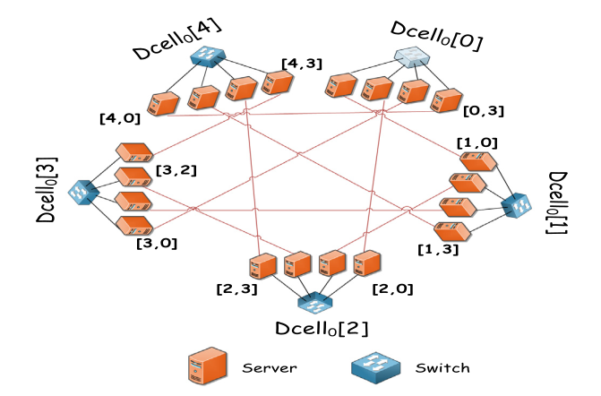
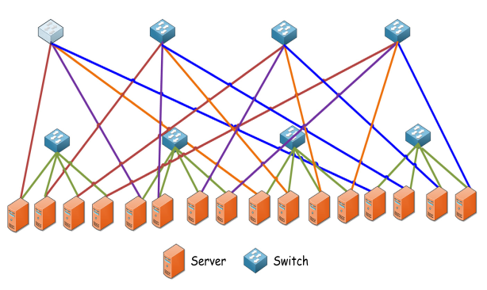
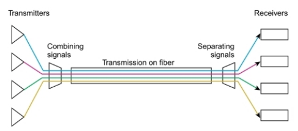
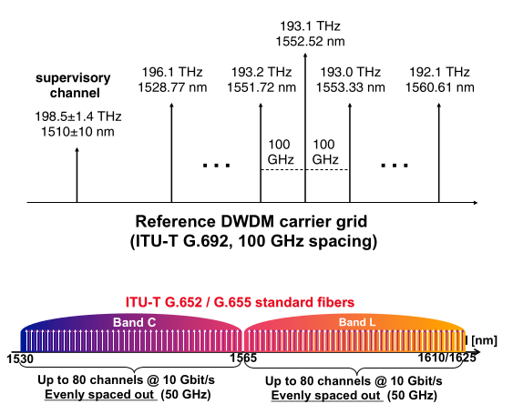
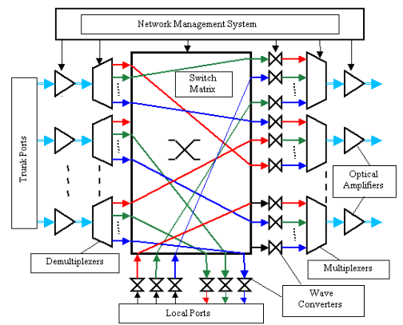
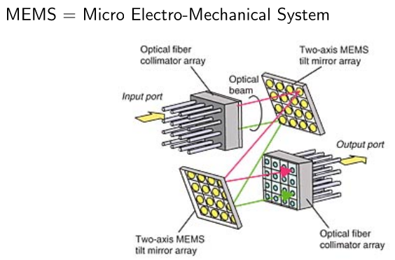
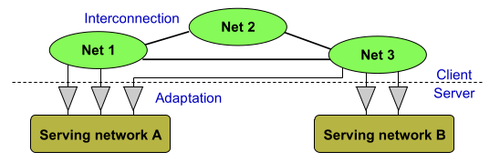
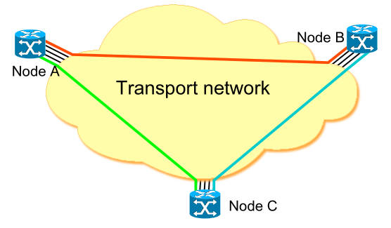
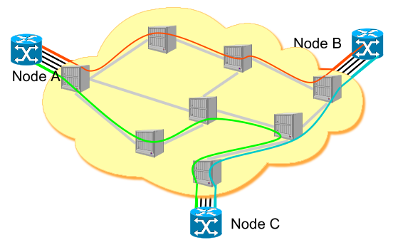
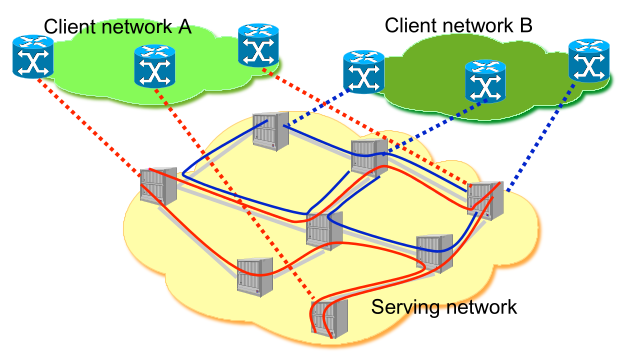

<!-- KaTeX auto-render header -->
<link rel="stylesheet" href="https://cdn.jsdelivr.net/npm/katex@0.16.0/dist/katex.min.css">

# Other Topologies

## Recursive and Server-Centric Topologies

**Core idea**: build a large network by recursively **connecting smaller, identical structures** called "***cells***".

A fundamental feature of these designs is that **servers are active participants in the network fabric**. 
* They are equipped with multiple network interface cards (NICs) and connect to switches at different levels or even directly to other servers. 
* This approach shifts some of the network forwarding complexity from dedicated switches to the servers themselves.

### DCell

DCell is a recursive topology designed for **massive scalability** and **high fault tolerance** data centers.

* **Construction:**
    1.  The **base unit** is a **$DCell_0$**, which consists of $\large n$ servers connected to a single $\large n$-port switch.
    2.  A **$DCell_1$** is built using $\large n+1$ copies of a $DCell_0$. 
        * Each server within a given $DCell_0$ uses one of its free ports to connect to a server in each of the other `n` $DCell_0$s. 
        * This creates a ***fully-meshed network*** of cells, with exactly one link between every pair of $DCell_0$ cells.
    3.  The general **recursive step** builds a **higher-level** **$DCell_k$** from a collection of $DCell_{k-1}$ cells. The key is how they are interconnected:
        * The goal is to create a **full mesh** where every $DCell_{k-1}$ cell is directly connected to every other $DCell_{k-1}$ cell.
        * This is achieved by having each of the $\large t_{k-1}$ servers within a cell use a free port to link to a different cell.
        * This allows for a total of $\large t_{k-1} + 1$ cells to be fully interconnected, forming the $DCell_k$.

* **Key Properties:**
    * **Server NICs:** Each server in a $DCell_k$ requires $\large k+1$ network ports.
    * **Scalability:** DCell's server count grows at a **double-exponential** rate. This allows it to support millions of servers with very few recursion levels, making it extremely scalable. The reason for this rapid growth lies in its recursive definition:
        * The number of servers at level $\large k$, denoted by $\large t_k$, is the number of sub-cells ($\large g_k$) multiplied by the number of servers in each sub-cell ($\large t_{k-1}$).
            $$\large t_k = g_k \times t_{k-1}$$
        * Crucially, the number of sub-cells, $\large g_k$, is determined by the number of servers at the previous level:
            $$\large g_k = t_{k-1} + 1$$
        * Combining these gives the relationship: $\large t_k = (t_{k-1} + 1) \times t_{k-1}$, which is approximately $\large t_k \approx t_{k-1}^2$.
        * Because the number of servers roughly **squares** at each level of recursion, the growth is double-exponential (on the order of $\large n^{2^k}$), leading to massive scalability.

        

### BCube

BCube is another recursive topology, specifically designed for **modular**, **container-based** data centers where physical servicing can be difficult after deployment.

* **Construction:**
    1.  Its **base unit**, **$BCube_0$**, is identical to a $DCell_0$: $\large n$ servers connected to a single $\large n$-port switch.
    2.  A **higher-level** **$BCube_k$** is built from $\large n$ copies of a $BCube_{k-1}$ and uses $\large n^k$ **additional** $\large n$-port switches to interconnect them.
    3.  These **additional level**-$\large k$ switches are used to connect to exactly one server in each of the $\large n$ different $BCube_{k-1}$ cells, creating the higher-level structure.

* **Key Properties:**
    * **Server NICs:** Like DCell, a server in a $BCube_k$ requires $\large k+1$ network ports.
    * **Scalability (Server Count):** The number of servers grows exponentially. The recursive relationship for the number of servers ($t_k$) is $t_k = n \times t_{k-1}$. With a base case of $t_0=n$, this yields the total number of servers $S$:
    $$\large S = n^{k+1}$$
    * **Scalability (Switch Count):** BCube uses significantly more switches than DCell. The total number of switches, $S_w$, is given by:
    $$\large S_w = (k+1)n^k$$
    * **Server Role:** A key implication of using more switches is that servers in a BCube are **less involved in forwarding packets** compared to servers in a DCell, as the dedicated switches handle more of the networking load.

    

### DCell vs. BCube: A Comparison

| Feature | DCell | BCube |
| :--- | :--- | :--- |
| **Server Role** | Servers are heavily involved in packet forwarding. | Servers are less involved due to the higher number of switches. |
| **Switch Count** | **Low**. Uses a minimal number of switches. | **High**. Adds many dedicated switches at each level. |
| **Scalability** | **Extremely High** (double-exponential). | **High** (exponential). |
| **Path Quality** | Paths can be non-uniform, creating potential bottlenecks. | Provides more uniform paths between servers. |

Both designs share the **common drawback** of:
* Requiring expensive servers with multiple NICs.
* Having increased wiring complexity compared to tree topologies.

## Flexible and Optical Topologies

While fixed topologies like the Fat-Tree offer high performance, their **rigid structure** can be **inefficient** for the highly dynamic and unbalanced traffic patterns found in data centers. 
* Flexible topologies address this by creating a network that can be physically reconfigured at runtime, adapting its connections to match traffic demands. 
* This dynamism is primarily enabled by **optical switching technologies**.

The main advantages of using optical networking are:

  * **High Bandwidth:** Optical fibers using techniques like **Dense Wavelength Division Multiplexing (DWDM)** can **support enormous bandwidth**, potentially up to terabits per second (Tbps) on a single fiber.
  * **Reconfigurability:** Optical switches allow for the dynamic creation and tearing down of direct, physical high-capacity links between different parts of the network.

### Enabling Technologies

#### Dense Wavelength Division Multiplexing (DWDM)

DWDM is a form of **frequency multiplexing** specifically for optical fiber communications. It works by sending multiple data streams simultaneously over a single fiber, with **each stream carried on a different wavelength** (i.e., a different color) **of light**.

  * **DWDM Carrier Grid:** The International Telecommunication Union (ITU) defines a standard grid of frequencies (or wavelengths) that can be used. This allows for up to 80 distinct channels to be multiplexed onto a single fiber, with each channel capable of carrying a high data rate (e.g., 10 Gbit/s).
  * **Operational Window:** These systems typically operate in the "***3rd window***" of optical fiber communication (around 1550 nm wavelength), a band which offers the **minimum signal attenuation** ($\large \sim 0.2 \text{ dB/km}$) and **limited dispersion**.

  

#### Optical Cross-Connects (OXC) and MEMS

An ***OXC*** is a device that can switch high-speed optical signals from an input fiber to an output fiber without converting them to electrical signals. A common technology used to build them is ***MEMS* (Micro-Electro-Mechanical Systems)**.

  * **Mechanism:** A MEMS-based switch consists of an array of **microscopic, movable mirrors**. By precisely tilting these mirrors, a beam of light from an input port can be redirected to a specific output port, creating a **dedicated physical circuit** (a "***lightpath***").
  * **Trade-off:** MEMS switches are highly efficient and consume very little power compared to their electrical counterparts. However, their physical nature means they have a slow **reconfiguration time** (on the order of a few milliseconds), which is a significant drawback compared to the nanosecond-speed of electrical packet switches.

  
  

### Example Architectures

#### c-Through: A Hybrid Approach

The c-Through architecture is a **hybrid** design that uses both electrical and optical switching networks in parallel.

  * **Structure**: It is composed of two distinct networks:
    1.  A permanent, always-on **electrical network** (typically a tree topology) that ensures baseline connectivity between all racks.
    2.  A high-bandwidth, **reconfigurable optical network** that provides temporary, direct, high-capacity circuits between selected pairs of racks.
  * **Operation**: A central control system monitors the traffic between racks. It then periodically reconfigures the optical network to create direct links for the rack pairs with the highest traffic demand, aiming to maximize the amount of traffic satisfied by the high-capacity optical links. This approach is not cost-effective for connecting every pair of racks, so links are provisioned transiently.

#### Helios: A Refined Hybrid

Helios is another hybrid electrical/optical switch architecture. It is a two-tier network where ToR switches are electrical, but the core is a combination of optical and electrical switches.

  * **Traffic Management Philosophy**: Unlike c-Through, Helios uses the two networks for different types of traffic:
      * The **electrical network** is used for bursty, latency-sensitive, all-to-all communication among pods.
      * The **optical network** is reserved for long-lived, high-bandwidth communication flows.

#### OSA (Optical Switching Architecture): A Pure Optical Core

The OSA architecture takes a more radical approach by aiming for a "pure" optical core.

  * **Structure**: The electrical core switches are completely removed and replaced by optical switches. ToR switches are still electrical, handling the conversion between electrical signals from servers and optical signals for the core.
  * **Operation**: Since direct optical links between all pairs of racks are not guaranteed, the network topology is configured to form a connected graph. This means that ToR switches must also function as **relays**, forwarding traffic between other ToR switches that do not have a direct optical connection. This creates a more complex multi-commodity flow problem for optimization.

## The Concept of Network Virtualization

Network design and management, especially in complex environments like data centers, can be simplified by applying two basic principles:

  * **Layering:** Decomposing the problem into a "client" and "server" relationship.
  * **Standard Interfaces:** Defining how these different layers interact with each other.

This leads to the core idea of network virtualization, which separates the network into two distinct layers:

1.  **Serving Network:** This is the underlying **physical infrastructure**—the actual switches, routers, and links that make up the data center network.
2.  **Client Network:** This is a **virtual network** that runs on top of the physical serving network. It is the logical view of the network as seen by a tenant or application. A single serving network can host multiple, isolated client networks.

This separation allows for a **network partition**, where different virtual networks can exist as peers, interconnected by the shared physical fabric but logically separate from one another.

### Abstract vs. Physical Views: An Example

The power of network virtualization lies in the abstraction it provides. The tenant (the "client") sees a much simpler network than the one that physically exists.

#### The Client View

From the **application or tenant's perspective** (the "IP level view"), the network is **straightforward**. 
* The different components of the application, represented as Nodes A, B, and C, appear to be connected by direct logical links through a single "Transport Network". 
* All the complexity of the underlying physical infrastructure is hidden.

#### The Serving Network View

In reality, the "Transport Network" is a **complex physical infrastructure** (the "serving network") composed of many interconnected switches and routers. 
* A simple logical link between two virtual nodes, like the one from Node A to Node B, is actually mapped onto a multi-hop path that traverses several physical devices. 
* Virtualization handles this complex mapping automatically, preserving the simple logical view for the tenant.

#### Supporting Multiple Tenants

A primary benefit of network virtualization is its ability to support **multi-tenancy**, where multiple independent "client" networks can run concurrently on a single physical "serving" network.

As shown in the diagram, "Client network A" and "Client network B" are two distinct, logically separate networks that are both hosted on the same underlying physical infrastructure. From the perspective of each client, they have their own private network, completely unaware of the other's existence.

This isolation provides several key advantages:

  * **Performance Isolation:** The traffic patterns and potential congestion in one client network do not affect the performance of another.
  * **Enhanced Security:** The separation prevents one tenant from being able to access or interfere with another tenant's data traffic.
  * **Flexibility:** Each tenant can potentially implement their own custom routing protocols and IP addressing schemes within their virtual network, without conflicting with other tenants or the physical network.

## DCN Topology Comparison

To evaluate and contrast the different data center network topologies, we use a set of standardized metrics. 
* These **Key Performance Indicators** (KPIs) help quantify the scalability, performance, and fault-tolerance of each design.

### Core Evaluation Metrics

* **Degree of Servers:** The number of network ports required on each server. 
    * For topologies like DCell and BCube, where servers actively participate in packet forwarding, this number can be greater than one.
* **Diameter:** The longest of the shortest paths between any two servers in the network. 
    * A smaller diameter generally leads to lower latency and more efficient routing.
* **Bandwidth:** The maximum capacity that can be offered between servers. This is often analyzed under different traffic patterns:
    * **One-to-one:** A single server sending data to another single server.
    * **All-to-all:** Every server simultaneously sending data to every other server.
* **Bisection Width & Bandwidth:** This is a critical measure of network robustness and capacity for all-to-all communication.
    * **Concept:** To find the bisection width, you split the network's nodes into two equally sized groups. The *bisection width* is the **minimum number of links** you must cut to completely disconnect the two groups.
    * **Bisection Bandwidth:** This is the sum of the capacities (in bit/s) of the links in that minimum cut.
    * **Relevance:** It represents the **bottleneck capacity of the network**. 
        * If traffic is random, roughly half of it will need to cross this bisection. 
        * Therefore, a **larger bisection bandwidth** indicates a network is less likely to have a central bottleneck and can better handle heavy all-to-all traffic patterns.

### Hardware Redundancy Metrics

These metrics quantify the fault tolerance of a topology by **measuring the number of alternate paths available**.

* **Node-disjoint Paths:** The minimum number of paths between any two servers that do not share any intermediate nodes (switches). 
    * This measures the network's **resilience to switch failures**.
* **Edge-disjoint Paths:** The minimum number of paths between any two servers that do not share any common links. 
    * This measures the network's **resilience to link failures**.
* **Redundancy Level:** A measure of how many link failures a network can sustain without becoming disconnected. 
    * A network has a redundancy level of $\large r$ if it remains connected after removing any $\large r$ links, but can be disconnected by removing a specific set of $\large r+1$ links.
* **f-fault tolerance:** A network is considered f-fault tolerant if it remains connected even after any $\large f$ components (links or nodes) have failed.

### Topologies Comparisons

#### Structural and Scaling Comparison

This table summarizes the structural properties of the main fixed-topology architectures. It shows how the number of *switches* (**SW**), *wires* (**W**), and *servers* (**SE**) scale with the number of ports on a *switch* (`n`) and the level of *recursion* (`k`). 
* For example, BCube uses the largest number of switches and wires, while the basic tree uses the fewest.

| | **Basic Tree** | **Fat-Tree** | **Clos Net** | **DCell** | **BCube** |
| :--- | :--- | :--- | :--- | :--- | :--- |
| **Degree** | 1 | 1 | 1 | $\large k + 1$ | $\large k + 1$ |
| **Diameter** | $\large \sim 2\log_n N$ | 6 | $\large \sim 6$ | $\large 2^{k+1} - 1$ | $\large k + 1$ |
| **Switches (SW)**| $\large \frac{N(n-1)}{n-2}$ | $\large \frac{5n^2}{4}$ | $\large \frac{6n+n^2}{4}$ | $\large N/n$ | $\large (k+1)n^k$ |
| **Wires (W)** | $\large N\frac{n(n-1)-2}{n-2}$ | $\large \frac{3n^3}{4}$ | $\large \frac{n^2+n^3}{4n_{ToR}}$| $\large (1+k/2)N$ | $\large (k+1)n^{k+1}$|
| **Servers (SE)** | $\large (n-1)^3$ | $\large \frac{n^3}{4}$ | $\large \frac{n^2}{4}n_{ToR}$| $\large N (*)$ | $\large n^{k+1}$ |

* **N(*)**: For DCell, the number of servers $N$ is bounded: $\large (n+1)2^k - 1/2 \le N \le (n+1)2^k -1$

---
#### Scalability: Number of Servers

This table provides concrete examples of how many servers each topology can support for a given *switch port count* (`n`) and *recursion level* (`k`). 
* It clearly illustrates the massive, double-exponential scalability of DCell compared to the other architectures.

| **n** | **Architecture** | **k=1** | **k=2** | **k=3** | **k=4** |
|:---:|:---:|:---:|:---:|:---:|:---:|
| **4** | **Basic Tree** | 64 | | | |
| | **Fat-Tree** | 16 | | | |
| | **Clos Network** | 8 | | | |
| | **DCell** | 20 | 420 | 176,820 | $\large > 3 \times 10^{10}$ |
| | **BCube** | 16 | 64 | 256 | 1,024 |
| **8** | **Basic Tree** | 512 | | | |
| | **Fat-Tree** | 128 | | | |
| | **Clos Network** | 96 | | | |
| | **DCell** | 72 | 5,256 | 27,630,792 | $\large > 7 \times 10^{14}$ |
| | **BCube** | 64 | 512 | 4,096 | 32,768 |

---
#### Traffic Performance Comparison

This table compares the theoretical bandwidth capabilities of the topologies under different traffic patterns.

| | **Basic Tree** | **Fat-Tree** | **Clos Net** | **DCell** | **BCube** |
|:---|:---:|:---:|:---:|:---:|:---:|
| **One-to-one** | 1 | 1 | 1 | $\large k + 1$ | $\large k + 1$ |
| **One-to-many** | 1 | 1 | 1 | $\large k + 1$ | $\large k + 1$ |
| **One-to-all** | 1 | 1 | 1 | $\large k + 1$ | $\large k + 1$ |
| **All-to-all BW** | $\large n$ | $\large N$ | $\large \frac{2N}{n_{ToR}}$ | $\large > \frac{N}{2^k}$ | $\large \frac{n(N-1)}{n-1}$ |
| **Bisection Width** | $\large n^2$ | $\large \frac{N}{2}$ | $\large \frac{N}{n_{ToR}}$ | $\large > \frac{N}{4\log_n N}$ | $\large \frac{N}{2}$ |

---
#### Hardware Redundancy Comparison

This table shows the fault tolerance of each topology. 
* The **number of node/edge-disjoint** paths indicates the minimum number of failures a network can sustain between any two servers while maintaining connectivity. 
* **Redundancy Level** shows how many redundant components exist at each tier of the network.

| | **Metric** | **Basic Tree** | **Fat-Tree** | **Clos Net**| **DCell** | **BCube** |
|:---|:---|:---:|:---:|:---:|:---:|:---:|
| **Fault Tolerance** | Node-disjoint Paths | 1 | 1 | 1 | $\large k+1$ | $\large k+1$ |
| | Edge-disjoint Paths | 1 | 1 | 1 | $\large k+1$ | $\large k+1$ |
| **Redundancy Level** | Edge/ToR Switch | 0 | 0 | 0 | k | k |
| | Aggregation Switch | 0 | $\large \frac{n}{2}-1$ | k | | |
| | Core/Intermediate | 0 | $\large (\frac{n}{2})^2 - 1$ | $\large n^2-1$ | | |
| | Server Ports | - | - | - | k | k |

**Key Takeaway**: Recursive topologies like *DCell* and *BCube* offer **significantly higher fault tolerance** because their server-centric design provides multiple, independent paths from each server into the network. *Tree-based topologies*, where each server has only a single connection to an edge switch, are much **more vulnerable** to the failure of that switch.

## Random Graph Topologies: Jellyfish

This section covers a modern approach to DCN design that moves away from highly structured topologies like the Fat-Tree and instead uses a randomized interconnection of switches.

### The Motivation: Limitations of Structured Topologies
Structured topologies like the Fat-Tree have rigid design constraints. For example, with a specific type of switch, you can only build a Fat-Tree for a very specific number of servers (e.g., 3456 or 8192 servers with 24-port or 32-port switches, respectively). This makes flexible, incremental expansion very difficult.

The Jellyfish approach proposes a radical solution: **forget about structure and build a random graph**. The network is built by randomly interconnecting the Top-of-Rack (ToR) switches.

### Design Goals
The primary goals of the Jellyfish design are:
* **High Throughput:** To maximize server-to-server bandwidth by creating a richer interconnection fabric.
* **Agile Placement:** To allow VMs to be placed on any server without worrying about network bottlenecks.
* **Incremental Expansion:** To make it easy to add or replace servers and switches one rack at a time.

### Construction and Expandability
* **Construction:** The network is constructed by taking a set of ToR switches and randomly connecting their available uplink ports until no more connections can be made. The process includes a "rewiring" step to ensure the graph is well-connected.
* **Incremental Expansion:** This random structure makes expansion easy. To add a new rack (with its ToR switch), you can simply pick a random link in the existing network, remove it, and use the two newly freed ports to connect to the new switch.

### Why It Works: Short Path Lengths
The key insight behind Jellyfish's high performance is that network throughput is inversely proportional to the average path length of the flows.

$$\text{Throughput} \propto \frac{1}{\text{Average Path Length}}$$

By randomly connecting switches, Jellyfish creates a richer, more diverse set of connections than a rigid Fat-Tree. This results in shorter average path lengths between servers, allowing the network to support more servers at full throughput with the same number of switches and links.

### Cabling
While a random topology might seem like it would lead to chaotic cabling, the design is still practical. By physically clustering the switches in a central location, the cable bundles can be aggregated and managed effectively.