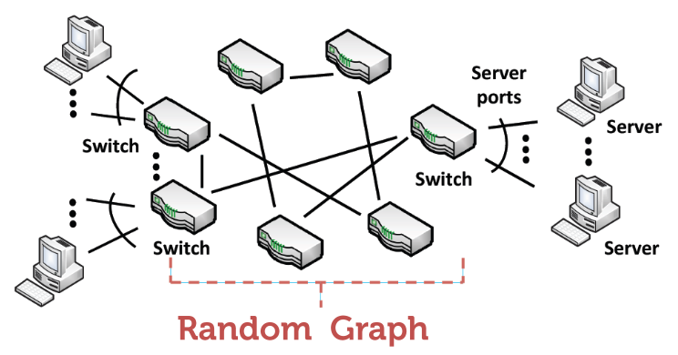
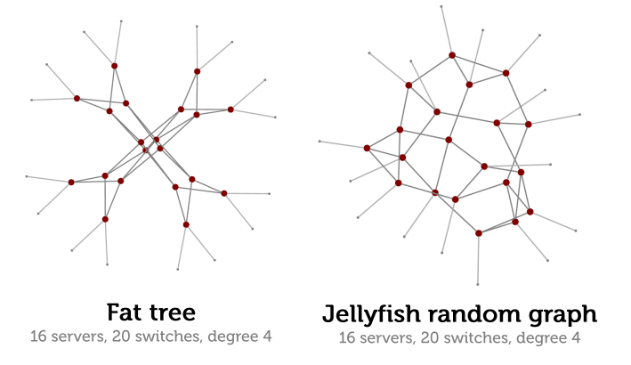
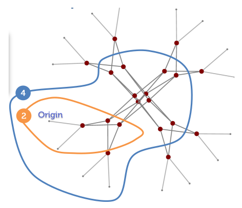
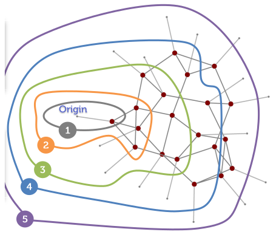
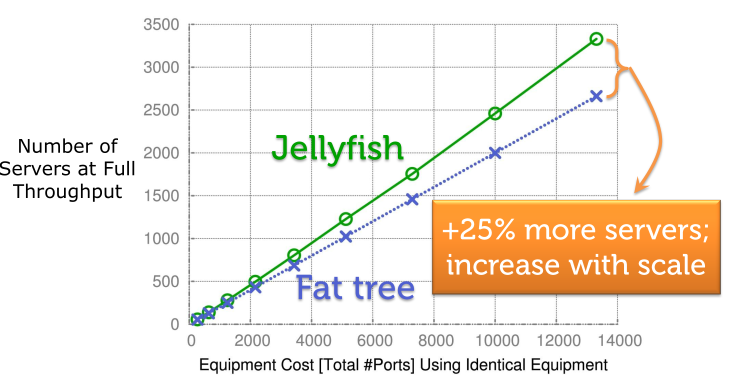
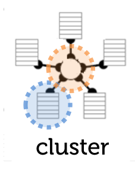

# Random Graph Topologies: Jellyfish

### Motivation: The Limits of Structured Topologies

Structured topologies like the Fat-Tree, while high-performing, have **rigid design constraints**.

For example, a three-layer Fat-Tree built with a specific type of commodity switch can only support a fixed number of servers [*max. number of servers $\large \frac{n^3}{4}$*]:
* **24-port switches:** 3,456 servers
* **32-port switches:** 8,192 servers
* **48-port switches:** 27,648 servers
* **64-port switches:** 65,536 servers

This rigidity makes flexible, incremental expansion very difficult. 

The ***Jellyfish*** approach proposes a solution: *to abandon rigid structure in favor of building a **random graph** of interconnected switches*.

### LEGUP: Upgrading Structured Topologies

The expansion of a data center based on a regular topology like a Fat-Tree is highly constrained. The **LEGUP** system attacks this expansion problem by finding optimal ways to upgrade existing Clos networks.

* **Core Contribution:** The authors of LEGUP developed the **theory of heterogeneous Clos networks**. This allows for integrating new, modern equipment with older, legacy hardware in a planned upgrade.
* **Performance:** They show that their construction needs only as much link capacity as a classic Clos network to route the same traffic matrices.
* **Practical Outcome:** The system provides detailed designs for the topology and physical arrangement of network upgrades or expansions.
* **Limitation:** Despite these optimizations, the underlying rigid structure of the Clos network still poses a strong limit to overall expandability.

### Jellyfish Design Goals

The design of Jellyfish is driven by two primary goals:

1.  **High Throughput:** To remove network bottlenecks and provide high server-to-server bandwidth, which allows for agile placement of Virtual Machines (VMs) anywhere in the data center.
2.  **Incremental Expansion:** To build a network where servers and switches can be easily added or replaced one at a time. 
    * This supports a "*pay-as-you-grow*" model, similar to commercial products like SGI's ICE Cube or HP's EcoPod.

### Construction and Expansion

#### Jellyfish Construction

The core of the Jellyfish approach is to construct a **random graph** by interconnecting the Top-of-Rack (ToR) switches. 

In a network with `S` *switches*, where each switch dedicates `r` *ports* for inter-switch connections and `n-r` *ports* for servers, a **total** of `S(n-r)` **servers can be supported**.

The construction follows a two-step process:

1.  **Initial Linking:** The process starts by picking a random pair of switches that have free ports and are not already connected. 
    * A **link is created** between them, and this is repeated until no more simple links can be added.
2.  **Rewiring:** If some switches are left with **two or more free ports** (which could lead to a disconnected network), a *rewiring step* is performed. 
    * A random existing link in the network is removed, and the two newly-freed ports are used to connect to the previously unconnected switch, ensuring the graph is **well-connected**.

The resulting topology is a randomized, unstructured interconnection of switches.

#### Incremental Expansion

This random structure makes the network highly amenable to easy, incremental expansion. 

To **add a new rack** (with its own ToR switch, `u`) to the existing network, the following procedure is used:

1.  A random existing link, `ℓ = (v,w)`, is selected from the network.
2.  This link `ℓ` is removed.
3.  **Two new links** are created: one connecting the new switch `u` to `v`, and another connecting `u` to `w`. This uses up two ports on the new switch.
4.  This process is repeated until all available inter-switch ports on the new switch `u` are connected.

A key benefit of this method is that the network preserves its properties as a regular random graph of degree `r` even after expansion.

### Performance Rationale: The Power of Short Paths

The reason a random graph can outperform a structured topology like a Fat-Tree comes down to a fundamental relationship between network throughput and path length.

The number of flows a network can support at full throughput is **inversely proportional** to the **average path length** of those flows.

$$\large \text{Number of Flows at Full Throughput} \le \frac{\sum_{\text{all links}} \text{Capacity(link)}}{\text{Average Path Length}}$$

**The intuition is simple:** to maximize the network's overall throughput, you must minimize the number of hops a typical packet has to take to reach its destination. 

**Random graphs excel at this**. Because they are not constrained by a rigid hierarchical structure, they create a richer and more diverse set of connections, which results in shorter average paths between nodes.

#### Formal Proof of the Throughput Bound

The relationship between throughput and path length can be derived formally.

First, we define the variables for the proof:
* $\large C_j$: The capacity of link $\large j$.
* $\large x_i$: The throughput of a specific flow $\large i$.
* $\large h_i$: The number of links (hops) in the routing path of flow $\large i$.
* $\large r_{ji}$: A routing variable, where $\large r_{ji} = 1$ if link $\large j$ is on the path for flow $\large i$, and $\large 0$ otherwise.

The proof proceeds as follows:

1.  The sum of the throughput of all flows passing through a single link $\large j$ cannot exceed that link's capacity, $\large C_j$. Assuming all flows have the same throughput $\large x$:
    $$\sum_{i \in F} r_{ji} x_i \le C_j$$

2.  By summing this inequality over all links $\large j$ in the network ($\large L$), we can relate the total consumed capacity to the total available capacity:
    $$\sum_{j \in L} \sum_{i \in F} r_{ji} x_i = \sum_{i \in F} x_i \sum_{j \in L} r_{ji} = \sum_{i \in F} x_i h_i \le \sum_{j \in L} C_j$$

3.  Assuming all flows achieve the same maximum throughput $\large x$, and using the definition of average path length ($\large \bar{h} = \frac{1}{|F|} \sum_{i \in F} h_i$), the total consumed capacity is $\large x |F| \bar{h}$.

4.  Combining these gives the final bound on the number of flows, $\large |F|$:
    $$|F| \le \frac{\sum_{j \in L} C_j}{x \bar{h}}$$

This formally shows that the number of supportable flows is inversely proportional to the average path length.

#### Visualizing Path Length: Jellyfish vs. Fat-Tree

This advantage can be clearly seen in a direct comparison. Consider two networks built with the exact same equipment (e.g., 16 switches): one as a Fat-Tree and one as a Jellyfish random graph.

If we pick a source switch and see how many other switches are reachable within a short number of hops (e.g., less than 6), the difference is stark.

  * **Fat-Tree:** Only **3 of the 15** other switches are reachable in less than 6 hops. The rigid structure forces many connections to take longer paths up and down the hierarchy.

  

  * **Jellyfish:** **11 of the 15** other switches are reachable in less than 6 hops. The random connections create numerous shortcuts, drastically reducing the average path length.

  

This dramatic reduction in path length is the primary reason why a Jellyfish topology can support more servers at full throughput compared to a Fat-Tree built with the same number of switches and links.

### Throughput Performance

The theoretical advantage of shorter path lengths in Jellyfish translates directly into superior performance. When compared to a Fat-Tree built with the same number of switches, Jellyfish can support a significantly larger number of servers, all communicating at their full potential throughput.

The graph below shows that for any given number of switches, the Jellyfish topology (top line) consistently supports more servers at full throughput than the Fat-Tree topology (bottom line). This performance gain is often around 25%.

### Practical Considerations: Cabling

A common concern with random graph topologies is that they would be a "cabling nightmare" to physically implement. However, the Jellyfish design accounts for this.

While the *logical* connections between switches are random, the *physical* layout can still be structured and organized. The proposed solution is to cluster the interconnecting switches in a central location. This way, structured cable bundles can be aggregated and run from the central switch cluster out to the individual server racks, making the physical wiring manageable.

