<!-- KaTeX auto-render header -->
<link rel="stylesheet" href="https://cdn.jsdelivr.net/npm/katex@0.16.0/dist/katex.min.css">

# Resource Management and Scheduling

## Multiple Servers and Load Balancing

In the previous section, we established that for a given total capacity, a single pooled **"super-server" offers the best theoretical performance**. However, this conclusion comes with several important caveats. 

This section revisits that debate and explores why modern data centers are built with thousands of independent servers and the crucial role that **load balancing** plays in making such systems efficient.

### Why Multiple Servers? Revisiting the Debate

There are **three main arguments** against the single-server ideal: a theoretical objection, a scaling argument, and a practical objection.

#### 1. The Theoretical Objection: Overhead and Variability

The single-server model assumes that service **capacity scales perfectly**. In reality, many services have a **fixed overhead** component that **does not scale**.

* **Service Time with Overhead:** A more realistic model for service time ($\large X$) might be the sum of a **fixed overhead** ($\large X_0$) and a **scalable component** ($\large X_1/m$):
    $$\Large X = X_0 + X_1/m$$
    * The average service time becomes:
    $$\Large E[X] = X_0 + \frac{1}{m \mu}$$
* **Performance Impact:** The graphs show that when you factor in this overhead, or when the service time has very high variability, the **conclusion changes**.
    * A system of multiple slower servers (**M/G/k**) can actually provide a lower mean response time than a single, pooled super-server (**M/G/1fast**).

    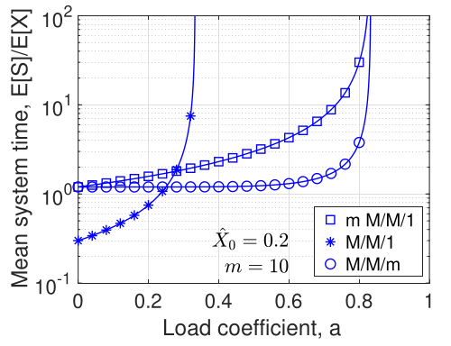
    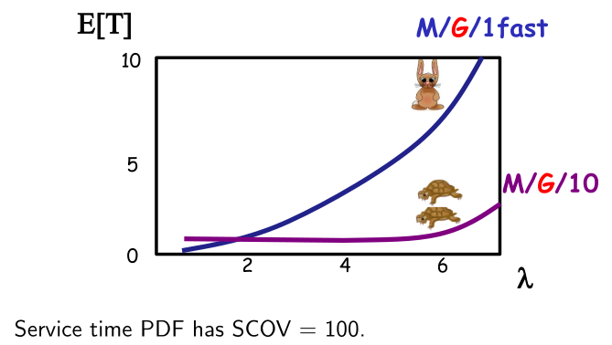

#### 2. The Scaling Argument: The Halfin-Whitt Regime

Is it possible to design a system that achieves both **near-perfect utilization** ($\large \rho \to 1$) and **near-zero waiting time** ($\large E[W] \to 0$)? 
* It seems like a paradox, but the answer is **YES**, in a large-scale, many-server system.

This is described by the **Halfin-Whitt** (or Quality-and-Efficiency-Driven) asymptotic regime.
* **The Setup:** We consider a system where the **number of servers**, $\large N$, is **only slightly larger** than the **mean offered traffic load**, $\large A$. 
    
    Specifically, the excess capacity is proportional to the square root of the load:
    $$\Large N = A + \beta\sqrt{A}$$
    Where $\large \beta$ is a fixed parameter that controls how much spare capacity the system has.

*  **Deriving the Utilization Coefficient ($\large \rho$):**
    The utilization is defined as the total load divided by the number of servers, $\large \rho = A/N$. 
    * By substituting the Halfin-Whitt condition for $\large N$, we get:
    $$\large \rho = \frac{A}{A + \beta\sqrt{A}}$$
    * Dividing the numerator and denominator by $\large A$ gives the final expression:
    $$\large \rho = \frac{1}{1 + \beta/\sqrt{A}}$$
    From this, we can see that as the system scales up (as $\large A \to \infty$), the term $\large \beta/\sqrt{A}$ goes to zero, and therefore **utilization $\large \rho$ approaches 1**.

*  **Deriving the Mean Wait ($\large W$):**
    The normalized mean waiting time in an M/M/N system is given by $$\large W = \frac{C(N, A)}{N - A}$$ 
    where $\large C(N, A)$ is the ***Erlang C formula*** for the probability of queuing.
    
    In the Halfin-Whitt regime, we know that $\large N - A = \beta\sqrt{A}$. 
    * Advanced asymptotic analysis (shown on slide 210) provides a simplified expression for the Erlang C formula in this regime. 
    * Substituting that result into the waiting time formula gives (from slide 211):
    $$\Large W \sim \frac{\phi(\beta)}{\beta [\beta\Phi(\beta) + \phi(\beta)]} \frac{1}{\sqrt{A}}$$
    Where $\large \phi(\cdot)$ and $\large \Phi(\cdot)$ are the **probability density function** and **cumulative distribution function** of a standard normal distribution, respectively.
    * The crucial part of this result is the $\large 1/\sqrt{A}$ term. 
    * It shows that as the system scales up (as $\large A \to \infty$), the **mean waiting time $\large W$ approaches 0**.
* **The Result:** As the system scales up (as $\large A \to \infty$), something remarkable happens:
    * The **server utilization**, $\large \rho = A/N$, approaches **100%**.
    * The **normalized mean waiting time**, $\large W$, approaches **0**.
* **Example (Slide 213):**
    * With an offered load of $\large A=100$ and $\large \beta=1$, we need $\large N=110$ servers. This system runs at over **90%** utilization, but the mean wait time is only **2.23%** of the mean service time.
    * With an offered load of $\large A=900$ and $\large \beta=2$, we need $\large N=960$ servers. This system runs at **93.75%** utilization, and the mean wait time is a negligible **0.04%** of the mean service time.

This proves that large-scale, multi-server systems can be both extremely efficient and provide excellent quality of service, a key reason for their use in data centers.

#### 3. The Practical Objection: COTS Hardware and Failures

The most compelling reason for using multiple servers is practical.
* **Feasibility and Cost:** A single "super-server" with the combined power of thousands of machines may be physically impossible or prohibitively expensive to build.
* **Reliability:** A single super-server is also a **single point of failure**.
* **The Data Center Philosophy:** The modern approach is to achieve massive processing capacity by aggregating thousands of inexpensive **Commercial Off-The-Shelf (COTS)** servers.

This approach, however, introduces **two fundamental engineering challenges** that define modern data center design:
1.  **Communication:** How do you efficiently interconnect thousands of servers? (This is solved by the **DCN topologies** we studied previously).
2.  **Load Balancing:** How do you intelligently distribute incoming tasks across these thousands of servers?

### Single vs. Multiple Servers: A Reconciliation

A critical question arises after concluding that large, multi-server systems offer superior scalability and performance: Why did we spend time analyzing scheduling policies for a single server?

The answer lies in the layered nature of modern data centers and the pervasive use of virtualization. The theories are not contradictory; they apply at different levels of the resource management stack.

  * **Single-Server Theory is for Intra-Machine Management:** The scheduling policies studied (FCFS, PS, SRPT, etc.) are directly applicable to how the operating system and hypervisor manage competing processes **within a single physical machine**. Virtual Machines (VMs), containers (like Docker), and individual applications all contend for the CPU, memory, and I/O resources of one physical server.

---

## Multiple Servers and Load Balancing

While single-server scheduling theory is crucial for managing resources *within* a single machine, a data center is a massive farm of many servers. 

The **key challenge** at this scale is **load balancing**: *the intelligent distribution of incoming tasks across all available servers to optimize performance.*

### Load Balancing Architecture

The component responsible for distributing work across the server farm is the **Load Balancer (LB)**. 
* It is a critical piece of infrastructure for **reducing latency** and **improving overall throughput**. 

The architecture often involves **multiple layers of load balancing**:

1. Incoming traffic is first handled by a **Level 4 Load Balancer (L4LB)**, which operates at the **transport layer** and can route traffic based on IP addresses and TCP/UDP ports. 
2. This L4LB might direct traffic to a server that is itself running a **Level 7 Load Balancer (L7LB)**, which operates at the **application layer** and can make more sophisticated routing decisions based on application-specific data like HTTP headers or cookies. 
3. The L7LB then dispatches individual tasks to be processed.

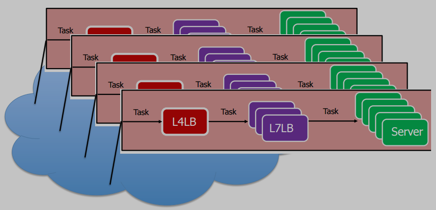

### The System Model

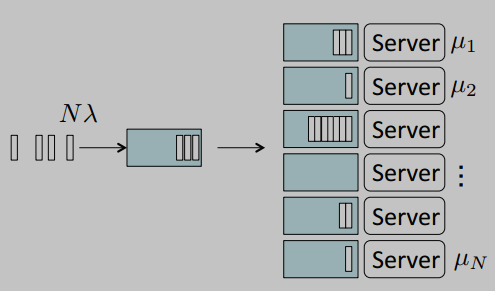

To analyze load balancing policies, we use a **standardized queueing model**. This model consists of a **central dispatcher** (*load balancer*) that routes incoming tasks to one of $N$ parallel servers, each with its own queue.

The **key parameters** of this model are:
  * $\large N$: The **total number of servers** in the system.
  * $\large \Lambda = N\lambda$: The **mean total arrival rate** of tasks to the dispatcher.
  * $\large \mu_j$: The **task processing rate** of an individual server $j$. 
    * This allows for **heterogeneous** systems where servers can have different speeds.
  * $\large \mu = \sum_{j=1}^{N} \mu_j$: The **total service capacity** of the entire system.

Once a task is dispatched to a server, it enters that server's queue and remains there until its service is complete.

#### Performance Goal

The primary goal of any load balancing policy is to **intelligently choose the right server** for each incoming task. 

* In this context, "*right*" has a very specific meaning: the choice that results in the **lowest possible latency** for the task.

#### Delay Components

The **total end-to-end latency** experienced by a task can be broken down into **two distinct components**:

1.  **Dispatching Delay:** The time elapsed from a task's arrival at the dispatcher to the moment it joins a server's queue. 
    * For **"push" policies** that need to query servers, this delay is non-zero. 
    * For **"pull" policies** where the dispatcher already knows of an available server, this delay can be effectively zero.
2.  **Response Time:** The time a task spends at the server. 
    * This is the **sum** of the time spent waiting in the server's queue plus the actual service (processing) time.

* **Key Insight**: A **good load balancing** policy aims to **minimize the sum of these two components**.

### Illustrative Example: Load Balancing with Heterogeneous Servers

To understand the **trade-offs** in load balancing, we can analyze a simple but insightful scenario involving **two servers** with **different speeds**.

#### The Setup

  * **Arrivals:** Tasks arrive at a central dispatcher. The arrival process is Poisson, meaning tasks arrive randomly and independently, with a long-term average rate of $\large \Lambda$ tasks per second.
  * **Servers:** There are two servers available to process these tasks. They are heterogeneous (have different speeds):
      * Server 1 is the faster server, with a service rate of $\large \mu_1$.
      * Server 2 is the slower server, with a service rate of $\large \mu_2$.
      * The relationship between their speeds is given by $\large \mu_1 = \alpha \cdot \mu_2$, where $\large \alpha \> 1$ is the speed ratio. For example, if $\large \alpha=2$, Server 1 is twice as fast as Server 2.
  * **Dispatching Policy:** The dispatcher uses a very simple probabilistic rule. For each arriving task, it flips a biased coin:
      * With probability $\large p$, it sends the task to Server 1.
      * With probability $\large 1-p$, it sends the task to Server 2.
  * **The Goal:** Our objective is to determine the best strategy for choosing the probability $\large p$, particularly as the performance gap between the servers ($\large \alpha$) becomes large.

#### Mathematical Formulation

To analyze this system, we model each server as an independent **M/M/1 queue**. This model is appropriate because:

  * **"M" (Markovian/Poisson Arrivals):** When a Poisson stream of arrivals with rate $\large \Lambda$ is split probabilistically, the resulting streams are also Poisson.
      * Arrival rate for Server 1 is $\large \lambda_1 = p\Lambda$.
      * Arrival rate for Server 2 is $\large \lambda_2 = (1-p)\Lambda$.
  * **"M" (Markovian/Exponential Service):** We assume the service times are exponentially distributed, with mean $\large 1/\mu_1$ and $\large 1/\mu_2$ respectively.
  * **"1" (Single Server):** Each queue has a single server.

The **mean system time** (or response time) for a standard M/M/1 queue is given by the formula:
$$\Large E[S] = \frac{1}{\mu - \lambda}$$

The overall average system time for our two-server system, $\large E[S]$, will be the weighted average of the system times at each server, where the weights are the probabilities of a task being sent to that server.

**Step 1: Calculate the Mean System Time for each server.**

  * For Server 1: $\large E[S_1] = \frac{1}{\mu_1 - \lambda_1} = \frac{1}{\mu_1 - p\Lambda}$
  * For Server 2: $\large E[S_2] = \frac{1}{\mu_2 - \lambda_2} = \frac{1}{\mu_2 - (1-p)\Lambda}$

**Step 2: Calculate the Overall Mean System Time.**
The overall mean time is $\large p$ times the average time at Server 1 plus $\large 1-p$ times the average time at Server 2.

$$\large E[S] = p \cdot E[S_1] + (1-p) \cdot E[S_2]$$

Substituting the formulas from Step 1 gives the final expression:

$$\Large E[S] = \frac{p}{\mu_1 - p\Lambda} + \frac{1 - p}{\mu_2 - (1 - p)\Lambda}$$

**Step 3: Define the Stability Conditions.**
For a queue to be stable (i.e., not grow infinitely long), its arrival rate must be less than its service rate ($\large \lambda < \mu$). We must satisfy this for both servers simultaneously.

  * For Server 1: $\large p\Lambda < \mu_1 \implies p < \frac{\mu_1}{\Lambda}$
  * For Server 2: $\large (1-p)\Lambda < \mu_2 \implies 1-p < \frac{\mu_2}{\Lambda} \implies p \> 1 - \frac{\mu_2}{\Lambda} \implies p \> \frac{\Lambda - \mu_2}{\Lambda}$

Since $\large p$ is a probability, it must also be between 0 and 1. Combining these conditions gives us the valid range for $\large p$:

$$\Large p_{min} < p < p_{max}$$

Where:

* $\large p_{min} = \max\left\{0, \frac{\Lambda - \mu_2}{\Lambda}\right\}$
* $\large p_{max} = \min\left\{1, \frac{\mu_1}{\Lambda}\right\}$

#### Numerical Results

We now compare three strategies for choosing $\large p$ by plotting their performance as the server speed ratio ($\large \alpha$) increases.

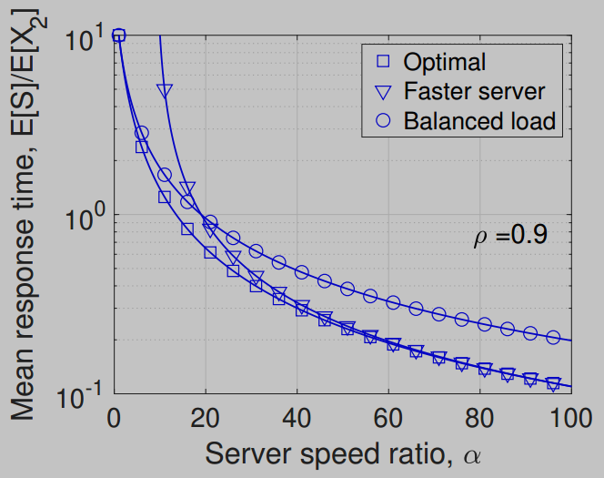

**Analysis of the Policies:**

  * **Balanced Load:** This policy aims to make the server utilizations equal ($\large \rho_1 = \rho_2$). 
    * It performs very well when servers are of similar speed ($\large \alpha$ is small). 
    * However, as $\large \alpha$ grows, its performance becomes extremely poor because it continues to send a significant fraction of jobs to the increasingly slow server, creating a **severe bottleneck**.
  * **Faster Server:** This policy sends all traffic to the faster server ($\large p=1$). 
    * It performs poorly when $\large \alpha$ is small because it ignores the available capacity of the second server. 
    * But as $\large \alpha$ becomes very large, this policy becomes the optimal strategy, as the contribution of the slow server becomes negligible.
  * **Optimal:** This policy calculates the value of $\large p$ that minimizes the $\large E[S]$ formula at each point. 
    * It shows the true best-possible performance, transitioning smoothly from a balanced approach when speeds are similar to an all-or-nothing approach when one server is vastly superior.

**Key Takeaway:** This simple example demonstrates that there is **no single "best" static load balancing policy**. 
* The optimal strategy depends on the specific characteristics of the servers. 
* A good load balancing algorithm must be able to adapt to the state of the system.

### Formal Performance Goals

To rigorously compare different load balancing policies, we need formal definitions of what makes a policy "good". 
* We evaluate policies against two primary goals: **throughput optimality** (stability) and **delay optimality** (performance).

### Throughput Optimality

Throughput optimality is the most fundamental property of a load balancing policy. It defines whether a policy can keep the system **stable** under a given workload.

1.  **Stability:** A system is considered stable if its **queues do not grow infinitely long** over time. 
    * *Formally*: The probability that the total number of tasks in the system, $\large \sum_{j=1}^{N} Q_j(t)$, exceeds any arbitrarily large number $\large C$ goes to zero as time goes to infinity.

    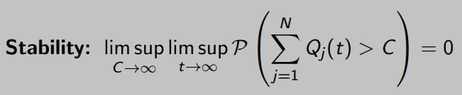

2.  **Stability Region vs. Achievable Region:**

      * The **Stability Region** is the set of **all possible total arrival rates**, $\large \Lambda$, for which the system is *theoretically* stable. 
        * For **our system**, this condition is simply that the total arrival rate must be less than the total service capacity: $\Large \Lambda < \sum_{j=1}^{N} \mu_j$.
      * The **Achievable Region** is the set of arrival rates for which a *specific load balancing policy* is able to keep the **system stable**.

      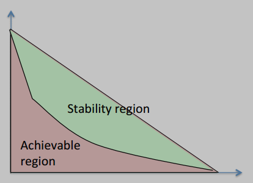

3.  **Definition of Throughput Optimality:** A load balancing policy is said to be **throughput optimal** if its **achievable region is identical to the system's stability region**. 
    * In other words, a throughput-optimal policy can successfully manage any workload that doesn't exceed the system's total physical capacity.

### Delay Optimality

While throughput optimality ensures a policy doesn't crash the system, it doesn't say anything about performance. 

**Delay optimality**: measures how effective a policy is at minimizing the response time for tasks. 

To define this, we must first establish the theoretical best-case performance, which is represented by the **Resource Pooled System**.

* **Multi-queue system:** This represents the **real-world** scenario we are analyzing. 
    * A dispatcher distributes an incoming stream of tasks with a total arrival rate of $\large N\Lambda$ among $\large N$ individual servers. 
    * Each server ($\large \mu_1, \mu_2, ..., \mu_N$) has its own independent queue.

2. **Resource pooled system:** This is a **hypothetical, ideal** model. 
    * It imagines that all the processing power of the individual servers is combined or "***pooled***" into a **single, powerful "super-server"**. 
    * This ideal server has a total service capacity of $\large \mu = \sum_{k=1}^{N} \mu_k$ and handles the total arrival rate $\large \Lambda^* = N\Lambda$.

* **The Performance Lower Bound:** A fundamental theorem in queueing theory states that the average number of tasks in a multi-queue system, $\large E[Q]$, can never be lower than the average number of tasks in its corresponding resource-pooled system, $\large E[q]$.
$$\Large E\left[\sum_{n=1}^{N} Q_n(t)\right] \ge E[q(t)]$$
This establishes the resource-pooled system as the gold standard for delay performance.

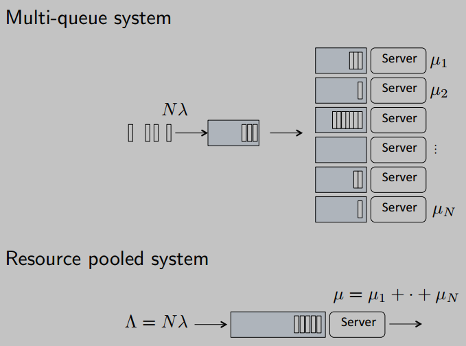

#### Heavy-Traffic (HT) Delay Optimality

The most important and challenging performance regime for a load balancer is the **heavy-traffic (HT) regime**, where the system is operating very close to its full capacity ($\large \rho \to 1$).

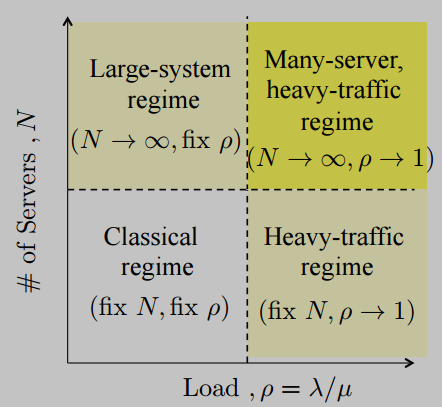

  * **Definition of HT Delay Optimality:** A load balancing policy is considered **HT delay-optimal** if its average delay performance converges to the (best possible) performance of the resource-pooled system as the load approaches 1. 
    * *Formally*: we define $\large \epsilon = \mu - \Lambda$ as the small amount of spare capacity. 
        * The HT regime is the limit as $\large \epsilon \to 0$. 
        * A policy is ***HT delay-optimal*** if:
    
    $$\Large \lim_{\epsilon\to0} \epsilon E[Q] = \lim_{\epsilon\to0} \epsilon E[q]$$

  * **Practical Relevance:** This concept is crucial because almost any load balancing policy will perform well when the system is lightly loaded. The **true differentiator** between policies is their ability to maintain **low latency and stability** when the system is **under stress**, which is precisely the condition described by the heavy-traffic regime.

    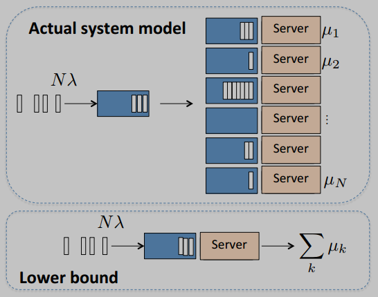

---

### Classification of Load Balancing Policies

Load balancing schemes can be categorized based on which entity—the dispatcher or the server—initiates the task assignment process.

* **Pull Policies:** The **servers** themselves take the initiative. 
    * An idle or under-loaded server sends a message to the dispatcher to "pull" a new task. 
    * The dispatcher maintains a state representing which servers are available and assigns new tasks based on these announcements.

* **Push Policies:** The **dispatcher** takes the initiative. 
    * It actively polls or queries a subset of servers to gather information about their current load (e.g., queue length). 
    * Based on the replies, the dispatcher decides where to "push" the next task.

### Overview of Famous Policies

The most well-known load balancing policies can be classified based on whether they use server state information and whether they know the job size in advance (***anticipative vs. non-anticipative***).

* **Non-Anticipative, No State Information:**
    * **RANDOM**
    * **ROUND-ROBIN**

* **Non-Anticipative, With State Information:**
    * **JSQ** (Join Shortest Queue)
    * **JIQ** (Join Idle Queue)
    * **JBT** (Join Below Threshold)

* **Anticipative, With State Information:**
    * **SITA** (Size-Interval Task Assignment)
    * **LWL** (Least Work Left)

The performance ranking of these policies is not **straightforward**; it depends heavily on factors like:
* Variability of **job sizes**
* **Scheduling policy** used at each individual server (e.g., FCFS or PS)
* Whether tasks are **dispatched immediately** or **held in a central queue**.

### Simple Algorithms: RANDOM and ROUND-ROBIN

These are the **simplest policies** as they do not require any communication or state information from the servers.

* **RANDOM:** Upon task arrival, the dispatcher selects one of the $\large N$ servers uniformly at random and sends the task there.
    * **Pros:** Requires **zero state information** and has **no messaging overhead**.
    * **Cons:** Performance is known to be **poor under heavy traffic**, especially when job sizes have **high variability**, as it can easily lead to situations where some servers are overloaded while others are idle.

* **ROUND-ROBIN:** The dispatcher assigns tasks to servers in a fixed, cyclic order ($\large 1, 2, ..., N, 1, 2, ...$).
    * **Pros:** Similar to RANDOM in its simplicity and lack of messaging.
    * **Cons:** Performance is also similar to RANDOM. It only requires minimal state at the dispatcher to remember which server was assigned the last task.

### Core "Push" Policies

"*Push*" policies are **proactive**; the dispatcher gathers information about the state of the servers *before* sending a task.

### Join Shortest Queue (JSQ)

*Join Shortest Queue* (JSQ) is the most well-known and theoretically optimal "push" policy.

  * **Policy:** Upon a task's arrival, the dispatcher polls **all** $\large N$ servers to determine their current queue length. 
    * It then sends the task to the server with the absolute shortest queue.
  * **Pros:**
      * JSQ is proven to be **delay-optimal** in the heavy-traffic regime. 
      * It provides the best possible average delay performance among policies that do not use job size information.
  * **Cons:**
      * **High Message Overhead:** The policy is extremely "chatty." 
        * It requires querying every server for every single incoming task, resulting in $\large 2N$ **messages** (a query and a response for each server) **per arrival**. 
        * This makes it impractical for systems with a large number of servers.
      * **Dispatching Delay:** There is a **non-zero delay** between when a task arrives and when it is dispatched, as the dispatcher must wait to receive the queue length information from all servers.

      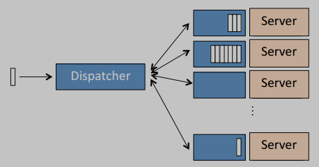

### Power-of-d (PoD)

The Power-of-d (PoD) policy, often called Power-of-2 when $\large d=2$, is a highly effective and practical compromise that captures most of the benefits of JSQ with a **fraction of the overhead**.

  * **Policy:** Upon a task's arrival, the dispatcher polls a small, fixed number, $\large d$, of **randomly chosen servers** (e.g., $\large d=2$). 
    * It then sends the task to the server with the shortest queue *among that small sample*.
  * **Pros:**
      * Achieves a dramatic performance improvement over a simple RANDOM policy. 
        * This phenomenon is often called the "power of two choices."
      * Like JSQ, it is **asymptotically delay-optimal** in the heavy-traffic regime.
  * **Cons:**
      * It still incurs a **non-zero dispatching delay** while it polls the $\large d$ servers.

      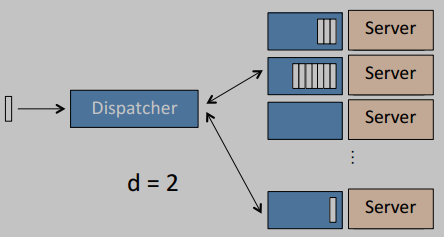

### Join Idle Queue (JIQ)

In contrast to "push" policies, "pull" policies are initiated by the servers themselves when they become available for work. 

The canonical example is *Join Idle Queue* (**JIQ**).

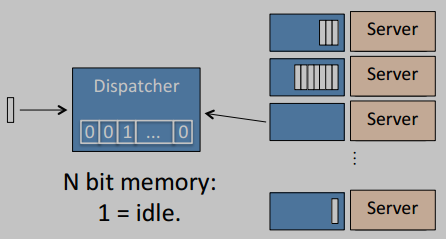

* **Policy:** The JIQ algorithm works as follows:
    *  The dispatcher maintains a simple state, often a bitmap or a list, indicating which of the $\large N$ servers are currently idle.
    *  When a server finishes processing all tasks in its queue and becomes idle, it sends a message to the dispatcher to signal its availability.
    *  When a new task arrives at the dispatcher, it checks its list of idle servers.
        * If **one or more servers are idle**, it sends the task to a randomly chosen server from that list.
        * If **all servers are busy**, the dispatcher defaults to a simple policy like **RANDOM**, sending the task to a random server from the entire pool.

* **Pros:**

    * **Low Message Overhead:** JIQ is very efficient in terms of communication. 
        * At most, one message is sent per task departure (when a server becomes idle), which is significantly less than polling-based "push" policies.
    * **Zero Dispatching Delay:** When an idle server is available, the dispatcher can send a task to it immediately without any polling delay.
    * Under **moderate loads**, JIQ often provides **better delay performance** than polling-based policies like Power-of-d.

* **Cons:**

    * The primary drawback is its **poor performance in the heavy-traffic (HT) regime**. 
        * Once all servers are busy, the "idle list" at the dispatcher is always empty. 
        * In this state, JIQ's behavior degenerates to that of the simple and inefficient **RANDOM** policy, leading to high delays.

### The "Big Picture": A Policy Dilemma

The policies discussed so far present a clear **trade-off**:

  * **Push Algorithms (JSQ, PoD)** 
    * **Pro**: These are **delay-optimal in the heavy-traffic regime**, providing excellent performance when the system is under stress. 
    * **Cons**: However, they suffer from **non-zero dispatching delays** and can have **high messaging overhead**.
  * **Pull Algorithms (JIQ)** 
    * **Pro**: These have **zero dispatching delay** and very **low message overhead**. 
    * **Cons**: However, their performance is poor in the heavy-traffic regime, as they devolve into a simple RANDOM policy.

The **goal**, therefore, is to design a policy that combines the best properties of both approaches: **the low overhead of "pull" policies with the high-performance guarantees of "push" policies.**

### A Hybrid Approach: The Join-Below-Threshold (JBT) Algorithm

The Join-Below-Threshold (JBT) algorithm is a hybrid "pull-based" scheme designed to achieve this goal. It operates with two key components: the dispatcher and the server.

#### JBT($\large r$) Algorithm: Dispatcher's Role

The **dispatcher's logic** is as follows:

1.  It maintains a list of server IDs that are known to have a queue length less than a predefined threshold, $\large r$.
2.  When a new task arrives, the dispatcher checks its list of available servers.
      * If the list is **not empty**, it picks a server ID from the list at random, sends the task to that server, and **immediately removes that ID from the list**. 
        * This is an **optimistic measure**, assuming that sending one task might push the server's queue over the threshold.
      * If the list is **empty**, it defaults to a simple policy like RANDOM.
3.  The dispatcher's list is only repopulated when it receives "I'm available" messages from the servers themselves.

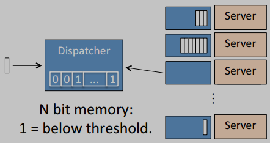

#### JBT($\large r$) Algorithm: Server's Role

The server's role is very simple and communication-efficient:

1.  The server continuously monitors its own task queue.
2.  A server sends a message to the dispatcher **only** at the specific moment its queue length drops from being equal to the threshold $\large r$ to $\large r-1$. 
    * This single message announces that it is now "below threshold" and available to be added back to the dispatcher's list.

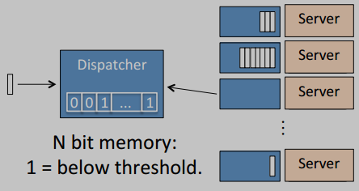

### Practical Implementation: The Adaptive JBT-d Algorithm

A **fixed threshold** $\large r$ is **not optimal**, as the ideal queue length threshold changes with the overall system load. 

The **JBT-d** algorithm is a practical, **adaptive** version that dynamically adjusts this threshold.

1.  **Adaptive Threshold Update:** The threshold is no longer a fixed value. 
    * Periodically (e.g., every $\large T$ time units), the dispatcher polls a small, random sample of $\large d$ servers. 
    * It then sets the **new threshold** to be the **minimum queue length** it observed among that sample. 
    * This new threshold is then communicated to all servers.
2.  **Server Behavior:** Each server operates as in the basic JBT policy, sending its ID to the dispatcher whenever its queue length falls below the *current, dynamically updated* threshold.
3.  **Dispatcher Behavior:** Upon a new task arrival, the dispatcher sends it to a server from its list of available (below-threshold) servers. 
    * If the list is empty, it dispatches the task randomly.

### JBT-d Properties and Performance Analysis

The adaptive JBT-d algorithm has a powerful **theoretical guarantee of optimality**, making it a **highly robust** and **efficient policy**.

* **Optimality Theorem:** For any finite update period $\large T$ and any sample size $\large d \ge 1$, the JBT-d policy is proven to be both **throughput optimal** and **delay optimal in the heavy-traffic regime**. 
    * This means it can stabilize any manageable workload and provides the best possible delay performance when the system is under high stress.

* **Generalization to Heterogeneous Servers (JBTG-d):** The algorithm can be extended to handle servers with different processing speeds ($\large \mu_j$).

    * When a server reports that it is below the threshold, it also includes its service rate, $\large \mu_j$.
    * The dispatcher then uses this information to perform a **weighted random assignment**. 
        * When it picks a server from its available list, it doesn't choose uniformly. 
        * Instead, the probability of sending a task to server $\large j$ is proportional to its speed:
        $$\Large \phi_j = \frac{\mu_j}{\sum_{k \in L(t)} \mu_k}$$

    Where $\large L(t)$ is the **list of available servers**. 
    * This ensures that faster servers are assigned proportionally more tasks. 
    * If no servers are on the list, it defaults to a weighted random choice among all servers.

#### Policy Comparison Summary

The following table summarizes the key properties of the load balancing policies discussed. It compares them on messaging overhead per task (Msg/task) and their optimality for both **homogeneous** (**Ho**) and **heterogeneous** (**He**) server environments.

| Policy | Msg/task | TO-Ho | TO-He | DO-Ho | DO-He |
| :--- | :--- | :---: | :---: | :---: | :---: |
| Random | 0 | ✓ | ✗ | ✗ | ✗ |
| JSQ | $\large 2N$ | ✓ | ✓ | ✓ | ✓ |
| PoD(d) / SQ(d) | $\large 2d$ | ✓ | ✗ | ✓ | ✗ |
| JIQ | $\large \le 1$ | ✓ | ✗ | ✗ | ✗ |
| JBT-d | $\large \le 1 + \frac{N+2d}{T}$ | ✓ | ✗ | ✓ | ✗ |
| **JBTG-d** | $\large \le 1 + \frac{N+2d}{T}$ | **✓** | **✓** | **✓** | **✓** |

**Key Takeaways:**

  * **JSQ** is theoretically perfect but has an impractically high message overhead that scales with the number of servers, $\large N$.
  * Simple policies like **PoD** and **JIQ** fail to achieve optimality in heterogeneous environments.
  * The generalized, adaptive **JBTG-d** policy is the **standout**. 
    * It is the only policy listed that achieves **both throughput and delay optimality for both homogeneous and heterogeneous systems**, all while maintaining a low and controllable message overhead.

#### Numerical Performance Results

Simulation results validate the theoretical properties of JBT-d, showing its **superior performance compared to other policies**, especially **under heavy load**.

  * **Delay Performance (Homogeneous Servers)**

    This graph plots the **mean response time** versus **system load** ($\large \rho$) for a system with 10 identical servers.

    * As predicted by theory, the performance of **JIQ** degrades rapidly as the load increases beyond 90%. 
    * In contrast, the **JBT-d** policy's performance remains low and closely tracks that of the theoretically optimal (but impractical) **JSQ** policy, even under very heavy load.

    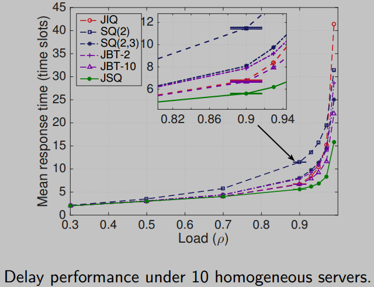

  * **Heavy-Traffic Delay Performance (Homogeneous Servers)**

    This graph provides a zoomed-in view of the heavy-traffic regime ($\large \rho \> 0.9$) for systems with 10 and 50 servers.

    * These results clearly demonstrate **JBT-d's heavy-traffic optimality**. 
    * While JIQ's delay explodes, JBT-d maintains a **very low and stable mean response time**, confirming its robustness under stress.

    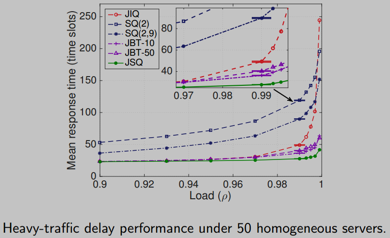

  * **Message Overhead Analysis** (*CHECK CORRECTNESS*)

    This final set of graphs shows the trade-off between message overhead and delay performance for the JBT-d algorithm.

    * **Purple Lines (Message Rate vs. T):** This shows that the number of messages per new job for JBT-d decreases as the threshold update period, $\large T$, increases. This means the communication overhead of the policy is **controllable**.
    * **Red Line (Delay vs. T):** This shows that the mean response time of JBT-d is **not very sensitive** to the value of $\large T$.

    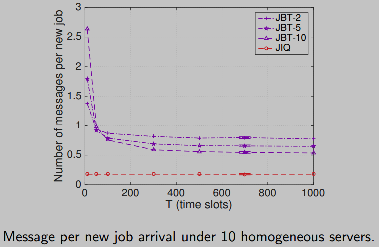

### Conclusion

Together, these graphs show the **key advantage of JBT-d**. 
* An operator can choose a larger value for $\large T$ to reduce the messaging overhead to be as low as JIQ's, while still retaining the vast majority of JBT-d's superior delay performance. 
* This makes it a highly practical and efficient policy.

---

## Anticipative Algorithms: Using Job Size Information

This class of algorithms assumes the **dispatcher has knowledge of a job's size upon its arrival**. 
* This information allows for more intelligent and often more performant load balancing decisions.

### Size-Interval Task Assignment (SITA)

  * **Policy:** The range of possible job sizes is **partitioned** into $\large N$ intervals using a set of thresholds, $\large s_0, s_1, ..., s_N$. 
    * When a job of size $\large X$ arrives, it is deterministically assigned to a specific server $\large i$ based on its size 
    * Assign job of size X such that $\large s_{i-1} < X \le s_i$, the job goes to server $\large i$.
  * **Challenge:** The main difficulty in implementing SITA is **finding the optimal threshold** values to balance the load effectively across the servers.

### Least Work Left (LWL)

  * **Policy:** Upon a task's arrival, the dispatcher polls all servers to determine the total amount of *unfinished work* in each server's queue (i.e., the sum of the remaining processing times of all jobs waiting at that server). 
    * It then sends the new task to the server with the minimum unfinished work.

### Performance Ranking (with FCFS Servers)

When the individual servers in the farm each use a simple First-Come, First-Served (**FCFS**) scheduling policy, and **job sizes are highly variable**, the performance of different load balancing policies can be ranked as follows.

(**CHECK**)

1.  **Central-Queue (M/G/k):** The theoretical ideal (the resource-pooled system), which provides the lowest possible mean response time.
2.  **SITA:** Performs very well by segregating jobs by size.
3.  **LWL:** Also performs well by trying to balance the total workload.
4.  **JSQ:** Performance degrades because knowing only the number of jobs is not enough when sizes are highly variable.
5.  **Round-Robin:** Performs the worst in this scenario.

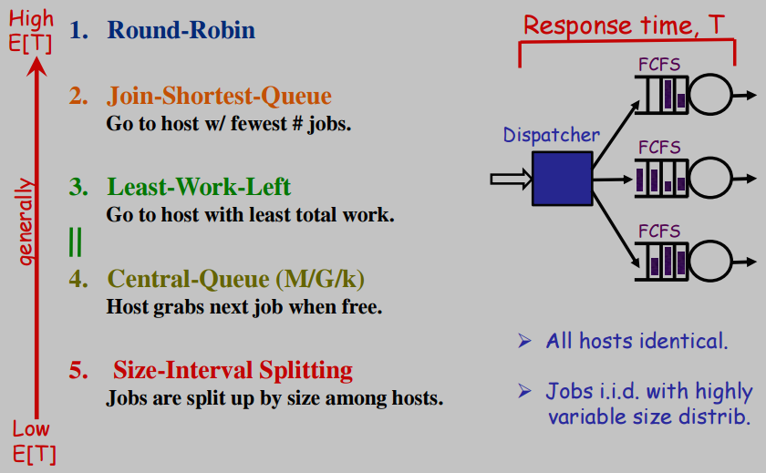

### The Deceptive Ranking: LWL vs. SITA

The simple ranking on the previous slide is deceptive because it **doesn't capture the full picture**. 
* The relative performance of LWL and SITA is highly dependent on the specific statistical properties of the job size distribution, particularly its "heavy-tailedness" (shape).

A **key question** in performance analysis is: *what happens to the performance of LWL and SITA as service time variability (measured by the ***Squared Coefficient of Variation***, or **SCOV**) becomes **extremely high***. 
* **No single answer**; the outcome depends entirely on the specific statistical properties of the job size distribution. 
    * Either policy could be superior, or both could perform well or poorly.

This dependency is demonstrated when comparing performance for a **Bounded Pareto distribution**, a common model for heavy-tailed workloads, but with a slightly different shape parameter, $\large a$:

* **When the shape parameter $\large a=1.6$**.
    * As variability increases, the performance of **LWL improves**, while SITA's degrades. 
    * In this scenario, **LWL is the better policy**.
* **When the shape parameter $\large a=1.4$**
    * With a small change to the distribution's shape, the situation completely reverses. 
    * Now, LWL's performance degrades with variability, while **SITA's improves**. 
    * In this scenario, **SITA is the better policy**.

    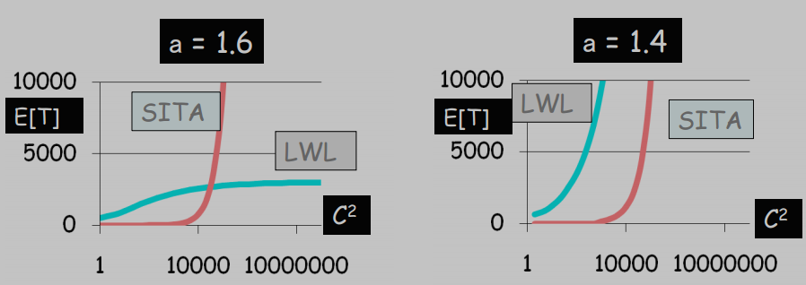

### Summary

  * For workloads with **high service time variability**, there is **no single winner** between SITA and LWL. 
    * The best choice depends on the precise nature of the job sizes. 
    * Non-anticipative policies like RANDOM, Round-Robin, and JSQ perform poorly in this environment.
  * For workloads with **low service time variability** (e.g., all jobs are roughly the same size), the situation is different. 
    * Simple policies like **RANDOM and Round-Robin perform well**, as there is no advantage to be gained from using size information.

### Performance with Processor Sharing (PS) Servers 

**(check if more math explan. is needed)**

The analysis changes significantly if the individual servers use a **Processor Sharing (PS)** scheduling discipline instead of FCFS.

#### SITA with PS Servers

If we use the SITA policy to dispatch jobs to a farm of PS servers, the goal is to set the size thresholds ($\large s_i$) to minimize the overall mean response time.

The mean response time is given by:

$$\Large E[R] = \frac{1}{N\lambda} \sum_{i=1}^{N} \frac{\rho_i}{1 - \rho_i}$$

This must be minimized subject to the constraint that the sum of the loads on each server, $\large \rho_i$, equals the total system load, $\large A$.$$\Large \sum_{i=1}^{N} \rho_i = A, \quad 0 \le \rho_i < 1$$

The optimal solution is to choose the thresholds such that the load is **perfectly balanced** across all servers, meaning $\large \rho_i = \rho = A/N$ for all $\large i$.

A key result is that for PS servers, an optimally configured SITA policy yields the **exact same performance as the much simpler RANDOM** policy. The fairness of the PS discipline at each server completely negates the advantage of segregating jobs by size at the dispatcher.

#### Final Ranking with PS Servers

When servers use PS, the performance ranking is as follows:

1.  **OPT (Optimal):** The theoretical best performance.
2.  **JSQ:** Performance is extremely close to optimal and is insensitive to job size variability.
3.  **LWL:** Performs much better than SITA/RANDOM.
4.  **SITA / RANDOM:** These have the worst performance in this scenario.

