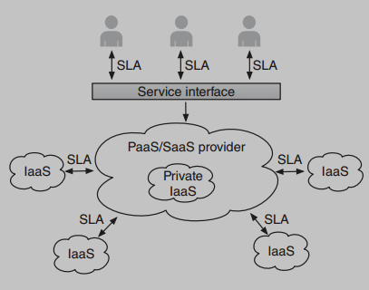
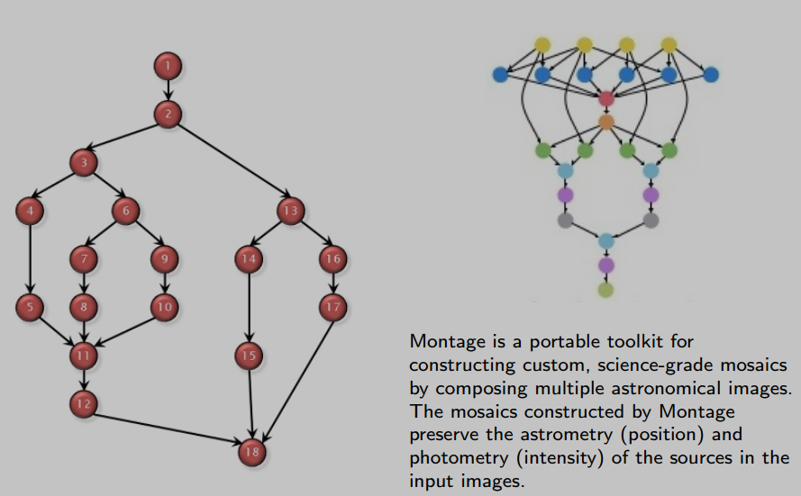
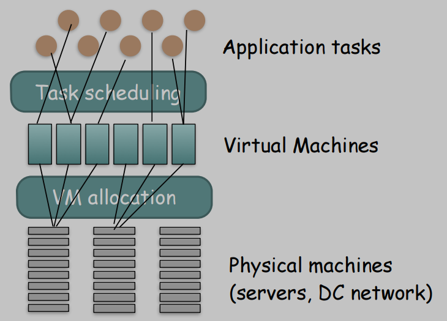
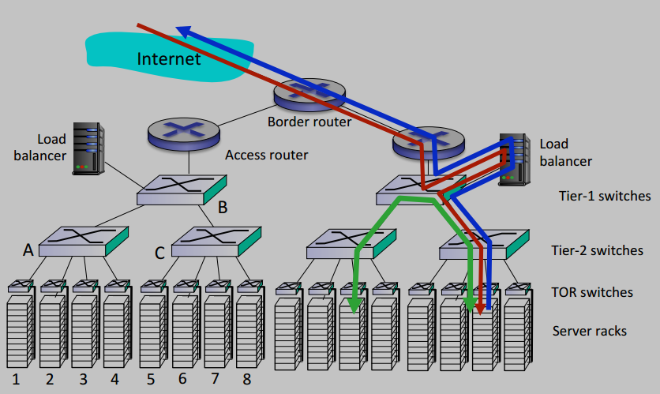

# Resource Management and Scheduling

This chapter explores the core concepts of managing resources in a cloud environment. 

The central challenge is to efficiently allocate and schedule computational tasks and virtual machines (VMs) onto physical hardware to meet performance goals while maximizing provider profit and user satisfaction.

---

## Core Concepts

### Service-Level Agreements (SLAs) and Provider Relationships

The relationship between a cloud customer and a provider is formally defined by a **Service-Level Agreement (SLA)**. The cloud ecosystem often involves multiple levels of service, creating a chain of dependencies. 
A provider at one level can be a customer of another.

  * A **Software-as-a-Service (SaaS)** provider might lease resources from a **Platform-as-a-Service (PaaS)** provider.
  * That PaaS provider might, in turn, lease its underlying infrastructure from an **Infrastructure-as-a-Service (IaaS)** provider.

This creates a **hierarchy of SLAs**. 
* For a provider at a higher level to guarantee a certain quality of service to its customers, it must receive corresponding guarantees from its own lower-level providers. 
* This dependency directly impacts service pricing and profit margins.

### Management Functions

The specific management tasks in a cloud environment depend heavily on the service model (IaaS, PaaS, or SaaS) and is based on '***pay-per-use***' basis:

  * **SaaS and PaaS:** Management focuses on **application performance**. 
    * The system must be able to automatically **scale computing power up or down** based on **user demand** to maintain a consistent quality of service.
  * **IaaS:** Management is centered on **resource allocation**. 
    * The system must respond to client requests for different types of VMs and allocate these requests to physical machines according to the provider's policies (e.g., maximizing server utilization or minimizing energy consumption).

### Cloud Charging Models

The actual allocation of VMs often depends on the charging model selected by the client. The **most common models** are:

  * **On-demand Leasing:** The **standard pay-per-use** model. 
    * A client pays a fixed price per unit of time (e.g., per hour) for a specific type of VM.
  * **Reserved Model:** A client pays an **upfront fee for a long-term contract** to get access to VMs at a significantly discounted hourly rate. 
    * This provides *price predictability* for stable workloads.
  * **Spot Model:** This model operates like a stock market for spare computing capacity.
      * The **price of a VM fluctuates** based on real-time supply and demand.
      * A user bids a **maximum price** they are willing to pay. 
        * They can use the VM as long as the current spot price remains below their bid.
      * If demand for resources increases, the spot price can rise above the user's bid, and the provider has the **right to terminate** the VM instance with little warning.

### Applications: Services vs. Jobs

In cloud computing, work can be categorized into **two main types**:
  * **Services:** A *service-oriented* approach, code is already deployed and remains running, waiting to be invoked through a defined *interface*. 
    * **Service repository** keeps track of running services.
    * **Service deployment** mechanism handles their distribution across resources.
  * **Jobs:** A more *traditional* approach, code and data are transferred to a resource, executed, and then terminated, with the results delivered back to the user.
* **Task**: generally refer to an **instance** of either a service or a job.

### Workflows and Directed Acyclic Graphs (DAGs)

Many complex applications consist of multiple tasks that have dependencies on one another. 
* This *precedence-constrained* set of tasks is known as a **workflow**.

Workflows are commonly represented using a **Directed Acyclic Graph (DAG)**, where:
* The **nodes (vertices)** represent individual **tasks**. 
    * Each node has a weight corresponding to its computational cost ($\large w_{t_a}$).
* The **directed edges** represent **dependencies**. 
    * ***Precedence-constrain***: An edge from task $\large t_a$ to task $\large t_b$ means that $\large t_b$ cannot start until $\large t_a$ is complete. 
    * Each edge has a weight representing the **communication cost** ($\large c_{a,b}$), i.e., the amount of data that must be transferred from $\large t_a$ to $\large t_b$.

#### Examples of workflow DAGs

## From high-level cloud computing to operational resource management 

### The Overall Optimization Problem

Resource management in the cloud is a complex, multi-layered optimization problem. 

* At the highest level are the **application tasks**. 
    * These tasks must be scheduled onto virtual machines, which in turn must be allocated onto the physical machines (servers and the data center network). 
* Each layer has its own set of constraints and objectives, creating a **hierarchical optimization challenge**.

### The Role of the Dispatcher (Load Balancer)

In a typical data center architecture, the component responsible for the initial distribution of incoming work is the **load balancer**. It acts as the **dispatcher**, sitting at the front-end of the server farm and directing incoming requests or tasks to the appropriate servers based on a specific load balancing policy.

### Explanation

The professor's intent here is to bridge the gap between the high-level, conceptual "what" of cloud computing (which you covered in the first chapter) and the detailed, operational "how" that this new chapter on resource management is all about.

Think of it this way: the slides on **Overall Resource Optimization (150)** and the **Dispatcher (151)** are the first look "under the hood." 
* They are not independent topics; rather, they are the direct, practical consequences of the core cloud concepts you've already learned.

Here is how they connect:

#### 1. From "Resource Pooling" to a Management Hierarchy (Slide 150)

* **The Concept (Chapter 1):** You learned that a cloud uses **Resource Pooling** to treat thousands of physical servers as a single, massive source of computing power.
* **The Practical Problem:** How do you actually *manage* that giant, shared pool? 
    * You can't just let applications grab resources randomly. 
    * You need a structured, automated process.
* **The Connection (Slide 150):** The "*Overall resource optimization*" diagram **is that process**. 
    * It shows the logical stack of decisions that a cloud provider's management system must make to translate a user's request into a specific allocation on a physical machine. 
    * It's the "brain" that makes resource pooling functional, ensuring that the right tasks are scheduled on the right VMs, which are then placed on the right physical servers.

#### 2. From "Elasticity" and "On-Demand Service" to a Dispatcher (Slide 151)

* **The Concept (Chapter 1):** You learned that a key feature of the cloud is **Rapid Elasticity**—the ability to scale services up or down automatically.
* **The Practical Problem:** If an application suddenly scales from 10 web servers to 100, how does incoming user traffic get directed to the 90 new servers? 
    * Something needs to be aware of all the active servers and distribute the workload among them.
* **The Connection (Slide 151):** The "dispatcher" (physically, a **load balancer**) **is that component**. 
    * The diagram shows it sitting at the front door of the data center's server farm. It is the crucial entry point that:
        * **Knows which servers are available** for a given application.
        * **Distributes incoming requests** across those servers.
        * **Makes elasticity work in practice.** When you add new VMs, the dispatcher is updated to include them in the pool of resources, and when you remove them, it stops sending them traffic.

In summary, the professor is using these two slides to transition from the abstract promises of the cloud model to the concrete engineering problems that need to be solved to deliver them. 

The optimization hierarchy (slide 150) and the dispatcher (slide 151) are the two fundamental control points for managing resources and traffic in a data center. 

All the specific scheduling and load balancing algorithms we will discuss next are simply **different ways of implementing the logic within these two control points**.

## The Importance of Delay

For many cloud services, especially interactive ones, **minimizing latency** is not just a technical goal—it's a **critical business requirement**.

  * **E-commerce:** The **Time To Interact (TTI)**—*the time it takes for a page to become usable*—has a **direct impact on revenue**. 
    * Amazon famously found that every 100 ms of latency costs them 1% in sales.
  * **Web Search:** Google discovered that even small increases in search result latency (from 400 ms to 900 ms) caused a 20% drop in traffic. 
    * This shows that users often value speed more than additional results.
  * **Other Applications:** Low latency is also crucial for e-health applications, industrial process control, online gaming, and real-time network security systems.

## Scheduling vs. Load Balancing

Although often used interchangeably, these two terms refer to distinct problems in resource management:

  * **Scheduling:** Defines the **order of execution** for tasks waiting in a **single server queue**. 
    * The goal is to decide which task to serve next. 
    * *Example*: First-Come, First-Served (*FCFS*).
  * **Load Balancing:** Defines the **distribution of tasks** across **multiple independent servers**. 
    * The goal is to decide which server a new task should be sent to. 
    * *Example*: **Randomly** assigning tasks.