<!-- KaTeX auto-render header -->
<link rel="stylesheet" href="https://cdn.jsdelivr.net/npm/katex@0.16.0/dist/katex.min.css">

# Resource Management and Scheduling

## Single-Server Models

To understand how to manage resources across a massive data center, we first need to understand the fundamentals of performance on a single machine. 

This section explores the classic queueing theory models that describe how tasks are processed by a **single server**.

### Preliminary Results: Queueing Theory Fundamentals

The performance of any system where tasks arrive, wait for service, and then depart can be analyzed using ***queueing theory***.

---

### Little's Law

A foundational result in queueing theory is **Little's Law**. 
* It provides **relationship** between the *average number of customers* in a stable system, their *arrival rate*, and the *average time* they spend in the system.

Given a system at statistical equilibrium, a system that has been running long enough to have settled into a **stable, predictable pattern of behavior**, the law states:

$$\Large E[Q] = \lambda E[S]$$

Where:

  * $\large E[Q]$ is the **average number of customers** (or tasks) in the system.
  * $\large \lambda$ is the **mean arrival rate** of customers into the system.
  * $\large E[S]$ is the **average time** a customer spends in the system (waiting time + service time).

---

### The M/G/1 Queue Model

To understand how to manage tasks on a single machine, we start with a fundamental concept from performance analysis: the **single-server queueing system**. The diagram on slide 157 illustrates this model, which serves as the theoretical foundation for this entire section of the course.

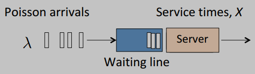

This diagram shows a standard queueing system with three main components:

  * **Poisson Arrivals ($\large \lambda$):** This represents the **flow of incoming tasks**. 
    * The term "***Poisson***" signifies that arrivals are random and independent, but they occur at a predictable average rate, denoted by the Greek letter $\large \lambda$ (lambda). 
    * This corresponds to the **"M"** in the **M/G/1** model notation.
  * **Waiting Line (The Queue):** This is the buffer where tasks wait if the server is busy. 
    * The time tasks spend here is the primary source of queuing delay.
  * **The Server and Service Time ($\large X$):** This is the single resource that performs the work. It can only handle one task at a time. 
    * The time it takes to complete a task is the **Service Time**, represented by the random variable $\large X$. 
    * The model is general, meaning the service time can follow any probability distribution, which corresponds to the **"G"** in **M/G/1**. 
    * The **"1"** signifies that there is a single server.

#### A Building Block for All Single-Server Analysis

This M/G/1 model is not just an introductory example; it is the **basic building block** upon which all the following analyses of single-server performance are built. Every subsequent topic in this section refers back to this fundamental structure:

  * **Waiting Time Formulas:** The detailed formulas for mean waiting time ($\large E[W]$) derived in the following slides are specifically for this M/G/1 system.
  * **Resource Pooling Comparison:** The analysis of whether to use one fast server or many slow ones compares different specific instances of this model (e.g., M/M/1 and M/M/m).
  * **Scheduling Policies:** All the different scheduling algorithms you will learn about—**FCFS**, **SJF**, **SRPT**, **Processor Sharing (PS)**, and others—are simply different strategies for managing the "Waiting Line" and deciding the order in which the "Server" processes tasks within this exact model.

### Mean Waiting Time of the M/G/1 Queue

For a single-server system using a **First-Come, First-Served (FCFS)** policy, the time an arriving task must wait before its own service begins ($\large W$) is the sum of two components:

1.  The **residual service time** ($\large \tilde{X}_0$) of the task currently being served (if any).
2.  The **full service times** ($\large X_j$) of all the $\large N$ tasks already ahead of it in the queue.

This gives the formula:

$$\Large W = \tilde{X}_0 + \sum_{j=1}^{N} X_j$$

From this, we can derive the formula for the *mean* waiting time, known as the **Pollaczek-Khinchine formula**, in a few clear steps.

#### Step 1: Taking the Average

We start by taking the average (the expected value, $\large E[...]$) of the expression for $\large W$. Using the principles of **Linearity of Expectation** and **Wald's Identity**, we get:

$$\large E[W] = E[\tilde{X}_{0}] + E[N]E[X]$$

We can write this more simply by defining $\large W_{0} = E[\tilde{X}_{0}]$, which gives us our intermediate equation:

$$\Large E[W] = W_{0} + E[N]E[X] \quad \quad \text{(Equation 1)}$$

This equation gives us the mean waiting time, but it depends on **another unknown**: $\large E[N]$, the **average number of tasks** in the queue.

#### Step 2: Applying Little's Law to Find E[N]

To solve for $\large E[N]$, we now apply **Little's Law** ($\large E[Q] = \lambda E[S]$) specifically to the **waiting line itself**.

* The "system" is the queue.
* The average number of items in this system is $\large E[N]$.
* The arrival rate into this system is $\large \lambda$.
* The average time an item spends in this system is, by definition, the mean waiting time, $\large E[W]$.

Applying Little's Law ($\large E[Q] = \lambda E[S]$) to these terms gives us:

$$\Large E[N] = \lambda E[W] \quad \quad \text{(Equation 2)}$$

#### Step 3: Substituting and Solving for E[W]

Now we can substitute the result from Little's Law (**Equation 2**) back into our intermediate equation (**Equation 1**):

$$\large E[W] = W_{0} + (\lambda E[W])E[X]$$

We can rearrange the terms and recall the ***definition of server utilization***, $\large \rho = \lambda E[X]$:

$$\large E[W] = W_{0} + (\lambda E[X])E[W]$$
$$\large E[W] = W_{0} + \rho E[W]$$

Finally, we solve this equation for $\large E[W]$ through simple algebra:

$$\large E[W] - \rho E[W] = W_{0}$$

$$\large E[W](1 - \rho) = W_{0}$$

$$\Large E[W] = \frac{W_{0}}{1 - \rho}$$

This is the final **Pollaczek-Khinchine formula** for the mean waiting time in an M/G/1 queue, where:

  * $\large \rho = \lambda E[X]$ is the **utilization coefficient** of the server (*the fraction of time it is busy*).
  * $\large W_0 = E[\tilde{X}_0]$ is the **mean residual service time**, which is the average time an arriving customer has to wait for the *current* service to finish. It is given by:

$$\large W_0 = \frac{\lambda E[X^2]}{2}$$

This formula is crucial because it shows that the mean waiting time depends not only on the arrival rate and mean service time ($\large E[X]$) but also on the *second moment* of the service time ($\large E[X^2]$), which is related to its **variability**. Higher service time variability leads to longer average waits.

#### Deriving the Mean Residual Service Time ($\large W_0$)

To find the value of $\large W_0$, we need to consider the **two possibilities** an arriving task might encounter. We can model this using a binary random variable, $\large B$:

* $\large B=1$: The server is **busy**. The probability of this is the server utilization, $\large P(B=1) = \rho$.
* $\large B=0$: The server is **idle**. The probability of this is $\large P(B=0) = 1 - \rho$.

The average residual service time, $\large W_0$, is the **weighted average of the outcomes** in these two states:

1.  **If the server is idle ($\large B=0$):** An arriving task finds an empty server and can begin service **immediately**. 
    * The residual service time is **0**.
2.  **If the server is busy ($\large B=1$):** An arriving task **must wait** for the current task to finish. 
    * Due to a property of Poisson arrivals known as the *inspection paradox*, the average remaining service time for the task in progress is given by a specific formula from renewal theory:
    $$\large E[\text{remaining time} | \text{server busy}] = \frac{E[X^2]}{2E[X]}$$

Combining these using the law of total expectation:

$$\large W_{0} = (P(B=0) \times 0) + (P(B=1) \times \frac{E[X^2]}{2E[X]})$$
$$\large W_{0} = ((1-\rho) \times 0) + (\rho \times \frac{E[X^2]}{2E[X]})$$
$$\large W_{0} = \frac{\rho E[X^2]}{2E[X]}$$

Finally, by substituting the definition of utilization ($\large \rho = \lambda E[X]$), we get the form used in the final calculation:

$$\Large W_{0} = \frac{(\lambda E[X]) E[X^2]}{2E[X]} = \frac{\lambda E[X^2]}{2}$$

### Resource Separation vs. Pooling

This queueing theory foundation allows us to answer a critical design question: **for a given total processing capacity, is it better to have one single, powerful server or to separate the capacity into multiple, slower servers?**

Let's consider a system with:
* **Total arrival rate** of $\large m\lambda$ 
* **Total service capacity** of $\large m\mu$. 

We can arrange this in **three ways**:

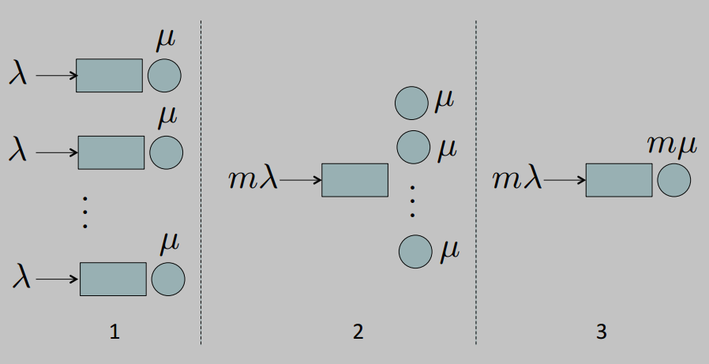

1.  **Multi-Queue (Separated):** $\large m$ separate servers, each with service rate $\large \mu$ and handling an arrival rate of $\large \lambda$. Each server is an **independent `M/M/1` queue**.

      * **Mean System Time:** $\Large E[S] = \frac{1}{\mu - \lambda}$

2.  **Multi-Server (Pooled):** $\large m$ servers with rate $\large \mu$ sharing a single queue. This is an **`M/M/m` queue**.

      * **Mean System Time:** $\Large E[S] = \frac{C(m, m\lambda/\mu)}{m\mu - m\lambda} + \frac{1}{\mu}$
    
      Where $\large C(m, A)$ is the ***Erlang C formula***, which gives the **probability** that an **arriving customer has to wait in the queue**.

3.  **Single-Server (Super-Server):** One single, fast server with a service rate of $\large m\mu$ handling the total arrival rate of $\large m\lambda$. This is a **single `M/M/1` queue**.

      * **Mean System Time:** $\Large E[S] = \frac{1}{m\mu - m\lambda}$

#### Numerical Comparison and Conclusion

The graph on the slide compares the performance of these three models for `m=10` servers as the load ($\large a = \lambda/\mu$) increases.

  * The **squarred line** (m M/M/1) represents the separated multi-queue system.
    * Its performance is the **worst**.
  * The **circle line** (M/M/m) represents the pooled multi-server system. 
    * It performs **significantly better**.
  * The **star line** (M/M/1) represents the single "super-server". 
    * It provides the **best performance** of all.

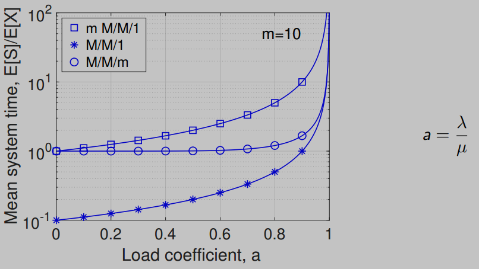

**The conclusion is clear: pooling resources is always better.** 

A single, faster server will always provide lower average response times than multiple, separate slower servers with the same total capacity. 
* This is a fundamental reason why cloud computing, which pools massive resources together, is **so effective**.

## An Introduction to Scheduling Policies and Terminology

A **scheduling algorithm** is a policy for managing the capacity of a single server. It defines the order in which tasks waiting in the queue are served.

To compare different scheduling strategies, we first need a framework for classifying them. Scheduling policies can be categorized along three key dimensions: **Sharing**, **Preemption**, and knowledge of **Job Size**.

### Priority Terminology
* **Sharing**
    * **Head-of-Line (HOL):** The server is dedicated to at most a **single customer** at a time. 
        * It completes one task (or a part of it) before even considering the next. 
        * This is a "***one-at-a-time***" service model.
    * **Server Sharing:** The server's capacity is conceptually "sliced" and **shared among multiple customers** simultaneously. 
        * More than one customer can be partially served at any given time.

* **Preemption**
    * **Non-preemptive Priority:** Once a task begins service, it **runs to completion and cannot be interrupted**, even if a higher-priority task arrives.
    * **Preemptive Priority:** A task currently being served **can be interrupted** (***preempted***) if a task with a higher priority arrives. 
        * The interrupted task is typically returned to the queue to resume later.

* **Job Size**
    * **Non-anticipative:** The scheduling algorithm has **no prior knowledge** of how long a task will take to complete (its "job size"). It can only react to a job's properties as it observes them.
    * **Anticipative:** The scheduling algorithm **knows the size** of each job upon its arrival and can use this information to make smarter scheduling decisions.

### Overview of Scheduling Policies

Using the terminology above, the slides will cover the following key scheduling strategies:

* **Head-Of-Line (HOL) Strategies:**
    * **Non-preemptive, Non-anticipative:**
        * ***First-Come, First-Served*** (**FCFS**)
        * ***Static Priority***
    * **Non-preemptive, Anticipative:**
        * ***Shortest Job First*** (**SJF**)
    * **Preemptive, Non-anticipative:**
        * ***Least Attained Service*** (**LAS**)
    * **Preemptive, Anticipative:**
        * ***Shortest Remaining Processing Time*** (**SRPT**)

* **Server Sharing Policies:**
    * **Processor Sharing (PS):** The theoretical model of perfectly fair sharing.
        * *Practical Implementation:* **Round Robin (RR)**.
    * **Generalized Processor Sharing (GPS):** The theoretical model for weighted fair sharing.
        * *Practical Implementation:* **Credit-Based Scheduling**.

### Notation for Analysis

To analyze these policies mathematically, we will use the following standard notation for a single-server system fed by $\large P$ different classes of customers:

* **Priority:** Class $\large j$ has priority over class $\large i$ for any $\large j < i$. (Class 1 is the highest priority).
* **Arrivals:**
    * $\large T_j$: The ***inter-arrival time*** for tasks of class $\large j$. 
        * We assume arrivals follow a ***Poisson process***, unless otherwise stated.
    * $\large \lambda_j$: The ***mean arrival rate*** of class $\large j$.
* **Service Times:**
    * $\large X_j$: The ***service time*** for a task of class $\large j$, which can follow a general probability distribution with CDF $\large F_{X_j}(t)$.
    * $\large E[X_j] = 1/\mu_j$: The ***mean service time*** for class $\large j$.
    * $\large E[X_j^2] = \sigma_{X_j}^2 + 1/\mu_j^2$: The ***second moment of the service time*** for class $\large j$.
* **Utilization (Load):**
    * $\large \rho_j = \lambda_j E[X_j]$: The ***utilization coefficient*** for class $\large j$ 
        * It is the fraction of the server's time spent on class $\large j$ tasks.
    * $\large \rho = \rho_1 + \dots + \rho_P$: The total utilization of the server. For the system to be stable, we must have $\large \rho < 1$.

## The Conservation Law for HOL Systems

Before analyzing specific policies, it's important to understand a fundamental principle that governs all ***work-conserving***, Head-of-Line (HOL) systems. 
* A system is **work-conserving** if the server is never idle when there are tasks in the queue.

**Theorem (Conservation Law):** For any work-conserving HOL priority system **in equilibrium**, the weighted sum of the mean waiting times across all customer classes is constant and equal to the mean waiting time of a simple FCFS system.

$$\Large \sum_{j=1}^{P} \frac{\rho_j}{\rho} E[W_j] = \frac{W_0}{1 - \rho} = E[W_{FCFS}]$$

Where:
* $\large \rho_j$ is the **utilization** from class $\large j$.
* $\large \rho$ is the **total server utilization**.
* $\large E[W_j]$ is the **mean waiting time** for class $\large j$.
* $\large W_0$ is the **mean residual service time** for the system as a whole.

**Key takeaway**: You cannot improve the waiting time for one class of tasks without worsening the waiting time for another. 
* Any scheduling policy is simply a **trade-off**, redistributing the total waiting time among the different classes.

## Static Non-Preemptive HOL Priorities

This is one of the simplest priority scheduling schemes.

* **Policy:** Arriving tasks are assigned a ***fixed priority "label"*** 
    * *Example*: from 1 to $\large P$, where 1 is the highest priority. 
    * When the server becomes free, it serves the task with the highest priority from the queue. 
    * Because it is **non-preemptive**, once a task begins service, it runs to completion, even if a higher-priority task arrives.
* **Mean Waiting Time:** If the **arrival are Poisson**, the mean waiting time for a task of class $\large j$ is given by:
    $$\Large E[W_j] = \frac{W_0}{(1 - \sum_{i=1}^{j-1}\rho_i)(1 - \sum_{i=1}^{j}\rho_i)}$$
* **Key Implication:** Note that the mean residual service time, $\large W_0 = \frac{1}{2}\sum_{i=1}^{P} \lambda_i E[X_i^2]$, is the same for all classes. 
    * This means that a long, high-variance job from a *low-priority* class can significantly delay all *high-priority* jobs if it happens to occupy the server when they arrive.
* **Optimal Priority Assignment:** If there is a cost $\large c_j$ associated with each unit of time a class $\large j$ task waits, the total cost is minimized by assigning priorities in decreasing order of the ratio $\large c_j/E[X_j]$. 
    * This is known as the ***cμ rule***: give higher priority to tasks that are "cheaper" to serve 
    * Have a **small** mean service time ($\large E[X_j]$) and/or have a **high** cost of waiting ($\large c_j$).

### Example
Consider two flows of jobs with $\large \lambda_1 = \lambda_2$ and where type-2 jobs take 10 times longer on average ($\large E[X_2] = 10 E[X_1]$). The total load is $\large \rho = 0.9$.

* This implies $\large \rho_1 \approx 0.082$ and $\large \rho_2 \approx 0.818$.
* Giving class 1 (the shorter jobs) higher priority results in:
    * $\large E[W_1] \approx 1.089 W_0$
    * $\large E[W_2] \approx 10.89 W_0$
* In a standard FCFS system, the overall mean wait would be $\large E[W_{FCFS}] = 10 W_0$. 
* **Key Takeaway**: The priority scheme significantly **improves performance** for the high-priority short jobs, at a **slight cost** to the low-priority long jobs.

## Shortest Job First (SJF)

SJF is an **anticipative** policy that aims to minimize overall waiting time by **prioritizing shorter jobs**.

* **Policy:** **Non-preemptive** priority policy where a job's priority is determined by its **service time**. 
    * When a job of size $\large x$ arrives, it is placed in the queue ahead of any waiting jobs with a service time greater than $\large x$.
* **Conditional Mean Waiting Time:** The mean waiting time for a job, given that it requires $\large x$ amount of service, is:
    $$\Large W(x) = E[W | X=x] = \frac{W_0}{(1 - \lambda \int_0^x t dF_X(t))^2}$$
    * Where the **integral term** represents the portion of the server load contributed by jobs smaller than $\large x$.
* **Performance:** SJF always results in a **lower overall average waiting time** than FCFS: $\large E[W_{SJF}] < E[W_{FCFS}]$.

## Least Attained Service (LAS)

What if you want to prioritize short jobs but don't know their size in advance? **Least Attained Service (LAS)**, also known as **Foreground-Background (FB)**, is a clever **non-anticipative** policy that **approximates SJF**.

* **Policy:** The server always gives **priority** to the task that has so far received the **least amount of service**.
* **Intuition:** The "age" or "attained service" of a job is used as a proxy for its total size. 
    * A job that has only received a **small amount of service** is likely to be a short job, so it is **given priority**. 
    * A job that has already run for a **long time** is likely a long job and is **de-prioritized**.
* **Implementation:** This is often implemented with a ***multi-level feedback queue***. 
    * **New jobs** enter the **highest-priority queue**. 
    * If a job uses up its time slice in that queue **without finishing**, it is **moved to a lower-priority queue**.
* **Conditional Response Time:** The response time for a job of size $\large x$ is:
    $$\Large S(x) = \frac{\lambda m_2(x)}{2[1 - \lambda m_1(x)]^2} + \frac{x}{1 - \lambda m_1(x)}$$
    Where $\large m_h(x)$ is the **$\large h$-th moment of the service time**, truncated at $\large x$. 

### LAS Numerical Examples

To better understand how the Least Attained Service (LAS) policy works in practice, we can look at two complementary examples: a step-by-step trace and a graph of its general performance.

#### Example 1: A Step-by-Step Trace (Slide 179)

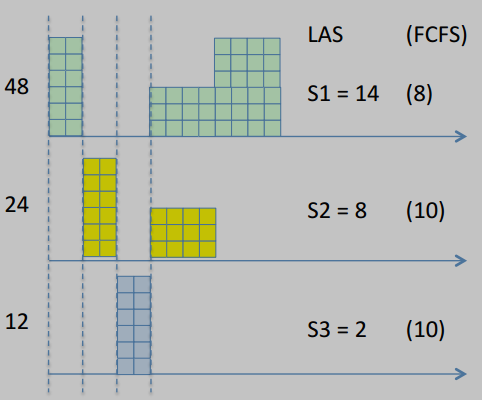

This example traces the execution of three jobs with different service times arriving at different moments, showing how LAS dynamically changes which job is being served.

  * **Scenario:**
      * Job 3 (service time = 2) arrives at time 12.
      * Job 2 (service time = 8) arrives at time 24.
      * Job 1 (service time = 4) arrives at time 48.
  * **Execution Trace:**
    1.  At time 12, Job 3 arrives and starts running.
    2.  At time 24, Job 2 arrives. Since Job 2 has received **zero** service so far, it has the "least attained service," and the server preempts Job 3 to start working on Job 2.
    3.  At time 48, Job 1 arrives. It also has zero attained service, so it has priority. The server preempts Job 2 and starts working on Job 1.
    4.  The server will continue to work on whichever active job has the least accumulated service time, switching between them until they are all complete.
  * **Result vs. FCFS:**
      * **With LAS:** The completion times are $\large S_1=14$, $\large S_2=8$, $\large S_3=2$. The policy manages to finish the two smaller jobs (2 and 3) very quickly.
      * **With FCFS:** The completion times would have been $\large S_1=8$, $\large S_2=10$, $\large S_3=10$. The jobs would be served strictly in their arrival order.

This trace clearly shows how LAS reorders execution to prioritize jobs that are presumed to be short, even if they arrive later.

#### Example 2: General Performance Characteristics (Slide 180)

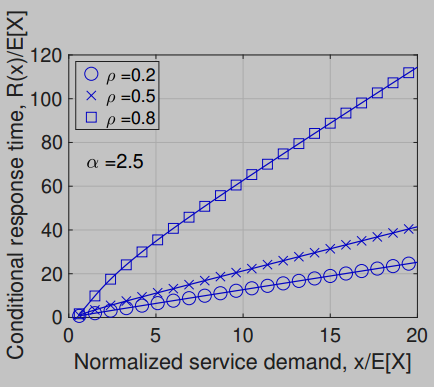

This graph illustrates the general performance of LAS by plotting the conditional response time as a function of the job's size, for different system loads ($\large \rho$).

  * **X-axis:** The normalized service demand ($\large x/E[X]$), representing how large a job is compared to the average job size.
  * **Y-axis:** The conditional response time ($\large R(x)/E[X]$), representing how long a job of a certain size takes to complete, normalized by the average service time.
  * **Interpretation:**
      * **Favors Short Jobs:** For small job sizes (left side of the graph), the response time is very low. 
        * LAS is extremely efficient for short tasks.
      * **Penalizes Long Jobs:** For large job sizes (right side of the graph), the response time grows dramatically. 
        * LAS will constantly preempt long jobs to service newly arriving short jobs, so large jobs can take a very long time to complete.
      * **Impact of Load:** This effect becomes much more extreme as the system load ($\large \rho$) increases. 
        * At high loads (e.g., $\large \rho=0.8$), the penalty for long jobs is severe.

**Conclusion from both examples:** Together, these examples demonstrate both the *mechanism* of LAS (always prioritizing the job with the least completed work) and its *performance consequence* (excellent response times for short jobs at the expense of very long delays for large ones).

## Shortest Remaining Processing Time (SRPT)

SRPT is the **preemptive** version of SJF and is the gold standard for minimizing delay.

* **Policy:** The server always works on the job with the **shortest remaining processing time**. 
    * If a new job arrives whose *total* size is less than the *remaining* time of the job currently in service, the new job preempts the running job.
* **Optimality:** It is proven that SRPT **minimizes the mean system time** ($\large E[S]$) for a single-server queue among all HOL policies.
* **Performance Ranking:** The mean system times for these policies are ordered as follows:
    $$\Large E[S_{SRPT}] \le E[S_{SJF}] \le E[S_{FCFS}]$$

## Server Sharing Policies

Unlike Head-of-Line (HOL) policies that serve one task at a time, server sharing policies conceptually **divide the server's capacity among multiple tasks simultaneously**.

The **primary motivation** for this approach is to provide **isolation**, which serves two main purposes:
* To **protect** well-behaved applications from being starved by aggressive, resource-hungry flows.
* To provide **differentiated** and **guaranteed service** levels to different classes of users.

### Processor Sharing (PS): The Ideal of Perfect Fair Sharing

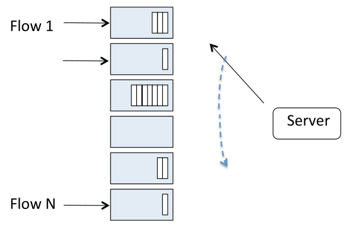

**Processor Sharing (PS)** is a theoretical model that represents the ideal form of perfect fairness.

* **The Concept:** If there are $\large n$ tasks in the queue at any given moment, the PS model assumes that the server's capacity (*mean service rate*: $\large \mu$) is instantly and perfectly divided, with **each task receiving exactly $\large 1/n$ of the total capacity**. 
    * If a new task arrives, the shares are instantaneously recalculated.
* **Performance:** The **mean system time** (***wait + service***) in a PS system is given by the simple formula:
    $$\Large E[S] = \frac{E[X]}{1 - \rho}$$
    A key feature of PS is that its performance depends only on the mean service time ($\large E[X]$), making it **insensitive to service time variability**. 
    * This is a **major advantage over FCFS**, whose performance degrades significantly as service time variance increases.
* **Practical Implementation - Round-Robin (RR):** In the real world, a CPU cannot truly work on multiple tasks at the exact same instant. 
    * **Round-Robin (RR)** scheduling is the practical approximation of the PS ideal. 
    * The server gives a small, fixed-size time slice (called a *quantum*) to each task in the queue, cycling through them in a circular order. 
    * If the time quantum is very small compared to the job sizes, the effect is very close to perfect, simultaneous sharing.

#### Derivation of Mean System Time

To understand the performance of PS, we can derive its mean system time ($\large E[S]$) by first considering a practical approximation with a very small, fixed-size work quantum, $\large \Delta$.

1.  **System Time in the Quantum Model:** 

    The total time it takes to complete a job of size $\large x$, denoted $\large S(x)$, is the sum of the time spent working on its own quanta plus the time spent waiting for the server to work on the quanta of all other jobs in the queue.

      * A job of size $\large x$ requires $\large x/\Delta$ of these small work quanta to be completed.
      * In **each "round"** of service, the server completes **one quantum for our job** (taking time $\large \Delta$) and **one quantum for each of the other** $\large Q(t_k)$ jobs in the queue at that time (taking time $\large \Delta \times Q(t_k)$).
      * The **total time** is the sum over all $\large x/\Delta$ rounds:
        $$\Large S(x) = \sum_{k=0}^{x/\Delta - 1} [\Delta + \Delta Q(t_k)] = x + \frac{x}{x / \Delta} \sum_{k=0}^{x/\Delta - 1} Q(t_k) = x + \Delta \sum_{k=0}^{x/\Delta - 1} Q(t_k)$$

        where $\large t_{k+1} = t_{k} + \Delta [1 + Q(t_k)], k\ge0$

2.  **Taking the Average (Slide 185):** 

    At statistical equilibrium, the average number of other jobs in the queue during the service of our job is simply the **overall average number of jobs in the system**, $\large E[Q]$. 
    
    So, the average system time for a job of size $\large x$ is:
    $$\large E[S|X=x] = x + x E[Q]$$
    By removing the conditioning on $\large x$, we get the average system time for any job:
    $$\large E[S] = E[X] + E[X]E[Q]$$

3.  **Applying Little's Law:** We use Little's Law ($E[Q] = \lambda E[S]$) to substitute for $\large E[Q]$:
    $$\large E[S] = E[X] + E[X](\lambda E[S])$$

4.  **Solving for E[S]:** Recalling that ***server utilization factor*** is $\large \rho = \lambda E[X]$, we can solve for $\large E[S]$:
    $$\large E[S] = E[X] + \rho E[S]$$   
    $$\large E[S](1 - \rho) = E[X]$$   
    $$\Large E[S] = \frac{E[X]}{1 - \rho}$$

#### Summary of PS Performance Metrics

The derivation and behavior of PS lead to three key performance results:

  * **Mean Response Time:**
    $$\Large E[S] = \frac{E[X]}{1 - \rho}$$
  * **Mean Response Time for a job of size $\large x$:**
    $$\Large E[S|X=x] = \frac{x}{1 - \rho}$$
  * **Slowdown for a job of size $\large x$:**
    $$\Large \text{Slowdown} = \frac{1}{1 - \rho}$$

    ***Slowdown***: the ratio of response time to service time, $\large S(x)/x$

The most important result is the **constant slowdown**. 
* In a PS system, a job that is twice as long will, on average, take exactly twice as long to complete. 
* This is why PS is considered the ideal of "fair" scheduling, as it does not discriminate based on job size.

#### Example of PS Execution

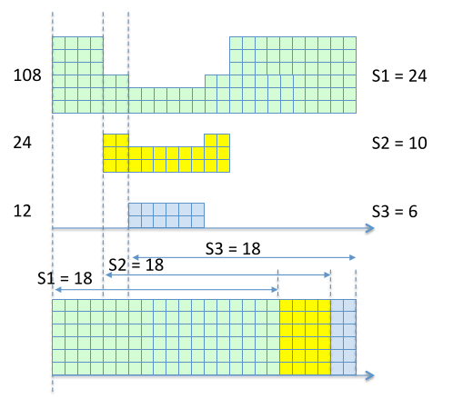

The diagram on this slide provides a visual trace of how PS handles three jobs arriving at different times.

  * **At time 12:** Job 3 arrives (size 6) and receives 100% of the server's capacity.
  * **At time 24:** Job 2 arrives (size 10). The server's capacity is now split 50/50 between Job 2 and Job 3. They are both being served simultaneously, but at half the speed.
  * **At time 48:** Job 1 arrives (size 24). The capacity is now split three ways. Each of the three active jobs receives 1/3 of the server's capacity.
  * **As jobs complete:** When one job finishes, its share of the capacity is instantly redistributed among the remaining active jobs.

Unlike HOL policies where some jobs are completely paused, under PS all jobs in the system are always making progress. The final completion times ($\large S_1=18, S_2=18, S_3=18$) reflect this concurrent processing.

### Comparison: Processor Sharing (PS) vs. First-Come, First-Served (FCFS)

While both PS and FCFS are fundamental scheduling policies, they have vastly different performance characteristics, especially when dealing with variable workloads.

* **For FCFS**, the *mean system time* is given by the Pollaczek-Khinchine formula, which can be written as:
    $$\Large E[S]_{FCFS} = E[X] + \frac{\rho E[X]}{1 - \rho} \frac{1 + C_X^2}{2}$$
    (Where $\large C_X^2$ is the squared coefficient of variation of the service time, a measure of its variability).

* **For PS**, the *mean system time* is:
    $$\Large E[S]_{PS} = \frac{E[X]}{1 - \rho}$$

#### The Key Insight: Insensitivity to Variance

By comparing these two formulas, we can see the most important difference:

1.  **FCFS is sensitive to variance:** Formula includes the $\large C_X^2$ term. 
    * This means that as the **variability of job sizes increases** (e.g., a mix of very short and very long jobs), the average system time under FCFS **gets worse**, even if the mean service time $\large E[X]$ stays the same. 
    * A long job can get "stuck" at the head of the queue and delay all subsequent jobs.

2.  **PS is insensitive to variance:** Formula **does not** contain any term related to service time variance. 
    * Its performance depends only on the mean service time $\large E[X]$ and the load $\large \rho$. 
    * This makes PS **extremely robust**. Whether the jobs are all the same size or have wildly different sizes, the **average system time remains the same**.

**Conclusion:** For the highly variable workloads common in data centers, **PS provides far more predictable and stable performance than FCFS**.

### Generalized Processor Sharing (GPS): Weighted Fair Sharing

**Generalized Processor Sharing (GPS)** extends the concept of PS to allow for *differentiated* service rather than strictly equal service. This is the model for **weighted fair sharing**.

* **The Concept:** Instead of giving every task an equal $\large 1/n$ share, GPS assigns a **weight** (e.g., $\large \phi_i$) to each task or class of tasks. The amount of service a task receives is **proportional to its weight** relative to the sum of the weights of all other tasks currently in the system ($\large B(t)$):
    $$\Large \text{Share for task } i = \mu \times \frac{\phi_i}{\sum_{j \in B(t)} \phi_j}$$
* **The Goal:** GPS is designed to provide predictable and controllable service differentiation. 
    * For instance, a cloud provider can offer different tiers of service by assigning different weights to customers.
* **Practical Implementation - Weighted RR / Weighted Fair Queueing (WFQ) / Credit-Based Scheduling (CBS):** Just as *Round Robin* (RR) is a practical implementation of PS, more advanced algorithms are needed to approximate GPS. 
    * **Weighted Fair Queueing (WFQ)** and **Credit-Based Scheduling (CBS)** are two such practical implementations that use various mechanisms to ensure that, over time, each task receives its designated **proportional share of the server's capacity**.

### Credit-Based Scheduling (CBS)

**Credit-Based Scheduling (CBS)** is a practical, work-conserving algorithm that implements the ideal of **Generalized Processor Sharing (GPS)**. Instead of serving tiny slices of multiple jobs at once, CBS serves one entire job at a time but uses a clever accounting system (a "credit") to ensure that, over the long run, every class of traffic receives its fair, weighted share of the server's capacity.

---

#### CBS Algorithm

The algorithm works by maintaining a **credit counter**, $\large K_j$, for each **class** $\large j$. 
* This counter tracks **how "behind" a class is** relative to its fair share. 
* The algorithm always **prioritizes** the class that is **most "deserving" of service**.

The process can be summarized in these steps:

1.  **Initialization:** At the beginning, all credit counters ($\large K_j$) are set to zero.
2.  **Selection Step:** At any point when the server is ready to choose a new job, it looks at all the job classes that have tasks waiting in the queue. For each of these classes, it calculates a "***virtual finish time***", $\large y_j$, which is essentially the **job's size adjusted by its current credit and its weight**:
    $$\Large y_j = \frac{L_j - K_j}{\phi_j}$$
    Where $\large L_j$ is the **size of the job** at the head of the queue and $\large \phi_j$ is the **weight for that class**. 
    
    The **algorithm then selects** the class, $\large j^*$, that has the **minimum** virtual finish time.
3.  **Service Step:** The server dedicates its full capacity to serving the **entire** head-of-line job from the selected class, $\large j^*$.
4.  **Credit Update Step:** This is the ***key to fairness***.
    * The credit for the class that was just served ($\large K_{j^*}$) is reset to **zero**.
    * The credit for **all other waiting classes** is **increased**. 
        * They are **rewarded for having waited**, and the amount of credit they gain is **proportional to their weight** ($\large \phi_j$). 
        * This ensures they will have a **higher priority** in future selection steps.
5.  **Loop:** The process repeats from Step 2.

#### Fairness of CBS

This algorithm comes with a **mathematical guarantee of fairness**. 

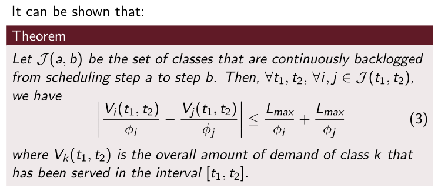

The theorem on proves that the amount of service any two classes receive, when normalized by their weights, can never differ by more than a small, bounded amount. 
* This prevents any single class from being starved and guarantees that the server's capacity is shared according to the specified weights over time.

## Performance Comparison, Fairness, and the All-Can-Win Theorem

### Overall Policy Comparison

This graphs compare the mean response time of all the policies we've discussed. 

The **key takeaway** is that as service time variance increases, policies like **FCFS degrade dramatically**, while **PS is unaffected** and **SRPT remains the best performer**.

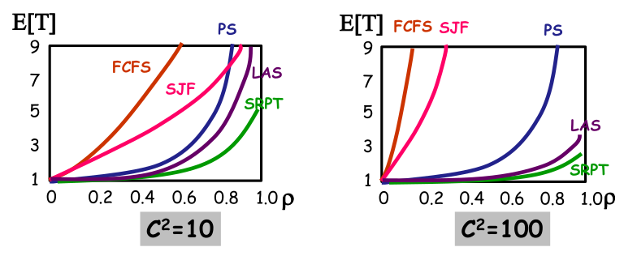

### The Fairness Dilemma

This leads to a critical dilemma:
* **SRPT** provides the best overall mean response time but seems "unfair" because it heavily prioritizes short jobs at the expense of long ones.
* **PS** is perfectly "fair" in the sense that all jobs experience the same slowdown factor, but its average performance is worse than SRPT's.

### The All-Can-Win Theorem

This apparent trade-off between performance and fairness is resolved by the **All-Can-Win Theorem**.

* **Theorem:** In an M/G/1 system, if the server load is sufficiently light (specifically, if $\large \rho < 1/2$), then the response time under **SRPT is better than the response time under PS for *all* job sizes**.
    $$\Large R_{SRPT}(x) \le R_{PS}(x), \quad \forall x \quad (\text{if } \rho < 1/2)$$
* **Intuition:** The **main penalty** for a large job under SRPT is waiting for small jobs to be served first. 
    * In a **lightly loaded system**, an arriving large job is likely to find the server idle, so its initial wait is small. 
    * Once it begins service, it gets the *full* server capacity, whereas under PS it would have to *share* that capacity. 
    * This makes its service phase **much faster**, more than compensating for any small initial wait.
* **Lesson Learned:** This theorem teaches a powerful lesson: sometimes, instead of designing complex scheduling policies, it's more effective to simply **ensure that servers are not too heavily loaded**. 
    * Keeping utilization below a certain threshold can unlock significant performance benefits and even **resolve fairness concerns**.
    * Often capacity is an **abundant resource**, it's **not free** but **comes easier** than other features.

## Case Study: Applying SRPT to Web Server Farms

This case study demonstrates how the theoretical performance benefits of the **Shortest Remaining Processing Time (SRPT)** policy were achieved in practice by modifying a standard web server's scheduling logic.

### The Problem: Traditional Web Servers and Fair Sharing (Slide 198)

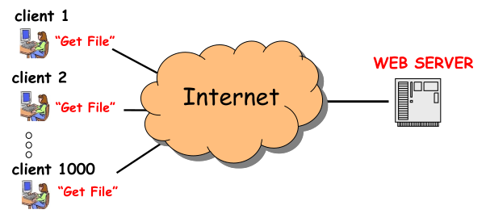

Traditionally, web servers handle **thousands of simultaneous client requests** for files. 
* To do this fairly, they use a **Processor Sharing (PS)**-like policy, giving each connection a small slice of the available resources.

The key challenge in applying a size-based policy like SRPT is to correctly answer two questions:

1.  **What is the actual resource** being scheduled?
2.  **What is the "job size"** that the scheduler can use to make decisions?

### The SRPT Approach: Redefining the Bottleneck and Job Size

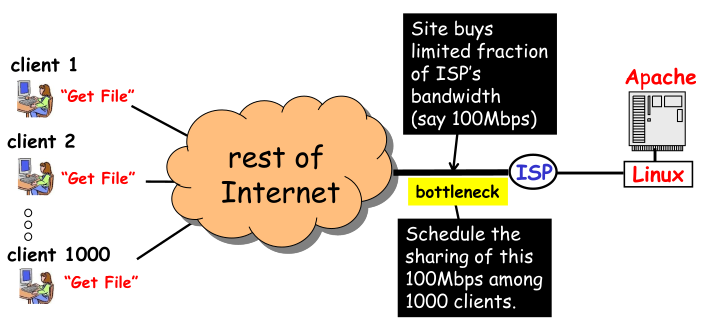

The researchers' key insight was to correctly identify the **true bottleneck** and the corresponding job size.

1.  **The Resource:** The primary bottleneck for a busy web server is not its CPU, but its **limited outbound Internet bandwidth** purchased from an Internet Service Provider (ISP). 
    * The **goal** is to schedule the sharing of this bandwidth link.
2.  **The Job:** A "job" is a client's request to transfer a file.
3.  **The Job Size:** The "size" of the job is simply the **size of the file being transferred**, which is information the server knows as soon as the request is made.

With these definitions, it becomes possible to implement a size-based policy like SRPT to manage the bandwidth.

### The Implementation: Modifying the Linux Kernel (Slide 200)

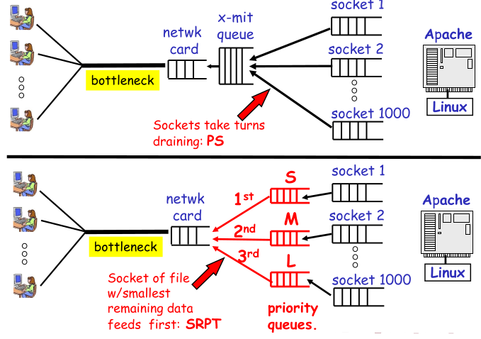

The core of the work was a **modification to the Linux kernel's network scheduler**. 

The slide contrasts the standard approach with the new SRPT approach.

  * **Upper Diagram (Standard PS):** In a *standard Linux system*, all TCP sockets corresponding to different client connections are **treated fairly**. 
    * They take turns placing their data packets into a single transmit queue for the network card. 
    * This is a practical implementation of **Processor Sharing (*PS*)**.

  * **Lower Diagram (SRPT Implementation):** The kernel was modified to replace the single queue with multiple **priority queues**. 
    * A connection's socket is placed into a queue based on the **remaining size of the file** it is transferring. 
    * Sockets for files with only a small amount of data left to send are put in the highest-priority queue. 
    * The scheduler **always** serves packets from the highest-priority non-empty queue. 
    * This is a direct and effective implementation of the **SRPT** policy.

### Performance Results

The following plot shows the dramatic performance improvement achieved.

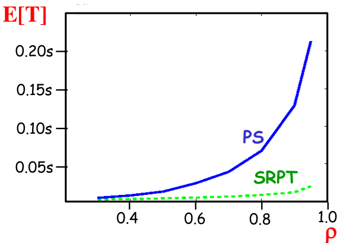

The graph plots the *mean response time* ($\large E[T]$) for file transfers against the *system load* ($\Large \rho$).

  * The **PS curve** shows the performance of the standard, unmodified web server.
  * The **SRPT curve** shows the performance of the modified server.

The result is unambiguous: the **SRPT implementation provides a significantly lower mean response time** across all load levels. 
* This case study is a powerful real-world validation that **applying the correct scheduling** theory can yield **massive performance gains**.