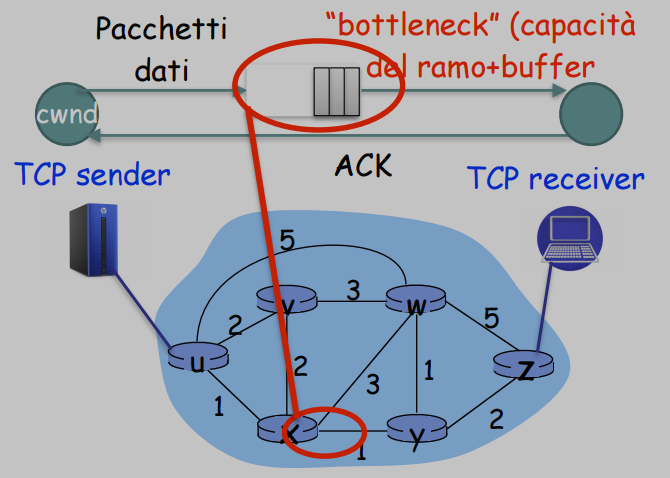
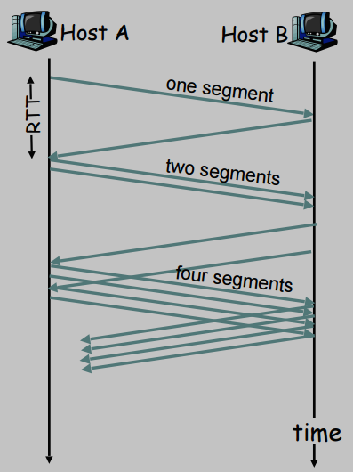
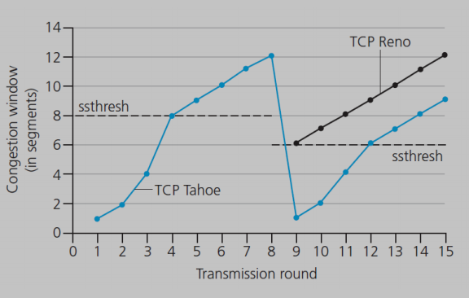
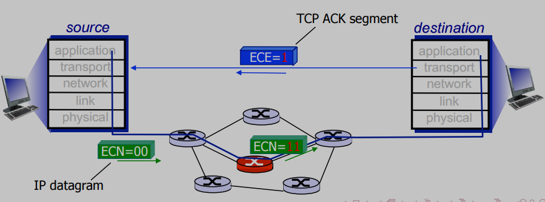
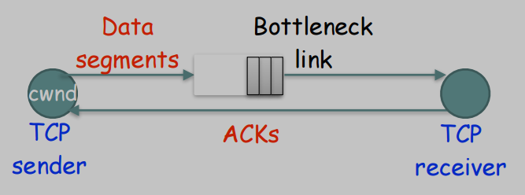

# DCN Congestion Control

## Data Center TCP (DCTCP)

### Introduction to TCP Congestion Control

**Congestion control** is a fundamental mechanism in networking designed to protect network resources (links and switch/router buffers) from overload. 
* It is a function performed by the **traffic sources** (the end-hosts) and is a core component of the **Transmission Control Protocol (TCP)**.
* This is distinct from **routing**, which is the process of selecting the best path through the network. Routing is performed by the network nodes (routers and switches) and is based on the **Internet Protocol (IP)**.

To analyze the behavior of TCP, we often use a simplified **"single bottleneck" model**. 
* This model considers a single TCP sender and receiver pair whose connection passes through a network path with one specific link that has the minimum capacity and acts as the bottleneck.

The sender's rate is controlled by its **congestion window ($\large cwnd$)**, which limits the amount of unacknowledged data that can be in flight at any time.



#### Core TCP Algorithm

The **standard TCP congestion control algorithm** operates in two primary phases to manage the size of the $\large cwnd$:

1.  **Slow Start:** This is an **initial, aggressive phase** where the sender rapidly increases its sending rate to probe for available bandwidth. 
    * For each Acknowledgement (ACK) received, the $\large cwnd$ **increases exponentially**. 
    * In practice, it doubles approximately every Round-Trip Time, or RTT.



2.  **Congestion Avoidance:** Once the $\large cwnd$ exceeds a certain threshold ($\large ssthresh$), the sender enters a more **conservative phase**. 
    * Here, the $\large cwnd$ **increases linearly** (adding approximately one segment per RTT). 
        * $\large cwdn \leftarrow cwdn + 1$
    * This phase is characterized by the classic " < sawtooth" pattern, where the window size grows slowly until a packet loss is detected, at which point the window size is drastically reduced.




* **Reaction to Congestion:** Standard TCP detects congestion indirectly, through **packet loss**. 
    * When a loss occurs, it performs a **multiplicative decrease**, typically halving its $\large cwnd$.
        * $\large cwdn \leftarrow (1 - \beta) cwdn, \quad 0 < \beta < 1$

The pseudocode for this **classic algorithm** is as follows:

```
cwnd = IW
ssthresh = 64
while (no packet loss detected):
    On ACK reception:
        if cwnd < ssthresh:
            // Slow Start phase
            cwnd = cwnd + 1
        else:
            // Congestion Avoidance phase
            cwnd = cwnd + 1/cwnd

// On packet loss detection
cwnd = cwnd * (1 - β)
ssthresh = max(2, flightsize/2)
GO TO while CYCLE
```

### Explicit Congestion Notification (ECN)

A **key limitation** of standard TCP is that it **relies on packet drops to detect congestion**. 
* This **introduces latency** and is **inefficient**. 

**Explicit Congestion Notification (ECN)** is an extension that allows a switch to signal impending congestion *before* it is forced to drop packets.

The ECN process works in four steps:

1.  The TCP **sender** indicates it is ECN-capable by setting a flag in the IP header of an outgoing packet.
2.  An intermediate switch that is experiencing congestion can, instead of dropping the packet, **mark** it by setting the **Congestion Experienced (CE)** codepoint in the IP header.
3.  The TCP **receiver** sees the CE mark and "echoes" this information back to the sender by setting the **ECN-Echo (ECE)** flag in the returning TCP ACK header.
4.  The original **sender** receives the ACK with the ECE flag and reacts as if it had experienced a packet loss (e.g., by reducing its $\large cwnd$), but without the need for a costly retransmission.

**DCTCP** (*Data Center TCP*) is built directly upon this ECN mechanism.



---

### The DCTCP Approach

**Data Center TCP (DCTCP)** is a **congestion control algorithm** designed specifically for the low-latency, high-bandwidth environment of a data center. 
* It modifies the standard TCP/ECN mechanism to **react more gracefully and precisely** to the onset of congestion.

The **core idea** is to move away from the binary "congestion or no congestion" signal of standard TCP. Instead, DCTCP creates a **multi-bit feedback signal** that reflects the ***extent*** of the congestion. 

This is achieved through **two main components**:

1.  **A Simple Marking Scheme at the Switch:** Switches mark packets with the ECN **Congestion Experienced (CE)** codepoint as soon as their buffer occupancy exceeds a small, fixed threshold ($\large K$). 
    * This provides an **early warning of congestion**.

2.  **A Modified Controller at the Sender:** The DCTCP sender estimates the fraction of packets being marked and reduces its congestion window by a factor that is **proportional to this fraction**.

This approach is **more robust** than delay-based congestion control algorithms. 
* In a high-speed data center network, inferring queue buildup from round-trip time measurements can be very noisy and unreliable; 
    * A queue of just 10 packets at 10 Gbps adds only 12 microseconds of delay, which is difficult to measure accurately. 
* DCTCP's explicit marking provides a much cleaner signal.

### DCTCP Components

The DCTCP algorithm is composed of **three distinct parts**:

#### 1. Simple Marking at the Switch
The logic at the switch is **extremely simple** and can be implemented in hardware. 
* For a given queue, an arriving packet is marked with the CE codepoint if, upon its arrival, the current queue occupancy is greater than the marking threshold $\large K$.
* `if (QueueLength > K) then Mark_Packet()`

#### 2. ECN-Echo at the Receiver
The receiver's role is also very simple. 
* It acts as a **transparent echo for the congestion signals**. 
* For every data packet it receives that has the CE codepoint marked, it sets the ECN-Echo (ECE) flag in the corresponding ACK packet that it sends back to the source.

#### 3. Controller at the Sender
The **intelligence of DCTCP resides in the sender**. 
* The sender maintains an estimate of the fraction of packets being marked, which we call $\large \alpha$. 
* This estimate is updated once per window of data (approximately one RTT) using an **Exponentially Weighted Moving Average (EWMA)**:

$$\Large \alpha \leftarrow (1-g)\alpha + gF$$

Where:
* $\large \alpha$ is the **running average estimate** of the congestion fraction.
* $\large F$ is the **fraction of packets** that were marked in the most recent window of data.
* $\large g$ is a **small, constant weighting factor** that determines how quickly the estimate adapts to new information (a typical value is $\large 1/16$).

### DCTCP Congestion Window (`cwnd`) Updating

The key innovation of DCTCP is **how the sender uses the calculated congestion fraction**, $\large \alpha$, to adjust its window.

* **Window Increase:** The rules for increasing the window remain the same as in standard TCP.
    * **Slow Start:** $\large cwnd \leftarrow cwnd + 1$ per ACK.
    * **Congestion Avoidance:** $\large cwnd \leftarrow cwnd + 1/cwnd$ per ACK.

* **Window Decrease:** This is where DCTCP differs. Upon detecting congestion (receiving ECE-marked ACKs) within a window of data, the sender reduces its congestion window **once** using the following formula:
    $$\Large cwnd \leftarrow cwnd \cdot \left(1 - \frac{\alpha}{2}\right)$$

This creates a smooth and proportional response:
* When **congestion is low** ($\large \alpha$ is near 0), the window is only **slightly reduced**.
* When **congestion is severe** ($\large \alpha$ is near 1), DCTCP behaves like standard TCP and cuts its window **roughly in half**.

### Mathematical Analysis of DCTCP (CONTINUE FROM HERE)

To understand DCTCP's behavior precisely, we can analyze its performance using a simplified mathematical model under a specific set of assumptions.

#### The System Model and Assumptions

For this analysis, we use the **single bottleneck model**, where $\large N$ competing flows share a single congested link.



The key variables are:

  * $\large C$: The capacity of the bottleneck link.
  * $\large T$: The base round-trip time ($\large RTT\_{base}$) of the path, excluding any queuing delay.
  * $\large W(t)$: The congestion window size of a single flow at time $\large t$.
  * $\large Q(t)$: The number of packets in the bottleneck switch's buffer at time $\large t$.

To make the analysis tractable, we make the following simplifying **assumptions**:

1.  We consider $\large N$ long-lived flows that always have data to send.
2.  All flows are in the **Congestion Avoidance** phase.
3.  All flows have the same base RTT, $\large T$.
4.  The **key assumption**: All $\large N$ flows are **synchronized**, meaning their "sawtooth" window dynamics are perfectly in-phase. This is most realistic for small $\large N$, a scenario common in data centers during events like an *incast*.

#### Derivation of Marking Fraction ($\large \alpha$) and Queue Dynamics

Under these assumptions, we can derive the steady-state behavior of DCTCP.

**Step 1: Relate Queue Size to Window Size**
Because all $\large N$ flows are synchronized, the total amount of data in flight at time $\large t$ is $\large N \cdot W(t)$. The "pipe" itself can hold $\large C \cdot T$ worth of data. Any data in flight beyond this amount must be stored in the switch's buffer. This gives us the fundamental relationship:
$$\Large Q(t) = N \cdot W(t) - C \cdot T$$

**Step 2: Define the Critical Window Size ($\large W^*$ )**
The switch starts marking packets when its queue length exceeds the threshold $\large K$. The window size of a single flow at the exact moment this happens is the critical window size, $\large W^*$. We find it by setting $\large Q(t) = K$:
$\Large K = N \cdot W^* - C \cdot T \implies W^* = \frac{C \cdot T + K}{N}$

**Step 3: Define the Number of Packets Sent ($\large S(a, b)$)**
Using a fluid model, the number of packets a single TCP flow sends while its congestion window increases from $\large a$ to $\large b$ in Congestion Avoidance is the integral of the window size over the time it takes for the increase. This simplifies to:
$\Large S(a, b) = \frac{b^2 - a^2}{2}$

**Step 4: Formulate the Equation for $\large \alpha$**
The marking fraction, $\large \alpha$, is the ratio of marked packets to total packets sent in one sawtooth cycle.

  * With synchronized flows, packets are only marked during the **final RTT** of the cycle, as the window grows from $\large W^*$ to $\large W^*+1$. The number of marked packets is $\large S(W^*, W^*+1)$.
  * The full cycle begins after the window is reduced to $\large (W^*+1)(1-\alpha/2)$ and grows back up to $\large W^*+1$. The total number of packets sent in this cycle is $\large S((W^*+1)(1-\alpha/2), W^*+1)$.

This gives the core relationship:
$$\Large \alpha = \frac{S(W^*, W^*+1)}{S\left((W^*+1)\left(1-\frac{\alpha}{2}\right), W^*+1\right)}$$

**Step 5: Solve for $\large \alpha$**
By substituting the formula for $\large S(a,b)$ into the equation above and simplifying, we arrive at:
$$\Large \alpha^2\left(1 - \frac{\alpha}{4}\right) = \frac{2W^* + 1}{(W^* + 1)^2} \approx \frac{2}{W^*}$$For cases where $\large W^*$ is large and $\large \alpha$ is consequently small, this can be further simplified to:$$\Large \alpha \approx \sqrt{\frac{2}{W^*}}$$

**Step 6: Derive Queue Dynamics ($\large Q\_{max}$ and $\large Q\_{min}$)**
Using these results, we can find the maximum and minimum queue sizes during a cycle.

  * **Maximum Queue Size ($\large Q\_{max}$):** The queue is largest at the peak of the sawtooth, when the window size is $\large W^*+1$.
    $\Large Q\_{max} = N(W^*+1) - C \cdot T = N\left(\frac{C \cdot T + K}{N} + 1\right) - C \cdot T = (C \cdot T + K + N) - C \cdot T$
    $$\Large Q_{max} = N+K$$
  * **Minimum Queue Size ($\large Q\_{min}$):** The queue is smallest at the bottom of the sawtooth, just after the window has been reduced. The size of the queue oscillation, or amplitude ($\large A$), is the difference between $\large Q\_{max}$ and $\large Q\_{min}$. The amplitude can be shown to be $\large A = \sqrt{\frac{N(CT+K)}{2}}$. Therefore:
    $$\Large Q_{min} = Q_{max} - A = (N+K) - \sqrt{\frac{N(CT+K)}{2}}$$For the system to function correctly, the queue should not drain completely, so we require $\large Q\_{min} \> 0$. By finding the value of $\large N$ that minimizes $\large Q\_{min}$ and ensuring it remains positive, we arrive at a rule of thumb for setting the marking threshold $\large K$:$$\Large K > \frac{CT}{7}$$