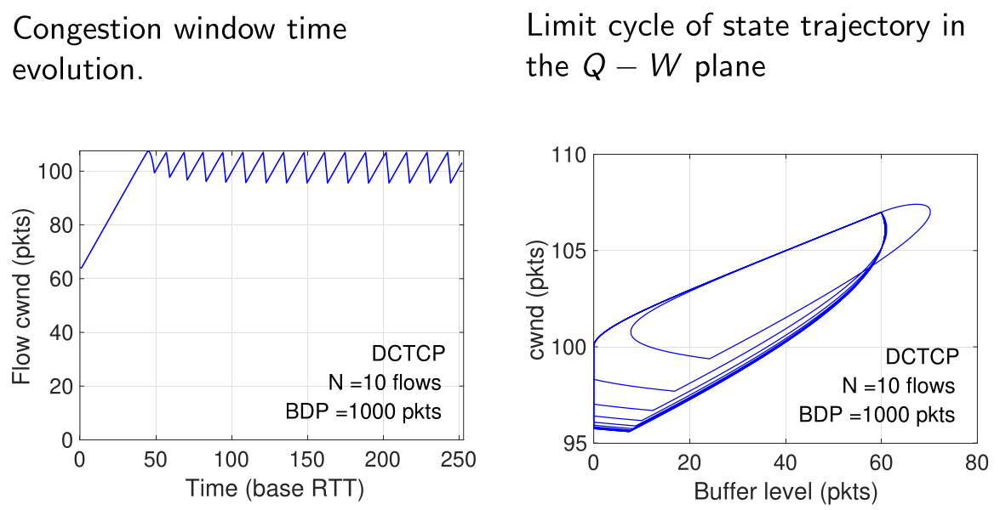

# DCN Congestion Control

## Data Center TCP (DCTCP)

### Introduction to TCP Congestion Control

**Congestion control** is a fundamental mechanism in networking designed to protect network resources (links and switch/router buffers) from overload. 
* It is a function performed by the **traffic sources** (the end-hosts) and is a core component of the **Transmission Control Protocol (TCP)**.
* This is distinct from **routing**, which is the process of selecting the best path through the network. Routing is performed by the network nodes (routers and switches) and is based on the **Internet Protocol (IP)**.

To analyze the behavior of TCP, we often use a simplified **"single bottleneck" model**. 
* This model considers a single TCP sender and receiver pair whose connection passes through a network path with one specific link that has the minimum capacity and acts as the bottleneck.

The sender's rate is controlled by its **congestion window ($\large cwnd$)**, which limits the amount of unacknowledged data that can be in flight at any time.


#### Core TCP Algorithm

The **standard TCP congestion control algorithm** operates in two primary phases to manage the size of the $\large cwnd$:

1.  **Slow Start:** This is an **initial, aggressive phase** where the sender rapidly increases its sending rate to probe for available bandwidth. 
    * For each Acknowledgement (ACK) received, the $\large cwnd$ **increases exponentially**. 
    * In practice, it doubles approximately every Round-Trip Time, or RTT.


2.  **Congestion Avoidance:** Once the $\large cwnd$ exceeds a certain threshold ($\large ssthresh$), the sender enters a more **conservative phase**. 
    * Here, the $\large cwnd$ **increases linearly** (adding approximately one segment per RTT). 
        * $\large cwdn \leftarrow cwdn + 1$
    * This phase is characterized by the classic " < sawtooth" pattern, where the window size grows slowly until a packet loss is detected, at which point the window size is drastically reduced.


* **Reaction to Congestion:** Standard TCP detects congestion indirectly, through **packet loss**. 
    * When a loss occurs, it performs a **multiplicative decrease**, typically halving its $\large cwnd$.
        * $\large cwdn \leftarrow (1 - \beta) cwdn, \quad 0 < \beta < 1$

The pseudocode for this **classic algorithm** is as follows:

```
cwnd = IW
ssthresh = 64
while (no packet loss detected):
    On ACK reception:
        if cwnd < ssthresh:
            // Slow Start phase
            cwnd = cwnd + 1
        else:
            // Congestion Avoidance phase
            cwnd = cwnd + 1/cwnd

// On packet loss detection
cwnd = cwnd * (1 - β)
ssthresh = max(2, flightsize/2)
GO TO while CYCLE
```

### Explicit Congestion Notification (ECN)

A **key limitation** of standard TCP is that it **relies on packet drops to detect congestion**. 
* This **introduces latency** and is **inefficient**. 

**Explicit Congestion Notification (ECN)** is an extension that allows a switch to signal impending congestion *before* it is forced to drop packets.

The ECN process works in four steps:

1.  The TCP **sender** indicates it is ECN-capable by setting a flag in the IP header of an outgoing packet.
2.  An intermediate switch that is experiencing congestion can, instead of dropping the packet, **mark** it by setting the **Congestion Experienced (CE)** codepoint in the IP header.
3.  The TCP **receiver** sees the CE mark and "echoes" this information back to the sender by setting the **ECN-Echo (ECE)** flag in the returning TCP ACK header.
4.  The original **sender** receives the ACK with the ECE flag and reacts as if it had experienced a packet loss (e.g., by reducing its $\large cwnd$), but without the need for a costly retransmission.

**DCTCP** (*Data Center TCP*) is built directly upon this ECN mechanism.


---

### The DCTCP Approach

**Data Center TCP (DCTCP)** is a **congestion control algorithm** designed specifically for the low-latency, high-bandwidth environment of a data center. 
* It modifies the standard TCP/ECN mechanism to **react more gracefully and precisely** to the onset of congestion.

The **core idea** is to move away from the binary "congestion or no congestion" signal of standard TCP. Instead, DCTCP creates a **multi-bit feedback signal** that reflects the ***extent*** of the congestion. 

This is achieved through **two main components**:

1.  **A Simple Marking Scheme at the Switch:** Switches mark packets with the ECN **Congestion Experienced (CE)** codepoint as soon as their buffer occupancy exceeds a small, fixed threshold ($\large K$). 
    * This provides an **early warning of congestion**.

2.  **A Modified Controller at the Sender:** The DCTCP sender estimates the fraction of packets being marked and reduces its congestion window by a factor that is **proportional to this fraction**.

This approach is **more robust** than delay-based congestion control algorithms. 
* In a high-speed data center network, inferring queue buildup from round-trip time measurements can be very noisy and unreliable; 
    * A queue of just 10 packets at 10 Gbps adds only 12 microseconds of delay, which is difficult to measure accurately. 
* DCTCP's explicit marking provides a much cleaner signal.

### DCTCP Components

The DCTCP algorithm is composed of **three distinct parts**:

#### 1. Simple Marking at the Switch
The logic at the switch is **extremely simple** and can be implemented in hardware. 
* For a given queue, an arriving packet is marked with the CE codepoint if, upon its arrival, the current queue occupancy is greater than the marking threshold $\large K$.
* `if (QueueLength > K) then Mark_Packet()`

#### 2. ECN-Echo at the Receiver
The receiver's role is also very simple. 
* It acts as a **transparent echo for the congestion signals**. 
* For every data packet it receives that has the CE codepoint marked, it sets the ECN-Echo (ECE) flag in the corresponding ACK packet that it sends back to the source.

#### 3. Controller at the Sender
The **intelligence of DCTCP resides in the sender**. 
* The sender maintains an **estimate of the fraction of packets being marked**, which we call $\large \alpha$. 
* This estimate is **updated once per window of data** (approximately one RTT) using an **Exponentially Weighted Moving Average (EWMA)**:

$$\Large \alpha \leftarrow (1-g)\alpha + gF$$

Where:
* $\large \alpha$ is the **running average estimate** of the congestion fraction.
* $\large F$ is the **fraction of packets** that were marked in the most recent window of data.
* $\large g$ is a **small, constant weighting factor** that determines how quickly the estimate adapts to new information (a typical value is $\large 1/16$).

### DCTCP Congestion Window (`cwnd`) Updating

The key innovation of DCTCP is **how the sender uses the calculated congestion fraction**, $\large \alpha$, to adjust its window.

* **Window Increase:** The rules for increasing the window remain the **same as in standard TCP**.
    * **Slow Start:** $\large cwnd \leftarrow cwnd + 1$ per ACK.
    * **Congestion Avoidance:** $\large cwnd \leftarrow cwnd + \frac{1}{cwdn}$ per ACK.

* **Window Decrease:** This is **where DCTCP differs**. Upon detecting congestion (receiving ECE-marked ACKs) within a window of data, the sender reduces its congestion window **once** using the following formula:
    $$\Large cwnd \leftarrow cwnd \cdot \left(1 - \frac{\alpha}{2}\right)$$

This creates a smooth and proportional response:
* When **congestion is low** ($\large \alpha$ *is near 0*), the window is only **slightly reduced**.
* When **congestion is severe** ($\large \alpha$ *is near 1*), DCTCP behaves like standard TCP and cuts its window **roughly in half**.

### Mathematical Analysis of DCTCP

To understand DCTCP's behavior precisely, we can analyze its performance using a simplified mathematical model under a specific set of assumptions.

#### The System Model and Assumptions

For this analysis, we use the **single bottleneck model**, where $\large N$ competing flows share a single congested link.


The key variables are:

  * $\large C$: The **capacity** of the bottleneck link.
  * $\large T$: The **base round-trip time** ($\large RTT_{base}$) of the path, excluding any queuing delay.
  * $\large W(t)$: The **congestion window size** of a single flow at time $\large t$.
  * $\large Q(t)$: The **number of packets** in the bottleneck switch's buffer at time $\large t$.

To make the analysis tractable, we make the following simplifying **assumptions**:

1.  We consider $\large N$ long-lived flows that always have data to send.
2.  All flows are in the **Congestion Avoidance** phase.
3.  All flows have the same base RTT, $\large T$.
4.  The **key assumption**: All $\large N$ flows are **synchronized**, meaning their "sawtooth" window dynamics are perfectly in-phase. 
    * This is most realistic for small $\large N$, a scenario common in data centers during events like an *incast*.

#### Derivation of Marking Fraction ($\large \alpha$) and Queue Dynamics

Under these assumptions, we can derive the steady-state behavior of DCTCP.

**Step 1: Relate Queue Size to Window Size**

* Because all $\large N$ flows are synchronized, the total amount of data in flight at time $\large t$ is $\large N \cdot W(t)$. 
* The "pipe" itself can hold $\large C \cdot T$ worth of data. 
* Any data in flight beyond this amount must be stored in the switch's buffer. 

This gives us the fundamental relationship:
$$\Large Q(t) = N \cdot W(t) - C \cdot T$$

---

**Step 2: Define the Critical Window Size ($\large W^*$ )**

* The switch starts marking packets when its queue length exceeds the threshold $\large K$. 
* The window size of a single flow at the exact moment this happens is the critical window size, $\large W^*$. 
* We find it by setting $\large Q(t) = K$:
$$\Large K = N \cdot W^* - C \cdot T \implies W^* = \frac{C \cdot T + K}{N}$$

---

**Step 3: Define the Number of Packets Sent ($\large S(a, b)$)**

* Using a fluid model, the number of packets a single TCP flow sends while its congestion window increases from $\large a$ to $\large b$ in Congestion Avoidance is the integral of the window size over the time it takes for the increase. 
* This simplifies to:

$$\Large S(a, b) = \frac{b^2 - a^2}{2}$$

---

**Step 4: Formulate the Equation for $\large \alpha$**

The marking fraction, $\large \alpha$, is the ratio of marked packets to total packets sent in one sawtooth cycle.

  * With synchronized flows, packets are only marked during the **final RTT** of the cycle, as the window grows from $\large W^*$ to $\large W^*+1$. 
    * The number of marked packets is $\large S(W^*, W^*+1)$.
  * The full cycle begins after the window is reduced to $\large (W^*+1)(1-\alpha/2)$ and grows back up to $\large W^*+1$. 
    * The total number of packets sent in this cycle is $\large S((W^*+1)(1-\alpha/2), W^*+1)$.

This gives the core relationship:
$$\Large \alpha = \frac{S(W^*, W^*+1)}{S\left((W^*+1)\left(1-\frac{\alpha}{2}\right), W^*+1\right)}$$

---

**Step 5: Solve for $\large \alpha$**

By substituting the formula for $\large S(a,b)$ into the equation above and simplifying, we arrive at:
$$\Large \alpha^2\left(1 - \frac{\alpha}{4}\right) = \frac{2W^* + 1}{(W^* + 1)^2} \approx \frac{2}{W^*}$$For cases where $\large W^*$ is large and $\large \alpha$ is consequently small, this can be further simplified to:$$\Large \alpha \approx \sqrt{\frac{2}{W^*}}$$

---

**Step 6: Derive Queue Dynamics ($\large Q_{max}$ and $\large Q_{min}$)**

Using these results, we can find the **maximum and minimum queue sizes** during a cycle.

  * **Maximum Queue Size ($\large Q_{max}$):** The queue is **largest at the peak of the sawtooth**, when the window size is $\large W^*+1$.
    $$\large Q_{max} = N(W^*+1) - C \cdot T = N\left(\frac{C \cdot T + K}{N} + 1\right) - C \cdot T = (C \cdot T + K + N) - C \cdot T$$

    $$\Large Q_{max} = N+K$$
  * **Minimum Queue Size ($\large Q_{min}$):** The queue is **smallest at the bottom of the sawtooth**, just after the window has been reduced. 
  
    * The size of the queue oscillation, or amplitude ($\large A$), is the difference between $\large Q_{max}$ and $\large Q_{min}$. 
    * The amplitude can be shown to be $\large A = \sqrt{\frac{N(CT+K)}{2}}$. 
    * Therefore:
    $$\Large Q_{min} = Q_{max} - A = (N+K) - \sqrt{\frac{N(CT+K)}{2}}$$
    
    For the system to function correctly, the queue **should not drain completely**, so we **require** $\large Q_{min} > 0$. 
    * By finding the value of $\large N$ that minimizes $\large Q_{min}$ and ensuring it remains positive, we arrive at a rule of thumb for setting the marking threshold $\large K$:$$\Large K > \frac{CT}{7}$$

---

### DCTCP Performance and Fluid Model

This section examines the practical performance of DCTCP through experimental results and a more advanced mathematical "***fluid model***" that describes its dynamic behavior.

#### DCTCP Performance Evaluation

Experiments comparing DCTCP to standard TCP and TCP with Random Early Detection (RED) on commodity data center switches highlight DCTCP's advantages.

  * **Throughput and Queue Length**

    The graphs below compare the queue length and throughput of DCTCP and standard TCP.

    

      * **Queue Length (Left Graph):** The Cumulative Distribution Function (CDF) of the queue length at the bottleneck switch shows that **DCTCP maintains a very low and stable queue** (hovering around the marking threshold, $\large K=20$ packets in this experiment). 
        * In contrast, standard TCP builds up a much larger and more volatile queue (10x larger).
      * **Throughput (Right Graph):** This graph shows that as long as the marking threshold $\large K$ is set reasonably (e.g., above 65 packets for a 10Gbps link), **DCTCP achieves the same maximum throughput** as standard TCP.

    **Conclusion:** DCTCP successfully provides full link utilization while keeping switch buffer occupancy extremely low, which is a significant improvement over standard TCP.

  * **Handling Incast Traffic**

    The ***incast* problem** is a common data center scenario where many servers send data to a single receiver at the same time, overwhelming the switch buffer and causing mass timeouts. DCTCP is highly effective at mitigating this.

    

    * **All-to-All Traffic (Left Graph):** 
        * **DCTCP**: In a benchmark simulating an all-to-all communication pattern, DCTCP performs exceptionally well, with no queries suffering from timeouts. 
        * **Standard TCP**: performs poorly, with over 55% of queries experiencing at least one timeout.
    * **Short Flow Latency (Right Graph):** 
        * In a mixed traffic scenario with large background flows, latency-sensitive short transfers complete much faster under DCTCP. 
        * The median completion time for a 20KB transfer is less than 1 ms with DCTCP, compared to 19 ms with standard TCP. 
        * This is a direct result of DCTCP **preventing queue buildup**.

#### Fluid Model for Dynamic Behavior

While the previous analysis looked at steady-state behavior, a **fluid model** using differential equations can describe the **dynamic, time-varying behavior** of the system.

$$\large \frac{dW}{dt} = \frac{1}{R(t)} - \frac{W(t)\alpha(t)}{2R(t)} p(t-T^*)$$

$$\large \frac{d\alpha}{dt} = \frac{g}{R(t)}[p(t-T^*) - \alpha(t)]$$

$$\Large \frac{dQ}{dt} = \begin{cases} \max\left\{0, \frac{NW(t)}{R(t)} - C\right\} & Q(t)=0, \[2ex] \frac{NW(t)}{R(t)} - C & 0 < Q(t) < B, \[2ex] \min\left\{0, \frac{NW(t)}{R(t)} - C\right\} & Q(t)=B. \end{cases}$$

Where:

  * $\large R(t) = T + Q(t)/C$ is the **instantaneous RTT**.
  * $\large p(t) = I(Q(t) \> K)$ is the **instantaneous marking probability** 
    * **1** if the queue is over the threshold.
    * **0** otherwise.

These equations model the evolution of the congestion window ($\large W$), the estimated marking fraction ($\large \alpha$), and the queue length ($\large Q$) over time.

  * **Dynamic Behavior Visualized**

    The results of this fluid model can be visualized to understand the system's dynamics.

    

      * **Left Graph:** This shows the congestion window of a flow over time, displaying the classic "sawtooth" pattern as the window increases linearly and then decreases upon detecting congestion.
      * **Right Graph (Phase Plot):** This plots the system's state in the ($\large Q, W$) plane. 
        * The trajectory forms a tight, stable loop known as a **limit cycle**. 
        * The small, contained shape of this loop is a visual representation of DCTCP's key benefit: it keeps both the queue occupancy and the congestion window within very tight, predictable bounds, avoiding the large and volatile oscillations of standard TCP.

## Quantized Congestion Notification (QCN) for Ethernet

While DCTCP is an enhancement to the standard TCP/IP stack, **Quantized Congestion Notification (QCN)** is a congestion control mechanism designed to operate at a lower level: directly within **Layer 2 Switched Ethernet**. 
* This approach is motivated by the unique characteristics of data center networks, which differ significantly from the broader Internet.

### Congestion Control in Ethernet vs. the Internet

A congestion control mechanism designed for a switched Ethernet data center cannot simply reuse the same principles as Internet TCP because the **underlying assumptions are different**:
* **No Per-Packet ACKs:** There is no built-in, per-packet acknowledgment mechanism at Layer 2.
* **Unknown Path Delays:** The concept of a Round-Trip Time (RTT) is not available, as there are no end-to-end acknowledgments.
* **Direct Signaling:** Congestion must be signaled directly from the congested switch back to the source MAC address.
* **No Packet Drops:** The goal is to create a lossless fabric, so dropping packets is not the primary congestion signal.
* **No Sequence Numbers:** Ethernet frames are not sequenced at Layer 2.
* **Line Rate Start:** Sources do not "slow start"; they begin sending at the full line rate of their link.
* **Shallow Buffers:** Data center switches typically have very small buffers (hundreds of kilobytes) compared to Internet routers.
* **Multipathing:** Rich multipathing is common, meaning traffic can take many different routes.

### Congestion Notification (CN) in Ethernet

**Congestion Notification (CN)** is the general framework (standardized in IEEE 802.1Q) that allows a switch to notify a source of congestion, prompting the source to reduce its transmission rate.

* **Targeted Use Case:** It is designed for low-latency networks like data centers and is most effective for long-lived data flows.
* **Goals:** The primary objectives are to **avoid frame loss** and **reduce latency** by managing queue buildup proactively.
* **Operation:** It operates on a per-VLAN priority basis, which allows a network administrator to have some traffic (e.g., storage traffic) managed by congestion control while other traffic (e.g., management traffic) is not.

### Relationship with Priority Flow Control (PFC)

QCN is designed to work with or replace a simpler mechanism called **Priority Flow Control (PFC)** (IEEE 802.1Qbb).

* **PFC Mechanism:** PFC is a **hop-by-hop flow control mechanism**. 
    * When a switch's buffer for a certain traffic class fills up, it sends a `PAUSE` frame to the upstream switch, telling it to stop sending traffic for a short time. 
    * This is very effective at **preventing packet drops**.
* **The Problem with PFC: Congestion Spreading:** The major drawback of PFC is that it can cause **congestion spreading**. 
    * When a bottleneck link is paused, the buffer at the *upstream* switch starts to fill up. 
    * This can cause that upstream switch to pause the link further upstream, creating a domino effect. 
    * This is highly undesirable because it can block traffic that was not even destined for the original bottleneck.
* **QCN's Advantage:** A true congestion control scheme like QCN avoids this problem. 
    * It allows the congested switch to **directly signal the original sources** that are causing the congestion, telling them to slow down, without affecting other unrelated traffic flows.

### QCN Design Objectives

The design of QCN is guided by the need for a simple, effective mechanism that can be implemented in hardware. Its key objectives are:
* **Protocol Independence:** It operates at Layer 2 and is independent of any upper-layer protocol like TCP/IP.
* **Coexistence:** It is designed to coexist with TCP running on the end-hosts.
* **Simplicity:** The algorithm is simple enough to be implemented in switch hardware. It requires **no per-flow state** or complex calculations in the switches.
* **Performance:** The goal is to be stable, responsive to changes in congestion, and fair to competing flows.

### The QCN Algorithm

**Quantized Congestion Notification (QCN)** is a reactive congestion control mechanism designed for Layer 2 Ethernet networks. When a switch detects that one of its queues is becoming congested, it generates and sends a special feedback frame directly to the source of the traffic, instructing it to reduce its sending rate.

#### QCN Components: Congestion Point and Reaction Point

The QCN algorithm is composed of two main functional blocks:

1.  **Congestion Point (CP):** This logic resides within the Ethernet switch.

      * **Function:** It monitors the length of its output queues. 
        * The goal is to keep the queue length stable around a desired operating point, the equilibrium queue threshold ($\large Q_{eq}$).
      * **Action:** When congestion is detected, the CP samples an outgoing data frame, generates a **Congestion Notification Message (CNM)** containing feedback about the severity of the congestion, and sends this CNM back to the original source of the data frame.

2.  **Reaction Point (RP):** This logic resides in the network adapter (NIC) of the source end-station.

      * **Function:** It operates a **Rate Limiter (RL)** that controls the transmission rate for a flow.
      * **Action:** When the RP receives a CNM from a switch, it **decreases** its sending rate. 
        * In the absence of feedback, it has a separate mechanism to slowly **increase** its rate to probe for available bandwidth.

### The Congestion Notification Message (CNM)

The CNM is a special Layer 2 frame that carries the feedback from the switch (CP) back to the source (RP). Its key fields include:

  * **Quantized Feedback ($\large F_b$):** A 6-bit value that encodes the severity of the congestion.
  * **Encapsulated Data:** To allow the source to identify which of its traffic flows triggered the feedback, the CNM includes the destination MAC address, priority, and the first 64 bytes of the original data frame that was sampled by the switch.

### The CN-TAG

For QCN to work, source hosts must add a **Congestion Notification Tag (CN-TAG)** to the frames they transmit. 
* This tag contains a 2-byte **Flow Identifier (Flow ID)**. 
* This ID has meaning only to the source station; 
    * It uses the ID to map an incoming CNM back to the specific internal Rate Limiter that should react to the feedback.

### Congestion Point (CP) Algorithm

The algorithm at the switch is responsible for calculating the congestion feedback value, $\large F_b$.


The goal of the CP is to drive the queue length, $\large Q$, towards the target equilibrium point, $\large Q_{eq}$. 
* It does this by calculating a feedback value based on **two factors**: the **current queue length offset** and the **rate of change of the queue length**.

The feedback value $\large F_b$ is calculated as:
$$\Large F_b = -(Q - Q_{eq}) - w(Q - Q_{old})$$
Where:

  * $\large -(Q - Q_{eq})$ is the **proportional feedback**, representing the current distance from the target queue size.
  * $\large -(Q - Q_{old})$ is the **derivative feedback**, representing the current rate of queue growth.
  * $\large w$ is a **weighting factor**, typically set to 2 by default.

A feedback message (CNM) is generated for a sampled frame **only if $\large F_b$ is negative**, which occurs when the queue is above its target size or is growing too quickly. 
* The rate at which the switch samples packets and sends this feedback is proportional to the magnitude of $\large F_b$
* More severe congestion leads to more frequent feedback messages.


### Reaction Point (RP) Algorithm

The ***Reaction Point (RP)*** is the component at the source host (typically in the NIC) that adjusts its sending rate based on feedback from the network.

A **key challenge** for the RP is that the QCN protocol provides **only negative feedback** (i.e., "slow down"). 
* There is no positive "all clear" signal. 
* Therefore, the RP must have its own internal mechanism to **increase its sending rate** to probe for newly available bandwidth and recover after a congestion event.

To manage this, the Rate Limiter (RL) at the RP maintains several state variables:

  * **Current Rate (CR):** The actual, **instantaneous transmission rate** of the flow.
  * **Target Rate (TR):** The **rate** the source is trying to recover back towards. 
    * After a congestion event, this is set to the new, reduced rate.
  * **Byte Counter (BC):** A **timer** that triggers a rate increase cycle after a certain number of bytes have been transmitted (e.g., 150 kB).
  * **Timer (TI):** A **clock** that triggers a rate increase cycle after a certain amount of time has passed (e.g., 10 ms). 
    * This ensures that even low-rate flows can increase their rate.

The RP algorithm consists of **three main phases**: Rate Decrease, Fast Recovery, and Active Increase.

#### Rate Decrease and Fast Recovery

  * **Rate Decrease:** When the RP receives a CNM with a feedback value $\large F_b$, it immediately performs a **multiplicative decrease** on its Current Rate. The Target Rate is also updated to this new, lower rate.
    $$\Large TR \leftarrow CR$$   
    $$\Large CR \leftarrow CR(1 - G_d |F_b|)$$
    Where $\large G_d$ is a **gain factor**. 
    
    The magnitude of the rate reduction is **proportional to the severity of the congestion** signaled by the switch.

  * **Fast Recovery (FR):** Immediately following a rate decrease, the RP enters a **Fast Recovery** phase to rapidly get back some of the lost bandwidth. 
    * This phase consists of **5 cycles**. 
    * In each cycle, the rate is additively increased halfway towards the Target Rate:
    $$\Large CR \leftarrow \frac{1}{2}(CR + TR)$$
    A recovery cycle is triggered by whichever comes first: the Byte Counter expiring or the Timer expiring.

The diagram below illustrates this process. 
* A congestion message causes a sharp drop in rate, followed by 5 discrete, rapid steps upward during the Fast Recovery phase.


#### Active and Hyper-Active Increase

After the 5 Fast Recovery cycles are complete, the source transitions to a slower, more probing rate-increase phase to cautiously look for additional bandwidth.

* **Active Increase (AI):** In this phase, the **Target Rate (TR)** itself is additively increased by a small, fixed amount ($\large R_{AI}$, e.g., 5 Mbit/s) in each cycle. 
    * The Current Rate (CR) continues to adjust itself halfway towards this slowly increasing target. 
    * The update rules are:
    $$\Large TR \leftarrow TR + R_{AI}$$   
    $$\Large CR \leftarrow \frac{1}{2}(CR + TR)$$

* **Hyper-Active Increase (HAI):** If a source operates for a long time in the Active Increase phase without receiving any congestion feedback, it assumes the network is very lightly loaded. 
    * It then enters a more aggressive **Hyper-Active Increase** phase, where the Target Rate is increased by a much larger amount ($\large R_{HAI}$, e.g., 50 Mbit/s) per cycle. 
    * The update rules are:
    $$\Large TR \leftarrow TR + R_{HAI}$$   
    $$\Large CR \leftarrow \frac{1}{2}(CR + TR)$$

The final diagram summarizes the entire state machine. 
* A congestion event triggers **Fast Recovery**. 
* After 5 cycles, the system enters the more conservative **Active Increase**. 
* If it remains in Active Increase for a long time without issue, it transitions to the aggressive **Hyper-Active Increase** to quickly reclaim bandwidth.

