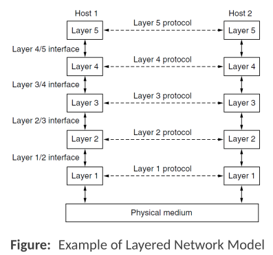
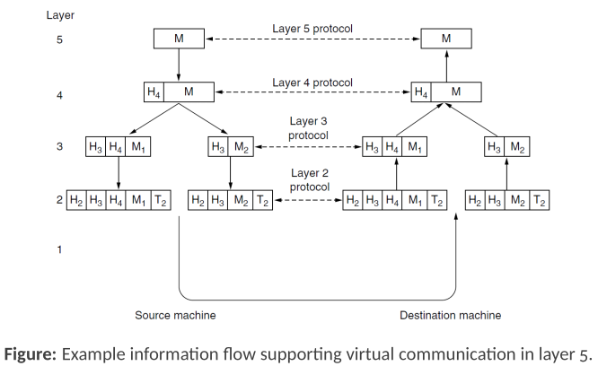
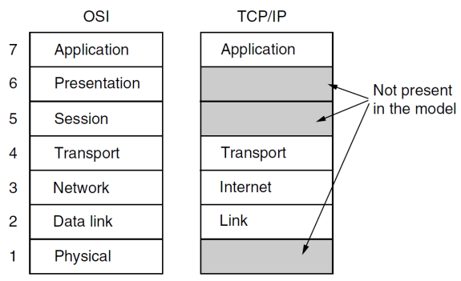

<!-- KaTeX auto-render header -->
<link rel="stylesheet" href="https://cdn.jsdelivr.net/npm/katex@0.16.0/dist/katex.min.css">

# Chapter 1: Introduction

## Some definitions

* **Computer Network**: A collection of autonomous computers interconnected by a technology.
* **Distributed System**: A software system built on top of a network, presenting a single coherent system to users.

* **Transmission types**:
    * When transmission occurs between a single sender and a single receiver in the network, it is known as **unicasting**.
    * When transmission occurs between a single sender and many receiver in the network, it is known as **multicast**.
    * When transmission occurs between a single sender and every receiver in the network, it is known as **broadcast**.

## Network Types and Classifications

### Point-to-Point Links
Point-to-point links create a **direct connection** between an individual **pair of machines**. 

In such networks, messages, which are referred to as **packets**, may need to travel through several intermediate machines to get from the source to the final destination.

* It's possible for multiple routes of varying lengths to exist between the source and destination.
* A crucial aspect of point-to-point networks is finding the most **optimal routes** for data transmission.

### Broadcast Networks
In broadcast networks, a **single communication channel** is **shared by all connected machines**. 

When a packet is sent, it is **received by every machine** on the network. However, each machine only processes the packets addressed to it.

* **Wireless networks** are a primary example of broadcast links.

### Classification of Networks
Networks can be classified based on their **scale** or the **physical distance** they cover. This is a crucial metric because different technologies are employed for networks of different sizes.

| Interprocessor Distance | Location | Example |
| :--- | :--- | :--- |
| 1 m | Same square meter | Personal Area Network (PAN) |
| 10 m - 1 km | Same room, building, or campus | Local Area Network (LAN) |
| 10 km | Same city | Metropolitan Area Network (MAN) |
| 100 km - 10,000 km | Same country, continent, or planet | Wide Area Network (WAN), The Internet |

#### Personal Area Networks (PANs)
* **Scale**: PANs facilitate communication over a **short range**. 

A common application is a wireless network that connects a computer to its peripherals, such as a mouse, keyboard, or printer.

* **Bluetooth** is a popular PAN technology that eliminates the need for cables and simplifies device connection through a master-slave model.
* Other PAN technologies include those used for embedded medical devices and **RFID** in smartcards.

#### Local Area Networks (LANs)
* **Scale**: A LAN is a **privately owned network** that operates within a **single building** or a **small area** like a home, office, or factory. 

LANs are commonly used to connect personal computers and other electronic devices through **wired (Ethernet)** or **wireless (Wi-Fi)** connections.

#### Metropolitan Area Networks (MANs)
* **Scale**: A MAN is designed to cover an entire **city**. 

The most well-known examples of MANs are cable television networks, which are often used in areas with poor over-the-air reception.

#### Wide Area Networks (WANs)
* **Scale**: A WAN spans a large geographical area, such as a country or a continent. 

It consists of:
* **Hosts**: The computers that are connected to the network.
* **Subnet**: The collection of routers and communication lines that carry messages from host to host.
* **Routers**: Devices that forward data packets toward their destination.

#### Internet
Internet is a **collection of interconnected networks**, it allows communication on different, and often incompatible, networks.

***

## Network Architecture and Models

### Layers and Protocols

To reduce design complexity, networks are organized as a **stack of layers**, where each layer offers **services to the one above it** while hiding its own implementation details. 

The **interaction** between these adjacent layers is defined by an ***interface***, which specifies the operations the lower layer makes available. 

For **communication** to occur between different machines, corresponding layers use a common set of rules known as ***protocols***. 

This entire framework, comprising the set of layers and their associated protocols, is known as a ***network architecture***, and the specific list of protocols implemented on a particular system is called its ***protocol stack***.

### Example of Information Flow

When a message is sent, it travels down the layers of the source machine and up the layers of the destination machine.

1.  **Down the source**: At the source, each layer accepts the message from the layer above and adds its own control information. 
    * This control information is called a **header**, layer 2 also adds a **trailer**.
    * This process is called **encapsulation**.
2.  **Transmission**: The message is then transmitted over the physical medium.
3.  **Up the destination**: At the destination, the message moves up the protocol stack. Each layer remove its corresponding header before passing the message to the layer above.

This layered approach, known as the **peer process abstraction**, simplifies network design by breaking the problem into **smaller, manageable parts**.

### Design Issues for Layers
Several key design issues must be addressed in layered networks:
* **Reliability**: Ensuring the network operates correctly despite having unreliable components.
    * Often through ***error detection*** and ***correction*** techniques.
* **Routing**: Determining the **best path for data** to travel from source to destination.
* **Addressing/Naming**: A mechanism to **identify senders and receivers**.
* **Resource Allocation**: Managing network resources to prevent interference between users. 
    * **flow control**: preventing a fast sender from overwhelming a slow receiver.
    * **congestion control**: managing network overload.

## The OSI Reference Model
The **OSI (Open Systems Interconnection) Model** is a conceptual framework that standardizes the functions of a telecommunication or computing system in seven distinct layers.

1.  **Physical Layer**: **Transmits** raw bits over a communication channel.
2.  **Data Link Layer**: Takes the raw bitstream from the Physical Layer and transforms it into a **free of *undetected* errors** communication line for the Network Layer above it.
    * Key functions:
        * **Framing**: **Grouping bits into frames** with defined start and end points.
        * **Error Control**: Adds **checksums** to detect (and sometimes correct) frames damaged during transmission.
        * **Flow Control**: Prevents a fast sender from overwhelming a slow receiver on the same link.
        * **Medium Access Control (MAC)**: Determines which device gets to use the shared medium at any given time (e.g., who gets to "talk" on the Wi-Fi channel).
3.  **Network Layer**: Responsible for the end-to-end delivery of packets across multiple networks or "hops." 
    * **Key Functions**:
        * **Logical Addressing**: Assigns **unique addresses** (like IP addresses) to hosts on the network.
        * **Routing**: Determines the **best path** to forward packets from source to destination through a series of routers.
4.  **Transport Layer**: Ensures that data pieces arrive **correctly** (in the right order, without error or duplication) at the destination. 

    While the Network Layer gets packets to the correct computer, the Transport Layer ensures the data gets to the **correct application** on that computer.
    * **Key Functions**:
        * **Segmentation and Reassembly**: Breaks large messages into smaller segments for transmission and reassembles them at the destination.
        * **Service-Point Addressing (Ports)**: Manages port numbers to deliver data to the correct application.
        * **Connection Control**: Can provide connection-oriented (like TCP) or connectionless (like UDP) services.
        * **Reliability**: Can ensure data arrives in order, without errors, and with no loss or duplication.

5.  **Session Layer**: Allows users on different machines to establish sessions between them.
6.  **Presentation Layer**: Concerned with the syntax and semantics of the information being transmitted.
7.  **Application Layer**: This layer ensures that data sent by one system is readable by the destination system and to the end user.

## The TCP/IP Reference Model
The TCP/IP model is another layered framework that is more practical and widely implemented than the OSI model. Its strength lies in its protocols. It consists of four layers:

1.  **Link Layer**: Describes what happens on the physical link (e.g., Ethernet, 802.11).
2.  **Internet Layer**: This layer's job is to permit hosts to inject packets into any network and have them travel independently to the destination. It uses the **Internet Protocol (IP)**.
3.  **Transport Layer**: Provides end-to-end communication, using protocols like **TCP (Transmission Control Protocol)** and **UDP (User Datagram Protocol)**.
4.  **Application Layer**: Contains all the higher-level protocols (e.g., HTTP, SMTP).

The Session and Presentation layers from the OSI model are not present in the TCP/IP model.

## Our Reference Model
For the purpose of this course, a hybrid 5-layer model is used, which combines aspects of the OSI and TCP/IP models:

1.  **Physical Layer**: Transmits bits as signals over a medium.
2.  **Link Layer**: Handles messaging between directly connected computers (e.g., Ethernet).
3.  **Network Layer**: Manages packet delivery between distant computers across multiple links (IP).
4.  **Transport Layer**: Provides delivery abstractions for applications (e.g., TCP, UDP).
5.  **Application Layer**: Includes the network programs themselves.