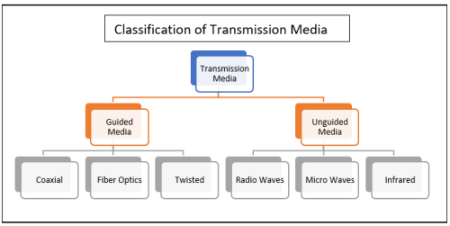
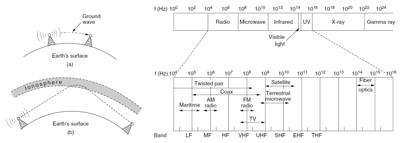
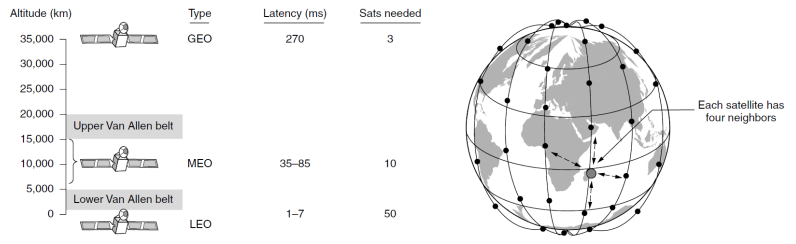
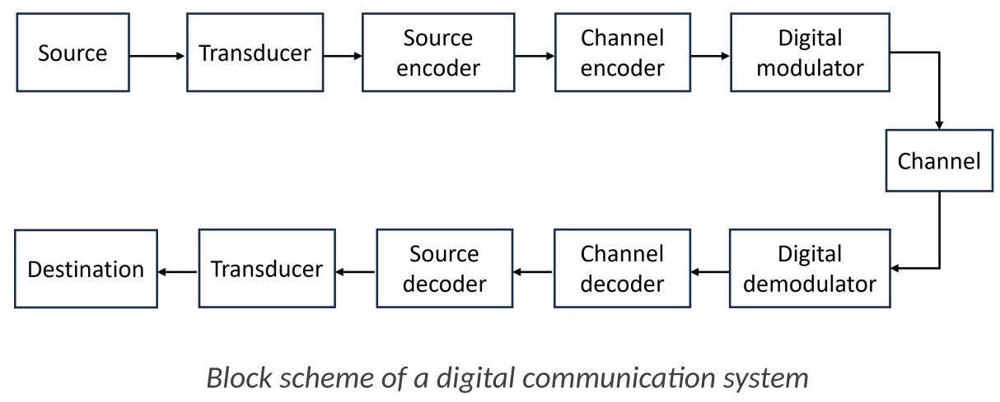

# Chapter 2: The Physical Layer

This chapter explores the **Physical Layer**, the first and most fundamental layer of the network stack. 

Its primary purpose is to **transport raw bits of data** from one machine to another. 

We will begin by examining the **various physical transmission media** that make this possible, from guided cables to unguided wireless signals. 

The chapter will then detail the essential **components** and **processes** of a **digital communication system**, covering how information is encoded, modulated for transmission, and then demodulated at the destination. 

Finally, we will discuss **multiplexing techniques**, which allow multiple signals to efficiently share a single communication channel.

## Transmission Media
The purpose of the physical layer is to transport bits between machines. The physical media used for this transport are classified into two main groups:

* **Guided Media**: These use a physical path, like a cable, to guide the signal from sender to receiver. Examples include copper wire and fiber optic cables.
* **Unguided Media**: These transmit signals through the air or space without a physical conductor. This is also known as wireless communication. Examples include radio waves, microwaves, and satellite links.

### Guided Transmission Media
* **Media**: Guided media **use a physical path**, like a cable, to conduct signals. 

* **Twisted Pair Cable**:
    * Consists of two insulated copper wires twisted together.
    * Commonly used for telephone lines and modern Ethernet networks.
    * The twisting helps reduce electromagnetic interference.

* **Coaxial Cable**:
    * Features a central copper core, layers of insulation, a metallic shield, and a protective outer jacket.
    * Offers better protection against interference than twisted pair.
    * Commonly used for cable television networks.

* **Fiber Optic Cable**:
    * Transmits data as pulses of light through a thin glass or plastic fiber.
    * It's composed of a core, cladding, and a protective jacket.
    * **Advantages**: Offers extremely high bandwidth and is completely immune to electrical interference, making it the fastest and most reliable guided medium.

* **Power Lines**: Existing electrical power lines can also be used for data transmission.

### Wireless Communications
Wireless communication uses the electromagnetic spectrum to transmit signals.

* **Radio Waves**:
    * Used by technologies like Wi-Fi and Bluetooth.
    * They are omnidirectional (travel in all directions) and can penetrate obstacles like walls, making them ideal for indoor networks.

* **Microwaves**:
    * Higher frequency waves that travel in a straight line (line-of-sight).
    * Used for point-to-point communication, such as connecting two buildings or for satellite communications. They are easily blocked by solid objects.

* **Satellite Communication**:
    * A satellite in orbit acts as a microwave repeater in the sky.
    * It receives a signal from a ground station, amplifies it, and re-broadcasts it to a receiving station elsewhere on Earth.
    * The altitude of the satellite (LEO, MEO, GEO) significantly impacts the signal delay (latency).

## **A Step-by-Step Look at the Digital Communication System**

This summary follows the journey of information as it travels from the sender, across the channel, and to the receiver, as illustrated in the slides.

#### **On the Sender's Side (The Transmitter)**

1.  **Source**
    * This is the origin of the message, which can be an analog signal (like voice) or a digital signal (like a text file).

2.  **Transducer (Sender)**
    * This component change the physical support of the original information to electrical signal (analog or digital). \
    A common example is a microphone converting sound into an electrical or digital signal .
        * Note: If source is a computer or a digital device, in digital communication systems, transducer is skipped because the the signal is already a digital electric signal.

3.  **Source Encoder**
    * The goal here is to represent the message with the minimum possible number of bits by reducing redundancy. It performs data compression, which can be lossless (like ZIP) or lossy (like JPEG).

4.  **Channel Encoder**
    * This component makes the communication robust against noise and interference from the channel. It does this by adding redundant bits to the data, which enables error detection and correction capabilities.

> #### **A Note on the Encoding Trade-off**
> It's important to recognize the fascinating trade-off between these two steps. **Source Encoding** and **Channel Encoding** have opposing goals:
> * The **Source Encoder** works to *remove* redundancy to make the data efficient and small.
> * The **Channel Encoder** works to *add* redundancy to make the data robust and safe from errors.
> This creates a fundamental balance between **efficiency** (sending fewer bits) and **robustness** (ensuring the bits arrive correctly).

5.  **Digital Modulator**
    * This takes the final stream of digital bits and maps them into an analog signal (like an electromagnetic wave or light pulse) that is suitable for transmission over the physical channel.

#### **The Transmission Medium**

6.  **Channel**
    * This is the physical medium (e.g., copper wire, fiber optic cable, or the air) used to transmit the signal. The channel is where disturbances like noise and interference can be introduced, potentially corrupting the signal.

#### **On the Receiver's Side**

7.  **Digital Demodulator**
    * This component observes the (potentially noisy) signal received from the channel and makes a decision about which sequence of bits was originally transmitted, converting the signal back into digital data.

8.  **Channel Decoder**
    * This is the counterpart to the channel encoder. It uses the redundant bits to detect and/or correct errors that occurred during transmission.

9.  **Source Decoder**
    * This is the counterpart to the source encoder. Its function is to decompress the data, restoring the message to its original, uncompressed form.

10. **Transducer (Receiver)**
    * This performs the reverse action of the first transducer. For example, a speaker converts the final electrical signal back into audible sound waves for the user.

11. **Destination**
    * The final recipient of the information.

***

There you go! Let me know if these final notes are complete for you.