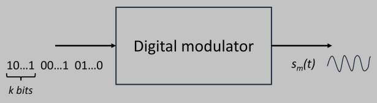
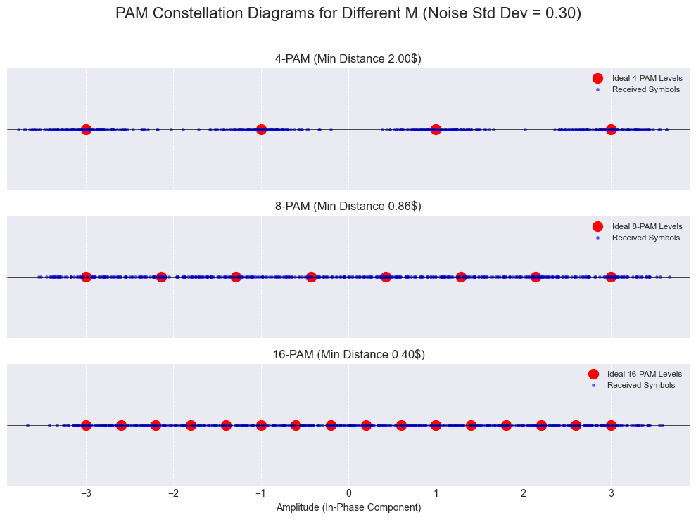
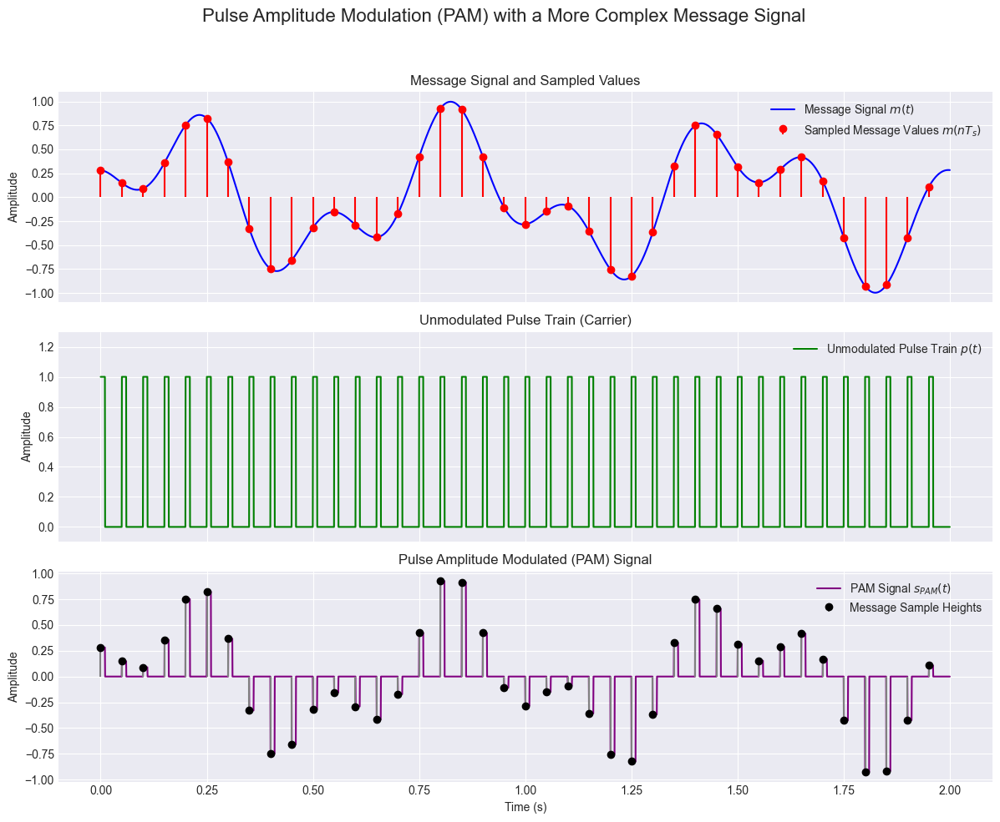
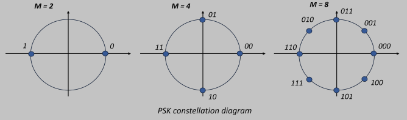
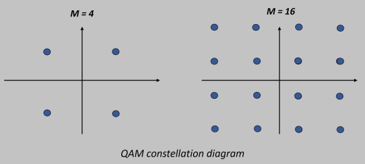

<!-- KaTeX auto-render header -->
<link rel="stylesheet" href="https://cdn.jsdelivr.net/npm/katex@0.16.0/dist/katex.min.css">

# Chapter 2: The Physical Layer

This chapter explores the **Physical Layer**, the first and most fundamental layer of the network stack. 

Its primary purpose is to **transport raw bits of data** from one machine to another. 

We will begin by examining the **various physical transmission media** that make this possible, from guided cables to unguided wireless signals. 

The chapter will then detail the essential **components** and **processes** of a **digital communication system**, covering how information is encoded, modulated for transmission, and then demodulated at the destination. 

Finally, we will discuss **multiplexing techniques**, which allow multiple signals to efficiently share a single communication channel.

## Transmission Media
The purpose of the physical layer is to transport bits between machines. The physical media used for this transport are classified into two main groups:

* **Guided Media**: These use a physical path, like a cable, to guide the signal from sender to receiver. Examples include copper wire and fiber optic cables.
* **Unguided Media**: These transmit signals through the air or space without a physical conductor. This is also known as wireless communication. Examples include radio waves, microwaves, and satellite links.

### Guided Transmission Media
* **Media**: Guided media **use a physical path**, like a cable, to conduct signals. 

* **Twisted Pair Cable**:
    * Consists of two insulated copper wires twisted together.
    * Commonly used for telephone lines and modern Ethernet networks.
    * The twisting helps reduce electromagnetic interference.

* **Coaxial Cable**:
    * Features a central copper core, layers of insulation, a metallic shield, and a protective outer jacket.
    * Offers better protection against interference than twisted pair.
    * Commonly used for cable television networks.

* **Fiber Optic Cable**:
    * Transmits data as pulses of light through a thin glass or plastic fiber.
    * It's composed of a core, cladding, and a protective jacket.
    * **Advantages**: Offers extremely high bandwidth and is completely immune to electrical interference, making it the fastest and most reliable guided medium.

* **Power Lines**: Existing electrical power lines can also be used for data transmission.

### Wireless Communications
Wireless communication uses the electromagnetic spectrum to transmit signals.

* **Radio Waves**:
    * Used by technologies like Wi-Fi and Bluetooth.
    * They are omnidirectional (travel in all directions) and can penetrate obstacles like walls, making them ideal for indoor networks.

* **Microwaves**:
    * Higher frequency waves that travel in a straight line (line-of-sight).
    * Used for point-to-point communication, such as connecting two buildings or for satellite communications. They are easily blocked by solid objects.

* **Satellite Communication**:
    * A satellite in orbit acts as a microwave repeater in the sky.
    * It receives a signal from a ground station, amplifies it, and re-broadcasts it to a receiving station elsewhere on Earth.
    * The altitude of the satellite (LEO, MEO, GEO) significantly impacts the signal delay (latency).

## **A Step-by-Step Look at the Digital Communication System**

This summary follows the journey of information as it travels from the sender, across the channel, and to the receiver, as illustrated in the slides.

### **On the Sender's Side (The Transmitter)**
1.  **Source**
    * This is the origin of the message, which can be an analog signal (like voice) or a digital signal (like a text file).
2.  **Transducer (Sender)**
    * This component **change the physical support** of the original information to electrical signal (analog or digital). \
    A common example is a microphone converting sound into an electrical or digital signal .
        * Note: If source is a computer or a digital device, in digital communication systems, transducer is skipped because the the signal is already a digital electric signal.
3.  **Source Encoder**
    * It performs **data compression**, which can be lossless (like ZIP) or lossy (like JPEG). The goal is to represent the message with the minimum possible number of bits by **reducing redundancy**. 
4.  **Channel Encoder**
    * This component **makes the communication robust against noise and interference** from the channel by **adding redundant** bits to the data, which enables *error detection and correction* capabilities.
> #### **A Note on the Encoding Trade-off**
> It's important to recognize the fascinating trade-off between these two steps. **Source Encoding** and **Channel Encoding** have opposing goals:
> * The **Source Encoder** works to *remove* redundancy to make the data efficient and small.
> * The **Channel Encoder** works to *add* redundancy to make the data robust and safe from errors.
> This creates a fundamental balance between **efficiency** (sending fewer bits) and **robustness** (ensuring the bits arrive correctly).
5.  **Digital Modulator**
    * **Transform the digital into analog signal**, so it maps the final stream of bits into an analog signal (like an electromagnetic wave or light pulse) that is suitable for transmission over the physical channel.
### **The Transmission Medium**
6.  **Channel**
    * This is the **physical medium** (e.g., copper wire, fiber optic cable, or the air) used to transmit the signal. The channel is where disturbances like noise and interference can be introduced, potentially corrupting the signal.
### **On the Receiver's Side**
7.  **Digital Demodulator**
    * Takes the noisy analog signal from the channel and tries to **convert it back to digital signal**.
8.  **Channel Decoder**
    * It uses the redundant bits to **detect and/or correct errors** that occurred during transmission.
9.  **Source Decoder**
    * Its function is to **decompress the data**, restoring the message to its original, uncompressed form.
10. **Transducer (Receiver)**
    * This performs the reverse action of the first transducer. 
        * For example, a speaker converts the final electrical signal back into audible sound waves for the user.
11. **Destination**
    * The final recipient of the information.

## Digital Modulation

This section covers the core mathematical principles that govern all digital modulation schemes.

* **Bits and Symbols**: A modulator groups a bitstream into blocks of $\large k$ bits. 
    * Each unique block is a **symbol**, and there are $\large M = 2^k$ possible symbols.
* **Symbol Rate ($\large R_s$)**: The number of symbols sent per second.
    $$\Large R_s = \frac{1}{T_s} \text{ (symbols/sec)}$$
    Here, $\large T_s$ is the "***symbol period***," the fixed duration of one symbol.
* **Bit Rate ($\large R$)**: The number of bits sent per second. This is the true measure of data transmission speed.
    $$\Large R = k \cdot R_s$$
* **Average Energy ($\large E_{avg}$)**: The average energy required per transmitted symbol.
    $$\Large E_{avg} = \sum_{m=1}^{M} p_m E_m$$
    It's a weighted average based on the **energy of each symbol** ($\large E_m$) and its **probability of being sent** ($\large p_m$)
* **Orthonormal Functions & Signal Space**: Any complex signal waveform, $\large s_m(t)$, can be built from a set of $\large N$ **orthonormal basis waveforms**, $\large \phi_n(t)$. 
    * This allows to represent a complex waveform as a vector of coordinates, $\large s_m = [s_{m1}, ..., s_{mN}]^T$. 
    * The set of all these vectors forms the **constellation diagram**, which is the discrete representation of the *signal space*.
    $$ \Large s_{m}(t) = \sum_{n=1}^N s_{mn}\phi_{n}(t)$$
    $$\large \text{with m} = 1, ..., M$$

### Pulse Amplitude Modulation (PAM)

Encodes information by varying the signal **amplitude**.

* **Waveform Formula**: Information is carried in the **discrete amplitude levels** $\large A_m$.
    $$\Large s_m(t) = A_m g(t) \cos(2\pi f_0 t)$$. 
    where: 
    * $\large A_m = 2m - 1 - M$: Standard amplitude values
        * where $m = 1, 2, ..., M$
    * $\large f_0$: Carrier frequency
    * $g(t)$: Finite-energy signal, the ***pulse shaper***
* **Simbol Energy $\large E_m = A_m^2 E_g/2$**: The energy per symbol, depends on the amplitude squared. 
* **Average energy $\large E_{avg} = \frac{(M^2-1)E_g}{6}$**: The average energy of the signal grows rapidly with the number of symbols $\large M$ to modulate, making it power-inefficient for large constellations.
#### Vector Representation: 

PAM is a 1-dimensional system ($\large N=1$), its single basis function is $\large \phi(t) = \sqrt{\frac{2}{E_g}}\cos(2\pi f_0 t)$. \
The coordinate for each symbol on the 1D constellation line is given by $\Large s_m = A_m\sqrt{E_g/2}$ with $\large A_m = \mp 1, ..., \mp M-1$

### Phase Shift Keying (PSK)

Encodes information by varying the signal **phase**.

* **Waveform Formula**: Information is carried in the **discrete phase angle** $\large \theta_m$

$$\Large s_m(t) = g(t)\cos(2\pi f_0 t + \theta_m) = g(t)\cos(2\pi f_0 t + \frac{2\pi}{M}(m-1)) = s_{m1}\phi_1(t) + s_{m2}\phi_2(t)$$
* **Phase Calculation**: Angles are **spaced equally** around a circle using $\Large \theta_m = \frac{2\pi}{M}(m-1)$ where $\large m = 1, 2, ..., M$.
* **Symbol Energy = Average Energy**: The energy per symbol, $\large E_m = E_g/2$, is **constant** for all symbols, so it coincides with average energy.
    * This makes **PSK more power-efficient than PAM** for large $\large M$.

#### Vector Representation
PSK is a 2-dimensional system ($\large N=2$). 

It uses a **cosine and a sine basis function**.

$$\large \phi_1(t) = \sqrt{\frac{2}{E_g}}\cos(2 \pi f_0t)$$
$$\large \phi_2(t) = \sqrt{\frac{2}{E_g}}\sin(2 \pi f_0t)$$

The coordinate for each symbol on the 1D constellation line is given by 

$$\Large s_m = [s_{m1}, s_{m2}] = \left[\sqrt{\frac{E_g}{2}}\cos\left(\frac{2\pi}{M}(m-1)\right), \sqrt{\frac{E_g}{2}}\sin \left(\frac{2\pi}{M}(m-1)\right)\right]^T$$ 

Its constellation points form a circle.

### Quadrature Amplitude Modulation (QAM)

Encodes information by varying **both amplitude and phase**. It is a hybrid of PAM and PSK.

* **Waveform Formula**: 

$$\Large s_m(t) = A_{mc}g(t)\cos(2\pi f_0 t) + A_{ms}g(t)\sin(2\pi f_0 t)$$ 

It is effectively **two independent PAM signals** on two **perpendicular (quadrature) carriers**.
* **Energy**: The average energy grows in proportion to $\large M$, making it a very balanced, more than PAM, and scalable scheme.

$$
\Large E_{avg} = \frac{E_g}{2M} \sum_{m=1}^{\sqrt{M}} \sum_{n=1}^{\sqrt{M}} (A_m^2 + A_n^2) = \frac{(M-1)E_g}{3}
$$
#### Vector Representation

QAM is a 2D system whose vector coordinates $\large [s_{m1}, s_{m2}]^T$ are determined by the independent amplitude levels 

$$\large A_{mc}, \large A_{ms} = 2m - 1 - \sqrt{M}$$. 

This creates a robust and efficient square grid constellation, making QAM ideal for modern high-speed communications.

## Digital Demodulation

### The Receiver's Goal & The AWGN Channel

* **Demodulator's Objective**: The digital demodulator's primary goal is to observe the received, noisy signal and decide which of the $\large M$ possible symbols (and thus, which block of $\large k$ bits) was originally transmitted. 
    * The optimal strategy aims to minimize the probability of error, $\large P_e = P[\hat{m} \ne m]$, where $\large m$ is the true symbol and $\large \hat{m}$ is the receiver's estimate, so the probability of being wrong.
* **Additive White Gaussian Noise (AWGN) Channel Model**: This is is very commonly used as a mathematical model to represent the cumulative effect of many random, unavoidable noise sources that can corrupt a signal during its transmission.
    * **Additive**: The noise $\large n(t)$ is mathematically added to the transmitted signal $\large s_m(t)$.
    * **White**: The noise has equal power across all frequencies of interest. 
        * This implies that noise samples at different times are uncorrelated.
    * **Gaussian**: The amplitude of the noise at any given time follows a Gaussian (Normal) distribution with 0-mean and variance $\large N_0/2$.
    * **Time-Domain Formula**: The received, noisy signal $\large r(t)$ is the sum of the transmitted signal $\large s_m(t)$ and the noise $\large n(t)$:
        $$\Large r(t) = s_m(t) + n(t)$$
    * **Vector Form**: Using orthonormal basis functions, this can be simplified to a vector equation:
        $$\Large r = s_m + n$$
        Here, $\large r$ is the received vector, $\large s_m$ is the vector of the transmitted symbol, and $\large n$ is the noise vector. Geometrically, the noise "pushes" the transmitted constellation point $\large s_m$ to a new location $\large r$.

        $$ 
        \Large s_m(t) = \sum_{j=1}^{N} s_{mj}\phi_j(t) \Rightarrow \mathbf{sm} = [s_{m1}, \dots, s_{mN}]^T \text{ with } s_{mj} = (\mathbf{s}_m, \phi_j) 
        $$

        $$
        \Large n(t) = \sum_{j=1}^{N} n_j\phi_j(t) \Rightarrow \mathbf{n} = [n_1, \dots, n_N]^T \text{ with } n_j = (\mathbf{n}, \phi_j)
        $$

### Maximum a Posteriori (MAP) Decision Rule

The **Maximum a Posteriori (MAP) decision rule** is a fundamental criterion used in digital demodulation to minimize the probability of symbol error when deciding which symbol was transmitted, given a received signal. It selects the symbol $s_m$ that maximizes the *a posteriori* probability $P[s_m|r]$, which is the probability that symbol $s_m$ was sent, given the received signal $r$.

Mathematically, the MAP decision rule is expressed as:

$$\large \hat{m} = \underset{1\le m\le M}{\operatorname{arg\,max}} P[s_m|r]$$

Where:

* $\hat{m}$ is the index of the estimated transmitted symbol.
* $M$ is the total number of possible transmitted symbols.
* $P[s_m|r]$ is the *a posteriori* probability of symbol $s_m$ given the received signal $r$.

Using Bayes' theorem, we can rewrite the *a posteriori* probability as:

$$\large P[s_m|r] = \frac{P[r|s_m]P[s_m]}{P[r]}$$

Since $P[r]$ does not depend on the transmitted symbol $s_m$, it is a constant factor for all symbols and can be ignored in the maximization process. Thus, the MAP rule simplifies to:

$$\large \hat{m} = \underset{1\le m\le M}{\operatorname{arg\,max}} P[r|s_m]P[s_m]$$

Where:

* $\large P[r|s_m]$ is the likelihood function, representing the conditional probability of receiving $r$ given that $s_m$ was transmitted.
* $\large P[s_m]$ is the *a priori* probability of transmitting symbol $s_m$.

#### MAP Rule for AWGN Channel

In an Additive White Gaussian Noise (AWGN) channel, the noise is Gaussian distributed.  If we assume the noise has a power spectral density of $N_0/2$, the likelihood function $P[r|s_m]$ can be expressed as:

$$\large P[r|s_m] = \left(\frac{1}{\sqrt{\pi N_0}}\right)^N e^{-\frac{||r-s_m||^2}{N_0}}$$

Where:

* $\large N$ is the dimensionality of the signal space.
* $\large ||r - s_m||^2$ is the squared Euclidean distance between the received signal $r$ and the possible transmitted signal $s_m$.

Substituting this into the MAP decision rule, we get:

$$\large \hat{m} = \underset{1\le m\le M}{\operatorname{arg\,max}} P[s_m] \left(\frac{1}{\sqrt{\pi N_0}}\right)^N e^{-\frac{||r-s_m||^2}{N_0}}$$

Taking the logarithm (which is a monotonic function and doesn't change the argmax) and simplifying, we often arrive at a form like:

$$\large \hat{m} = \underset{1\le m\le M}{\operatorname{arg\,max}} \left( \log P[s_m] - \frac{||r-s_m||^2}{N_0} \right)$$

Or, by including a factor of $\frac{N_0}{2}$ which is sometimes used for convenience in certain derivations:

$$\large \hat{m} = \underset{1\le m\le M}{\operatorname{arg\,max}} \left( \frac{N_0}{2}\log P[s_m] - \frac{1}{2}||r-s_m||^2 \right)$$

Expanding the squared Euclidean distance, we can further express this as:

$$\large \hat{m} = \underset{1\le m\le M}{\operatorname{arg\,max}} \left( \frac{N_0}{2}\log P[s_m] - \frac{1}{2}E_m + (r, s_m) \right)$$

Where:

* $\large E_m$ is the energy of the signal $s_m$.
* $\large (r, s_m)$ is the inner product (correlation) between the received signal $r$ and the possible transmitted signal $s_m$.

This final form highlights that the MAP decision rule in an AWGN channel essentially involves correlating the received signal with each possible transmitted signal, and choosing the signal that yields the largest correlation, adjusted by the signal energy and *a priori* probabilities.

### Maximum Likelihood (ML) Simplification (NO?)

If all symbols are assumed to be equally likely (i.e., $\large p_m = 1/M$ for all $\large m$), the $\large \log p_m$ term becomes a constant for all symbols and can be disregarded in the maximization. The decision rule simplifies to the Maximum Likelihood (ML) rule:
$$\Large \hat{m}_{ML} = \underset{1\le m\le M}{\operatorname{arg\,max}} \left( - \frac{1}{2}E_m + (r,s_m) \right)$$
If, additionally, all symbols have the same energy $\large E_m$ (as in PSK), then the $\large - \frac{1}{2}E_m$ term is also constant and can be ignored. The rule further simplifies to choosing the symbol $\large m$ that maximizes the correlation $\large (r,s_m)$, which is equivalent to finding the symbol $\large s_m$ that has the minimum Euclidean distance $\large ||r-s_m||^2$ to the received vector $\large r$.

### Antipodal Signals and Error Probability (SISTEMARE)

* **Signal Constellation ($\large s_1, s_2$):** There are two ideal signal points, labeled $\large s_1$ and $\large s_2$, on a single axis (let's call it the $\large \phi_1$ axis, representing a single basis function). 
* **Received Signal $\large r$:** When a signal ($\large s_1$ or $\large s_2$) is transmitted, it gets corrupted by noise. The received signal is $\large r = s_m + n$, where $\large s_m$ is the transmitted signal point and $\large n$ is the noise. Due to the noise, the received point $\large r$ will not be exactly at $\large s_1$ or $\large s_2$ but will be scattered around them.
* **Decision Regions and Threshold ($\large \gamma$):**
    * To decide whether $\large s_1$ or $\large s_2$ was transmitted given a received $\large r$, the receiver establishes a **decision threshold**, labeled $\large \gamma$.
    * If the received $\large r$ falls on one side of $\large \gamma$, the receiver decides in favor of one symbol (e.g., $\large s_1$).
    * If $\large r$ falls on the other side, it decides in favor of the other symbol (e.g., $\large s_2$).
    * This divides the 1D signal space into two **decision regions**.
* **Probability of Error:** Errors occur if, for example, $\large s_1$ was sent but the noise $\large n$ was large enough and in such a direction that $\large r = s_1 + n$ falls into the decision region for $\large s_2$. The shaded "error region" tail under the Gaussian curve (which we'll discuss next) illustrates this probability of error.

* **Conditional PDFs $\large p(r|s_1)$ and $\large p(r|s_2)$:** This image shows the **probability density functions (PDFs)** of the received signal $\large r$, *given* that a specific symbol was sent.
    * $\large p(r|s_1)$: This is the PDF of $\large r$ when $\large s_1$ was transmitted. If the noise $\large n$ is Gaussian with zero mean, then $\large r = s_1 + n$ will also be Gaussian, but with its mean centered at $\large s_1$. This is the Gaussian curve centered at $\large s_1$.
    * $\large p(r|s_2)$: Similarly, this is the PDF of $\large r$ when $\large s_2$ was transmitted, represented by the Gaussian curve centered at $\large s_2$.
* **Decision Threshold $\large \gamma$ and Error Probability:**
    * The decision threshold $\large \gamma$ is shown again, positioned between the two means $\large s_1$ and $\large s_2$.
    * **Error when $\large s_1$ is sent:** If $\large s_1$ was sent, but the received $\large r$ falls to the right of $\large \gamma$ (into the region where we would decide $\large s_2$), an error occurs. The probability of this error, $\large P(e|s_1)$, is the area under the tail of the $\large p(r|s_1)$ curve from $\large \gamma$ to $\large \infty$. This area is shaded and labeled $\large P_1$.
    * **Error when $\large s_2$ is sent:** If $\large s_2$ was sent, but the received $\large r$ falls to the left of $\large \gamma$ (into the region where we would decide $\large s_1$), an error occurs. The probability of this error, $\large P(e|s_2)$, is the area under the tail of the $\large p(r|s_2)$ curve from $\large -\infty$ to $\large \gamma$.
* **Optimal Threshold:** For equiprobable symbols and noise with symmetrical distribution (like Gaussian), the optimal decision threshold $\large \gamma$ that minimizes the overall probability of error is typically halfway between $\large s_1$ and $\large s_2$.

### Error Probability for Pulse Amplitude Modulation (PAM)

In a Pulse Amplitude Modulation (PAM) system, the different signal points (symbols) are arranged along a single line in the constellation diagram. The probability of an error occurring depends on how close these points are to each other relative to the noise level.

* The crucial parameter is $\large d_{min}$, which represents the **minimum distance** between any two adjacent constellation points. A smaller $\large d_{min}$ for a given noise level means errors are more likely.

#### Error Probabilities for Inner and Outer Constellation Points

Not all points in a PAM constellation have the same vulnerability to noise:

* **Inner Points**:
    * There are $\large M-2$ inner points in a PAM constellation with $\large M$ symbols.
    * Each inner point has two neighbors (one on each side). An error occurs if noise shifts the received signal by more than $\large d_{min}/2$ towards either neighbor.
    * The probability of error for an inner point ($\large P_{ei}$) is given by:
        $$\Large P_{ei} = 2Q\left(\frac{d_{min}}{\sqrt{2N_0}}\right)$$
    * Here, $\large Q(x)$ is the Q-function, representing the tail probability of a standard Gaussian distribution (i.e., the probability that a standard normal random variable exceeds $\large x$). $\large N_0/2$ is the noise power spectral density.

* **Outer Points**:
    * There are 2 outer points (at the ends of the constellation line).
    * Each outer point has only one neighbor. An error occurs if noise shifts the received signal by more than $\large d_{min}/2$ towards that single neighbor.
    * The probability of error for an outer point ($\large P_{eo}$) is:
        $$\Large P_{eo} = Q\left(\frac{d_{min}}{\sqrt{2N_0}}\right)$$

The overall probability of a symbol error ($\large P_e$) is the average of the error probabilities of all $\large M$ constellation points, assuming each symbol is equally likely to be transmitted:
$$\Large P_e = \frac{1}{M} [2 \cdot P_{eo} + (M-2) \cdot P_{ei}]$$Substituting the expressions for $\large P_{ei}$ and $\large P_{eo}$, this simplifies to:$$\Large P_e = \frac{2(M-1)}{M}Q\left(\frac{d_{min}}{\sqrt{2N_0}}\right)$$

#### Relating $\large P_e$ to Signal-to-Noise Ratio (SNR)

The minimum distance $\large d_{min}$ can be related to the average energy per bit ($\large E_{bavg}$) and the number of symbols ($\large M$). 

Substituting this relationship into the $\large P_e$ formula gives the error probability in terms of the average SNR per bit ($\large \frac{E_{bavg}}{N_0}$):
$$\Large P_e = 2\left(1-\frac{1}{M}\right)Q\left(\sqrt{\frac{6 \log_2M}{M^2-1}\frac{E_{bavg}}{N_0}}\right)$$
* Note that $\large \log_2M = k$, which is the number of bits per symbol.

For large values of $\large M$, this can be approximated as:
$$\Large P_e \approx 2Q\left(\sqrt{\frac{6 \log_2M}{M^2-1}\frac{E_{bavg}}{N_0}}\right)$$

#### **E. Performance Implications**

The error probability formula and performance curves (like the one on slide 60) show critical trade-offs for PAM:
* **Increasing $\large M$ (more bits per symbol)**:
    * Allows for higher data rates for a given symbol rate.
    * However, it significantly increases the **required SNR** to achieve the same error probability. This is because the term $\large M^2-1$ in the denominator under the square root drastically reduces the effective SNR making the points effectively "closer" relative to noise, or requiring much more power to maintain the same $\large d_{min}$.
    * It also increases the **average energy** requirement, as discussed previously.

Essentially, with PAM, sending more bits per symbol comes at the cost of needing a much cleaner channel (higher SNR) or more power, and makes the system more susceptible to noise if the SNR doesn't increase proportionally.

### **Revision Notes: The Ultimate Speed Limit - Shannon Capacity**

The Channel Coding Theorem is a fundamental result in information theory that establishes the theoretical limits of communication over a noisy channel.

* **The Promise**: For any communication channel with a given capacity $\large C$, and for any desired level of reliability (i.e., an arbitrarily small probability of error), it is possible to transmit information at any rate $\large R$ as long as $\large R < C$, by using sufficiently sophisticated encoding and decoding techniques.
* **The Limit**: If the transmission rate $\large R$ exceeds the channel capacity $\large C$ ($\large R > C$), then it is impossible to achieve an arbitrarily low error probability, regardless of the complexity of the coding scheme used. Errors will occur with a non-negligible probability.

#### The Shannon Capacity Formula

The formula defines the channel capacity $\large C$ for an Additive White Gaussian Noise (AWGN) channel:
$$\Large C = B \log_2(1 + SNR)$$

* $\large C$: **Channel Capacity** in bits per second (bps). This is the theoretical maximum rate at which data can be transmitted reliably over the channel.
* $\large B$: **Bandwidth** of the channel in Hertz (Hz). This represents the range of frequencies the channel can support.
* $\large SNR$: **Signal-to-Noise Ratio**. This is a dimensionless ratio of the average received signal power to the average noise power ($\Large SNR = \frac{\text{Signal Power}}{\text{Noise Power}}$). A higher SNR indicates a cleaner channel.
* $\large \log_2(1 + SNR)$: This term quantifies how efficiently the available bandwidth can be utilized. The base-2 logarithm signifies that the capacity is measured in bits. As SNR increases, this term increases, allowing more bits to be encoded per unit of bandwidth.

#### Practical Implications

* **Theoretical Upper Bound**: Shannon Capacity $\large C$ is an upper limit. Actual systems will generally achieve rates somewhat below $\large C$.
* **Guidance for System Design**: The formula highlights that capacity can be increased by either increasing the channel bandwidth ($\large B$) or by improving the Signal-to-Noise Ratio ($\large SNR$) (e.g., by increasing signal power or reducing noise).
* **Complexity of Coding**: Achieving rates close to $\large C$ requires highly complex and long error-correcting codes. The "coding gap" refers to the difference between the Shannon limit and the performance of practical coding schemes, though modern codes (like LDPC and Turbo codes) have significantly reduced this gap.

### Multiplexing 

***Frequency Division Multiplexing*** (FDM) and ***Time Division Multiplexing*** (TDM) are two fundamental techniques used in telecommunications to **allow multiple signals to share a single communication medium** or channel efficiently.

### Frequency Division Multiplexing (FDM)

**Concept:** FDM works by dividing the total available bandwidth of the communication channel into several distinct, non-overlapping frequency bands (sub-channels). 
    * Each of these sub-channels is then allocated to a different signal or user.

**How it works:**
1.  Each individual signal (which might originally be a baseband signal) is modulated onto a different **carrier frequency**, chosen such that the modulated signals occupy different frequency slots within the overall channel bandwidth.
2.  All these modulated signals are then combined (summed) and transmitted simultaneously over the common channel.
3.  **Guard Bands:** To prevent interference (crosstalk) between adjacent signals, small unused frequency bands called "guard bands" are often inserted between the allocated frequency slots.

**Demultiplexing (at the receiver):** The receiver uses a set of **bandpass filters**, each tuned to one of the specific carrier frequencies (or frequency slots), to separate the individual signals from the combined signal. After filtering, each signal is then demodulated to recover the original baseband information.

**Analogy:** Think of traditional radio or analog television broadcasting. Each station broadcasts on its assigned frequency channel. You use your radio tuner (which acts like a tunable bandpass filter) to select the frequency of the station you want to listen to, isolating it from all others.

### Time Division Multiplexing (TDM)

* **Concept:** TDM works by allocating different, brief **time slots** to different signals on the same communication channel. All signals use the same frequency band (the full bandwidth of the channel), but they take turns transmitting.
* **How it works:**
    1.  The transmission time is divided into a repeating sequence of frames. Each frame is further divided into a fixed number of time slots.
    2.  Each signal is assigned one or more specific time slots within each frame. During its allotted time slot, a signal has exclusive use of the entire channel bandwidth.
    3.  A multiplexer at the transmitter combines the data from different sources into these time slots.
    4.  **Synchronization:** TDM requires precise synchronization between the transmitter and receiver so that the receiver knows when each user's time slot begins and ends, allowing it to correctly demultiplex (separate) the data.
    5. **Guard Time:** Analogous to frequency guard bands, may be added to accommodate small timing variations.
* **Demultiplexing (at the receiver):** The demultiplexer at the receiver, synchronized with the transmitter, extracts the data from the appropriate time slots and directs it to the correct destination.
* **Analogy:** Imagine a group of people sharing a single microphone to speak. They take turns (each person gets a short slot of time to speak). During their turn, they have full access to the microphone.

#### In Summary

* **FDM:** Divides the channel by **frequency**. Users transmit simultaneously but in different frequency bands.
* **TDM:** Divides the channel by **time**. Users transmit in the same frequency band but at different, interleaved times.

Both techniques are fundamental for sharing communication resources, though modern systems often use more advanced and hybrid multiplexing schemes.