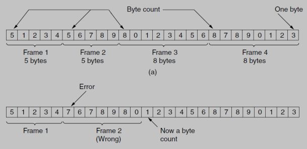
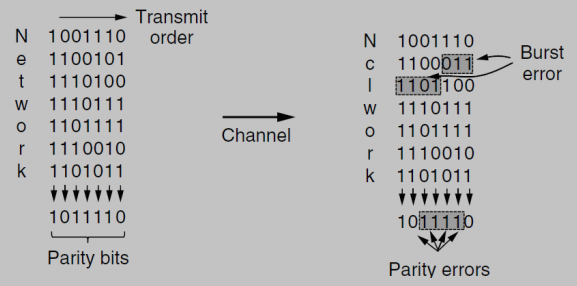

# Data Link Layer

## Data Link layer design

The **data link layer** acts as an **intermediary**, using the services of the physical layer to send and receive bits across a communication channel. Its primary role is to provide a reliable and efficient communication path between two directly connected machines.

This layer performs several **crucial functions**:
* **Service Interface**: It provides a clear and well-defined service interface for the network layer above it.
* **Error Handling**: It is responsible for dealing with transmission errors that may occur at the physical layer.
* **Access Control**: It manages how a shared communication medium is accessed by multiple devices.

To accomplish this, the data link layer takes the packets it receives from the network layer and encapsulates them into units called **frames**. 
* Each frame is structured with a **header**, a **payload field** (which contains the actual packet), and a **trailer**. 

    

## Framing

To manage the flow of data, the data link layer must **break the raw bit stream** from the physical layer into **discrete units** called ***frames***. 

* **Error detection in frames**: For each frame, the sender computes a short token called a **checksum**, which is then attached to the frame.

    When a frame arrives at its destination, the receiving device recomputes the checksum based on the received data. If this newly computed **checksum is different** from the checksum included in the frame, the data link layer knows that a **transmission error has occurred**. 
    
    In response, it can take **corrective actions**: 
    * Discarding the faulty frame 
    * In some systems, sending an error report back to the sender.

A good framing method must be designed to make it easy for a receiver to **find the start of a new frame**, even in a continuous stream of bits, while using as little channel bandwidth as possible for this overhead.

There are **three primary methods for framing**:

### Byte Count

This framing method uses a **field in the frame's header** to specify the **number of bytes contained within that frame**. 

The receiver reads the byte count value and then reads that many bytes to process the complete frame. Once it has processed that frame, it knows that the very next byte will be the count for the subsequent frame.

The **main problem** with this method is its **lack of robustness**, if the byte count field is corrupted by a transmission error, the receiver will lose track of where the current frame ends and the next one begins. 
* For example, if a count of 5 is changed to a 7, the receiver will read two bytes from the following frame as part of the current one. 
* This single error causes the receiver to become desynchronized, and it will likely interpret all subsequent frames incorrectly.

    

### Flag Bytes with Byte Stuffing

This method overcomes the synchronization problem of the byte count method by marking the start and end of each frame with a special byte, known as a **flag byte** (`FLAG`).

* Each frame begins and ends with this `FLAG` byte. This way, if a receiver loses synchronization, it can simply scan the input for a `FLAG` byte to find the end of the current frame and the beginning of the next one.

A **major challenge** arises if the `FLAG` byte pattern appears within the actual data. To solve this, a technique called **byte stuffing** is used.

* **Byte stuffing** works by inserting a special **escape byte** (`ESC`) into the data stream just before any accidental `FLAG` byte in the data.
* If an `ESC` byte itself appears in the data, the sender "stuffs" another `ESC` byte just before it. 
    * Therefore, a single `ESC` in the data becomes a sequence of two (`ESC ESC`).

The receiving data link layer performs the reverse process, removing the stuffed `ESC` bytes to restore the original data before passing it to the network layer.


### Flag Bits with Bit Stuffing

This approach allows for frames to contain an arbitrary number of bits, making it more flexible than byte-oriented methods.
* In this method, each frame **begins and ends** with a **special bit pattern**, or flag: `01111110`. 
    * This protocol is used by ***HDLC (High-level Data Link Control)***.

* To prevent the flag pattern from appearing in the data, this method uses a technique called **bit stuffing**.

* **Sender-Side (Stuffing)**: Whenever the sender's data link layer encounters five consecutive `1`s in the data, it **automatically stuffs** a `0` bit into the outgoing bit stream.
* **Receiver-Side (De-stuffing)**: When the receiver sees five consecutive `1`s in the incoming stream, it **checks the next bit**.
    * If the sixth bit is a `0`, it must have been stuffed. 
        * The receiver **removes it**.
    * If the sixth bit is a `1`, the receiver **checks the seventh bit**. 
        * If it's a `0`, it's a `FLAG` (`01111110`), 
        * otherwise, **it's an error**.


## Error Detection and Correction

Errors are a common occurrence during data communication, and robust protocols must be able to handle them. There are two fundamental approaches to managing errors:

* **Error-Correcting Codes (FEC)**
    * This strategy, also known as **Forward Error Correction (FEC)**, involves including enough redundant information with the data to allow the receiver to deduce what the transmitted data must have been, even if errors are present.
        * It is often used for real-time services like video streaming, where waiting for a retransmission would cause unacceptable delays.
* **Error-Detecting Codes (ARQ)**
    * This strategy, often paired with an **Automatic Repeat Request (ARQ)** mechanism, includes only enough redundancy to allow the receiver to know *that* an error has occurred, but **not enough to fix it**.
        * Upon detecting an error, the receiver **requests that the sender retransmits** the affected frame.

## Error-Correcting Codes

There are several types of error-correcting codes, including:
* Hamming codes
* Binary convolutional codes
* Reed-Solomon codes
* Low-Density Parity Check (LDPC) codes

All these codes work by adding **redundancy** to the information being sent.

* **(n, m) code**: A frame is composed of **`m`** data (message) bits and **`r`** redundant (check) bits, total length of the block is **`n`**. 

* **Codeword**: An n-bit unit containing both data and check bits.

Different types of codes are defined by **how the check bits are generated**, these property are not **mutually exclusive**:
* **Block code**: The `r` check bits are computed solely from the `m` data bits within the same block.
    * **Example**: A simple parity check.
        * Assume we have 7 data bits (`m=7`): `1011001`.
        * We want to add one check bit (`r=1`) for even parity (the total number of 1s must be even).
        * We count the 1s in the data: there are four. Since four is an even number, the parity bit is `0`.
        * This check bit (`0`) was calculated *only* from the `1011001` data block. It does not depend on any previous or future data blocks.
* **Systematic code**: The `m` data bits are sent directly and unchanged, with the check bits appended.
    * **Example**: Using the same parity check example.
        * Original data (`m=7`): `1011001`
        * Calculated check bit (`r=1`): `0`
        * The final codeword (`n=8`) would be `1011001`**`0`**.
        * You can clearly see the original data at the beginning of the codeword, followed by the check bit. This is the defining feature of a systematic code.
* **Linear code**: The `r` check bits are computed as a linear function of the `m` data bits. (typically based on **XOR operations**).
    * **Example**: A simple code for 4 data bits (`m=4`) and 3 check bits (`r=3`).
        * Let the data bits be `d1 d2 d3 d4` = `1011`.
        * Let's define the check bits (`r1 r2 r3`) with these linear equations (XOR is modulo-2 addition):
            * `r1 = d1 XOR d2 XOR d3 = 1 XOR 0 XOR 1 = 0`
            * `r2 = d1 XOR d2 XOR d4 = 1 XOR 0 XOR 1 = 0`
            * `r3 = d1 XOR d3 XOR d4 = 1 XOR 1 XOR 1 = 1`
        * The check bits are `001`.
        * Since the check bits were generated using only XOR operations on the data bits, this is a linear code. If it were also a systematic code, the final codeword (`n=7`) would be `1011`**`001`**.
* **Code rate**: the fraction of the codeword that **carries useful information**, calculated as $\large \frac{m}{n}$.

### Hamming Distance
A fundamental concept for understanding error correction is the **Hamming distance**.

* **Definition**: The Hamming distance between two codewords is the **number of bit positions in which they differ**.
* **Significance**: If two codewords are a Hamming distance of `d` apart, it will require `d` single-bit errors to convert one into the other.
    * **Example**: The codewords `10001001` and `10110001` differ in three positions, so their Hamming distance is 3.
* By examining the complete list of all legal codewords in a code, we can determine the minimum Hamming distance for that code, which dictates its error-handling capabilities.

### How Error Correction Works
Error correction is possible because not all possible `n`-bit combinations are valid codewords.

* Out of $\large 2^n$ possible `n`-bit words, only $\large 2^m$ of them are legal codewords.
* This means only a small fraction of messages, $\Large \frac{2^m}{2^n}$ or $\Large \frac{1}{2^r}$, are valid.
* It is this **sparseness** of the legal codewords that **enables the receiver to detect and correct errors**. When a non-legal codeword is received, the system can guess it was the closest legal codeword, assuming a small number of errors.

The **error-detecting and error-correcting properties** of a code depend directly on its Hamming distance.

* **To detect `d` errors**: A code must have a Hamming distance of at least **`d + 1`**. 
    * This is because with a distance of `d + 1`, there is no way for `d` single-bit errors to change a valid codeword into another valid codeword. 
    * The result will be an invalid codeword, which the receiver can flag as an error.

* **To correct `d` errors**: A code must have a Hamming distance of at least **`2d + 1`**. 
    * This ensures that the legal codewords are so far apart that even after `d` single-bit errors, the resulting (corrupted) codeword is still closer to the original, correct codeword than to any other legal codeword. 
    * The receiver can then confidently choose the closest legal codeword as the correct one.

    

#### Example: A Code with Distance 5

Consider a code that has only four valid 10-bit codewords:
* `0000000000`
* `0000011111`
* `1111100000`
* `1111111111`

This code has a minimum Hamming distance of 5. Based on the rules we just discussed:
* It can **correct double errors** (since `2d + 1 = 2*2 + 1 = 5`).
* It can **detect quadruple errors** (since `d + 1 = 4 + 1 = 5`).

Let's see how it works in practice:

* **Correction Scenario**:
    * Imagine the codeword `0000000111` arrives at the receiver. This is not a valid codeword.
    * The receiver calculates its Hamming distance to all valid codewords. It is 2 away from `0000011111` and 3 away from `0000000000`.
    * Since it's closer to `0000011111`, the receiver corrects the error and concludes this was the original message.
* **Incorrect Correction Scenario**:
    * What if a triple error occurred, changing `0000000000` into `0000000111`?
    * The receiver would still "correct" it to `0000011111` because it is the closest valid codeword. In this case, the correction would be wrong. 
        * This illustrates the **limits of the code's power**.
* **Detection Scenario**:
    * If the goal is only to detect errors, the system is more robust. When `0000000111` arrives, the receiver knows it's not a legal codeword and simply reports that an error has occurred. 
        * This would successfully detect the triple error that the correction mechanism could not handle properly.

## Error-Detecting Codes

Error-detecting codes are designed to determine if an error has **occurred, but not to fix it**. \
They **require less redundant data** than error-correcting codes. 

Common examples include:
* Parity
* Checksums
* Cyclic Redundancy Checks (CRCs)

### Error-Detecting Codes: Parity

The simplest error-detection method is to append a single **parity bit** to the data.

* This bit is chosen so that the total number of 1s in the resulting codeword is either always even (even parity) or always odd (odd parity).
* A code with a single parity bit has a **Hamming distance of 2**. 
    * This is because any single-bit error will change the codeword's parity, allowing the error to be detected.
* **Issue**: A simple parity bit cannot detect **burst errors**. 
    * For example, if **two bits are flipped**, the parity remains the same, and the error goes unnoticed.

### Interleaving

**Possible solution**: To better handle burst errors, a technique called **interleaving** can be used with parity.

**Process**:
1.  The sender arranges a block of data, for example `k` rows of `n` bits each, into a `k x n` matrix.
2.  It then computes a parity bit for each of the `n` columns.
3.  The data is transmitted one row at a time, followed by a final row containing the `n` column parity bits.



The power of interleaving comes from **how it handles burst errors**.

**Error Detection**:
* A **burst error** during transmission corrupts a sequence of consecutive bits.
* When the receiver reconstructs the matrix, these **consecutive errors will be distributed across multiple different rows, but within a small number of columns**.
* When the receiver re-calculates the parity for each column, it will find that the parity fails for the columns affected by the error, thus successfully detecting the burst error.

This technique uses `n` parity bits to detect any single burst error of length `n` or less on a block of `k*n` data bits.

#### Interleaving Example

Let's assume we want to send the following two 8-bit data words using even parity:
* **Word 1**: `10100101`
* **Word 2**: `01110011`

**1. Sender: Create the Matrix**
The sender arranges the data into a `2x8` matrix (`k=2`, `n=8`).
```
Row 1: 1 0 1 0 0 1 0 1
Row 2: 0 1 1 1 0 0 1 1
```

**2. Sender: Calculate Column Parity**
The sender calculates the even parity bit for each column.
* **Column 1** (1, 0) -> one '1' -> Parity: **1**
* **Column 2** (0, 1) -> one '1' -> Parity: **1**
* **Column 3** (1, 1) -> two '1's -> Parity: **0**
* **Column 4** (0, 1) -> one '1' -> Parity: **1**
* **Column 5** (0, 0) -> zero '1's -> Parity: **0**
* **Column 6** (1, 0) -> one '1' -> Parity: **1**
* **Column 7** (0, 1) -> one '1' -> Parity: **1**
* **Column 8** (1, 1) -> two '1's -> Parity: **0**

The calculated parity row is `11010110`.

**3. Sender: Transmit the Data**
The data is sent row by row, followed by the parity row.
* **Stream Sent**: `10100101` (Row 1) `01110011` (Row 2) `11010110` (Parity)

**4. Channel: A Burst Error Occurs**
Let's say a 4-bit burst error flips the last two bits of Row 1 and the first two bits of Row 2.
* **Original Stream**: `101001`**`01`** **`01`**`110011...`
* **Corrupted Stream**: `101001`**`10`** **`10`**`110011...`

**5. Receiver: Reconstruct the Matrix and Check Parity**
The receiver rebuilds the matrix with the corrupted data it received:
```
Row 1 (corrupted): 1 0 1 0 0 1 1 0
Row 2 (corrupted): 1 0 1 1 0 0 1 1
```
The receiver then gets the transmitted parity row: `11010110`.

Now, the receiver calculates the parity of the data it *actually received*:
* **Column 1** (1, 1) -> Parity: `0`. (Transmitted was `1`. **MISMATCH**)
* **Column 2** (0, 0) -> Parity: `0`. (Transmitted was `1`. **MISMATCH**)
* **Column 3** (1, 1) -> Parity: `0`. (Transmitted was `0`. Match)
* **Column 4** (0, 1) -> Parity: `1`. (Transmitted was `1`. Match)
* **...and so on for the remaining columns...**
* **Column 7** (1, 1) -> Parity: `0`. (Transmitted was `1`. **MISMATCH**)
* **Column 8** (0, 1) -> Parity: `1`. (Transmitted was `0`. **MISMATCH**)

Because the receiver's calculated parity bits do not match the parity bits sent by the sender, it successfully detects that a burst error has occurred.

### Error-Detecting Codes: Checksums

A checksum is another common method for detecting errors in transmitted data.

* **Functionality**:
    * The checksum is calculated based on a **running sum of the data bits** in a message.
        * This calculated value is typically placed at the end of the message.
    * To verify the data, the receiver sums the entire received codeword (both the original data bits and the checksum). 
        * If the result is a specific value (often zero), the message is considered to be error-free.

#### Checksum Example: 16-bit Internet Checksum
* This checksum, used in the Internet Protocol (IP), works by dividing the message into 16-bit words and summing them up.
* Its advantage over a simple parity check is that it operates on multi-bit words rather than single bits. 
* Therefore, many types of errors that would not be caught by parity (like two flipped bits in a block) will change the sum and thus be detected by the checksum.

## The Medium Access Control (MAC) Sub-layer

Network links can be divided into two main categories:
* **Point-to-point connections**: A direct, dedicated link between two individual machines.
* **Broadcast channels**: A single, shared communication channel used by multiple machines. 
    * These are also known as *multiaccess channels* or *random access channels*.

**Broadcast fundamental challenge**: How to decide who gets to use the channel when there is competition for it.

The protocols used to determine which station goes next on a multiaccess channel belong to a specific sublayer of the data link layer called the **MAC (Medium Access Control) sublayer**, 
* **Critical LAN** and for **wireless networks**, as the wireless medium is *inherently a broadcast channel*.

### Static Channel Allocation

* **Main concept**: The most straightforward way to divide a channel among multiple users is through **static allocation** through a fixed multiplexing scheme, such as **Frequency Division Multiplexing (FDM)**.
    * If there are `N` users, the total available bandwidth is divided into `N` equal-sized portions. 
    * Each user is then assigned one portion for their exclusive use.

This approach is simple and **can be efficient, but only under specific conditions**.
* *Example*: There is a **small and constant number of users** who each have a **continuous stream** of data to send.

However, this method is **very inefficient for bursty traffic** or when the **number of users changes over time**. It has **two major drawbacks**:
* **Wasted Resources**: If an assigned user has no data to send, their portion of the bandwidth (in FDM) or their time slot (in Time Division Multiplexing - TDM) **remains idle and is wasted**. 
    * It cannot be used by other users.
* **Access Denial**: If more than `N` users want to communicate, some will be **denied access** because there are no free portions available, even if the active users are only lightly using their allocated channels.

#### Performance Analysis

We can use queuing theory to mathematically demonstrate the inefficiency of static channel allocation.

* Assuming a model where frame arrivals are **random** (a *Poisson process)*, the mean time delay `T` for a single channel with capacity `C` is given by the formula:
    $$
    \Large T = \frac{1}{\mu C - \lambda}
    $$
    Where:
    * `λ` is the **average frame arrival rate**.
    * `1/μ` is the **mean frame length** in bits.

* If we divide the channel into `N` static subchannels (***FDM***), each user gets a channel with capacity `C/N` and an arrival rate of `λ/N`. The **delay for each user**, `T_N`, becomes:
    $$
    \Large T_N = \frac{1}{\mu \frac{C}{N} - \frac{\lambda}{N}} = N \cdot \frac{1}{\mu C - \lambda} = N \cdot T
    $$

* **Conclusion:** This result shows that the mean delay for a user with a statically allocated subchannel is **N times worse** than it would be on a single shared channel that can be dynamically accessed. 
    * This is because each user's transmission is limited to a small fraction of the total capacity, even when no one else is transmitting.

### Dynamic Channel Allocation

* **Main concept**: In contrast to static methods, dynamic channel allocation **allows users to access the channel on-demand**. 

The following **five key assumptions** are foundational to most dynamic allocation protocols:

1.  **Independent Traffic**: The model assumes there are `N` **independent stations**, each generating frames. 
    * Once a station generates a frame, it is **blocked and cannot generate another** until the first one has been **successfully transmitted**.
2.  **Single Channel**: There is a single communication channel available **for all stations** to use for communication.
3.  **Observable Collisions**: If two or more stations transmit simultaneously, their frames will overlap, causing a **collision**. 
    * It is **assumed that all stations can detect** that a collision has occurred. 
    * **Collided frames** are damaged and **must be retransmitted** later.
4.  **Time Domain**: Time can be treated in one of **two ways**:
    * **Continuous Time**: Stations can begin **transmitting at any point** in time.
    * **Slotted Time**: Time is divided into discrete intervals (slots), and transmissions are **only allowed to start at the beginning of a slot**.
5.  **Channel Sensing**: Stations may or may not be able to **sense the state of the channel** before transmitting:
    * **Carrier Sense**: Stations **can listen** to the channel to detect if another station is currently transmitting.
    * **No Carrier Sense**: Stations **transmit without checking** the channel first. 
        * They determine if the transmission was successful later.

## MAC Protocols

These are specific algorithms that operate under the dynamic allocation model.

### ALOHA

The ALOHA protocol is one of the earliest and simplest contention-based protocols.
  * **Core Idea**: Let users transmit whenever they have data to be sent. 
    * There is **no sensing** of the channel before transmission.
  * **Collisions**: If two or more users transmit at the same time, their frames will interfere with each other, causing a **collision**.
    * Both frames are **destroyed**.
  * **Random waint & Retransmission**: After a collision, each sender involved waits for a **random amount of time** before attempting to send its frame again. 
    * The randomization is crucial to **prevent the same frames from colliding repeatedly**.

    
    
#### Performance

To measure the efficiency of ALOHA, we want to find its **throughput**: the **fraction of transmitted frames** that **escape collision** and are therefore successful.

* We define **G** as the total number of frames (new ones plus retransmissions) that stations attempt to send per frame time.
* The throughput, **S**, is then the total attempt rate `G` multiplied by the probability of success, `P₀`.
    $$
    \Large S = G P_0
    $$
* A frame is successful only if no other frame is transmitted during its "***vulnerable period***". 
* For a given frame, this period is **two frame times long**:
    * No other frame can start transmitting in the frame time **before** our frame starts (as it would overlap).
    * No other frame can start transmitting **during** our frame's transmission time.
* Assuming that frame generation follows a ***Poisson distribution***, the probability (`P₀`) that zero frames are generated during our vulnerable period (which is 2 frame times long) is:
    $$
    \Large P_0 = e^{-2G}
    $$
* Therefore, the **final throughput for the pure ALOHA** protocol is:
    $$
    \Large S = G e^{-2G}
    $$

### Slotted ALOHA

The maximum throughput of pure ALOHA occurs at $G = 0.5$, so it is $\large S = 1/2e$, which is only about **18.4%**. 
* This **low efficiency** prompted the development of an improved version.

**Slotted ALOHA** increases efficiency by **dividing time into discrete intervals**, or ***slots***, where each slot's duration corresponds to one frame time.

  * **Core Idea**: Stations are not **permitted to send whenever they want**. 
    * Instead, they must wait for the **beginning of the next available time slot** to start transmitting.
  * **Improvement**: This simple rule **halves the vulnerable period**. 
    * In **pure ALOHA**, a frame could collide with another that started up to one frame time before or after. 
    * In **Slotted ALOHA**, collisions can only occur if two stations decide to transmit in the exact same slot.
        * The vulnerable period is **reduced from two frame times to one**.
  * **Throughput**: Because the vulnerable period is halved, the probability of a successful transmission becomes $\\large e^{-G}$. The throughput formula for Slotted ALOHA is therefore:
    $$
    \Large S = G e^{-G}
    $$
  * This doubles the maximum throughput to $\\large S = 1/e$, which is approximately **36.8%**, occurring when `G=1`.

    

### Carrier Sense Multiple Access (CSMA)

A significant improvement over the ALOHA protocols comes from having stations first **listen to the channel** to check for any ongoing transmissions before they attempt to send their own data. 
* Protocols that use this "*listen before you talk*" strategy are called **carrier sense protocols**.

#### 1-persistent CSMA

When a station has a frame to send, it behaves as follows:
1.  It **senses** the channel.
2.  If the channel is **idle**, it **transmits the frame immediately**.
3.  If the channel is **busy**, it **waits and continuously senses** the channel until it becomes idle, at which point it transmits immediately. 
    * This is why it is called "***persistent***" – it *persistently watches for the channel to become free*.
4.  If a **collision occurs**, the station **waits a random amount of time** and then **repeats** the entire process.

This protocol is more aggressive than ALOHA, but it has a **significant drawback**:
* If two or more stations are waiting for a busy channel to become free, they will both detect the end of the transmission at the same time and both transmit immediately. 
    * This results in a **guaranteed collision**.
* **Propagation delay can also cause collisions**. A station may sense an idle channel and start sending, but another station far away may have already started transmitting. 
    * **Signal simply hasn't reached the first station yet** - *propagation delay* .

#### nonpersistent CSMA
This protocol is less greedy than 1-persistent CSMA and achieves **better channel utilization** at the cost of **longer delays**.

* **Algorithm**:
    1.  **Sense** the channel.
    2.  If the channel is **idle**, **transmit** the frame.
    3.  If the channel is **busy**, **DO NOT** continuously **sense** it, instead, the station waits for a **random period of time** and then repeats the process from the beginning.

This approach **reduces the chance of collision** because multiple waiting stations will likely wait for different random amounts of time rather than all trying to seize the channel at once.

#### p-persistent CSMA
This protocol applies to **slotted channels** and acts as a compromise between the 1-persistent and nonpersistent approaches. It aims to reduce collisions while also minimizing idle channel time.

**Algorithm**:
1.  When a station is **ready** to send, it **senses** the channel.
2.  If the channel is **idle**, it transmits with a probability `p`. 
    * With a probability `q = 1-p`, it defers its transmission until the next time slot.
3.  If the **station deferred**, it **repeats the same logic in the next slot**.
    * If the slot is idle, it will again transmit with probability `p` or defer with probability `q`. 
        * This process is **repeated until the frame is finally transmitted**.
4.  If the channel is initially sensed as **busy**, the station waits until the next slot and then applies the same algorithm.
5.  If another station starts transmitting while our station is in a deferred state, it **handles this as if a collision occurred** (*waits a random backoff time and starts over*).

#### Throughput Comparison

The performance of these different protocols can be compared by **plotting their throughput** (***S***) **against the offered load** (***G***).

From the graph, we can observe:

* All CSMA protocols significantly outperform both pure and Slotted ALOHA. By sensing the channel, stations can avoid many collisions that would otherwise occur.
* **1-persistent CSMA** performs well under light loads but degrades sharply as the load increases. This is because its greedy nature leads to more collisions when multiple stations are trying to send.
* **nonpersistent CSMA** shows better overall performance. By forcing stations to wait a random time when the channel is busy, it avoids the "dogpile" effect of many stations trying to transmit at once, leading to higher throughput under heavy load.
* **p-persistent CSMA** provides a way to tune the protocol's behavior. A smaller value of `p` makes the protocol less greedy and better able to handle high loads, approaching the performance of nonpersistent CSMA.


#### CSMA with Collision Detection (CSMA/CD)

A key enhancement to CSMA is to have stations **listen to the channel *while they are transmitting***. 
* This allows them to detect a collision almost immediately. 

This improved protocol is known as **CSMA/CD**.

* **Core Idea**: A station can **quickly detect a collision** by **comparing the signal it is transmitting with the signal it is receiving on the channel**. 
    * If they are **different**, a collision is in progress.
* **Action**: Upon detecting a collision, the station **immediately aborts** its transmission, since the frame is already corrupted and **continuing would be a waste of bandwidth**.
* **Recovery**: After aborting, the station **waits for a random period** of time before attempting the entire transmission process again.

This process divides the channel's time into periods of successful frame transmission and **contention periods**, which are composed of time slots where stations compete for access.

## Ethernet (CONTINUE FROM HERE)

Ethernet, defined by the **IEEE 802.3 standard**, is arguably the most ubiquitous wired networking technology in the world.

There are two primary kinds of Ethernet:

  * **Classic Ethernet**: The original shared-medium version that uses the MAC protocols we have been studying, like CSMA/CD.
  * **Switched Ethernet**: The modern standard, where devices called switches are used to connect computers, creating what are effectively point-to-point links.

### Classic Ethernet Topology

In its original form, a Classic Ethernet network consisted of a single long cable (often referred to as the "ether") to which all computers on the network were attached.

  * This shared cable had a maximum length per segment.
  * To extend the network beyond this limit, devices called **repeaters** were used to regenerate the signal and connect multiple segments together.

#### Frame Format

The structure of a Classic Ethernet (IEEE 802.3) frame is standardized to ensure interoperability.

The fields are as follows:

  * **Preamble** (8 bytes): This begins with seven bytes of `10101010` used by the receiver's hardware to synchronize its clock. It is followed by a final byte, `10101011`, called the **Start of Frame (SoF) delimiter**, which marks the beginning of the actual frame content.
  * **Destination and Source Addresses** (6 bytes each): These fields contain the link-layer **MAC addresses** of the destination and source machines.
  * **Length** (2 bytes): Specifies the number of bytes in the Data field.
  * **Data** (up to 1500 bytes): This is the payload of the frame, which typically contains a packet from a higher layer, such as an IP packet. The frame must be at least 64 bytes long, so this field must be at least 46 bytes.
  * **Pad** (variable): If the data field is smaller than 46 bytes, this padding field is used to fill the frame out to the minimum required size.
  * **Checksum** (4 bytes): An error-detecting code (specifically, a Cyclic Redundancy Check or CRC) that covers the entire frame. If the receiver computes a different checksum, the frame is known to be corrupt and is discarded.

#### MAC Protocol: Binary Exponential Backoff

Classic Ethernet uses the **1-persistent CSMA/CD** algorithm as its Media Access Control protocol. The key to its operation is how it handles retransmissions after a collision.

  * When a collision is detected, stations immediately send a "jam signal" to ensure all other stations are aware of the collision, and then they abort their transmission.

  * To determine how long to wait before trying again, they use a randomized backoff algorithm called **binary exponential backoff**.

  * **The Algorithm**:

    1.  Time on the channel is divided into discrete **slots**, each 51.2 µs long (the time to send 512 bits).
    2.  After the first collision (`i=1`), each station chooses a random number `k` from the set `{0, 1}` and waits `k` slot times.
    3.  If they collide again (`i=2`), they each choose a random `k` from `{0, 1, 2, 3}`.
    4.  In general, after `i` collisions, each station chooses a random `k` from `0` to `2^i - 1`.
    5.  The range of the random interval is capped after 10 collisions (at 1023 slots). If a frame still cannot be sent after 16 collisions, the station gives up and reports a failure.

This method cleverly adapts to the network load. With few stations colliding, the backoff delays are short. With many stations colliding, the backoff delays become much longer, spreading out their retransmission attempts and increasing the chance of success.

#### Performance

The efficiency of Classic Ethernet depends heavily on the frame size and the number of stations competing for the channel.

As the graph shows, longer frames lead to higher channel efficiency. This is because the overhead of the contention period (where collisions can happen) is fixed, so a longer data transmission time means less time is wasted on contention relative to the amount of useful data sent.

-----

### Switched Ethernet

Modern networks use **Switched Ethernet**, which replaces the single shared cable of Classic Ethernet with an intelligent device called a **switch**.

  * A switch has numerous ports, and each port connects to a single computer or another network device, creating a dedicated link.
  * The key feature of a switch is that it forwards frames intelligently. It reads the destination MAC address of an incoming frame and sends it *only* to the port connected to that destination.
  * This creates independent **collision domains** for each port. A station on port 1 can transmit at the same time as a station on port 2 without causing a collision.
  * Furthermore, if the links are **full duplex**, a station can send and receive data simultaneously, eliminating the possibility of collisions entirely for that link.

Switches can be interconnected to build large, hierarchical networks that can handle much more traffic than a classic shared-medium network.

-----

## Link-Layer Addressing

### MAC Addresses

To send a frame from one machine to another on the same local network, a system of link-layer addresses is needed.

  * Every network interface (adapter) has a unique link-layer address called a **physical address** or, most commonly, a **MAC address**.
  * MAC addresses are 6 bytes (48 bits) long and are usually written in hexadecimal notation, such as `1A-23-F9-CD-06-9B`.
  * These addresses are designed to be globally unique. The IEEE assigns a 24-bit prefix to each manufacturer, who then assigns a unique 24-bit value to each adapter it produces.

### Address Resolution Protocol (ARP)

While frames are sent using MAC addresses, applications and higher-level protocols like IP use IP addresses. The **Address Resolution Protocol (ARP)** is the critical glue that connects these two addressing schemes.

  * **Function**: When a host needs to send a packet to an IP address on its own local network, it uses ARP to find the corresponding MAC address.
  * **ARP Table**: Each host and router keeps an **ARP table** in memory. This table is a cache of recently resolved IP-to-MAC address mappings.
  * **TTL**: Entries in the table have a Time-to-Live (TTL), so old mappings eventually expire and are removed. This allows the network to adapt if a device's network card is replaced (changing its MAC address).

-----

## Switch Operation

### Filtering and Forwarding

A switch uses a **switch table** to make intelligent decisions about where to send frames. Its two core functions are:

  * **Forwarding**: Determining which output port a frame should be sent to.
  * **Filtering**: Deciding to drop a frame because it does not need to be sent anywhere else.

When a frame arrives at a switch on a given port, the switch looks up the frame's **destination MAC address** in its table and takes one of three actions:

1.  **Address not found**: If the destination address is not in the table, the switch does not know where to send it. It performs a **broadcast** (also called flooding), sending a copy of the frame to all ports except the one on which it arrived.
2.  **Address found on the incoming port**: If the table indicates that the destination machine is on the same segment from which the frame came, there is no need to forward it. The switch performs **filtering** and discards the frame.
3.  **Address found on a different port**: If the table shows that the destination is on a different port, the switch performs **forwarding** and sends the frame only to that specific port.

### Self-Learning

Switches build their tables automatically using a **self-learning** mechanism. This process is transparent and requires no manual configuration.

1.  The switch table starts empty.
2.  For every frame that arrives at the switch, the switch examines the **source MAC address**.
3.  It records the source MAC address, the port on which the frame arrived, and the current time in its switch table. This is how the switch learns the location of every active device.
4.  Entries that are not refreshed for a certain period (the **aging time**) are removed from the table. This ensures the table remains up-to-date as devices are moved or disconnected from the network.