# The Network Layer

## Introduction to the Network Layer

The **network layer** is primarily concerned with the complex task of getting packets from the source host to the destination host. This often involves the packets traversing multiple routers and networks.

To achieve its goals, the network layer must:

  * Know the **topology** of the network, which includes the set of all routers and the links that connect them.
  * Choose appropriate **paths** through this network for packets to travel.
  * Make routing decisions to **avoid overloading** some communication lines and routers while others might be idle.

The environment in which the network layer operates involves a packet originating from a process on a source host, being routed through an internetwork of routers, and finally reaching a process on a destination host.

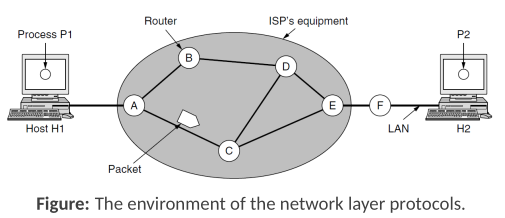

## Routing Algorithms

**Primary responsibility**: decide which output line an incoming packet should be **transmitted** on to continue its journey toward the destination.

Inside a router, **two distinct processes** work together:

* **Forwarding**: It involves looking up the packet's destination address in the **routing tables** to determine the **appropriate outgoing line** and then directing the packet to that line.
* **Routing**: This is the "background" process responsible for creating, maintaining, and updating the routing tables that the forwarding process uses.

Routing algorithms can be broadly categorized as:

* **Static Routing**: Routes are **manually configured** and do not change unless a network administrator intervenes.
* **Adaptive (or Dynamic) Routing**: Routes are **adjusted automatically by the routing algorithm** based on changes in network topology or traffic conditions.

---

### Shortest Path Algorithm

A common approach to routing involves modeling the network as a graph. In this graph:
* Each **node** represents a **router**.
* Each **edge** represents a **communication line** or link between routers.

To choose a route between two routers, the algorithm finds the **shortest path** between the corresponding nodes in the graph. 

The "**length**" of a path can be defined by **various metrics**, such as:
* The **number of hops** (links traversed).
* **Geographical distance**.
* **Mean delay** for packets on that link.
* **Available bandwidth** on the link.

#### Bellman Optimality Principle

* **Core**: It states that if a router `J` lies on the optimal path from router `I` to router `K`, then the optimal path from `J` to `K` also follows this same route.

An important consequence of this principle is that the set of optimal routes from all source routers to a specific destination router forms a tree rooted at the destination. 
* This is known as a **sink tree**.

It's important to note that a sink tree for a given destination is **not necessarily unique**
* **Multiple sink trees** with the same path lengths to the destination can exist **if there are multiple optimal paths**.

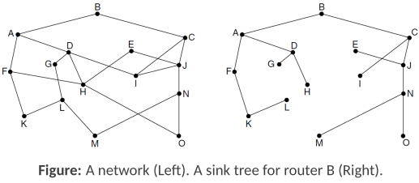

#### Dijkstra’s Algorithm
Well-known method for finding the shortest paths from a source node to all other nodes in a graph where edge **weights are non-negative**.

The algorithm works as follows:
* Each node is labeled with its distance from the source node along the best-known path.
* Initially, all nodes are labeled with infinity, and these labels are considered **tentative**.
* As the algorithm progresses and better paths are found, the labels are updated.
* Once the algorithm determines that the shortest possible path to a node has been found, that node's label becomes **permanent** and will not change further.

The complexity of Dijkstra's algorithm is typically $\large O(N^2)$, where N is the number of nodes (routers) in the network.

#### Dijkstra's Shorthest Path Example

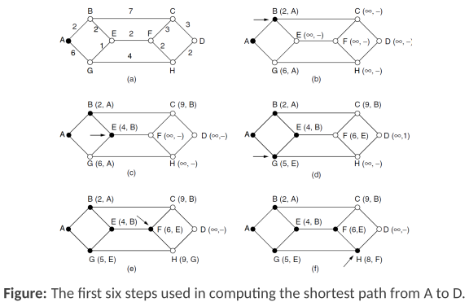

The figure illustrates the application of Dijkstra's algorithm to find the shortest path from node A to all other nodes, particularly D. Each node is labeled with `(distance, predecessor)`. A black filled circle indicates a node whose shortest path from A has been found and is now permanent.

* **Figure (a): Initial Network Graph**
    This shows the network topology with routers (A, B, C, D, E, F, G, H) and the costs (distances) associated with the links between them. 
    * For example, the link A-B has a cost of 2 and E-F has a cost of 2.
* **Figure (b): Step 1 - Node A made permanent**
    * Node A (the source) is made permanent, with a distance of 0 from itself (***(0,-)***).
    * Its direct neighbors are updated with their **tentative distances from A**:
        * Node B is labeled (2,A), meaning the distance to B via A is 2.
        * Node G is labeled (6,A), meaning the distance to G via A is 6.
* **Figure (c): Step 2 - Node B made permanent**
    * From the tentative nodes in (b) (B, G), Node B (2,A) has the **smallest** distance and is made **permanent**.
    * The algorithm now examines paths from B to its neighbors:
        * To Node E: The path A-B-E has a cost of $2+2=4$. E's label is updated to (4,B).
        * To Node C: The path A-B-C has a cost of $2+7=9$. C's label is updated to (9,B).
* **Figure (d): Step 3 - Node E made permanent**
    * Comparing the current tentative distances (E(4,B), G(6,A), C(9,B), etc.), Node E (4,B) is the **smallest**. E is made **permanent**.
    * Paths from E (whose own shortest path from A is 4, via B) to its neighbors are considered:
        * To Node F: The path A-B-E-F has a cost of $4+2=6$. F's label is updated to (6,E).
        * To Node G: The path A-B-E-G has a cost of $4+1=5$. G's label is updated from (6,A) to (5,E)
* **Figure (e): Step 4 - Node G made permanent**
    * Comparing the current tentative distances (G(5,E), C(9,B)), Node G (5,E) is the **smallest**. G is made **permanent**.
    * From G(5,E):
        * To node H: The path A-B-E-G-H has cost of $5+4=9$. H's label is updated to (9, G)
* **Figure (f): Step 5 - Node F made permanent**
    * From figure (e), F(6,E) has the smallest tentative distance. F is made permanent.
    * Paths from F (shortest path from A is 6, via E) to its neighbors:
        * To C: Current label (9,B). Path A-...-E-F-C cost is $6+3=9$. C's label remains (9,B) or could be updated to (9,F) if **path is equivalent**.
        * To H: Current label (9,G). Path A-B-E-F-H cost is $6+2=8$. H's label is updated to (8,F).
* **No figure: Step 6 - Node D made permanent**
    * Paths from D neighbors are C(9,B) and H(8,F), latter is the shortest one so D is labed as (10, H).

This process continues until node D becomes permanent, at which point its label will represent the shortest distance from A to D and the predecessor on that path.

* **General Principle**: 
    * Always pick the **unvisited node with the smallest known distance** from the source
    * Mark it as visited (permanent)
    * Update the distances to its neighbors

---

### Distance Vector Routing

Distance vector routing is an adaptive routing algorithm where each router maintains a table, often called a **distance vector**. 

For every router (destination) in the newwork, this table lists:
* The best known **distance** to that destination (assumed known).
* The **link (next hop)** to use to reach that destination.

Key operational aspects include:

* **Knowledge of Neighbors**: Each router is **assumed to know the "distance"** to its immediate neighbors.
    * If the routing metric is the **number of hops**, the distance to a direct neighbor is simply one hop.
    * If the metric is **propagation delay**, a router can measure this directly by sending ***special ECHO packets*** to its neighbors. 
        * The neighbor timestamps the ECHO packet and sends it back immediately, allowing the originating router to calculate the round-trip time, and thus estimate the delay.

* **Information Exchange**:
    * **Periodically** (e.g., every T milliseconds), each router sends its entire distance vector (its current list of estimated distances/delays to all known destinations) to each of its direct neighbors.
    * **Concurrently**, each router receives similar distance vectors from each of its neighbors.

* **Route Calculation**:
    * When a router receives a distance vector from a neighbor, say router X, this vector contains X's current best estimates of its distances to all other destinations. 
        * Let $\large X_i$ be X's estimated distance to destination $\large i$.
    * If our router knows its own distance (cost) to reach neighbor X is $\large m$, it can then calculate a potential new path to destination $i$ via X. The total distance of this path would be $\large X_i + m$.
    * The router performs this calculation for each destination listed in X's vector. It then compares these new path distances with the distances it currently has in its own routing table. If a path via X offers a shorter distance to a destination $\large i$ than its current best path, the router updates its table for destination $\large i$ to use the link to X and records the new shorter distance ($\large X_i + m$).

#### Distance Vector Routing Example

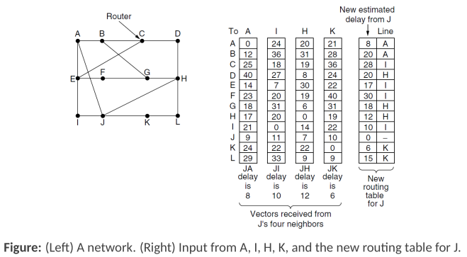

**Consider router J**. It receives distance vectors from its neighbors A, I, H, and K. Router J also knows its own delay to reach these neighbors:
* Delay from J to A = 8
* Delay from J to I = 10
* Delay from J to H = 12
* Delay from J to K = 6

Each neighbor's vector lists (*elenca*, verbo) the estimated delay of that neighbor relative to all other destinations in the network. 
* **For instance**, neighbor A's vector would list A's delay to A (0), A's delay to B, A's delay to C, and so on.

Router J uses this information to update its own routing table. 
* For each destination, J calculates the potential delay if it routes packets through each of its neighbors.

Let's take destination **D** as an example:
* **Via A**: J's delay to A (8) + A's reported delay to D (40). 
    * Total delay = $\large 8 + 40 = 48$.
* **Via I**: J's delay to I (10) + I's reported delay to D (24). 
    * Total delay = $\large 10 + 24 = 34$.
* **Via H**: J's delay to H (12) + H's reported delay to D (8). 
    * Total delay = $\large 12 + 8 = 20$.
* **Via K**: J's delay to K (6) + K's reported delay to D (22). 
    * Total delay = $\large 6 + 22 = 28$.

Comparing these calculated total delays (48, 34, 20, 28), router J **determines that the shortest path** to destination D is via neighbor H, with a total delay of 20. 
* J's routing table entry for D would then be updated to (20, H).

This process is **repeated for every destination in the network**. 
* The "new routing table for J" shown in the slide is the result of J performing these calculations for all destinations (A through L) based on the vectors received from A, I, H, and K, and then choosing the minimum delay and the corresponding next-hop neighbor for each.

---

### Link State Routing

In Link State routing, each router strives to build a complete map (graph) of the network topology. 
* Once this map is available, each router can then independently calculate the shortest path to every other router using an algorithm like Dijkstra's.

The process involves each router performing the following five steps:

1.  **Discover Neighbors**: Each router must first identify its directly connected neighbors and learn their network addresses.
2.  **Set Link Costs**: The router then determines the distance or cost metric for the link to each of its neighbors. This cost can be based on bandwidth, delay, or other factors.
3.  **Construct Link State Packet (LSP)**: Each router creates a packet, known as a Link State Packet (LSP), which contains information about itself, its neighbors, and the costs of the links to those neighbors. Essentially, it's a small piece of the overall network map.
4.  **Distribute LSPs**: The router sends its LSP to all other routers in the network, and it receives LSPs from all other routers. This distribution is typically done using a technique called flooding.
5.  **Compute Routes**: Once a router has received LSPs from all other routers, it has enough information to construct the complete network topology. It then runs a shortest path algorithm (like Dijkstra's) locally to compute the optimal path to every other router.

The key idea is that the complete topology is distributed to every router. 

Variants of Link State routing, such as ***IS-IS*** (Intermediate System to Intermediate System) and ***OSPF*** (Open Shortest Path First), are the most widely used routing algorithms within the Internet today.

#### 1. Learning about Neighbors

* **Point-to-Point Links**: When a router is connected to another router via a *point-to-point link*, it typically sends a special **HELLO packet** over that line. 
    * The router at the other end of the link is expected to **reply**, **providing its unique network name or identifier**.
* **Broadcast Links (LANs)**: When two or more routers are connected via a *broadcast link*, such as an Ethernet LAN, The LAN itself is often modeled as an **artificial node** in the network graph. 
    * For example, if multiple routers connect to the same LAN, the graph representation might show each of these routers connected to this single artificial node representing the LAN. This helps in accurately depicting the connectivity.

    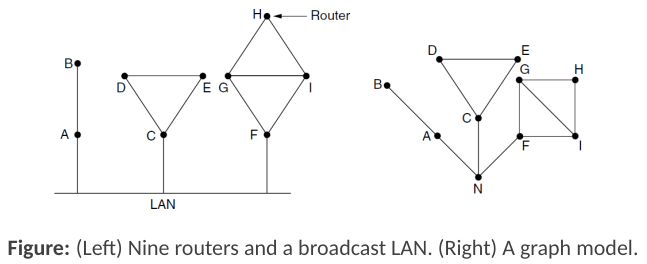

#### 2. Setting Link Costs

Once a router knows its neighbors, it must assign a cost (or distance metric) to the link for each neighbor. \
This cost is **used by the shortest path algorithm**.

* The cost can be **manually configured** by the network operator or **set automatically** by the system.
* Examples of cost, as said, are bandwidth, delay, ...
    * A common automatic approach is to set the cost **inversely proportional to the bandwidth** of the link. 
        * For example, a 1 Gbps Ethernet link might have a cost of 1, while a slower 100 Mbps Ethernet link would have a higher cost, such as 10. 
        * This prioritizes higher bandwidth paths.
    * In networks that span large geographical areas, the **propagation delay** of the link may also be factored into the cost to favor shorter, faster links.
    * Delay can be estimated by sending an **ECHO packet** to the neighbor. 
        * The ***round-trip time*** is measured, and then divided by two to get an approximate one-way delay for that link.

#### 3. Building Link State Packets (LSPs)

After a router has discovered its neighbors and determined the cost of the links to them, it consolidates this information into a **Link State Packet (LSP)**.

The LSP typically contains:
* The **identity of the sender** (the router creating the LSP).
* A **sequence number** (to distinguish new LSPs from older ones).
* An **age field** (to prevent old LSPs from circulating indefinitely).
* A **list of its direct neighbors** and the **cost associated with reaching each of these neighbors**.

Essentially, each LSP represents a piece of the network topology from the perspective of the originating router.

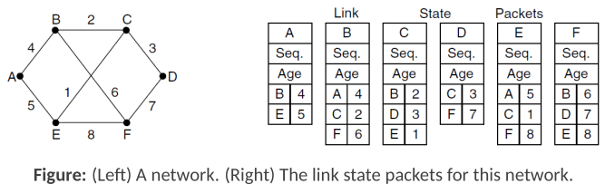

#### 4. Distributing Link State Packets

The **crucial step** for sharing topology information is the distribution of these LSPs to all other routers in the network. 
    * This is typically accomplished using **flooding**.

* To manage the flooding process and prevent LSPs from circulating endlessly or being processed out of order, several mechanisms are used:
    * **Sequence Numbers**: Each LSP contains a sequence number that the originating router increments for each new LSP it sends. Routers keep track of the highest sequence number received from each other router.
        * If an incoming LSP is **new** (higher sequence number than the one stored), it is **forwarded** on all links except the one on which it arrived.
        * If it's a **duplicate** (same sequence number as one already seen), it is **discarded**.
        * If it's **obsolete** (lower sequence number than the highest one seen), it is **rejected**.
    * **Age Field**: To address potential issues like a router crashing and losing its sequence number, or sequence numbers wrapping around, LSPs also include an "age" field. 
        * This age is periodically decremented (e.g., once per second). 
        * When a packet's **age reaches zero**, the information from that router (contained in that LSP) is **discarded** from the network map. 
            * This ensures that **stale information** is eventually **purged**.

#### 5. Computing the New Routes

Once a router has received LSPs from all other routers in the network, it has a complete picture of the network's topology—all routers and their connecting links with associated costs.

* With this complete graph:
    * Each link is effectively **represented twice**, once for each direction, and these directions can have different costs.
    * The router can then run a **shortest path algorithm (like Dijkstra's)** locally on this graph.
        * This computation determines the shortest path from itself to every other destination router in the network.
* The results of this algorithm (the shortest paths and the next hop to take for each destination) are then installed into the router's **forwarding table (routing table)**.

* **Performance**: Link state routing generally **converges quickly** to stable routes and does not suffer from the slow convergence problems that can affect distance vector protocols. 
    * The **memory required** is proportional to $\large kn$ and **computation time** grows faster than $\large kn$, where $\large n$ is the number of routers and $\large k$ is the average number of neighbors.

## Network Layer in the Internet

The Internet is not a single, monolithic network but rather a vast, interconnected collection of many individual networks. These networks can vary widely in size, ownership, and technology.

The overall structure includes:
* **Backbone Networks**: Large, high-speed networks that span countries or even continents (e.g., a U.S. backbone, a European backbone). These are often connected by high-capacity leased transatlantic lines or other international links.
* **Regional Networks**: Intermediate-scale networks that might cover a specific geographic region.
* **Mobile Networks**: Networks providing connectivity to mobile devices, often using technologies like WiMAX.
* **Local Networks**: Smaller networks, such as:
    * **Company Networks (Enterprise Networks)**: Internal networks used by businesses, often using Ethernet and connected to the wider Internet via IP routers.
    * **Home Networks**: Small networks used in homes, connecting via technologies like cable.

These diverse networks are linked together by IP routers, allowing data to traverse from a host on one network to a host on any other network within the global Internet.

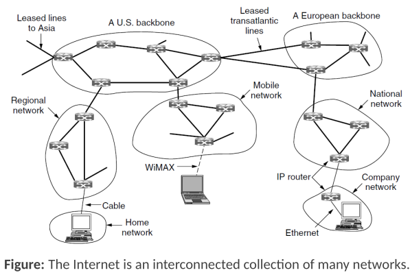

## The Internet Protocol (IP)

The Internet Protocol (IP) is fundamental to the functioning of the Internet and was designed with internetworking as a core principle from its inception. 
* It offers a ***"best-effort" delivery service***, meaning it **tries its best** to transport packets from their source to their destination but **provides no guarantees** about delivery, order, or error-free transmission.

Communication using IP generally follows these **steps**:
* The **transport layer** (e.g., TCP or UDP) at the source host takes data streams and breaks them into smaller units, which are then encapsulated into IP packets. 
    * These packets are typically **no larger than 1500 bytes**.
* These IP packets are then handed to **IP routers**, which forward each packet independently through the interconnected networks of the Internet, moving it closer to the destination host.
* A single packet will usually traverse **multiple networks and a significant number of IP routers** on its journey.
* When the packets arrive at the **destination host's network layer**, they are reassembled back into the original ***datagram*** (if they were fragmented) and then passed up to the transport layer for the receiving application or process.

### IP Version 4 (IPv4) Protocol

An IP Version 4 (IPv4) **datagram** is composed of two main parts:
* The **header**, which contains **control information** for routing and delivery.
* The **body** or **payload**, which carries the **actual data** from the higher layer (e.g., a TCP segment or UDP datagram).

The IPv4 header itself has a **20-byte fixed part** and can also include a **variable-length optional part**.

The structure of the IPv4 header includes the following fields:

* **Version**: Indicates the **IP version** (e.g., 4).
* **IHL (Internet Header Length)**: Specifies the length of the header in 32-bit words.
* **Differentiated Services**: Used for quality of service (QoS) purposes.
* **Total Length**: The total length of the IP datagram (header + payload) in bytes.
* **Identification**: Used to identify fragments of an original IP datagram.
* **Flags**: Control flags related to fragmentation (e.g., DF - Don't Fragment, MF - More Fragments).
* **Fragment Offset**: Indicates where a particular fragment belongs in the original IP datagram.
* **Time to Live (TTL)**: Limits the lifetime of a packet to prevent it from circulating indefinitely.
* **Protocol**: Specifies the higher-level protocol to which the payload should be delivered at the destination (e.g., TCP, UDP).
* **Header Checksum**: A checksum calculated over the header fields to detect errors in the header.
* **Source Address**: The 32-bit IPv4 address of the sending host.
* **Destination Address**: The 32-bit IPv4 address of the receiving host.
* **Options**: Allows for additional control information if needed (variable length).

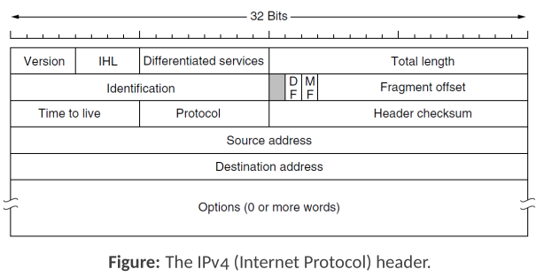

### IP Version 6 (IPv6) Protocol

The exponential growth of the Internet led to the realization that the 32-bit address space of IPv4 would eventually be exhausted. **IP Version 6 (IPv6)** was developed primarily to address this limitation, along with other improvements.

* **Larger Addressing Space**: IPv6 uses **128-bit addresses**, providing an enormous number of possible addresses ($2^{128}$), which is effectively an unlimited supply for the foreseeable future.
* **Simplified Header**: The IPv6 header has been simplified compared to the IPv4 header. Some IPv4 header fields were removed or made optional (moved to extension headers). This simplification allows routers to process IPv6 packets more quickly, potentially improving throughput and reducing delays.

The introduction of IPv6 aims to ensure the continued expansion and evolution of the Internet by overcoming the addressing limitations of IPv4 and streamlining packet processing.

### IP Addressing

IP addresses are used to uniquely identify devices (hosts and routers) on a network. 

In IPv4, these addresses have specific characteristics:

* **Structure**: Each IPv4 address is 32 bits long. It is divided into two main parts, with variable boundary:
    * A **network portion** (***prefix***). 
        * This part identifies the specific network to which the device is connected.
    * A **host portion**. 
        * This part identifies a specific device (host) within that network.
* **Network Identification**: All hosts and router interfaces on the same logical network share the same network portion in their IP addresses.
* **Dotted Decimal Notation**: For human readability, 32-bit IP addresses are typically written as four decimal numbers separated by dots (periods). 
    * Each number represents one byte (8 bits) of the address. 
    * For example, `192.168.1.1`.
* **Prefix Notation (CIDR Notation)**: The network portion of an address is often described by its length in bits. This is appended to the IP address with a slash. 
    * For example, `128.208.0.0/24` indicates that the first 24 bits represent the network portion, leaving the remaining $32-24=8$ bits for the host portion. 
    * This /24 corresponds to a binary **subnet mask** where the first 24 bits are 1s and the last 8 bits are 0s (e.g., `255.255.255.0`).

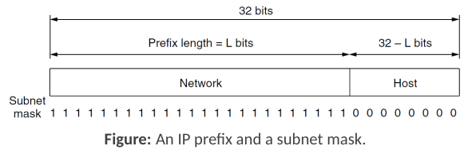

### Classful Addressing (SKIP?)

Before 1993, IPv4 addresses were organized using a system known as **classful addressing**. This system divided the entire 32-bit address space into five distinct classes: A, B, C, D, and E. Each class had a predefined number of bits for the network portion and the host portion.

* **Class A**:
    * Identified by the first bit being `0`.
    * Allocated 7 bits for the network ID and 24 bits for the host ID.
    * Supported a small number of very large networks (up to $2^{24}$ - 2, or over 16 million, hosts per network).
    * Address range: `1.0.0.0` to `127.255.255.255`.
* **Class B**:
    * Identified by the first two bits being `10`.
    * Allocated 14 bits for the network ID and 16 bits for the host ID.
    * Supported a moderate number of medium-sized networks (up to $2^{16}$ - 2, or 65,534, hosts per network).
    * Address range: `128.0.0.0` to `191.255.255.255`.
* **Class C**:
    * Identified by the first three bits being `110`.
    * Allocated 21 bits for the network ID and 8 bits for the host ID.
    * Supported a large number of small networks (up to $2^8$ - 2, or 254, hosts per network).
    * Address range: `192.0.0.0` to `223.255.255.255`.
* **Class D**:
    * Identified by the first four bits being `1110`.
    * Reserved for **multicast addressing**.
    * Address range: `224.0.0.0` to `239.255.255.255`.
* **Class E**:
    * Identified by the first four bits being `1111`.
    * Reserved for **future or experimental use**.
    * Address range: `240.0.0.0` to `255.255.255.255`.

Unfortunately, this rigid classful system proved to be very inefficient. It often led to **wasting millions of IP addresses**, as organizations were typically assigned a class that was either too large for their needs (leading to many unused host addresses) or too small. This inefficiency was a major factor leading to the development of classless addressing (CIDR).

### Classless Inter-Domain Routing (CIDR)

Classless Inter-Domain Routing (CIDR) was developed to replace the inefficient classful addressing system and to slow down the exhaustion of IPv4 addresses. It also helps in managing the size of global routing tables.

* **Route Aggregation (Supernetting)**: The core idea of CIDR is **route aggregation**, also known as supernetting. This allows multiple smaller IP address prefixes to be combined into a single, larger prefix. For instance, sixteen /24 networks that are contiguous in the address space could be aggregated and advertised to the rest of the Internet as a single /20 route.
* **Variable-Length Prefixes**: With CIDR, IP addresses are no longer constrained by fixed class boundaries (A, B, C). Instead, network prefixes can be of any length, specified by the slash notation (e.g., /19, /22). This allows for address allocations that more closely match the actual needs of an organization.
* **Reduced Routing Table Size**: By aggregating routes, routers in the Internet backbone need to store fewer individual routes, which helps prevent "routing table explosion" and improves routing efficiency.

#### Longest Matching Prefix

When CIDR is used, a router's forwarding table can contain multiple prefixes of varying lengths that might overlap. If a destination IP address matches more than one entry in the routing table, the router uses the **longest matching prefix rule**. This means the packet is forwarded according to the route entry that has the longest network prefix (i.e., the most specific match).

* **Example**:
    * A router in New York might have a general route (e.g., a /16) for traffic going to a region in London that hosts several universities.
    * If one of those universities then allocates a part of its address space (say, a /24 within that /16) to a campus in San Francisco, the New York router would need two entries:
        1.  The original /16 route pointing towards London.
        2.  A new, more specific /24 route for the San Francisco campus, pointing in a different direction.
    * When a packet arrives destined for an IP address within that /24 San Francisco block, it will match both the /16 London route and the /24 San Francisco route. According to the longest matching prefix rule, the /24 route (being more specific) will be chosen, and the packet will be correctly routed to San Francisco. Packets for other parts of the /16 London block will use the /16 route.

### Subnetting

To address the inefficiencies of classful addressing and provide more flexible IP address allocation within an organization, the concept of **subnetting** was introduced.

Subnetting allows a single, larger block of IP addresses (assigned to an organization) to be **divided or split into several smaller**, independent parts. 
* These smaller parts, known as ***subnets***, can be used to create **multiple logical networks** for internal use. 
* To the outside world (the rest of the Internet), this collection of subnets **still appears as a single**, contiguous network block.

#### Subnetting Example

For example, an organization might be assigned a /16 prefix. Using subnetting, they could divide this /16 block into:
* One /17 block for a large department.
* Several /18 blocks for smaller departments.
* Many /19 or smaller blocks for specific functions or smaller groups.

Each subnet operates as an independent network, allowing for better organization, improved security through isolation, and more efficient use of the assigned IP address space.

An organization with a /16 address block (e.g., `128.208.0.0/16`) can divide this space to suit its internal structure. The division doesn't have to be into equally sized subnets, but each subnet's prefix length must correspond to a valid bit boundary.

Consider the example from the slides where the `128.208.0.0/16` block is allocated as follows:
* **Computer Science (CS)** department receives half of the block, which is a /17 network.
    * Binary representation (relevant part): `10000000 11010000 1xxxxxxx xxxxxxxx` (e.g., `128.208.128.0/17`)
* **Electrical Engineering (EE)** department receives a quarter of the original block, which is a /18 network.
    * Binary representation (relevant part): `10000000 11010000 00xxxxxx xxxxxxxx` (e.g., `128.208.0.0/18`)
* **Art** department receives one-eighth of the original block, which is a /19 network.
    * Binary representation (relevant part): `10000000 11010000 011xxxxx xxxxxxxx` (e.g., `128.208.96.0/19`)
* The remaining one-eighth of the /16 block is unallocated in this example.

When a packet arrives at a router that is responsible for this /16 block, the router examines the packet's destination IP address. To determine which specific subnet the packet belongs to, the router performs a logical AND operation between the destination IP address and the subnet mask of each configured subnet. The subnet whose network prefix matches the result of this operation is the correct destination subnet for the packet.

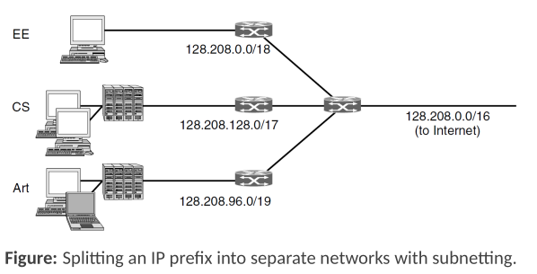

### IP Subnetting Exercise (By Gemini, CORRECTNESS NOT CHECKED)

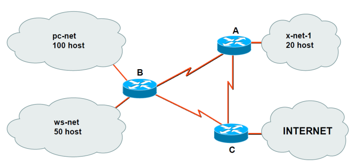

This exercise demonstrates how to subnet a given IP address block based on network requirements.
The starting address block is `192.168.0.0/24`.

**1. Network Requirements Identification**

The network diagram shows the following requirements:
* **Host Networks**:
    * pc-net: 100 hosts
    * ws-net: 50 hosts
    * x-net-1: 20 hosts
* **Point-to-Point Links between Routers**:
    * Link-1 (Router A - Router B)
    * Link-2 (Router B - Router C)
    * Link-3 (Router A - Router C)
* Connection to the INTERNET (typically requires a link, often a /30 or a public IP on an interface).

In total, there are 6 distinct networks/subnets to be created from the `192.168.0.0/24` block: 3 host networks and 3 inter-router links. IP addresses will be needed for each host and for each router interface connected to these subnets.

**2. Calculating Required IP Addresses and Prefix Lengths**

For each subnet, we need to determine the number of IP addresses required and the corresponding prefix length (subnet mask). The formula $2^{\large nh} - 2 \ge \text{number of required host IPs}$ is used, where $\large nh$ is the number of bits for the host portion. For router interfaces on host networks, these count as one of the required IPs. Point-to-point links require 2 IP addresses.

* **pc-net (100 hosts)**:
    * Requires 100 IPs for hosts + 1 IP for the router interface = 101 IPs.
    * We need $\large nh$ such that $2^{\large nh} - 2 \ge 101$.
    * If $\large nh=6$, $2^6 - 2 = 64 - 2 = 62$ (too small).
    * If $\large nh=7$, $2^7 - 2 = 128 - 2 = 126$ (sufficient).
    * Prefix length = $32 - \large nh = 32 - 7 = 25$. So, a **/25** subnet.
* **ws-net (50 hosts)**:
    * Requires 50 IPs for hosts + 1 IP for the router interface = 51 IPs.
    * We need $\large nh$ such that $2^{\large nh} - 2 \ge 51$.
    * If $\large nh=5$, $2^5 - 2 = 32 - 2 = 30$ (too small).
    * If $\large nh=6$, $2^6 - 2 = 64 - 2 = 62$ (sufficient).
    * Prefix length = $32 - 6 = 26$. So, a **/26** subnet.
* **x-net-1 (20 hosts)**:
    * Requires 20 IPs for hosts + 1 IP for the router interface = 21 IPs.
    * We need $\large nh$ such that $2^{\large nh} - 2 \ge 21$.
    * If $\large nh=4$, $2^4 - 2 = 16 - 2 = 14$ (too small).
    * If $\large nh=5$, $2^5 - 2 = 32 - 2 = 30$ (sufficient).
    * Prefix length = $32 - 5 = 27$. So, a **/27** subnet.
* **Link-1, Link-2, Link-3 (each needs 2 IPs for router interfaces)**:
    * We need $\large nh$ such that $2^{\large nh} - 2 \ge 2$.
    * If $\large nh=2$, $2^2 - 2 = 4 - 2 = 2$ (sufficient).
    * Prefix length = $32 - 2 = 30$. So, each link will be a **/30** subnet.

**3. Allocating Subnet Addresses**

The subnets are typically allocated from the base address block (`192.168.0.0/24`) by assigning them contiguously, starting with the largest subnet first to optimize address space utilization.

* **Base Network**: `192.168.0.0/24` (Range: `192.168.0.0` to `192.168.0.255`)

1.  **pc-net (/25)**: Needs $2^7 = 128$ addresses.
    * Network Address: `192.168.0.0`
    * Subnet Mask: `255.255.255.128`
    * Range: `192.168.0.0` - `192.168.0.127`
    * Binary (last octet of network address): `00000000`
2.  **ws-net (/26)**: Needs $2^6 = 64$ addresses. Starts after pc-net.
    * Network Address: `192.168.0.128`
    * Subnet Mask: `255.255.255.192`
    * Range: `192.168.0.128` - `192.168.0.191`
    * Binary (last octet of network address): `10000000`
3.  **x-net-1 (/27)**: Needs $2^5 = 32$ addresses. Starts after ws-net.
    * Network Address: `192.168.0.192`
    * Subnet Mask: `255.255.255.224`
    * Range: `192.168.0.192` - `192.168.0.223`
    * Binary (last octet of network address): `11000000`
4.  **Link-1 (/30)**: Needs $2^2 = 4$ addresses. Starts after x-net-1.
    * Network Address: `192.168.0.224`
    * Subnet Mask: `255.255.255.252`
    * Range: `192.168.0.224` - `192.168.0.227`
    * Binary (last octet of network address): `11100000`
5.  **Link-2 (/30)**: Needs 4 addresses. Starts after Link-1.
    * Network Address: `192.168.0.228`
    * Subnet Mask: `255.255.255.252`
    * Range: `192.168.0.228` - `192.168.0.231`
    * Binary (last octet of network address): `11100100`
6.  **Link-3 (/30)**: Needs 4 addresses. Starts after Link-2.
    * Network Address: `192.168.0.232`
    * Subnet Mask: `255.255.255.252`
    * Range: `192.168.0.232` - `192.168.0.235`
    * Binary (last octet of network address): `11101000`

**4. Specific IP Assignments**

Based on the subnet allocation, specific IP addresses are assigned to router interfaces and host ranges. (Note: The slide 133 in the presentation shows a different starting address for Link-3, `192.168.0.248`. The following assignments will use the values from that slide for the links, which implies some addresses between `192.168.0.231` and `192.168.0.248` might have been reserved or the allocation adjusted.)

* **pc-net**: Network `192.168.0.0`, Mask `255.255.255.128`
    * Router B (e.g., eth0 interface): `192.168.0.1`
    * Hosts (100): `192.168.0.2` to `192.168.0.101` (usable range `192.168.0.1` to `192.168.0.126`)
* **ws-net**: Network `192.168.0.128`, Mask `255.255.255.192`
    * Router B (e.g., eth1 interface): `192.168.0.129`
    * Hosts (50): `192.168.0.130` to `192.168.0.179` (usable range `192.168.0.129` to `192.168.0.190`)
* **x-net-1**: Network `192.168.0.192`, Mask `255.255.255.224`
    * Router A (e.g., eth1 interface): `192.168.0.193`
    * Hosts (20): `192.168.0.194` to `192.168.0.213` (usable range `192.168.0.193` to `192.168.0.222`)
* **Link-1**: Network `192.168.0.224`, Mask `255.255.255.252`
    * Router B (e.g., eth2 interface): `192.168.0.225`
    * Router A (e.g., eth0 interface): `192.168.0.226`
* **Link-2**: Network `192.168.0.228`, Mask `255.255.255.252`
    * Router B (e.g., eth3 interface): `192.168.0.229`
    * Router C (e.g., eth2 interface): `192.168.0.230`
* **Link-3**: Network `192.168.0.248`, Mask `255.255.255.252` (as per slide 133)
    * Router A (e.g., eth2 interface): `192.168.0.249`
    * Router C (e.g., eth0 interface): `192.168.0.250`

**Routing Table for Router B**

Based on the network topology and IP assignments from the exercise, Router B's routing table would be constructed to direct traffic appropriately. The table would include entries for directly connected networks and routes to remote networks via its neighbors (Router A and Router C).

A simplified representation of Router B's routing table might look like this:

| Destination Network | Subnet Mask       | Next Hop IP     | Outgoing Interface on B |
| :------------------ | :---------------- | :-------------- | :---------------------- |
| `192.168.0.0`       | `255.255.255.128` | Directly Connected | eth0 (pc-net)           |
| `192.168.0.128`     | `255.255.255.192` | Directly Connected | eth1 (ws-net)           |
| `192.168.0.224`     | `255.255.255.252` | Directly Connected | eth2 (to Router A)      |
| `192.168.0.228`     | `255.255.255.252` | Directly Connected | eth3 (to Router C)      |
| `192.168.0.192`     | `255.255.255.224` | `192.168.0.226`   | eth2 (to Router A)      |
| `192.168.0.248`     | `255.255.255.252` | `192.168.0.226`   | eth2 (to Router A for A's side of Link-3) *or* `192.168.0.230` (to Router C for C's side of Link-3) |
| `0.0.0.0` (Default) | `0.0.0.0`         | `192.168.0.230`   | eth3 (to Router C, assuming C is gateway to Internet) |

* **Directly Connected**: For networks pc-net, ws-net, Link-1, and Link-2, Router B knows they are directly attached to its interfaces.
* **Remote Networks**:
    * To reach **x-net-1** (`192.168.0.192/27`), which is connected to Router A, packets are sent to Router A's IP address on Link-1 (`192.168.0.226`) via Router B's `eth2` interface.
    * To reach **Link-3** (`192.168.0.248/30`), if the specific destination is Router A's interface on Link-3 (`192.168.0.249`), Router B would route via its `eth2` to `192.168.0.226`. If the destination is Router C's interface on Link-3 (`192.168.0.250`), Router B would route via its `eth3` to `192.168.0.230`. Specific host routes or more detailed static routes might be needed if just the network address of Link-3 is used.
    * A **default route** (`0.0.0.0/0`) is used to send traffic destined for networks not explicitly listed in the table (e.g., the Internet). This traffic is typically directed towards a gateway router (assumed to be Router C in this example).

