# Transport Layer

## Transport Services and Protocols

While the network layer handles data transfer between end systems (hosts), the **transport layer** extends this to enable communication **directly between specific processes** on those systems.

Key characteristics of transport services and protocols include:

* **End-System Operation**: Transport protocols, such as TCP and UDP, **run in the end systems** (i.e., on the hosts involved in the communication), not in the intermediate network routers.
* **Enhancement of Network Layer**: Transport layer services rely on the services provided by the network layer (e.g., IP, which provides host-to-host delivery). 
    * The transport layer then enhances these services to provide features for application needs, such as reliability or process-to-process addressing.
* **Process-to-Process Delivery**: The core distinction is that:
    * **Network layer** gets data to the **correct host**.
    * **Transport layer** gets data to the **correct process** running on that host.

The messages exchanged between transport layer entities (e.g., from the transport layer on one host to the transport layer on another) are commonly referred to as **segments**. These segments are encapsulated within network layer packets (like IP packets), which are themselves encapsulated within link layer frames for transmission over a physical medium.

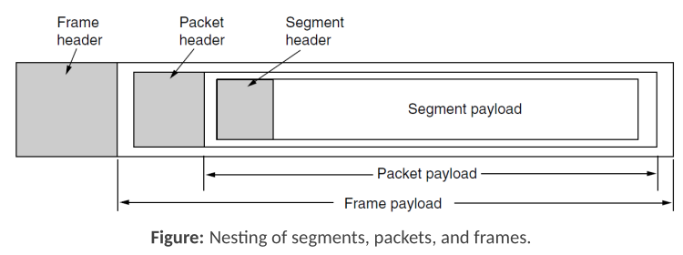

The transport layer offers different protocols to cater to various application requirements. The two most prominent transport protocols in the Internet suite are:

### Transmission Control Protocol (TCP)

TCP is designed to provide **reliable, in-order delivery** of a stream of bytes. 

It is a **connection-oriented** protocol, meaning a logical connection must be established between the sender and receiver (using a process called a *three-way handshake*) before any application data is transferred. 
    * This setup allows both ends to negotiate parameters and allocate resources.

**Key Characteristics and Advantages:**
* **Reliable Delivery**: TCP guarantees that data sent will arrive at the receiver correctly, without errors, loss, or duplication. It uses mechanisms like sequence numbers, acknowledgments (ACKs), and retransmissions to achieve this.
* **In-Order Delivery**: It ensures that data segments are delivered to the receiving application in the same order they were sent by the sending application.
* **Flow Control**: TCP implements flow control to prevent a fast sender from overwhelming a slow receiver. The receiver advertises how much data it can currently buffer, and the sender adjusts its transmission rate accordingly.
* **Congestion Control**: TCP includes mechanisms to detect and respond to network congestion. It adjusts the sending rate to avoid overloading the network, helping to ensure fair sharing of network resources among different TCP connections.
* **Full-Duplex Communication**: Once a connection is established, data can flow in both directions simultaneously.

**Common Use Cases:**
TCP is used by a vast majority of popular Internet applications where reliability is critical:
* **World Wide Web (HTTP/HTTPS)**: For loading web pages and secure web communication.
* **Email (SMTP, POP3, IMAP)**: For sending and receiving email messages.
* **File Transfer (FTP, SFTP)**: For reliable transfer of files between systems.
* **Secure Shell (SSH)**: For secure remote login and command execution.
* **Streaming services where quality is paramount**: While some streaming uses UDP, services that cannot tolerate loss (or handle it at a higher layer after TCP delivery) might use TCP.
* Any application where the accurate and ordered delivery of all data is more important than minimizing latency or overhead.

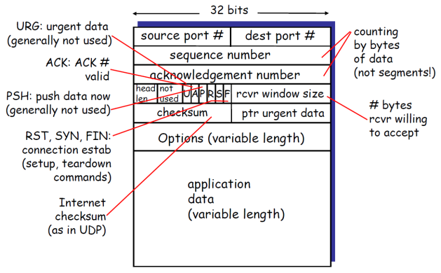

## TCP Connection Management

TCP is a **connection-oriented protocol**, which means that before application data can be exchanged, the TCP entities in the sender and receiver **must establish a logical connection**. 
* This process also involves **tearing down** the connection once **communication is complete**.

During connection setup, **several TCP variables** are initialized, including:
* Sequence numbers for ordering and reliability.
* Information about buffers and flow control parameters (like the initial `RcvWindow`).

### Three-Way Handshake

The process for establishing a TCP connection is known as the **three-way handshake**:

1.  **Step 1: SYN**: The client (initiating end system) sends a special TCP segment with the **SYN** (synchronize) control bit set to the server. 
    * This segment also specifies the *client's initial sequence number* (ISN).
2.  **Step 2: SYN-ACK**: The server end system receives the SYN segmen. 
    * **If it accepts** the connection, it allocates buffers and replies with a TCP segment that has both the SYN and ACK control bits set a SYN-ACK segment. 
    * This segment acknowledges the client's SYN by including an acknowledgment number based on the client's ISN and also specifies the server's own initial sequence number.
3.  **Step 3: ACK**: The **client receives the SYN-ACK segment** from the server. 
    * It then replies with another TCP segment that has the ACK bit set. 
    * This segment acknowledges the server's SYN-ACK.

Once this third ACK is received by the server, the **connection is established**, and data **transfer can begin**.

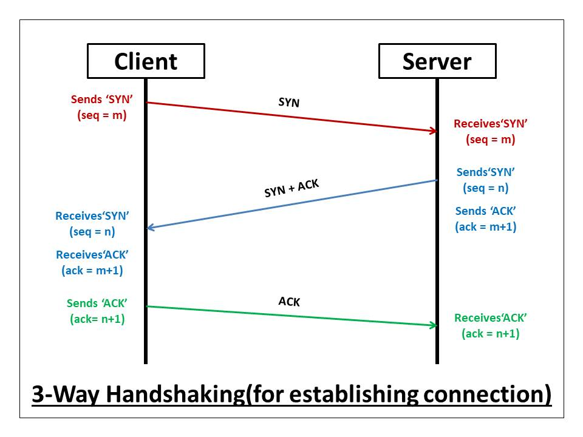

### User Datagram Protocol (UDP)

UDP is a transport protocol that provides a minimalistic, **connectionless** service. 
    * This means there is no initial handshaking procedure between the sender and receiver before data is exchanged
    * Each UDP segment is handled independently.

**Key Characteristics and Advantages:**
* **No Connection Establishment Delay**: UDP does not require a connection setup phase, which can save time, making it faster to start sending data.
* **Simplicity**: It's a simple protocol with no connection state maintained by the sender or receiver.
* **Small Segment Header**: UDP headers are small (8 bytes), resulting in low overhead.
* **No Congestion Control**: UDP does not inherently implement congestion control. This means it can send data as fast as the application and the underlying system desire, without throttling based on network congestion. This can be beneficial for some applications but can also contribute to network congestion if not managed carefully at the application level.

**Common Use Cases:**
UDP is often used for applications that are:
* **Streaming Multimedia**: Applications like video and audio streaming can tolerate some data loss but are sensitive to delays. UDP's lack of retransmission and connection management overhead makes it suitable.
* **DNS (Domain Name System)**: DNS queries are typically small and benefit from quick request-response cycles.
* **SNMP (Simple Network Management Protocol)**.
* Applications where **rate sensitivity** is important and that can handle **loss tolerance** at the application layer. If reliability is needed with UDP, it must be implemented by the application itself.

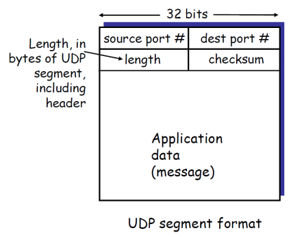

## Reliable Data Transfer (RDT)

A primary goal of many transport protocols, like TCP, is to provide **reliable data transfer** over an underlying network layer that is **inherently unreliable** (e.g., IP, which can lose, reorder, or corrupt packets). 

The complexity of the **reliable data transfer** (***RDT***) protocol designed to achieve this depends significantly on the characteristics of the underlying unreliable channel.

These channel characteristics include:
* **Bit Errors**: Bits within a packet can be flipped or corrupted during transmission.
* **Delay**: Packets can experience variable and unpredictable delays.
* **Packet Loss**: Packets can be lost entirely within the network.

**Main goal**: The RDT protocol aims to transform this unreliable service into a reliable one for the application layer, ensuring that data is delivered correctly, completely, and in order.

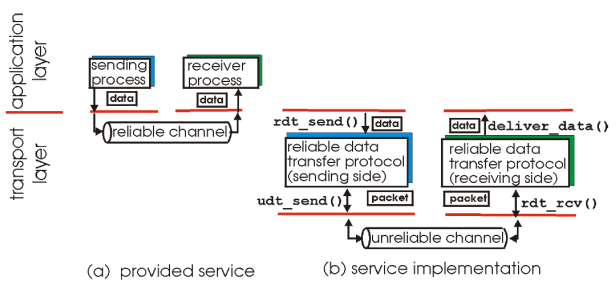

### Handling Bit Errors

One of the fundamental challenges in ***RDT*** is dealing with **bit errors**, where the data within a packet gets corrupted during transmission over the underlying channel.

The key question for the sender is: **how does it know that an error has occurred at the receiver?** à

**Two primary mechanisms** are used for feedback from the receiver:

* **Acknowledgments (ACKs)**: The receiver sends a **positive acknowledgment (ACK)** back to the sender to indicate that a packet (or a sequence of packets) was **received correctly and without errors**.
* **Negative Acknowledgments (NAKs)**: If the receiver **detects an error** in a received packet, it can send a **negative acknowledgment (NAK)** back to the sender. 
    * This explicitly informs the sender that the specified packet was corrupted. 
    * Upon receiving a NAK, the sender typically **retransmits** the erroneous packet.

#### Dealing with Corrupted Feedback and Duplicates

Consider a situation where:
1.  The sender transmits a packet (e.g., Pkt0).
2.  The receiver successfully receives Pkt0 and sends an acknowledgment (ACK0) back.
3.  However, this ACK0 gets corrupted during its return journey to the sender.

If the ACK0 is corrupted, the sender doesn't receive proper confirmation.

The sender might then time out waiting for the ACK or receive the garbled ACK and be unable to interpret it. 
* In such cases, the sender will typically retransmit Pkt0. 
* This means the receiver will get a second copy of Pkt0, which is a duplicate of a packet it has already processed.

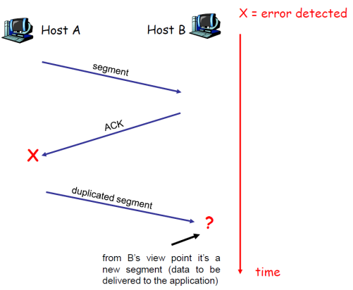

To handle such situations and **prevent duplicate data** from being delivered to the application layer, reliable data transfer protocols employ sequence numbers:

* **Sequence Numbers**: The sender adds a sequence number to each packet it transmits. 
    * This number uniquely identifies the packet (or its position in the data stream).
* **Retransmission**: If an **ACK/NAK is corrupted or lost**, the sender **retransmits** the packet with the same sequence number.
* **Duplicate Detection by Receiver**: When the receiver gets a packet, it **checks the sequence number**. 
    * If it has already successfully received and processed a packet with that same sequence number, it recognizes the newly arrived packet as a **duplicate and discards it** 
    * Receiver, usually, still sends an ACK for it to ensure the sender stops retransmitting.

#### Stop-and-Wait Protocol

A simple protocol that incorporates these ideas is the **Stop-and-Wait** protocol. 

Its operation is straightforward:
* The sender transmits a single packet.
* It then stops and waits for a response (an ACK) from the receiver before sending the next packet.

If the ACK doesn't arrive within a certain timeout period, or if a NAK is received (in protocols that use NAKs), the sender retransmits the packet. 

**Sequence numbers** are essential here to allow the receiver to distinguish between a new packet and a retransmission of a previous one.

#### NAK-Free Approach

Some protocols opt for a "NAK-free" design to **simplify error reporting**:
* Instead of sending explicit NAKs when a corrupted packet is received, the receiver simply sends an **ACK for the last packet it received correctly and in order**.
* For this to work effectively, the receiver must explicitly include the sequence number of the packet it is acknowledging in the ACK message.
* If the sender receives a duplicate ACK for an older packet, or if it times out waiting for an ACK for the current packet, it can infer that the current packet (or its ACK) was lost or corrupted and **retransmit it**.

Okay, let's proceed with how reliable data transfer protocols address the issue of packet loss.

### Handling Packet Loss with Timeouts

The underlying channel can also **lose packets entirely**

This applies to both data packets sent from the sender to the receiver and ACK/NAK packets sent from the receiver back to the sender. While mechanisms like checksums (for error detection), sequence numbers (for duplicate detection), and acknowledgments are helpful, they are not sufficient on their own to deal with lost packets.

**The primary question is: how does the sender detect and recover from a lost packet if it never reaches the receiver (or if the receiver's ACK is lost)?**

The common approach is to use **timeouts**:

* **Sender-Side Timer**: The sender starts a **countdown timer** each time it sends a data packet.
* **Waiting for ACK**: The sender then waits for an ACK for that packet. 
    * The duration of the timer is set to a "reasonable" amount of time, which should be long enough for the packet to reach the receiver and for the ACK to travel back under normal conditions.
* **Retransmission on Timeout**: If the **timer expires** before ACK is receive, for that specific packet, the sender assumes the packet (or its ACK) was lost. 
    * It **retransmits the packet**.
* **Handling Delayed Packets/ACKs**: It's possible that a packet or its ACK is not actually lost but just significantly delayed in the network.
    * If the sender times out and retransmits, this retransmission will arrive as a duplicate at the receiver if the original packet eventually arrives (or if the original ACK was just delayed and the sender already processed it).
    * As discussed before, the use of **sequence numbers** allows the receiver to identify and discard such duplicates.
    * To ensure clarity, ACKs should always specify the sequence number of the data packet they are acknowledging.

This timeout mechanism is a fundamental component for ensuring reliability in the face of packet loss.

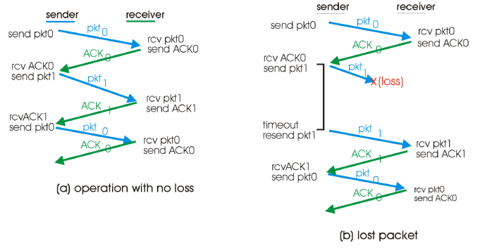
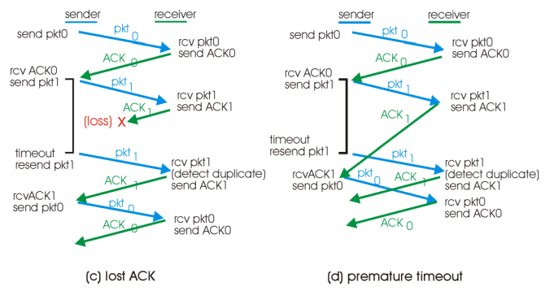

### Pipelined Protocols

***Stop-and-wait*** protocols are simple but inefficient because they **only allow one packet** to be sent but not yet acknowledged at a time ("*in-flight*"). 

***Pipelining*** allows the sender to transmit multiple packets without waiting for an acknowledgment for each one individually, significantly improving channel utilization.

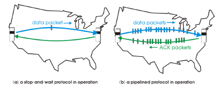

* **Pipelining Concept**:
    * The sender is permitted to send **multiple packets even before receiving acknowledgments** for earlier ones
        * These are considered "in-flight" packets.
    * To manage these multiple in-flight packets, the **range of sequence numbers used must be larger** than in stop-and-wait protocols.
    * **Buffering is required** at the sender (to store transmitted but unacknowledged packets, often managed by a "Transmission Window") and potentially at the receiver (to store correctly received but out-of-order packets).

There are **two generic forms**of pipelined reliable data transfer protocols:

* **Go-Back-N (GBN)**:
    * Uses **cumulative acknowledgments** (ACKs), where an ACK for sequence number $\large n$ acknowledges all packets up to and including $\large n$.
        * The receiver discards any out-of-order packets it receives.
* **Selective Repeat (SR)**:
    * Uses **selective acknowledgments**, where the receiver ACKs individual packets.
        * The receiver accepts and buffers out-of-order packets, typically in a receive buffer (Rcv Buffer), for later delivery to the application in the correct sequence.

#### Go-Back-N (GBN)

Go-Back-N is a reliable data transfer protocol that allows the sender to have multiple unacknowledged packets in flight, up to a certain **window size**.

**Sender-Side Behavior:**

* The sender number the packets.
* It maintains a "window" that allows for up to $\large N$ consecutive unacknowledged packets to be in flight at any time.

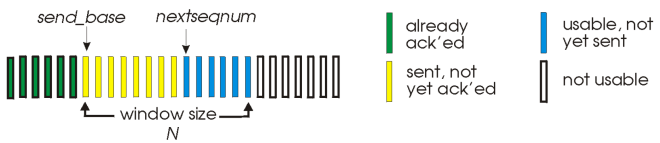

* **Acknowledgments (ACKs)**: GBN uses **cumulative acknowledgments**. 
    * An `ACK(n)` message from the receiver **confirms that all packets up to and including sequence number $\large n$ have been correctly received**.
* **Timers**: The sender typically maintains a timer for each packet that is currently in flight (or, more commonly, a **single timer for the oldest** unacknowledged packet).
* **Timeout Handling**: If a **timeout occurs** for a packet (let's say packet $\large n$), the sender **retransmits packet $\large n$ and all subsequent packets** that are within the current sending window (i.e., all higher sequence number packets that have already been sent but not yet acknowledged). 
    * This is the "**go back $\large N$**" aspect: if an error occurs with packet $\large n$, the sender "goes back" and resends packet $\large n$ and all packets after it in the window.

**Receiver-Side Behavior:**

The receiver in GBN is relatively simple in its logic.

* **Acknowledgment Policy**: Receiver will send an ACK for the correctly received packet that has the highest in-order sequence number. This policy may lead to the generation of **duplicate ACKs**. 
    * For instance, if packet $\large n$ is received correctly, but packet $\large n+1$ is lost, and then packet $\large n+2$ arrives, the receiver will discard $\large n+2$ (as it's out of order) and resend an ACK for packet $\large n$.
    * The receiver only needs to keep track of the next expected in-order sequence number.
* **Handling Out-of-Order Packets**: If a packet arrives out of order:
    * The packet is **discarded**. 
        * GBN receivers do **not buffer out-of-order packets**. 
    * The receiver **re-sends an ACK** for the highest in-order sequence number packet it has successfully received so far. 
        * This duplicate ACK serves as a signal to the sender that the expected packet has not yet arrived.

---

#### GBN Operational Example

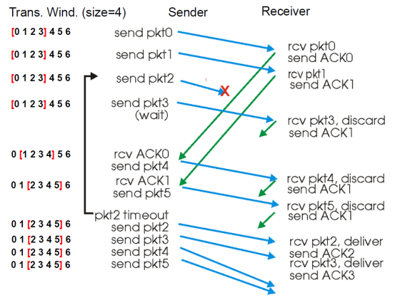

To illustrate Go-Back-N, consider the following scenario:
1.  The sender has a window of packets to send (e.g., Pkt0, Pkt1, Pkt2, Pkt3). It sends these packets sequentially.
2.  Assume Pkt0 and Pkt1 are successfully received by the receiver. The receiver sends ACK0 for Pkt0 and ACK1 for Pkt1. These are cumulative acknowledgments.
3.  Now, suppose Pkt2 is lost in transit.
4.  The sender, unaware of the loss, continues and sends Pkt3.
5.  The receiver receives Pkt3. However, since it was expecting Pkt2 (as Pkt1 was the last correctly received in-order packet), Pkt3 is considered out of order. The GBN receiver discards Pkt3. It then resends ACK1 (the ACK for the highest sequence number packet it has received in order).
6.  Meanwhile, the sender's timer for Pkt2 eventually expires because ACK2 (or a higher cumulative ACK) has not been received.
7.  Upon timeout for Pkt2, the sender "goes back" and retransmits Pkt2, and then retransmits all subsequent packets that were in its sending window, which includes Pkt3 in this case.

This example highlights GBN's behavior of discarding out-of-order packets at the receiver and the sender's need to retransmit a sequence of packets if an earlier packet is lost or its ACK is delayed.

---
#### Selective Repeat (SR) 

Unlike Go-Back-N, SR aims to **reduce unnecessary retransmissions** by having the sender retransmit only those packets that are suspected to be lost or corrupted, rather than all packets from a certain point onwards.

* **Individual Acknowledgments**: The receiver acknowledges each correctly received packet **individually**, rather than cumulative ACKs.
* **Receiver Buffering**: The **receiver buffers correctly received packets** that arrive out of order. 
    * Once the missing earlier packet(s) arrive, the buffered packets can be delivered to the application layer in the correct sequence.
* **Selective Retransmission**: The sender only retransmits packets for which it has not received an acknowledgment. 
    * This typically happens **after a timeout** for that specific unacknowledged packet.
* **Sender Timer per Packet**: The sender maintains a timer **for each unacknowledged packet** that is currently in flight.
* **Sender Window**: The sender maintains a window of $\large N$ consecutive sequence numbers. 
    * This window **limits the sequence numbers of packets that can be sent but are not yet acknowledged**.

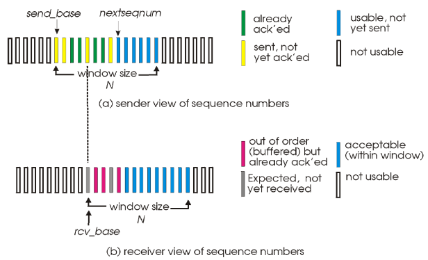

**Sender Logic:**
* **Data from Application**: If the next available sequence number for a new packet falls within the sender's current window, the sender creates and sends the packet.
* **Timeout for Packet $\large n$**: If the timer for packet $\large n$ expires, the sender resends packet $\large n$ and restarts its timer.
* **Receiving ACK($\large n$)**: If an ACK for packet $\large n$ arrives and $\large n$ is within the current send window (e.g., between `sendbase` and `sendbase+N-1`):
    * The sender marks packet $\large n$ as received.
    * If $\large n$ is the **smallest sequence number** among the unacknowledged packets (i.e., it's at the `sendbase`), the **sender advances the window base** to the next unacknowledged sequence number.

**Receiver Logic:**
* **Packet $\large n$ arrives within expected window `[rcvbase, rcvbase+N-1]`**:
    * The receiver sends an `ACK(n)` for this packet.
    * If the packet is out of order (i.e., $\large n > \text{rcvbase}$), it is buffered.
    * If the packet is in order (i.e., $\large n = \text{rcvbase}$), it is delivered to the upper layer. Any consecutively sequenced packets already buffered are also delivered. The receive window base (`rcvbase`) is then advanced to the next sequence number not yet received.
* **Packet $\large n$ arrives, $\large n$ is within `[rcvbase-N, rcvbase-1]`**:
    * This means the packet is one that the receiver has **previously acknowledged** and delivered
        * It's part of the "history" just outside the current receive window. 
        * An `ACK(n)` is **sent again** to ensure the sender receives it, in case the previous ACK was lost. 
            * This helps the sender's window to **advance correctly**.
* **Otherwise (packet is outside these ranges)**:
    * The packet is **ignored**.
---
#### SR Operational Example

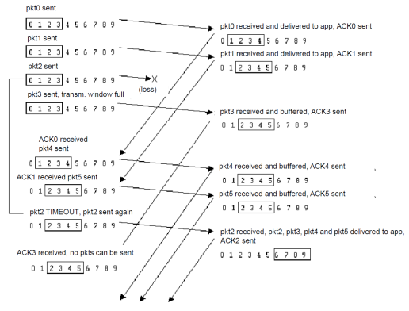

Consider an SR sender and receiver, each with a window size (e.g., of 4 packets).
1.  The sender transmits Pkt0, Pkt1, Pkt2, and Pkt3.
2.  Suppose Pkt0 and Pkt1 are received correctly. The receiver sends ACK0 and ACK1, buffers Pkt0 and Pkt1, and delivers them to the application. The receive window advances.
3.  Now, assume Pkt2 is lost in transit.
4.  Pkt3 arrives at the receiver. Since Pkt3 is within the receiver's window but Pkt2 has not yet arrived, Pkt3 is considered out of order. The receiver sends ACK3 for Pkt3 and buffers Pkt3. It does not deliver Pkt3 to the application yet because Pkt2 is missing.
5.  The sender's timer for Pkt2 eventually expires.
6.  The sender retransmits only Pkt2. It does not retransmit Pkt3 because it may have already received ACK3 (or will receive it soon).
7.  When the retransmitted Pkt2 arrives at the receiver, the receiver sends ACK2. Now that Pkt2 has arrived, the receiver can deliver Pkt2, and then the buffered Pkt3, in order to the application. The receive window advances accordingly.

This illustrates how Selective Repeat can be more efficient than Go-Back-N in scenarios with multiple lost packets, as it avoids the retransmission of packets that have already been successfully received and buffered by the receiver.

---

## Flow and Congestion control

### TCP Flow Control

TCP Flow Control is a mechanism to **prevent a fast sender from overwhelming a slow receiver** by transmitting too much data too quickly. 
* If the sender transmits data faster than the receiver can process and buffer it, the **receiver's buffers could overflow**, leading to **data loss**.

The core ideas behind TCP flow control are:

* **Receiver-Advertised Window**: The receiver explicitly informs the sender about the **amount of free buffer space** it currently has available. 
    * This is done by including a value, called the **RcvWindow** (Receive Window), in the **TCP segment header** that it sends back to the sender. 
    * This window size can change dynamically as the receiver processes data and frees up buffer space, or as its buffer fills up.
* **Sender Regulation**: The sender, upon receiving the `RcvWindow` value from the receiver, ensures that the amount of unacknowledged data it has "in-flight" (transmitted but not yet ACKed) does not exceed this most recently advertised `RcvWindow`. 
    * This prevents the sender from sending more data than the receiver can handle.

### Principles of Congestion Control

While flow control deals with preventing a sender from overwhelming a specific receiver, **congestion control** addresses the issue of **preventing a sender (or multiple senders) from overwhelming the network itself**.

* **What is Congestion?**
    * Informally, network congestion occurs when "too many sources are sending too much data too fast for the network to handle".
    * It's important to note that congestion is different from flow control. 
        * Flow control is an **end-to-end problem** between a specific sender and receiver
        * Congestion is a **network-wide problem**.

* **Consequences of Congestion**:
    * **Lost Packets**: When routers receive packets faster than they can forward them, their internal **buffers can overflow**, leading to **packets being dropped** (lost).
    * **Long Delays**: Even if packets are not lost, they can **experience significant delays** as they wait in long queues within router buffers.

* **Managing Transmission Rate**:
    * To help manage and mitigate congestion, TCP senders use a **Congestion Window (Congwin)**. This window is used to **"limit" the rate** at which the sender transmits data into the network, independent of the receiver's advertised flow control window (`RcvWindow`).

### TCP Congestion Control

TCP employs a sophisticated set of mechanisms to control congestion, **adapting** its transmission rate **based on perceived network conditions**. 
* The core strategy involves **probing for available bandwidth** and **reacting to signs of congestion**, primarily packet loss.

* **Probing for Usable Bandwidth**:
    * Ideally, TCP aims to transmit data as fast as the network can reliably support, which means making its congestion window (`Congwin`) as large as possible.
    * To find this optimal rate, TCP **gradually increases** its `Congwin`.
    * If this increase leads to **packet loss** (which is taken as an indication of congestion), TCP will then **decrease** its `Congwin` to alleviate the pressure on the network. 
    * After reducing its rate, it will cautiously begin probing for more bandwidth again by **slowly increasing** `Congwin`.

* **Operational Phases**: TCP congestion control typically operates in two main phases:
    * **Slow Start** 
    * **Congestion Avoidance** 

* **Key Variables**:
    * `Congwin` (Congestion Window): This variable determines the **maximum amount of unacknowledged data** the sender can have in flight due to congestion control.
    * `Threshold` (Slow Start Threshold, often `ssthresh`): This variable is used to define the **boundary between the Slow Start phase and the Congestion Avoidance phase**. 
        * It helps control how quickly `Congwin` grows.

#### Slow Start Algorithm

* The Slow Start algorithm is used when a **TCP connection begins** or **after a timeout due to packet loss**.
* **Initially**, `Congwin` is set to a **small value**, typically 1 Maximum Segment Size (MSS).
* For each segment that is acknowledged, `Congwin` is effectively **doubled**. 
    * This results in an **exponential increase** of `Congwin` **per Round-Trip Time (RTT)**. 
    * While named "slow start," this phase can lead to a rapid increase in the window size.
* The Slow Start phase **continues until a loss event occurs** or `Congwin` **exceeds the** `Threshold` value.
* A loss event can be **detected** either by a **timeout** (as in ***TCP Tahoe***) or by the **receipt of three duplicate ACKs** (as in ***TCP Reno***).

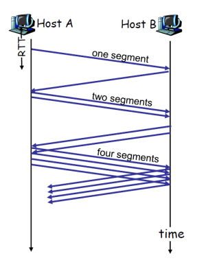

#### Congestion Avoidance

The Congestion Avoidance phase **begins** **when the `Congwin` has surpassed the `Threshold`**. 

**Goal**: **probe for additional bandwidth more cautiously** than in Slow Start.

* During Congestion Avoidance, `Congwin` is typically **increased by approximately one MSS** per RTT. (`Congwin++`)
    * This **continues until a loss event is detected**.
* When a **loss event occurs**:
    * The `Threshold` is **updated**, typically to **half of the** `Congwin` value at the time of loss (`Threshold = Congwin / 2`).
    * `Congwin` is **reset to 1 MSS**.
    * The protocol then **re-enters the Slow Start phase**. 
        * This behavior is characteristic of ***TCP Tahoe***.

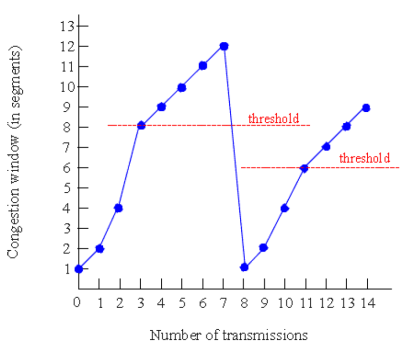

#### TCP Tahoe and TCP Reno

Different versions of TCP handle the transition after a loss event differently:

* **TCP Tahoe**:
    * Regardless of how a loss event is detected (timeout or duplicate ACKs), TCP Tahoe **resets** `Congwin` **to 1 MSS** and goes **back to the Slow Start** phase.
* **TCP Reno**:
    * If a loss event is indicated by the receipt of **three duplicate ACKs** (signaling a likely single packet loss, a mechanism called ***Fast Retransmit***), TCP Reno **does not revert to Slow Start** immediately. 
        * Instead, it typically **halves** `Congwin`, setting it to the **new** `Threshold`, and then enters a phase called ***Fast Recovery***, continuing in a mode similar to Congestion Avoidance by increasing the window by 1 MSS for further duplicate ACKs.
        * The slide notes it sets the "window to threshold value and increase by 1".
    * However, if a **loss is detected** via a **timeout**, TCP Reno, like Tahoe, will enter **Slow Start** with `Congwin` **= 1 MSS**.

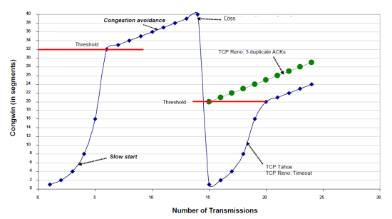

---
### Interaction of Flow and Congestion Control

**TCP** uses both **flow control** and **congestion control** to determine how much data it can send.

* The **flow control** mechanism **computes the** `RcvWindow` based on the **receiver's available buffer space**.
* The **congestion control** mechanism **computes** `Congwin` based on the **perceived state of network congestion**.
    * The actual amount of data a TCP sender can transmit without acknowledgment is limited **by the smaller of these two windows**.
    * **Transmission Window = *min(RcvWindow, Congwin)*** 
