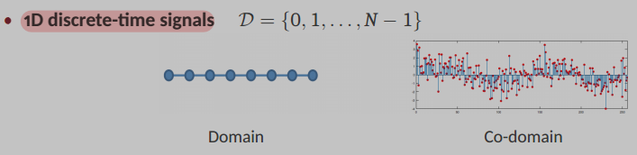
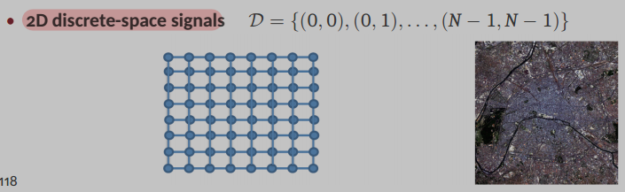

# Signal Processing Introduction

## Signal Definition
**Tecnical definition**: Signal is the **formal way to describe a phenomenon that changes** over time, space, or other general domains. 
* *Example*: *Think of a speech signal where the amplitude changes over time, or an image where color and intensity vary across a 2D space.*

**Classical definition**: Signal is the physical medium used to carry information.

**Math. definition**: Signal is seen as a mapping from a domain (D) to a co-domain.
* **1D discrete-time**: Domain like $\mathcal{D}=\{0,1,...,N-1\}$

    

* **2D discrete-space**: Domain like $\mathcal{D}=\{(0,0),(0,1),...,(N-1,N-1)\}$

    

### Examples of Signals
* **Speech signal:** The amplitude of a sound wave varying over time.
* **Images:** Represent light intensity and color over a 2D space.
* **Audio recording:** An analog pressure wave is sampled and converted into a one-dimensional discrete-time signal.
* **Communication signals:** These are analog continuous-time waves (like electromagnetic, light, or acoustic waves) that carry information.
* **Photos:** An analog scene of light is sampled (e.g., by a CCD array) and stored as a two-dimensional discrete-space signal.
* **Text:** Messages are collections of characters, each assigned a numerical value (e.g., a 16-bit number) and stored sequentially.
* **Ratings:** Integers (e.g., 0-5) used for things like books, movies, or vacation rentals.

## What is Signal Processing (SP)?

**Definition:** Operation that modifies, extracts, or otherwise manipulates the information within a signal.
* *Example*:
    * **Converting** one signal into another (e.g., filtering, de-noising, interpolating).
    * **Extracting** and interpreting information (e.g., speech recognition, computer vision, remote sensing, deep learning).
    * **Synthesizing** and **encoding** signals for efficient communication.

The **Goal of Signal Processing** is to extend human capabilities to process and extract information from data. This enables more sophisticated sensing, communication, and learning.

### Applications of Signal Processing

* **Magnetic Resonance Imaging (MRI):** Involves exposing the brain to magnetic fields and recording electromagnetic (EM) signal responses from hydrogen protons to create high-resolution brain images.
* **Speech Processing:** Signal processing is key for extracting features from speech. These features are then used with machine learning models for tasks like automatic speech recognition and separation.
* **Computer Vision:** SP plays a vital role in extracting intrinsic facial features, which are then used for face detection and classification.
* **Digital Communications:** Signal processing laid the foundations for digital communication systems and is expected to be critical in the upcoming 6G revolution, particularly in semantic and effectiveness aspects.
* **Remote Sensing:** SP enables sophisticated applications like planetary imaging, meteorology, and deep space exploration.
