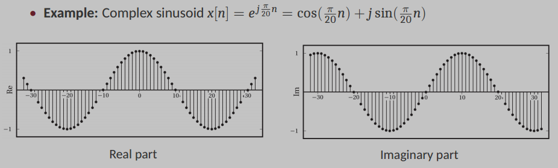
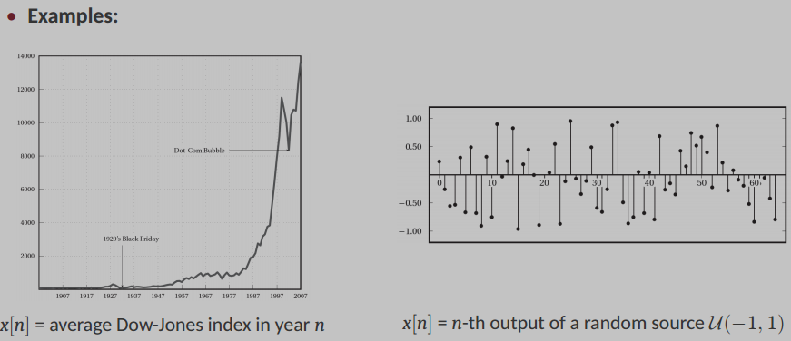
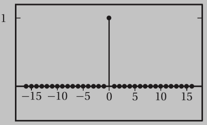
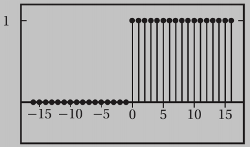
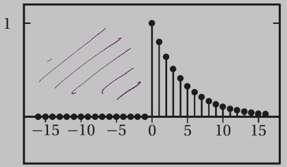
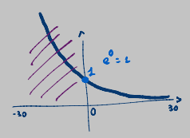
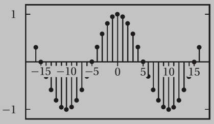

# Signals

This chapter delves into the details of different types of signals, their properties, fundamental operations, and how they can be represented.

## Continuous-time vs. Discrete-time Signals

### Continuous-time signals
**Definition**: Complex-valued function $x(t)$, $t \in \mathbb{R}$ and $x(t)$ function.
* *Think of this as a signal that has a value at every possible instant in time.*

Often used to model physical quantities that change continuously, like temperature, pressure, or the voltage in an analog circuit.

Much of **classical signal** processing theory is built upon **continuous-time signals**. \
However, **real-world processing** is usually done on computers using **discrete-time signals**.

### Discrete-time signals

**Definition**: Mathematically, a discrete-time signal $x[n]$ is a complex-valued sequence, where $n$ is an integer index ($n \in \mathbb{Z}$).

Discrete-time signals are obtained by ***sampling*** a continuous-time signal. 
* This means observing the continuous signal $x(t)$ at specific, equally spaced time instants $nT$, where **$T$** is the **sampling period**. So, the discrete-time signal is $\large x[n] = x(nT)$.

**QUESTION**: Why a signal is often represented using a Complex-valued sequence, so using a signal for real and a signal for immaginary part?

**ANSWER**: 
1. Many signals can be broken down into, or are fundamentally based on, **sinusoidal waves** (sines and cosines).

2. Using a complex exponential like $X e^{j\omega t}$ (where $X$ itself can be a complex number $A e^{j\phi}$), we can **embed both amplitude $A$ and phase $\phi$ into the complex amplitude $X$**. 
    * This **simplifies many mathematical operations** (like differentiation, integration, and analyzing shifts in phase).

3. **Fundamental Role in Fourier Analysis:** The Fourier Transform, which is a crucial tool for analyzing the frequency content of signals, inherently produces complex-valued results. These complex values tell us the magnitude and phase of each frequency component present in the signal. 
    * So, working with complex signals from the outset makes the transition to and from the frequency domain more seamless.

4. **Simplifying System Analysis:** When signals pass through systems (like **filters**), the system's effect is often described by **how it changes the amplitude and phase** of different frequency components. This is captured by the system's "frequency response," which is generally a complex-valued function. 
    * Operations like **convolution** in the time domain (which can be complicated) **become simple multiplication in the frequency domain** if you're working with the complex spectra of the signals and the system.

#### Properties

* **Notation**: Square brackets, like $x[n]$, are standard for discrete-time signals. The index $n$ is often thought of as a **dimensionless measure of time**.

* **Graphical Representation**: Discrete-time signals are typically shown using "stem" or "lollipop" plots. Sometimes, a function-like line plot is used for simplicity if the discrete nature is understood.

* **Example**: A complex sinusoid can be represented in discrete time as $x[n]=e^{j\frac{\pi}{20}n}=\cos(\frac{\pi}{20}n)+j~sin(\frac{\pi}{20}n)$. **(IMAGE ABOVE)**

* **Example**: the yearly average Dow-Jones index or the output of a random number generator at discrete points.

    * The way the Dow-Jones index is plotted can indeed look like a continuous signal because of the connecting lines. However, it's considered a discrete-time signal in this context for a key reason
        * The slide specifies the signal as  "$x[n]$ = average Dow-Jones index in year n".
    * So, even though the graph uses a line, the underlying signal $x[n]$ is a sequence of values where each value corresponds to a specific integer index 'n' (representing the year). This fits the definition of a discrete-time signal as a complex-valued sequence $x[n]$ which is a function of an integer index $n$

    

## Basic Discrete-time Signals

Several fundamental discrete-time signals form the **building blocks for more complex ones**:

### Impulse (or discrete-time delta function):
It's a signal that is 1 only at $n=0$ and zero everywhere else.
$$\delta[n]=\begin{cases}1,&n=0\\ 0,&n\ne0\end{cases}$$.

### Unit step
$$u[n]=\begin{cases}1,&n\ge0\\ 0,&n < 0\end{cases}$$ 

### Exponential decay

$$x[n]=a^{n}u[n]$$

This signal is given by the **product** of an **exponential signal** (not zero in $n<0$) and **unit step** signal $u[n]$, which ensures exponential decay signal is zero for $n<0$.

**Properties**:
* $a$ is a complex number.
* $|a|<1$. 

### Sinusoids
$$x[n]=\cos(2\pi kn+\phi)$$

* **Properties**:
* $k \in \mathbb{R}$ determines the **frequency**, which tells how many **cicles occur per sample**. (We are in discrete time, so it's not per second)
* $2\pi f = \omega$ is the **angular frequency**.
    * This term convert **frequency to angular frequency**, so in radians per sample.
* $\phi \in [0,2\pi]$ is the **phase**.

### Elementary Operations on Discrete-time Signals (ADD IMAGE)
These are basic manipulations you can perform on signals:

### Shift
$$y[n]=x[n-k]$$

Properties:
* $k \in \mathbb{Z}$
* If $k$ is **positive**, the signal is shifted to the right (**delayed**).
* If $k$ is **negative**, the signal is shifted to the left (**advanced**).

### Scaling
$$y[n]=\alpha~x[n]$$

**Properties**:
* $\alpha \in \mathbb{C}$.
* If $\alpha$ is **real**, it amplifies ($\alpha>1$) or attenuates ($\alpha<1$) the signal.
* If $\alpha$ is **complex**, it also introduces a phase shift.

### Sum
$y[n]=x[n]+w[n]$

It's a term-by-term sum.

### Product 
$y[n]=x[n]w[n]$

It's a term-by-term product.

### Integration (Discrete-time)

$$y[n]=\sum_{m=-\infty}^{n}x[m]$$ 

Integration, in discrete time, is a "**running sum**":
1. **Sum:** At its core, it's an operation of adding values from the input signal $x[k]$.
2.  **Running:** This implies that the sum is cumulative and updated as you move along the discrete-time index 'n'. \
For each output sample $y[n]$, you are summing all past and current values of the input signal $x[k]$ up to that point 'n'.

### Integration (Continous-time)

$$y(t)=\int_{-\infty}^{t}x(\tau)d\tau$$

### Differentiation (Discrete-time)
$$y[n]=x[n]-x[n-1]$$

#### More about Integration and Differentiation
* **Relationship**: The unit step $u[n]$ can be obtained by integrating the impulse $\delta[n]$. Conversely, the impulse can be obtained by differentiating the unit step.
* **Approximation**: In discrete time, differentiation operation is **approximated** by a first-order difference. \
This approximation arises because we don't have a continuous signal to find an instantaneous rate of change; instead, we work with values at discrete time points.
* **Smoothing Effect:** The running sum (integration in discrete-time) often has a **smoothing effect** on a signal because it accumulates values, rapid, short-term fluctuations in the input signal tend to be averaged out or diminished in the output.
* **Highlighting Changes:** The first-order difference $y[n]=x[n]-x[n-1]$ directly measures the change between consecutive samples. If the signal is changing rapidly, the magnitude of $y[n]$ will be large. If the signal is constant or changing slowly, the magnitude of $y[n]$ will be small or zero.
* **Low-Pass Filtering Characteristic:** Due to this smoothing effect, discrete-time integration (the running sum) can act as a simple form of a **low-pass filter**. This means it tends to attenuate high-frequency components (rapid changes) in the signal while allowing low-frequency components (slower changes) to pass through.
* **High-Pass Filtering Characteristic:** Because it emphasizes changes, the first-order difference operation can act as a simple form of a **high-pass filter**. It tends to enhance high-frequency components (areas of rapid change) and attenuate low-frequency components (areas of slow change or constant parts) of the signal.

## Energy and Power of Discrete-time Signals

These concepts measure the "strength" of a signal:

### Energy ($E_x$)
 $E_{x}=\sum_{k=-\infty}^{\infty}|x[k]|^{2}$.
    * A signal has finite energy if this sum converges (i.e., it's square summable).
### Power ($P_x$) 
$$P_{X}=lim_{N\rightarrow\infty}\frac{1}{2N+1}\sum_{k=-N}^{N}|x[k]|^{2}$$

This is the average energy over time.

Properties:
* Signals with finite energy have zero power.
* Signals with infinite energy (like periodic signals) can have finite power.

**QUESTION**: What are these measures?

**ANSWER**:

A signal can either:
* **LAST FOREVER**: **Power Signal** &rArr; $P_X$ &ne; $0$ and $E_X = \infin $

    This at the signal as a constant wave or a periodic signal, it doesn't fade, just keeps going.

    * Why **Power (Average?) is finite**? Because the average will **converge to some non-zero value**, given that the signal doesn't fade out, so, also the sum do not fade out but get stable.
    * Why **Energy is infinite**? Because the signal never stop, so the **sum grows over time** and tend to infinite. 

* **NOT LAST FOREVER**: **Energy Signal** &rArr; $P_X = 0$ and $E_X = a, a \in \mathbb{R} $

    Think at the signal as a **short burst**, with finite energy but no sustained output over time (e.g *impulse* *signal*).
    * Why **Average Power is 0**? ($P_X = 0$): Because, given that the signal "dies out", the average over more time goes tend to 0.
    * Why **Energy is finite**? ($E_X = a$): Because we have a single signal value or few of them overt the time, so the sum goes tend to finite value.

## Classes of Discrete-time Signals

* **Finite length signals**
A **collection of N complex values**, equivalent to a vector $x \in \mathbb{C}^{N}$.
    * Extremely convenient because their **Energy is always finite**, so no stability issue arise in processing the signal.

* **Infinite length signals**: Represented by an **infinite complex sequence**. Even if we will always process finite length signals, studying their asymptotic behavior is **valuable**. 

    * *Example:* Asymptotic analysis helps us understand the fundamental limits and capabilities of signal processing operations. For example, the concept of frequency resolution (how well we can distinguish between closely spaced frequencies) is best understood by considering behavior as the observation window becomes very large (approaching infinity).
    * *Example:*  Properties like the stability of systems are often defined based on their response to inputs over an infinite duration.
    * *Important Example*: In practice, we often use finite-length approximations of ideal infinite-length processes (e.g., using a finite number of terms in a series expansion). Understanding the asymptotic behavior helps in analyzing the error introduced by such truncations and determining how "long" a finite signal needs to be for a good approximation.

* **Finite-support signals**: An infinite signal that is non-zero only over a finite range of indices.

* **Periodic signals**: An infinite signal $\tilde{x}[n]$ **repeats itself every N samples**: $\tilde{x}[n]=\tilde{x}[n+kN]$ for any integer $k$. 
    * *Important:* It's **fully defined** by its N values over one period.

    * **Periodization of finite-support signals**: A periodic signal $\tilde{x}[n]$ can be created by summing infinite copies of a finite-support signal $\overline{x}[n]$, spaced N samples apart: $\tilde{x}[n]=\sum_{k=-\infty}^{\infty}\overline{x}[n-kN]$.

        * **Fundamental Period**: it's the **smallest positive integer N** such that the signal repeats itself after N samples. In other words, smallest number to complete a **full cycle**.

        * If **N is bigger** than the size of the support, copies of the sum do **not overlap**.
        * If **N is smaller**, **overlap**.

## Linear Algebra for Signals and Vector Spaces

This section casts signal processing concepts in terms of **linear algebra**, which is very powerful.

### The Hermitian Operator (Conjugate Transpose)
Before defining the inner product, it's important to understand the **Hermitian operator**, also known as the **conjugate transpose**. 

For a vector $x$, its Hermitian transpose is denoted as $x^H$ (or sometimes $x^*$, or $\underline{x}^*$ as seen on slide 30).

If $x$ is a column vector:
$$x = \begin{bmatrix} x_0 \\ x_1 \\ \vdots \\ x_{N-1} \end{bmatrix}$$
$$x^H = \begin{bmatrix} x_0^* & x_1^* & \cdots & x_{N-1}^* \end{bmatrix}$$

Then its Hermitian transpose $x^H$ is a row vector where each element is the complex conjugate of the original element where $x_i^*$ is the **complex conjugate** of $x_i$.

This operation is crucial for working with complex vectors, especially when defining norms (lengths) and inner products.

### Inner Product
For two finite-length discrete-time signals $x[n]$ and $y[n]$ (represented as column vectors $x, y \in \mathbb{C}^N$), the inner product (also called a *scalar product*) is defined as:
$$(x,y) = x^H y = \sum_{n=0}^{N-1}x^{*}[n]y[n]$$
This operation takes **two vectors** and produces a **single complex scalar**. 

It measures **how much one vector "aligns" with another**, considering both magnitude and phase, so it's a measure of how much they are similar, a **measure of similarity**.

#### Properties of Inner Product
* **Norm and Energy**: The inner product of a vector with itself gives the squared Euclidean norm (or squared length) of the vector, which corresponds to the **signal's energy**:
    $$(x,x) = x^H x = ||x||^{2} = \sum_{n=0}^{N-1}|x[n]|^{2} = E_{x}$$

    * *Note on Energy Definition*: The use of the Hermitian operation here ensures that the energy is calculated as the sum of the squared magnitudes of the signal components. 
    
        This definition is crucial because it forms the basis for **Parseval's Relation** (discussed later in Spectral Analysis), which states that the total energy is conserved across different signal representations (like time and frequency). Parseval's Relation allows us to interpret how the signal's global energy is distributed across different frequencies by looking at its spectrum.

* **Distance**: The squared Euclidean distance between two signals $x$ and $y$ can be expressed using norms and inner products:
    $$||x-y||^{2} = (x-y)^H(x-y) = ||x||^{2} + ||y||^{2} - 2\text{Re}\{(x,y)\}$$
    * *Note*: $2\text{Re}\{(x,y)\} = (x,y) + (y,x)$ if the definition $(x,y)=y^H x$ is used, or $(x,y) + (x,y)^*$ if $(x,y)=x^H y$ is used. 
    * *Note*: The slide uses $2\text{Re}\{(x,y)\}$, which is correct for $(x,y)=x^H y$ because $(y,x) = y^H x = (x^H y)^* = (x,y)^*$. \
    So, $(x,y) + (y,x) = (x,y) + (x,y)^* = 2\text{Re}\{(x,y)\}$.

* **Orthogonality**: Two signals $x$ and $y$ are orthogonal if their **inner product is zero**:
    $$(x,y) = x^H y = 0$$
    This means they are "**perpendicular**" in the complex vector space.

    * *Note*: in transform like *DFT - Discrete Fourier Transform*, orthogonality between basis functions allow **perfect reconstruction**.

* **Cauchy-Schwarz Inequality (CBS)**: This inequality relates the magnitude of the inner product of two vectors to the product of their norms:
    $$|(x,y)| \le ||x|| \cdot ||y||$$.

    * *Notes*: It gives a bound on how two signals can be aligned.

## Signal Expansion over a Basis
A signal $x \in \mathbb{C}^N$ can be represented as a **linear combination** of $N$ **linearly independent basis vectors** $\{u_k\}$:
$$x=\sum_{k=0}^{N-1}X_{k}u_{k}$$.

### Properties
* The $\{X_k\}$ are the ***expansion coefficients*** (or coordinates of $x$ in this basis), can be tought as the **features** extracted from the signal.

* If the basis vectors $\{u_k\}$ are **orthogonal** (i.e., $(u_k, u_l) = u_k^H u_l = 0$ for $k \ne l$), the coefficients are found by projecting $x$ onto each basis vector:
    $$X_{k}=\frac{(u_{k},x)}{||u_{k}||^{2}} = \frac{u_k^H x}{u_k^H u_k}$$.

#### Orthonormal Basis
If the basis is **orthonormal**, then $$||u_k||^2=1$$ $$X_k = (u_k,x) = u_k^H x$$

An orthonormal basis $\{u_k\}$ has two key properties:
1.  **Orthogonality**: The basis vectors are **mutually orthogonal**, meaning their inner product is zero: $(u_k, u_l) = u_k^H u_l = 0$ for $k \ne l$.
2.  **Normality**: Each basis vector has **unit norm** (unit length): $||u_k||^2 = (u_k, u_k) = u_k^H u_k = 1$.

These two conditions can be combined into a single statement: $(u_k, u_l) = \delta[k-l]$, where $\delta[k-l]$ is the **Kronecker delta** (1 if $k=l$, and 0 if $k \ne l$).

Here are the main consequences for signal expansion:

* **Simplified Calculation of Expansion Coefficients ($X_k$)**:
    * For a general orthogonal basis, the coefficients are $X_k = \frac{(u_k, x)}{||u_k||^2}$.
    * For an **orthonormal basis**, since $||u_k||^2 = 1$, this simplifies to:
        $$X_k = (u_k, x) = u_k^H x$$
    This means the **expansion coefficient** for each basis vector is simply the **direct inner product** of the signal with that basis vector. You don't need to divide by the squared norm of the basis vector, which makes calculations more straightforward.

* **Direct Energy Preservation (Parseval's Theorem simplified)**:
    * For an orthonormal expansion $x = \sum_{k=0}^{N-1} X_k u_k$, the **energy of the signal is equal to the sum of the squared magnitudes of its expansion coefficients**:
        $$E_x = ||x||^2 = \sum_{n=0}^{N-1} |x[n]|^2 = \sum_{k=0}^{N-1} |X_k|^2$$
    This is a direct consequence of orthonormality. It means the transformation into the coefficient domain perfectly preserves the signal's energy without any scaling factors. This is a very elegant form of Parseval's theorem.

* **Simplified Synthesis Formula**:
    * The synthesis formula $x = \sum_{k=0}^{N-1} X_k u_k$ remains the same, but the coefficients $X_k$ used are the ones calculated via the simpler inner product $X_k = (u_k, x)$.

* **Clear Geometric Interpretation**:
    * Orthonormal basis vectors can be thought of as the equivalent of perpendicular unit vectors (like $\hat{i}, \hat{j}, \hat{k}$ in 3D Cartesian coordinates) in the $N$-dimensional complex vector space $\mathbb{C}^N$.
    * The coefficients $X_k = (u_k, x)$ are then the direct coordinates or projections of the signal vector $x$ onto these mutually perpendicular unit axes.

* **Unitary Transformation Matrix**:
    * If you form a matrix $U$ whose columns are the orthonormal basis vectors $\{u_k\}$, then this matrix $U$ is a **unitary matrix**. A key property of unitary matrices is that their Hermitian transpose is their inverse: $U^H U = I$ (where $I$ is the identity matrix) and $U U^H = I$.
    * The vector of expansion coefficients $X$ can be obtained by $X = U^H x$.
    * The signal can be reconstructed by $x = U X$.
    This leads to very neat and numerically stable transformations.

In summary, orthonormality simplifies the mathematics of signal expansions considerably, makes energy calculations and interpretations more direct, and provides a clear geometric picture of the signal decomposition. Many important transforms, or their suitably scaled versions (like the DFT basis vectors scaled by $1/\sqrt{N}$), form orthonormal bases.

### Best Approximations (Projection Theorem)
If we want to **approximate** a signal $x \in \mathbb{C}^N$ using only $K < N$ orthogonal basis vectors $\{u_k\}_{k=0}^{K-1}$ (which span a subspace $\mathcal{P}$), the **best approximation** $\tilde{x}$ (in terms of minimizing the squared error $||x-\tilde{x}||^2$) is obtained by summing the projections of $x$ onto these $K$ basis vectors:
$$\tilde{x}=\sum_{k=0}^{K-1}X_{k}u_{k} = \sum_{k=0}^{K-1}\frac{(u_{k},x)}{||u_{k}||^{2}}u_{k} = \sum_{k=0}^{K-1}\frac{u_k^H x}{u_k^H u_k}u_{k}$$.

#### Projection Theorem

* The approximation error $e = x - \tilde{x}$ is orthogonal to the approximation $\tilde{x}$ (i.e., $e^H \tilde{x} = 0$) and to any vector in the subspace $\mathcal{P}$.
* $\tilde{x}$ is the vector in $\mathcal{P}$ that is **closest** to $x$.

The Projection Theorem is a cornerstone concept in signal processing and many other fields because it tells us how to find the **best possible approximation** of a signal if we are restricted to using a simpler, lower-dimensional representation.

**QUESTION:** How do we choose the $K$ basis vectors $u_k$ so that the subspace $\mathcal{P}$ they form allows for the "best possible" approximation of a signal $x$ using only $K$ dimensions?

**ANSWER:** There are primarily **two approaches**:

1.  **Using a Fixed, Standard Basis (and selecting significant components):**
    * We start with a **known, complete basis** (e.g., Fourier, DCT, Wavelet) for the entire $N$-dimensional space. These bases are typically chosen because they are known to **efficiently represent certain types of signals**, often leading to sparse representations where the signal's energy is concentrated in a few coefficients.
    * First, the **coefficients** $X_k$ of the signal $x$ in this chosen basis are found using the Analysis Formula ($X_k = \frac{(u_k, x)}{||u_k||^2}$).
    * Then, we select the $K$ basis vectors $u_k$ that correspond to the $K$ **coefficients $X_k$ with the largest magnitudes**.
    * The subspace spanned by these selected basis vectors will capture the most significant portion of the signal's energy *as represented in that particular fixed basis*. This strategy aims to minimize the energy of the discarded components, thereby minimizing the approximation error $||x - \tilde{x}||^2$.

2.  **Using Signal-Dependent (Data-Adaptive) Bases for a Theoretical Optimum (e.g., KLT or PCA):**
    * Techniques like the **Karhunen-Loève Transform (KLT)** or **Principal Component Analysis (PCA)** are used to derive a **custom basis** that is optimally tailored to the statistical properties of the specific signal $x$ or a class of similar signals.
    * These methods find an ordered set of basis vectors where the first vector captures the maximum possible signal energy (variance), the second captures the maximum remaining energy while being orthogonal to the first, and so on.
    * The first $K$ basis vectors from this KLT/PCA basis will span the $K$-dimensional subspace that **minimizes the mean square approximation error** overall, compared to any other $K$-dimensional subspace.

**Consequences and Importance of the Projection Theorem:**

* **Optimal Approximation in a Subspace:**
    * The most fundamental consequence is that the vector $\tilde{x}$ (the orthogonal projection of $x$ onto the subspace $\mathcal{P}$) is the **best approximation** of the original signal $x$ that can be formed using only the basis vectors that span $\mathcal{P}$.
    * "**Best**" here means that $\tilde{x}$ minimizes the **squared error** (or Euclidean distance) $||x - \tilde{x}||^2$ compared to any other vector $z$ within that subspace $\mathcal{P}$. No other combination of the chosen $K$ basis vectors will produce an approximation closer to the original signal $x$.

* **Foundation for Data Compression and Dimensionality Reduction:**
    * This theorem is the theoretical basis for many **lossy data compression** techniques. By selecting a subspace spanned by $K$ "important" basis vectors (where $K<N$), we can represent the signal $x$ using fewer coefficients (the $X_k$ values used to construct $\tilde{x}$).
    * The approximation $\tilde{x}$ is essentially the reconstructed signal from this compressed representation. The Projection Theorem guarantees that this reconstruction has the minimum possible error for the chosen number of basis vectors.
    * This allows for significant reduction in data size while controlling the loss of information.

* **Noise Reduction and Filtering:**
    * If we can assume that the desired part of a signal lies primarily within a certain subspace $\mathcal{P}$, and noise components lie outside or are spread across other dimensions, then projecting the noisy signal $x$ onto $\mathcal{P}$ to get $\tilde{x}$ can effectively **reduce noise**.
    * The error vector $e = x - \tilde{x}$, which is orthogonal to the subspace $\mathcal{P}$, would contain the parts of the signal (including noise) that couldn't be represented by the chosen basis vectors.

* **Feature Extraction:**
    * The coefficients $X_k$ used to form the best approximation $\tilde{x}$ (i.e., $X_k = \frac{(u_k,x)}{||u_k||^2}$) can be considered the most significant **features** of the signal $x$ with respect to the chosen basis $\{u_k\}_{k=0}^{K-1}$. These features capture the essence of the signal within that subspace.

* **Clear Geometric Interpretation:**
    * The theorem provides a powerful geometric intuition: the best way to approximate a vector $x$ in a lower-dimensional subspace $\mathcal{P}$ is to "drop a perpendicular" from $x$ onto $\mathcal{P}$. The point where this perpendicular meets the subspace is the orthogonal projection $\tilde{x}$[cite: 66]. The error vector $e = x - \tilde{x}$ is this perpendicular line itself.

* **Basis for Advanced Algorithms:**
    * The principle of finding an optimal solution by projection is fundamental to many advanced algorithms in signal processing, statistics, and machine learning, such as least squares estimation and Principal Component Analysis (PCA).

In essence, the Projection Theorem provides a constructive way (the formula for $\tilde{x}$) to achieve the best possible "simplified" version of a signal within a chosen subspace, quantifying the error and ensuring optimality.

This makes it incredibly useful whenever we need to **reduce complexity**, **compress data**, or **isolate key signal components**.

### Analysis and Synthesis Formulas
These terms describe the process of **decomposing a signal** into its basis coefficients and **reconstructing it**.

#### Analysis Formula (Decomposition)

For an orthogonal basis $\{u_k\}$, coefficients $X_k = [X_0, X_1, ..., X_{N-1}] \in \mathbb{C^N}$, can be found using **Analysis Formula**:
$$X_{k}=\frac{(u_{k},x)}{||u_{k}||^{2}} = \frac{u_k^H x}{u_k^H u_k}$$ 
$$k = 0, 1, ..., N-1$$

Coefficients vector $X_k$ can be seen as a **set of features** extracted by the signal $x$ using the basis functions $\{u_{k}\}^{N-1}_{k = 0}$.

Here's the breakdown of how feature extraction happens:

1.  **Basis Functions as "Pattern Detectors":**
    Each basis function $u_k$ in the set $\{u_k\}$ represents a specific, fundamental **pattern, shape, or characteristic**.
    * **Fourier basis**, each $u_k$ is a complex sinusoid representing a **specific frequency**.
    * **Walsh-Hadamard basis**, each $u_k$ is a sequence of +1s and -1s representing a **specific "sequency"** (related to zero-crossings).
    * **Canonical basis**, each $u_k$ is an impulse $\delta[n-k]$, representing presence at a **single point in time**.

2.  **Inner Product as a "Similarity Measure":**
    The inner product $(u_k, x)$ measures the **similarity or correlation** between the signal $x$ and the specific basis function $u_k$. It essentially quantifies "how much" of the pattern $u_k$ is present in the signal $x$.
    * Geometrically, it's like projecting the signal vector $x$ onto the direction defined by the basis vector $u_k$.
    * The normalization by $||u_k||^2$ (if the basis is not orthonormal) ensures that $X_k$ **correctly represents the contribution** of $u_k$ to $x$.

3.  **Coefficients ($X_k$) as Feature Values:**
    Each calculated coefficient $X_k$ is a scalar value (it can be complex) that represents the **strength, amplitude, or weight** of the corresponding basis function $u_k$ within the original signal $x$.
    * Thus, the set of coefficients $\{X_0, X_1, ..., X_{N-1}\}$ becomes a **new representation** of the signal.
    * Each $X_k$ is a **feature** because it describes a specific aspect of the signal $x$ as defined by the nature of the basis function $u_k$.

So, by choosing an appropriate basis, you can use the analysis formula to decompose the signal into a set of features that highlight aspects of the signal you're interested in (e.g., its frequency content (Fourier), its time-localization (Canonical), etc.).

#### Synthesis Formula (Reconstruction)

The **Synthesis Formula** allows us to reconstruct the original signal $x$ from its set of **expansion coefficients** $\{X_k\}$ and the **basis functions** $\{u_k\}$.

For a basis $\{u_k\}$, the signal $x$ is synthesized as a linear combination:
$$x = \sum_{k=0}^{N-1}X_{k}u_{k}$$

This formula shows how the signal $x$ is **built (i.e., synthesized)** as a **weighted sum of the basis functions** $\{u_k\}_{k=0}^{N-1}$, where each basis function $u_k$ is weighted by its corresponding coefficient $X_k$.

Here's how you can think about the signal synthesis process:

1.  **Basis Functions ($u_k$) as "Fundamental Building Blocks":**
    * Just like in the analysis, each basis function $u_k$ represents a specific, elementary pattern or shape (e.g., a pure sinusoid of a certain frequency, an impulse at a certain time, a specific Walsh-Hadamard pattern).
    * Think of these as the set of pre-defined "Lego bricks" you have available to build your signal.

2.  **Coefficients ($X_k$) as "Recipe Instructions" or "Weights":**
    * Each coefficient $X_k$ (obtained from the analysis step) now acts as an instruction telling you "how much" of the corresponding building block $u_k$ is needed.
        * If $X_k$ has a large magnitude, it means that the pattern $u_k$ is a strong component of the signal $x$.
        * If $X_k$ is small or zero, the pattern $u_k$ contributes little or nothing to the final signal.
    
3.  **Scaling and Summation ($X_k u_k$ and $\sum$) as "Constructing the Signal":**
    * **Scaling:** In the term $X_k u_k$, each "building block" $u_k$ is first scaled by its respective "weight" $X_k$. This adjusts the amplitude and/or phase of the building block to match its required presence in the final signal.
    * **Summation:** The $\sum$ operation then takes all these individually scaled building blocks ($X_0u_0, X_1u_1, ..., X_{N-1}u_{N-1}$) and adds them together. This superposition combines the fundamental patterns in the precise proportions specified by the coefficients.

The **result** of this weighted summation is the **reconstructed signal** $x$. The synthesis formula shows how a potentially complex signal $x$ can be perfectly rebuilt by combining simpler, fundamental patterns (the basis functions) according to a specific "recipe" (the coefficients).

As slide 34 describes, the synthesis formula "builds (i.e., synthesize) the signal x as a linear combination of the basis functions $\{u_{k}\}_{k=0}^{N-1}$ , weighted by the coefficients $\{X_{k}\}_{k=0}^{N-1}$".

So, if analysis is about *decomposing* the signal into its core components (features), synthesis is about *recomposing* or *reconstructing* the signal from these same core components and their respective weights.

### Examples of Basis
Different bases **highlight different aspects** of a signal.
* **Canonical Basis (Standard Basis)**: $u_k[n] = \delta[n-k]$ (vectors with a single 1 and zeros elsewhere). The coefficients $X_k$ are simply the samples $x[k]$ themselves.
* **Fourier Basis**: $u_k[n] = e^{j\frac{2\pi}{N}nk}$ (complex sinusoids). The coefficients $X_k$ are the Discrete Fourier Transform (DFT) of the signal. This basis is orthogonal.
* **Walsh-Hadamard Basis**: Composed of vectors with +1 and -1 values, useful for certain types of compression and known for their computational efficiency. This basis is orthogonal.

### Choosing the Best Basis: Sparsity
The goal is often to find the ***sparsest representation*** – the one that requires the smallest number of significant (non-zero or large magnitude) coefficients $X_k$ to represent the signal adequately, or with minimal error.
* This principle is related to **Ockham's razor**: "Entities should not be multiplied without necessity."
* Sparse representations are crucial for:
    * Efficient processing
    * Effective machine learning (feature extraction)
    * Data compression (storage and transmission)

* *Exercise 1* (from the slides) demonstrates compressing an ECG signal by keeping only the largest Walsh-Hadamard coefficients, which relies on finding a sparse representation in that basis.

## Continuous-Time Signals: Inner Products and Basis Representations

This section extends concepts like inner products and basis representations from the discrete-time finite-vector world to **continuous-time signals**, which often represent physical phenomena before they are sampled and digitized.

### Inner Product for Continuous-Time Signals 

The definition of the inner product for continuous-time signals depends on whether the signals have finite energy or finite power.

#### Finite Energy signals $x(t)$ and $y(t)$
* **Inner Product**: $$(x,y)=\int_{-\infty}^{\infty}x^{*}(t)y(t)dt$$
    * **Understanding**: Similar to the discrete case where we sum $x^*[n]y[n]$, here we **integrate** the product $x^*(t)y(t)$ over all time. This integral still measures the **alignment or similarity** between the two continuous signals. A larger value implies more similarity.
* **Signal Energy**: $$E_{x}=\int_{-\infty}^{\infty}|x(t)|^{2}dt=||x||^{2}$$
    * **Understanding**: This is the continuous-time equivalent of summing squared magnitudes. It represents the total energy contained in the signal over its entire duration.
#### Finite Power $x(t)$ and $y(t)$
* **Inner Product**: $$(x,y)=\lim_{\Delta t\rightarrow\infty}\frac{1}{\Delta t}\int_{-\Delta t/2}^{\Delta t/2}x^{*}(t)y(t)dt$$
    * **Understanding**: For signals that last forever (like a continuous sine wave), the total energy is infinite. So, we look at the **average similarity** over an infinitely long time window.
    * *Slide Typo*: The slide notation for the limit is `1/Δt lim Δt→∞`, but typically the `1/Δt` is inside or implied with the limit operation over the integral.
* **Signal Power**: $$P_{x}=\lim_{\Delta t\rightarrow\infty}\frac{1}{\Delta t}\int_{-\Delta t/2}^{\Delta t/2}|x(t)|^{2}dt=||x||^{2}$$
    * **Understanding**: This measures the **average energy per unit of time** for signals that don't die out.
    * *Slide Typo*: The slide has an extraneous square root symbol over the integral for $P_x$.

**So What?**: Distinguishing between energy and power signals, and how to measure their "strength" or "similarity," is fundamental for classifying signals and understanding how they behave in systems.

### Discrete Representation of Continuous-Time Signals 

Consider a continuous-time signal $x(t)$ defined over a finite interval $t\in[-T/2;T/2]$ (e.g., a snippet of audio, one cycle of a periodic signal). We can represent such a signal using a set of (often infinitely many) basis functions. 

This is key to how continuous phenomena can be **analyzed or prepared for digital processing**.

* **Inner Product in this context**: $$(u,x)=\int_{-T/2}^{T/2}u^{*}(t)x(t)dt$$
    * **Understanding**: Same idea as before, but the integration is now over the defined interval.

* **Basis Functions**: We use a set of basis functions $\{u_{k}(t)\}_{k=0}^{\infty}$ that are linearly independent, orthogonal, and complete **over the interval**.
    * **So what?**: These properties are crucial. Orthogonality simplifies finding coefficients. Completeness ensures we can represent *any* reasonable signal in that interval.

* **Analysis Formula (Coefficients)**: The coefficients $X_k$ of the expansion are found by:
    $$X_{k}=\frac{(u_{k},x)}{||u_{k}||^{2}}=\frac{\int_{-T/2}^{T/2}u_{k}^{*}(t)x(t)dt}{\int_{-T/2}^{T/2}|u_{k}(t)|^{2}dt}$$ 
    $$k=0,1,2,...$$
    * **Understanding**: Each $X_k$ quantifies "how much" of the basis function $u_k(t)$ is present in the signal $x(t)$ over the interval. These $X_k$ values become a **discrete set of numbers representing the continuous signal** $x(t)$ with respect to the chosen basis. This is a foundational idea for transforming continuous signals into a discrete set of parameters.

* **Synthesis Formula (Signal Reconstruction)**: The signal $x(t)$ can be synthesized from these coefficients as:
    $$x(t)=\sum_{k=0}^{\infty}X_{k}u_{k}(t)$$
    * **Understanding**: This shows that the continuous signal $x(t)$ (over the interval) can be viewed as a weighted sum of potentially infinitely many simpler basis functions.

### Completeness Property

The completeness property of a basis ensures that the signal defined on the interval can be perfectly reconstructed using an **infinite number of these basis functions**.

* Let $\tilde{x}_{K}(t)=\sum_{k=0}^{K-1}X_{k}u_{k}(t)$ be the best approximation of the signal $x(t)$ using $K$ coefficients.

* The completeness property states that the energy of the approximation error goes to zero as $K$ increases:
    $$\lim_{K\rightarrow\infty}\int_{-T/2}^{T/2}|x(t)-\tilde{x}_{K}(t)|^{2}dt=0$$

    * **So What?**: This property is vital. It means our chosen set of basis functions is "rich enough" or "complete enough" to represent *any* signal (that meets certain criteria, like Dirichlet conditions) within that interval without losing information, provided we use enough terms. \
    If a **basis wasn't complete**, there would be some signals we couldn't properly represent, no matter how many terms we used.

### Dirichlet Conditions

For certain sets of basis functions (like the **Fourier series**, which uses complex exponential basis functions) to be complete for a continuous-time signal $x(t)$ over an interval $t\in[-T/2,T/2]$, the **signal must satisfy the Dirichlet conditions**:
1.  $\int_{-T/2}^{T/2}|x(t)|dt<\infty$ (the signal is **absolutely integrable** over the interval).
2.  The **number of discontinuities** of $x(t)$ in the definition interval is **finite**.
3.  The **number of maximum and minimum points** of $x(t)$ in the definition interval is **finite**.
* **So What?**: If a signal $x(t)$ satisfies these conditions, then its Fourier series representation (a common and very important type of basis expansion) is guaranteed to **converge properly** (specifically, it converges to $x(t)$ where $x(t)$ is continuous, and to the midpoint of the jump at discontinuities). This ensures that the mathematical representation is meaningful and reliable for "well-behaved" signals.

### Examples of Complete Bases for Continuous-Time Signals

For signals satisfying the Dirichlet conditions, examples of complete bases include:
* **Fourier Basis**: $u_{k}(t)=e^{j2\pi kt/T}$, for $t\in[-T/2;T/2]$, $k\in\mathbb{Z}$. 
    * **Importance**: Fundamental for spectral analysis (Chapter 3), as it decomposes signals into their constituent frequencies.
* **Walsh Functions** (defined piece-wise).
    * **Importance**: Used in some communication and image processing applications; consist of rectangular waves (+1, -1).
* **Legendre Polynomials**: $u_{n}(t)=\sqrt{\frac{2n+1}{2}}p_{n}(t)$ for $t\in[-1;1]$.
    * **Importance**: A type of orthogonal polynomial useful in approximation theory and solving differential equations.

**General Takeaway for this Section:**
Understanding how continuous signals can be represented by a discrete set of coefficients using basis functions is crucial. It forms the conceptual bridge to transforming continuous, real-world phenomena into a format that can be analyzed, processed, and stored digitally. 

The conditions (like Dirichlet) and properties (like completeness) ensure that these representations are mathematically sound and practically useful. This lays the groundwork for understanding transforms like the Fourier Transform in the next chapter.