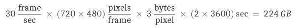
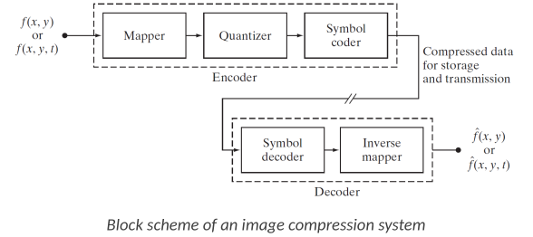
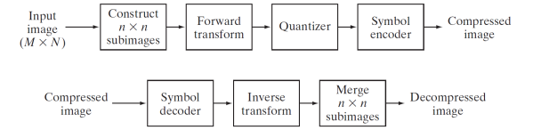
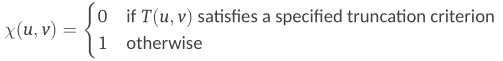
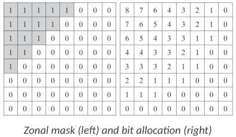
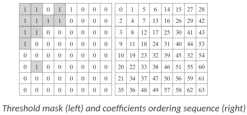
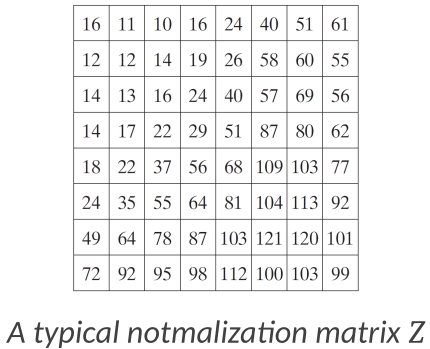

<!-- KaTeX auto-render header -->
<link rel="stylesheet" href="https://cdn.jsdelivr.net/npm/katex@0.16.0/dist/katex.min.css">

# Data Compression

This chapter introduces the fundamental concepts and techniques behind data compression, also known as source encoding. It starts by explaining *why* compression is necessary, particularly given the large data volumes of modern signals, and how it's made possible by identifying and reducing redundancies inherent in data.

The chapter will then transition to focus significantly on **image compression** as a primary application area. 

We'll explore:
* A general framework or block diagram that outlines the common stages involved in compressing an image.
* The role of various **transforms** (like the Fourier Transform or related transforms) in converting image data into a format more suitable for compression by decorrelating data or compacting energy.
* The crucial step of **quantization**, where information is selectively discarded or represented with lower precision to achieve data reduction, often by exploiting perceptual limitations.
* Different strategies for **coding** the quantized data, such as zonal coding (keeping coefficients in predefined zones) and threshold coding (keeping coefficients above a certain magnitude).
* Finally, these concepts will be tied together by looking at established **image compression standards** like JPEG, which utilize these principles.

Essentially, this chapter will take us from the "what" and "why" of data compression to the "how," with a practical emphasis on image data.

## Source Encoding

Signal compression, also known as source encoding, is fundamentally about **reducing the amount of data** required to effectively represent a signal. 

The significant data volumes associated with uncompressed signals highlight the need for such techniques. 
* *Example*: Consider a two-hour standard definition television movie; if stored without compression, it would occupy approximately 224 gigabytes. 

    

    To fit this onto a standard 8.5 GB DVD, a **compression factor** of around 26.3 would be essential.

The feasibility of compressing signals arises because data representations often contain what is known as **redundancy**. 
* This means that the same core information can often be conveyed (*trasmesse*) using different amounts of data, and representations are redundant if they include repeated or irrelevant information.

Several **types of redundancies** are commonly found in signals:
* **Spatial and Temporal Redundancy**: In visual media like **images**, adjacent pixels often share similar values, leading to spatial correlation. 
    * Storing each pixel independently in such cases would mean replicating information unnecessarily. 
    
    Similarly, in **video sequences**, there's often strong correlation between pixels across consecutive frames, which is a form of temporal redundancy.

* **Irrelevant Information**: Datasets frequently include information that is either imperceptible to human senses or is largely ignored by them. 
    * *Example*: some audio frequencies are beyond human hearing, or certain fine visual details might not be critical for perception. 
    
    Removing such irrelevant information can significantly reduce data size with **minimal impact on perceived quality**.

The effectiveness of any compression scheme is often measured by its **compression ratio**:

$$\Large c = b/b'$$

This is defined as the ratio of:
* $b$: Number of bits in the original representation 
* $b'$: Number of bits in the compressed representation

### Image Compression process

The principles of data compression are widely applied to images, and understanding image compression provides a good foundation for compressing other types of signals, like 1D audio signals or more complex time-varying 2D signals such as video.

A typical image compression system can be broken down into an **encoder** (which compresses the image) and a **decoder** (which reconstructs the image from the compressed data).

#### Encoding Process
The **primary goal** of the encoder is to transform the input image into a **more compact representation** by systematically **removing redundancies**.

This is generally achieved through a series of three main operations:

1.  **Mapper:** Takes the input ($\large f(x,y)$ for a still **image** or $\large f(x,y,t)$ for **video**) and **transforms its data into a different format**, often a non-visual one, to reduce spatial and temporal redundancy. 
    * This transformation aims to make the data more suitable for compression.

2.  **Quantizer:** Reduces the precision of the data produced by the mapper. 

    This reduction in accuracy is **guided by a pre-defined fidelity criterion**, meaning there's a controlled trade-off between the amount of compression and the quality of the reconstructed image. 
    
    The **primary aim** of quantization in this context is to **discard irrelevant or less critical information**, often based on human limits.

3.  **Symbol Coder:** Takes the output from the quantizer (which is now a stream of less precise data) and **generates a code to represent it**, producing the final compressed data stream, ready for storage or transmission. 

    This code can be **fixed-length** (where each symbol uses the same number of bits) or, more commonly, **variable-length** (where more frequent symbols are represented by shorter codes, like in Huffman coding). 
    
#### Decoding Process

The decoder reverses the operations performed by the encoder to reconstruct an approximation of the original input (image or video). 

It typically consists of **two main components**:

1.  **Symbol Decoder:** Using the **same coding scheme** employed by the encoder, converts back the codes into a sequence of quantized values.
2.  **Inverse Mapper:** Attempts to reverse the original transformation applied by the mapper in the encoder, converting the data back into the image domain to produce the reconstructed image ($\large \hat{f}(x,y)$ or $\large \hat{f}(x,y,t)$).

It's important to note that if **lossy compression techniques** (like quantization) were used in the encoder, the **reconstructed image** $\hat{f}$ **will be an approximation** of the original image $f$, not an exact replica.

### Image compression standards

Essentially, image (and video) compression standards are **specifications or agreed-upon methods that define how the compression and decompression processes should be performed**. 

The main purpose of having these standards is to ensure **interoperability** which means that an image or video file compressed using a standard on one device or software can be correctly decompressed and viewed on another device or software that also adheres to that standard.

The slide you're referring to lists a variety of these standards, broadly categorized:

* **For Still Images:**
    * **Binary Images** (like black and white text scans): Standards such as CCITT Group 3 and Group 4 (often used in fax machines), JBIG, and JBIG2.
    * **Continuous Tone Images** (like photographs): Well-known standards include JPEG (very widely used for photos), JPEG-LS, JPEG-2000, BMP (often uncompressed or simply compressed), GIF (good for images with limited colors and animation), PNG (good for lossless compression of graphics and photos), and TIFF (versatile, can be lossless or lossy). PDF can also embed compressed images.

* **For Video:**
    * There's a wide range, including DV (for digital camcorders), the H.26x series (like H.261, H.262/MPEG-2 Part 2, H.263, H.264/MPEG-4 AVC which is very common), the MPEG series (MPEG-1, MPEG-2, MPEG-4), AVS, HDV, M-JPEG (Motion JPEG), QuickTime, and VC-1 (WMV9).

These standards typically specify aspects like the transformation methods, quantization strategies, and coding techniques that should be used to ensure compatibility.

### Block Transform Coding method

Block transform coding is a method for **image compression**. 

* **Core Idea**: divide the image into smaller, manageable blocks and then apply a transformation to each block independently.

    

#### Steps

1.  **Image Division (Subimages):**
    * An input image (e.g., of size $M \times N$) is first divided into **smaller non-overlapping block** or subimages.
    * This results in $\large MN/n^2$ such subimage blocks, typically of size $n \times n$ 
        * *Example*: $8 \times 8$ pixels, as commonly used in JPEG.

2.  **Forward Transform:**
    * Each $n \times n$ subimage is then subjected to a **forward transform** which **converts the spatial data within the block into a different domain** (often a *frequency-like* domain, using DCT, DFT, or a wavelet transform) where the **energy is usually more compacted into fewer coefficients**.
    * This result in $\large MN/n^2$ transform coefficient arrays, each also of size $n \times n$.

3.  **Quantizer:**
    * The transform coefficients from each block are then **quantized**. 
        * This is a crucial step where **compression is achieved** by **reducing the precision of the coefficients**.
    * The quantization process **selectively eliminates** or **coarsely represents coefficients** that are deemed to carry less important visual information 
        * Example: high-frequency components or those with small magnitudes
    
    This step is typically **where information is lost** in lossy compression schemes.

4.  **Symbol Encoder:**
    * Finally, the quantized coefficients are **encoded**. This usually involves techniques like run-length encoding (for sequences of zeros) and variable-length coding (e.g., Huffman coding or arithmetic coding), where frequently occurring values are assigned shorter codes.
    * This produces the final compressed image data.

**Decompression (Reverse Process):**
1.  **Symbol Decoder:** The compressed data is decoded to retrieve the quantized coefficients.
2.  **Inverse Transform:** An inverse transform is applied to each block of quantized coefficients to convert them back to the spatial domain.
3.  **Merge Subimages:** The processed $n \times n$ blocks are then merged to reconstruct the full decompressed image.

This block-based approach allows for efficient processing and is effective because the statistics (and thus redundancies) within small local blocks of an image are often more manageable and exploitable than trying to process the entire image at once with a single transform.

### General Image Compression vs. Block Transform Coding

* **General Image Compression** Process: This is a **high-level framework** outlining the essential stages

* **Block Transform Coding** Process: This is a *specific instantiation* or a popular *method* that fits into the general image compression framework, particularly for the "Mapper" and "Inverse Mapper" stages.

#### Comparison

* **Encoding Process**:

    1.  **Mapper (general) $\leftrightarrow$ "Image Division" + "Forward Transform" (block transform):**
        * **Image Division:** The first step in block transform coding is to divide the image into smaller blocks (e.g., $8 \times 8$). This isn't a "transform" in the mathematical sense itself but is a crucial preprocessing step for this type of mapping.
        * **Forward Transform:** A mathematical transform (like DCT, DFT, or a wavelet transform) is then applied to each block. This transform converts the spatial pixel data within each block into a set of coefficients (often representing frequency-like information). This transformed representation typically decorrelates the data or compacts its energy into fewer coefficients, thus reducing redundancy – which is precisely the goal of the "Mapper" in the general framework.

    2.  **Quantizer (in both frameworks):**
        
        This stage is **conceptually the same**. 
        
        In block transform coding, the transform coefficients obtained for each block are quantized. This means their precision is reduced, and many small coefficients might be set to zero. This is a primary source of data reduction and is usually where lossy compression occurs.

    3.  **Symbol Coder (in both frameworks):**
        
        Again, this stage is **conceptually the same**. 
        
        The quantized transform coefficients (often after some reordering, like zigzag scanning in JPEG) are then encoded using techniques like run-length encoding and Huffman or arithmetic coding to further reduce the data size.

* **Decoding Process**:

    * **Symbol Decoder (general) $\leftrightarrow$ Symbol Decoder (block transform):** 
    
        Reverses the symbol encoding to get quantized coefficients.
    * **Inverse Mapper (general) $\leftrightarrow$ "Inverse Transform" + "Merge Subimages" (block transform):**
        * **Inverse Transform:** An inverse mathematical transform is applied to each block of quantized coefficients to convert them back into pixel values.
        * **Merge Subimages:** These reconstructed blocks are then reassembled to form the complete output image.

#### Summary

* The **general image compression process** describes the **"what"**: the necessary functional stages (mapping, quantizing, coding).
* **Block transform coding** describes a **popular "how"** for the mapping stage: it specifies that the mapping is done by dividing the image into blocks, then applying a mathematical transform (like DCT or DFT) to each block.

Think of the general process as a template. Block transform coding is a specific, widely adopted strategy that fills in the details of that template, particularly for the "Mapper" and "Inverse Mapper" components. Many well-known standards like JPEG are based on the principles of block transform coding.

### Forward and Inverse Transform

In the context of block transform coding, where an image is divided into $n \times n$ subimages (or blocks), a **transform** is applied to each block.

#### Forward Transform

Let $\Large g(x,y)$ represent an $\large n \times n$ subimage block, its **forward transform**, $T(u,v)$, which results in an $n \times n$ block of transform coefficients, can be generally expressed as:
    $$\Large T(u,v) = \sum_{x=0}^{n-1}\sum_{y=0}^{n-1}g(x,y)r(x,y,u,v)$$
    for $\large u,v=0,...,n-1$.
* The function $\large r(x,y,u,v)$ is called the **forward transformation kernel**, which **defines the specific type of transform** being applied.

#### Inverse Transform

Given the block of transform coefficients $T(u,v)$, the original subimage block $\large g(x,y)$ can be **reconstructed** using the generalized **inverse transform**:
    $$\Large g(x,y) = \sum_{u=0}^{n-1}\sum_{v=0}^{n-1}T(u,v)s(x,y,u,v)$$
    for $\large x,y=0,...,n-1$.
* The function $\large s(x,y,u,v)$ is called the **inverse transformation kernel**.

The transform coefficients $\large T(u,v)$ can be seen as the **representation coefficients** (or *weights*) of the subimage $\large g(x,y)$ with respect to a set of **basis functions**, where these **basis functions are essentially defined by the inverse transformation kernels** $\large s(x,y,u,v)$. 

Each $\large s(x,y,u,v)$ for fixed $\large u,v$ can be viewed as an $\large n \times n$ basis image.

#### Forward and Inverse Kernels

The choice of the forward and inverse transformation kernels is **critical**. 

It determines:
* The **specific type of transform** computed (e.g., Fourier, Discrete Cosine Transform, Walsh-Hadamard).
* The **overall computational complexity** of the transformation.
* The **reconstruction error** (if any, especially after quantization).
* **How well the transform compacts energy** into a few coefficients, which is **crucial for compression**.

Examples of kernels for different transforms are then provided:
* **Fourier Transform Kernels:**
    * Forward kernel: $\Large r(x,y,u,v) = e^{-j2\pi(ux+vy)/n}$
    * Inverse kernel: $\Large s(x,y,u,v) = \frac{1}{n^2}e^{j2\pi(ux+vy)/n}$
        
        * *Note*: The division by $n^2$ is part of the inverse kernel here.

* **Discrete Cosine Transform (DCT) Kernels:**
    * For the DCT, the forwa**rd and inverse kernels are the same** making the transform orthogonal (up to scaling factors if not normalized).
        * Note: specifically *DCT-II*, commonly used in image compression like JPEG
    
    $$\Large r(x,y,u,v) = s(x,y,u,v) = \alpha(u)\alpha(v)\cos\left[\frac{(2x+1)u\pi}{2n}\right]\cos\left[\frac{(2y+1)v\pi}{2n}\right]$$

    * $\large \alpha(k) = \sqrt{\frac{1}{n}}$ for $\large k=0$
    * $\large \alpha(k) = \sqrt{\frac{2}{n}}$ for $\large k=1,...,n-1$.

* **Walsh-Hadamard Transform Kernels:**
    These kernels are composed of values +1 and -1, arranged in specific patterns based on Hadamard matrices. They are computationally very efficient as they only involve additions and subtractions.

These transforms convert the spatial information within each block into a set of coefficients that hopefully represent the block's information more efficiently for compression, typically by concentrating energy into fewer coefficients.

### Quantization of Transform Coefficients

Once a subimage block $\large g(x,y)$ has been converted into a block of transform coefficients $\large T(u,v)$ (e.g., using DCT or DFT), quantization is applied. 

This is typically the main step where **information is lost in lossy compression schemes**, but it's **crucial for achieving data reduction**.

The reconstruction of the subimage $\large g(x,y)$ from its coefficients $\large T(u,v)$ and the basis images $\large S_{u,v}$ ($\large n \times n$ basis image corresponding to the inverse kernel $\large s(x,y,u,v)$) can be written as:
$$\Large G = \sum_{u=0}^{n-1}\sum_{v=0}^{n-1}T(u,v)S_{u,v}$$
(using $\large G$ to represent the $\large n \times n$ matrix form of $\large g(x,y)$).

To compress the data, **we don't keep all** $\large T(u,v)$ **coefficients** or their full precision, instead, an **approximation** $\hat{G}$ of $G$ is formed from a modified (truncated or coarsely represented) set of coefficients:
$$\Large \hat{G} = \sum_{u=0}^{n-1}\sum_{v=0}^{n-1}\chi(u,v)T(u,v)S_{u,v}$$
Here, $\large \chi(u,v)$ is a ***transform coefficient masking function***, it determines which coefficients are kept (or how they are modified) based on a specified truncation or quantization criterion. 
* *Example*: $\large \chi(u,v)$ might be 1 if $T(u,v)$ is deemed important and 0 if it's to be discarded, or it might represent a quantization operation.

    

The ***reconstruction error***, often measured by something like the mean squared error, for instance, $\large \mathbb{E}||G-\hat{G}||^{2}$, **depends on the number and relative importance of the discarded or altered transform coefficients**.

#### How to choose the transform coefficient masking function $\large \chi(u,v)$? (RIGUARDARE)

There are **two popular approaches** to decide which coefficients to keep or how to quantize them:

1.  **Zonal Coding:**
    * **Core Principle:** Transform coefficients with the **maximum variance** carry the most significant portion of the image information within a block, therefore, these are the coefficients that **should be prioritized and retained** during the compression process.

    * **Location of High-Variance Coefficients:** For many common types of images and widely used transforms (like the Discrete Cosine Transform - DCT, which is central to JPEG compression), these high-variance coefficients are typically **concentrated in a specific region of the transform coefficient block** $T(u,v)$, **usually around the origin** $(u=0, v=0)$, corresponding to the **low-frequency components** of the image block. 
    
        The $\large T(0,0)$ coefficient is the DC coefficient, representing the average intensity of the block, and it usually has the **highest energy/variance**.

    * **Zonal Mask:**
        * To implement zonal coding, a **zonal mask** is constructed, this is essentially a binary template of the **same size as the transform coefficient block** (e.g., $\large n \times n$).
        * The mask has a '1' (or some indicator to keep/finely quantize) in locations corresponding to coefficients with high variance (i.e., within the predefined "zone"), '0' otherwise.

    * **Bit Allocation:**
        * Often, zonal coding is combined with a **bit allocation** strategy. Coefficients within the selected zone (deemed more important) are allocated more bits, allowing for finer quantization and thus higher precision.
        * **Coefficients outside the zone** might be allocated **fewer bits** (*coarser quantization*) or **discarded entirely** (allocated *zero bits*).
            * The example image on the right (labeled "bit allocation") illustrates this, showing more bits assigned to the low-frequency coefficients (top-left) and progressively fewer or zero bits to higher-frequency coefficients.

        

2.  **Threshold Coding:**
    * **Core Principle:** The fundamental idea behind threshold coding is that, for any given subimage block, the transform coefficients with the **largest magnitudes** are the ones that make the most significant contribution to the quality of the reconstructed subimage. 
        * This significance is **independent of their specific location** (zone) within the transform block.
    
* **Implementation:**
    * A **threshold value** is determined.
    * Transform coefficients whose magnitudes are **above** this threshold are considered significant and are retained (though they might still be quantized, i.e., their precision reduced).
    * Transform coefficients whose magnitudes are **below** the threshold are deemed less important and are typically discarded (set to zero) or very coarsely quantized.

* **Adaptivity:** Unlike zonal coding, which uses a predefined mask shape, **threshold coding adapts to the specific content of each block**. 

    If a block has significant high-frequency information (e.g., an edge or texture), those high-frequency coefficients might have large magnitudes and thus be retained, even if they fall outside a typical low-frequency zone.

* **Reordering for Encoding:**
    * After thresholding, the remaining non-zero coefficients (or the quantized values) are often **reordered into a 1D sequence** before symbol coding.
    * A common reordering method, especially for DCT coefficients (like in JPEG), is a **zigzag scan**.
        * *Note*: To understand the "*zigzag*", look at the path followed by the sequence $0, 1, 2, 3, 4, 5, 6, ..., 63$.
    
        This scan tends to **group low-frequency** coefficients (which are more likely to be non-zero and have larger magnitudes) together **at the beginning** of the sequence, **followed by higher-frequency** coefficients.

        

    * This **reordering often results in long runs of zeros** (from the discarded high-frequency or low-magnitude coefficients) at the end of the 1D sequence, which can be **very efficiently compressed** using run-length encoding.
    * The example image on the slide shows a threshold mask (where '1's indicate kept coefficients, which are not confined to a fixed zone but are scattered based on magnitude) and an "ordering sequence" (like a zigzag pattern) on the right.

**Ways to Apply Thresholding:**

There are a few variations in how the threshold can be applied:

1.  *Global Threshold*: **Single threshold value applied uniformly** to all subimage blocks in the entire image. 
    * The level of compression will vary from image to image (and block to block) depending on how many coefficients exceed this global threshold.
2.  *Adaptive Threshold (per subimage) / N-Largest Coding:* **Different threshold for each subimage**, often with the goal of retaining a fixed number, $N$, of the largest magnitude coefficients for each block. 
    * Ensures a more consistent number of coefficients (and thus bits, before symbol coding) per block.
3.  *Location-Dependent Threshold (Normalization Array):* **Threshold varied as a function of the location** $\large (u,v)$ of each coefficient within the transform block. This is often combined directly with quantization by using a **quantization matrix** or **normalization array**, $Z(u,v)$.

    The quantized coefficient $\large \hat{T}(u,v)$ is calculated as:
        $$\large \hat{T}(u,v) = \text{round}\left[\frac{T(u,v)}{Z(u,v)}\right]$$
    During decompression, the coefficient is de-quantized (**approximately**) by:
        $$\large \dot{T}(u,v) = \hat{T}(u,v)Z(u,v)$$
    The inverse transform of $\large \dot{T}(u,v)$ then yields the decompressed subimage.
    
    The values in $Z(u,v)$ are typically larger for higher frequencies (less perceptual importance) and smaller for lower frequencies (more perceptual importance), effectively applying a coarser quantization (a higher effective threshold) to higher frequencies. 
    
    * The example "***typical normalization matrix Z***" on the slide shows this pattern, with smaller numbers in the top-left (low frequencies) and larger numbers towards the bottom-right (high frequencies).

         

* **Zone vs Threshold coding**: Threshold coding, especially the adaptive and normalization array approaches, allows for more flexibility in preserving important image features compared to fixed zonal coding.
    * These quantization strategies aim to eliminate information that is either statistically less important (low variance) or has a smaller perceptual impact (low magnitude), thereby achieving compression.

### JPEG: Joint Photographic Experts Group (MUCH MORE THAN SLIDE) (SISTEMARE)

JPEG is one of the most popular and widely implemented **image compression standards**, especially for continuous-tone images like photographs. 

#### Steps

1.  **Discrete Cosine Transform (DCT) Computation:**
    * **Divide**: The image is first divided into $8 \times 8$ pixel blocks.
    * **Process**: These blocks are processed from left to right, top to bottom.
    * **Level Shifting**: Before applying the DCT, the pixel values (unsigned integers, 0-255) are **level-shifted** by subtracting $\large 2^{L-1}$ to center pixel values around zero.
        * $L$ is the **number of bits per pixel**, usually $8$, so $128$ is subtracted.
    * **DCT**: 2D Discrete Cosine Transform (**DCT**) is then computed for each $8 \times 8$ block. This transforms the $64$ spatial pixel values into $64$ DCT coefficients, representing different spatial frequencies. The coefficient at $(0,0)$ is the DC coefficient (related to the average intensity of the block), and the other 63 are AC coefficients.

2.  **Quantization:**
    * Each of the 64 DCT coefficients in a block is then **quantized** (*crucial lossy step in JPEG compression*)
    * Quantization is performed by dividing each DCT coefficient $\large T(u,v)$ by a corresponding value $\large Z(u,v)$ from an $\large 8 \times 8$ **quantization table** (similar to *normalization array* $Z$) and then rounding to the nearest integer:
        $$\large \hat{T}(u,v) = \text{round}\left[\frac{T(u,v)}{Z(u,v)}\right]$$
    * The quantization table, typically, has:
        * **Larger values** for **higher spatial frequencies**, meaning these components are quantized more coarsely, leading to more information loss for fine details 
        * **Smaller values** for **lower spatial frequencies**, preserving them more accurately. 
        
        The specific table used can vary and affects the compression ratio and image quality.

3.  **Variable-Length Code Assignment (Entropy Coding):**
    * The quantized $8 \times 8$ block of coefficients is then **reordered** into a 1D sequence using a **zigzag scan**. This scan pattern groups low-frequency coefficients (which are more likely to be non-zero and have larger magnitudes after quantization) at the beginning of the sequence, followed by higher-frequency coefficients, which are often zero after quantization.
    * This zigzag ordering helps to create long runs of zeros, especially for the higher-frequency AC coefficients.
    * The DC coefficient (the first one) is treated differently; it's typically differentially encoded (the difference from the DC coefficient of the previous block is encoded).
    * The AC coefficients are then encoded using a combination of **run-length encoding (RLE)** for the runs of zeros and **Huffman coding** (or sometimes arithmetic coding) for the non-zero AC coefficient values and the run lengths. This variable-length coding assigns shorter codes to more frequent symbols, further reducing the data size.

The resulting stream of coded data is the compressed JPEG image. Decompression involves reversing these steps: entropy decoding, de-quantization (multiplying by the same quantization table values), and applying the inverse DCT to each block.

