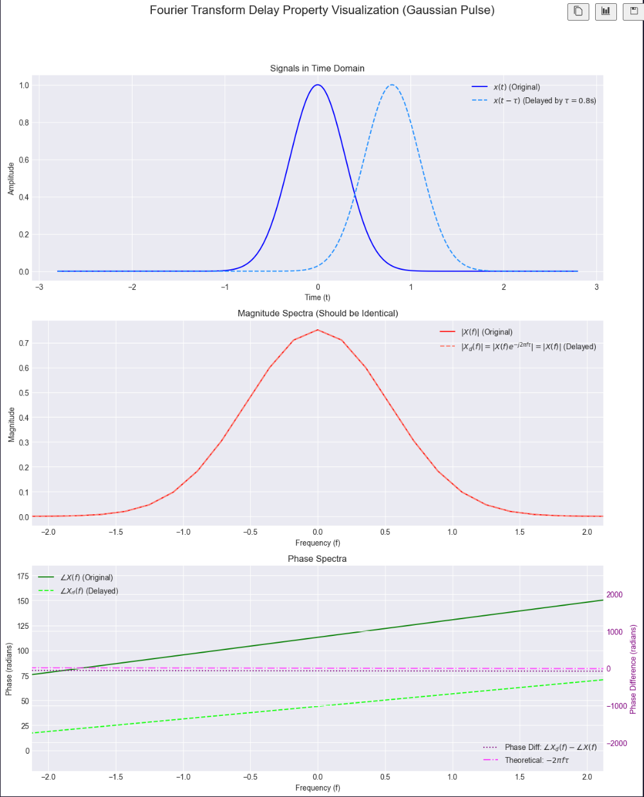

# Spectral Analysis

This chapter is fundamental as it introduces the tools to analyze signals in the **frequency domain**, which tells us about the different **frequency components** present in a signal.

The **Fourier Transform** is a specific method for analyzing a signal by comparing it (measuring its similarity) to a particular family of reference signals: **complex sinusoids** ($e^{j2\pi ft}$).

Signal processing utilizes **various transforms** and techniques that compare a signal to different sets of basis functions or reference signals **to extract different types of information**:
* For example, the **Wavelet Transform** (which appears later in Chapter 3) compares the signal to scaled and shifted versions of a "mother wavelet." 
    * This is useful for analyzing signals with **localized features** in **both time and frequency**.
* In Chapter 2, we discussed different bases like **Walsh-Hadamard functions** or **Legendre polynomials**. 

Representing a signal in these bases also involves comparing the signal to those specific basis functions, typically via inner products, to find the coefficients.

So, the core idea of decomposing or analyzing a signal by measuring its similarity to a set of predefined "pattern" signals is a fundamental concept. The Fourier Transform is a very powerful and widely used instance of this, where the patterns are the everlasting complex sinusoids, making it exceptionally good at revealing the **frequency content of a signal**.

## Fourier Transform (Continuous-Time)

The **Fourier Transform** of a continuous-time signal $x(t)$ is defined as:

$$X(f) = \int_{-\infty}^{\infty} x(t)e^{-j2\pi ft}dt$$
    
This function $X(f)$ is also known as the **spectrum** of the signal $x(t)$.

* **Interpretation (How $X(f)$ is calculated):** The formula shows that $X(f)$ is essentially an **inner product**.

    This inner product measures the **similarity** between the signal $x(t)$ and a complex sinusoid $e^{j2\pi ft}$ (specifically, its conjugate $e^{-j2\pi ft}$ is used in the integral). 
    
    This calculation is performed for **EVERY possible frequency $f$**, effectively "scanning" the signal for all frequency components (entire ***frequency spectrum***).

    * A complex sinusoid $e^{j2\pi ft}$ represents a **pure, single-frequency** oscillation. (IMAGE)
    
* **Core Significance of $X(f)$ (What the Spectrum tells us):**
    * The value $X(f)$ for a specific frequency $f_0$ quantifies **"how much" of that specific frequency component $f_0$ is present** in the overall signal $x(t)$.
    * The **magnitude $|X(f_0)|$** indicates the **strength or prominence** of that frequency component.
        * A **large $|X(f_0)|$** (a "strong" spectral component) means that an oscillation at frequency $f_0$ is a **significant and characteristic part of the signal** $x(t)$.
        * A **small $|X(f_0)|$** (a "weak" spectral component) means that oscillations at frequency $f_0$ contribute very little to the signal $x(t)$.
    * The **phase of $X(f_0)$** tells us how the sinusoidal component at frequency $f_0$ is aligned (phase-shifted) relative to a reference. (ELABORATE)

### Inverse Fourier Transform (IFT)

The **Inverse Fourier Transform (IFT)** allows us to **reconstruct the original signal** $x(t)$ from its **spectrum** $X(f)$:

$$x(t) = \int_{-\infty}^{\infty} X(f)e^{j2\pi ft}df$$

The goal of transforms like the Fourier Transform is to represent data in a different domain (the frequency domain, in this case) to:
* **Reveal hidden characteristics**: such as periodicities or dominant frequencies that are not obvious in the time-domain representation.
* **Simplify certain operations**: For example, convolution in the time domain becomes multiplication in the frequency domain (as we'll see in properties).

### Key Idea of Spectral Analysis

The goal of transforms like the Fourier Transform is to represent data in a different domain (the frequency domain, in this case) to **reveal different characteristics** or to **simplify certain operations**.

### Properties of the Fourier Transform

1.  **Spectrum and Energy Distribution**:
    * $X(f)$ is called the **spectrum** of the signal.
    * ***What it does?***: It indicates how much oscillatory behavior at each frequency $f$ is contained in the signal $x(t)$.
    * The squared magnitude, $|X(f)|^2$, is a measure of the signal's **energy at the frequency $f$**.

2.  **Parseval's Relation**:
    For signals with **finite energy**, the **total energy in the time domain equals the total energy in the frequency domain**:

    $$\int_{-\infty}^{\infty}|x(t)|^{2}dt = \int_{-\infty}^{\infty}|X(f)|^{2}df$$

    * **Significance**: This is a **crucial property**! It means the Fourier Transform is an **energy-preserving transformation**. 
    
        The spectrum $X(f)$ (specifically $|X(f)|^2$) shows how the **global energy** of the original signal $x(t)$ is distributed across the different frequencies.
    * *(Recalling our previous discussion: The energy $|x(t)|^2$ (like $x^H x$ for discrete signals) is the sum/integral of squared magnitudes. Parseval's relation links this time-domain energy directly to the sum/integral of squared magnitudes of the frequency components, $|X(f)|^2$. This solidifies the interpretation of $|X(f)|^2$ as energy density in frequency.)*

**Example: Fourier Transform of a Rectangular Pulse** (IMAGE)
* A rectangular pulse in the time domain, $x(t) = A \cdot \text{rect}_T(t)$ (a pulse of amplitude $A$ and duration $T$), has a Fourier Transform given by:
    $X(f) = AT \text{sinc}(\pi Tf) = AT \frac{\sin(\pi Tf)}{\pi Tf}$
    The $\text{sinc}$ function has a characteristic shape with a main lobe and decaying side lobes. This means even a simple, time-limited pulse contains an infinite range of frequencies, though their strength diminishes for higher frequencies.

### More Properties of the Fourier Transform (Continuous-Time)

These properties describe how the Fourier Transform behaves with common signal operations and what symmetries exist. Understanding these properties is crucial for manipulating signals in both time and frequency domains and for simplifying the analysis of systems.

1.  **Area Properties**:
    * The value of the spectrum at zero frequency, $X(0)$, is equal to the total area (integral) of the time-domain signal $x(t)$:
        $$X(0) = \int_{-\infty}^{\infty} x(t)dt$$
    * Conversely, the value of the time-domain signal at $t=0$, $x(0)$, is equal to the total area (integral) of its spectrum $X(f)$:
        $$x(0) = \int_{-\infty}^{\infty} X(f)df$$
    * This is a **unique property** for the frequency $f = 0$ and time $t = 0$
        * When you set $f=0$, the exponential term of complex sinusoid $e^{-j2\pi (0)t}$ becomes $e^0 = 1$.
        * So, the formula simplifies to $X(0) = \int_{-\infty}^{\infty} x(t) \cdot 1 \cdot dt = \int_{-\infty}^{\infty} x(t)dt$.
        * Same for $t=0$, the exponential term $e^{j2\pi f(0)}$ becomes $e^0 = 1$.
        * So, the formula simplifies to $x(0) = \int_{-\infty}^{\infty} X(f) \cdot 1 \cdot df = \int_{-\infty}^{\infty} X(f)df$.

2.  **Conjugate Symmetry**:
    * If the time-domain signal $x(t)$ is **real-valued**, then its Fourier Transform $X(f)$ exhibits conjugate symmetry:
        $$X(-f) = X^*(f)$$
    * This means that for real signals, the negative frequency part of the spectrum is redundant; it can be determined from the positive frequency part. 
    
        The magnitude spectrum will be symmetric ($|X(-f)| = |X(f)|$), and the phase spectrum will be anti-symmetric ($\angle X(-f) = -\angle X(f)$).

        

3.  **Delay (Time Shift)**:
    * If a signal $x(t)$ is shifted in time by $\tau$, its Fourier Transform is multiplied by a complex exponential representing a linear phase shift:
        $$\mathcal{F}\{x(t-\tau)\} = X(f)e^{-j2\pi f\tau}$$
    * This means a delay in the time domain does not change the magnitude of the spectrum, but it does affect its phase.
    * Used in **modulation** and **filtering application**.

    

4.  **Modulation (Frequency Shift)**:
    * If a signal $x(t)$ is multiplied by a complex exponential $e^{j2\pi f_0 t}$ (which is modulation), its **spectrum is shifted in frequency**:
        $$\mathcal{F}\{x(t)e^{j2\pi f_0 t}\} = X(f-f_0)$$
    * This property is fundamental to radio communications, where signals are modulated to different carrier frequencies.

    

5.  **Duality**:
    * There's a **strong symmetry between the time and frequency** domains. 
    
        If $X(f)$ is the Fourier Transform of $x(t)$, then the Fourier Transform of the function $X(t)$ (where we've replaced $f$ with $t$) is related to $x(-f)$ (the original time signal with $t$ replaced by $-f$):

        $$\text{If } X(f) = \mathcal{F}\{x(t)\}, \text{ then } \mathcal{F}\{X(t)\} = x(-f)$$

    * This implies that any property that holds for the time-to-frequency transformation has a corresponding dual property for the frequency-to-time transformation. 
    
    As shown below:
    * Rectangular pulse in time having a sinc spectrum.
    * Rectangular spectrum in frequency would correspond to a sinc-shaped pulse in time.

    

### Convolution Property

The convolution property states how the Fourier Transform behaves when two signals are convolved in the time domain.

* **Time-Domain Convolution:**
    The convolution of two signals $x(t)$ and $y(t)$ is defined as:
    
    $$z(t) = x(t) * y(t) = \int_{-\infty}^{\infty} x(\tau)y(t-\tau)d\tau$$

    Convolution is a fundamental operation that describes how the output of a *linear time-invariant* (LTI) system is **related to its input and impulse response**.

#### Frequency-Domain Multiplication
The Fourier Transform of the convolution of two signals is the **product of their individual Fourier Transforms**:

$$\mathcal{F}\{x(t) * y(t)\} = Z(f) = X(f)Y(f)$$

This property is **incredibly powerful** because it transforms a relatively **complex operation** in the time domain (convolution, which involves an integral and a flip-and-slide operation) into a **much simpler operation** in the frequency domain (point-wise multiplication).

This is the cornerstone of analyzing LTI systems in the frequency domain. 

* In the **time domain**, if $x(t)$ is the input to an LTI system with impulse response $h(t)$, the output is: $y(t) = x(t) * h(t)$. 
    
* In the **frequency domain**, this becomes $Y(f) = X(f)H(f)$ where $H(f)$ is the system's frequency response (the Fourier Transf. of $h(t)$). 
    
* **Consequences**: This makes it much easier to understand how a system modifies the frequency components of an input signal.

#### Duality (Multiplication in Time)
There's a **dual property**: multiplication in the time domain corresponds to convolution in the frequency domain (often with a scaling factor depending on the FT definition).
$$\mathcal{F}\{x(t)y(t)\} = Z(f) = X(f) * Y(f) = \int_{-\infty}^{\infty} X(\nu)Y(f-\nu)d\nu$$
(The slide uses this form. Sometimes a $1/(2\pi)$ scaling factor appears if using angular frequency $\omega$ instead of $f$).
* **Significance of Dual Property:** This is important in understanding phenomena like windowing (multiplying a signal by a window function in time) and its effect on the spectrum (convolution of their spectra, which can lead to spectral leakage). It's also key in amplitude modulation.

### Correlation Property

Correlation measures the **similarity** between two signals **as one is shifted relative to the other**.

* **Time-Domain Cross-Correlation:**
    The cross-correlation of two signals $x(t)$ and $y(t)$ is often defined as:
    $$R_{xy}(t) = z(t) = \int_{-\infty}^{\infty} x^{*}(\tau)y(t+\tau)d\tau$$
    (Note: The definition can vary slightly, sometimes $y(\tau-t)$ or $x(t+\tau)y^*(\tau)$ is used. The slide uses $x^*(\tau)y(t+\tau)$.)

* **Frequency-Domain Relationship:**
    The Fourier Transform of the cross-correlation is related to the product of their Fourier Transforms, with one of them conjugated:
    $$\mathcal{F}\{R_{xy}(t)\} = Z(f) = X^*(f)Y(f)$$

* **Significance:**
    * Correlation is used to **detect the presence of a known signal within another signal**, to **find time delays** between signals, and in system identification.
    * The **Wiener-Khinchin theorem** relates the autocorrelation of a signal (correlation of a signal with itself) to its power spectral density (for random signals) or energy spectral density (for deterministic signals). The energy spectral density is $|X(f)|^2$. If $y(t)=x(t)$, then $R_{xx}(t) \leftrightarrow |X(f)|^2$. This is a direct consequence of the correlation property: $X^*(f)X(f) = |X(f)|^2$.

These two properties, convolution and correlation, are **workhorses in signal processing** theory and applications.

### Change of Scale (Scaling Property)

This property describes how **scaling the time axis** of a signal **affects its Fourier Transform**.

* **Time-Domain Scaling:**
    If we have a signal $x(t)$ and we scale its time axis by a factor $\alpha$ (where $\alpha$ is a real, non-zero constant), we get a new signal $x(\alpha t)$.
    * If $|\alpha| > 1$, the signal $x(\alpha t)$ is a **compressed** version of $x(t)$ in time (it happens faster).
    * If $0 < |\alpha| < 1$, the signal $x(\alpha t)$ is an **expanded** or **stretched** version of $x(t)$ in time (it happens slower).

* **Frequency-Domain Effect:**
    The Fourier Transform of the time-scaled signal $x(\alpha t)$ is related to the original spectrum $X(f)$ as follows:
    $$\mathcal{F}\{x(\alpha t)\} = \frac{1}{|\alpha|}X\left(\frac{f}{\alpha}\right)$$

* **Significance and Interpretation:**
    * **Inverse Relationship:** This property highlights a fundamental inverse relationship between the "width" or "scale" of a signal in the time domain and the "width" or "scale" of its spectrum in the frequency domain.

        * **Time Compression leads to Frequency Expansion:** If you compress a signal in time (make it shorter, $|\alpha| > 1$), its spectrum expands in frequency (becomes wider). The $1/|\alpha|$ term also scales the amplitude of the spectrum down.
        * **Time Expansion leads to Frequency Compression:** If you expand a signal in time (make it longer, $0 < |\alpha| < 1$), its spectrum compresses in frequency (becomes narrower). The $1/|\alpha|$ term scales the amplitude of the spectrum up.

        

    * **Conservation of Energy (related):** While the amplitude of the spectrum changes by $1/|\alpha|$, the **overall energy relationship** (*Parseval's theorem*) **still holds**. The scaling factor $1/|\alpha|$ for the amplitude and $1/\alpha$ for the frequency axis in $X(f/\alpha)$ ensures this.

    * **Uncertainty Principle:** This is a direct mathematical manifestation of the time-frequency uncertainty principle we discussed earlier. A signal cannot be arbitrarily narrow in both time and frequency simultaneously. **If you squeeze it in one domain, it bulges out in the other**.

    * **Practical Examples:**
        * Playing a sound recording faster ($|\alpha| > 1$) not only shortens its duration but also shifts its frequencies upwards (pitches become higher), and the spectrum effectively spreads out.
        * If you have a short pulse (narrow in time), its spectrum will be wide, meaning it contains a broad range of frequencies needed to construct those sharp changes. A long, slowly varying signal will have a spectrum concentrated at lower frequencies (narrow in frequency).

### Periodization Property

This property describes what happens to the spectrum when a **finite-length signal is made periodic in the time domain**.

* **Time-Domain Periodization:**
    Let $g(t)$ be a finite-length signal, for instance, non-zero only for $t \in [-T_g/2, T_g/2]$ and zero elsewhere (finite support signal).
    
    We can create a periodic signal $x(t)$ by summing infinite, shifted copies of $g(t)$, where the copies are spaced $T$ seconds apart. This is called periodization with period $T$ ($T$ is the ***Fundamental Period***):
    $$x(t) = \sum_{k=-\infty}^{\infty} g(t-kT)$$
    The slide notes, "Every periodic signal can be written in this form," meaning **any periodic signal can be thought of as the periodization of one of its fundamental periods**.

* **Frequency-Domain Effect:**
    If $G(f) = \mathcal{F}\{g(t)\}$ is the Fourier Transform of the single, finite-length segment $g(t)$, then the Fourier Transform of the periodic signal $x(t)$ is:
    $$X(f) = \mathcal{F}\left\{\sum_{k=-\infty}^{\infty} g(t-kT)\right\} = \frac{1}{T}\sum_{k=-\infty}^{\infty} G\left(\frac{k}{T}\right)\delta\left(f-\frac{k}{T}\right)$$
    Where $\delta(f)$ is the Dirac delta function (an impulse in the frequency domain).

    

* **Significance and Interpretation:**
    * **Discrete Spectrum:** The spectrum $X(f)$ of a periodic signal $x(t)$ is **no longer a continuous function** of frequency. Instead, it consists of a **series of impulses** (Dirac deltas) located at **discrete frequencies** $f = k/T$. 

        These frequencies are integer multiples of the **fundamental frequency** $1/T$. These multiples are called **harmonics**.

    * **Amplitudes of Harmonics:** The "strength" or amplitude of each impulse at $f = k/T$ is given by $\frac{1}{T}G\left(\frac{k}{T}\right)$. This means the amplitudes are determined by sampling the Fourier Transform $G(f)$ of the original single period $g(t)$ at these harmonic frequencies $k/T$, and then scaling by $1/T$.

    * **Fourier Series Connection:** This result is precisely what the Fourier Series representation of a periodic signal tells us: a periodic signal can be decomposed into a sum of sinusoids (or complex exponentials) at its fundamental frequency and its harmonics. The coefficients of the Fourier Series are directly related to these $G(k/T)$ values.

    * **From Continuous to Discrete Spectrum:** Periodization in one domain (time) leads to a form of discretization (sampling with impulses) in the other domain (frequency). This is a manifestation of the duality between time and frequency.

This property is fundamental because many signals we analyze are either periodic or are treated as periodic when we use tools like the DFT (which implicitly assumes periodicity).

### Sampling Property (SFACIOLAMENTO INIZIATO)

This property describes what happens to the spectrum of a continuous-time signal when it is sampled in the time domain.

* **Time-Domain Sampling:**
    Sampling a continuous-time signal $x(t)$ means observing its values only at discrete time instants, typically $nT$, where $T$ is the **sampling period** and $n$ is an integer.
    
    Mathematically, the sampled signal $x_s(t)$ can be represented as the product of the original signal $x(t)$ and an impulse train (also known as a Dirac comb or Shah function):
    $$x_s(t) = x(t) \sum_{k=-\infty}^{\infty} \delta(t-kT) = \sum_{k=-\infty}^{\infty} x(kT)\delta(t-kT)$$
    This means $x_s(t)$ is a series of impulses, where the strength (area) of the impulse at $t=kT$ is equal to the value of the original signal $x(kT)$ at that instant.

* **Frequency-Domain Effect:**
    If $X(f) = \mathcal{F}\{x(t)\}$ is the Fourier Transform of the original continuous-time signal $x(t)$, then the Fourier Transform of the sampled signal $x_s(t)$ is a **periodization of $X(f)$**:
    $$X_s(f) = \mathcal{F}\{x_s(t)\} = \frac{1}{T}\sum_{k=-\infty}^{\infty} X\left(f-\frac{k}{T}\right)$$
    Here, $1/T$ is the **sampling frequency**, often denoted as $F_s$. So, $X_s(f) = F_s \sum_{k=-\infty}^{\infty} X(f-kF_s)$.

    

* **Significance and Interpretation:**
    * **Spectrum Replication:** Sampling in the time domain causes the original spectrum $X(f)$ to be **replicated (repeated) in the frequency domain** at integer multiples of the sampling frequency $F_s = 1/T$. Each replica is also scaled by $1/T$ (or $F_s$).
    * **From Continuous to Periodic Spectrum:** Sampling in one domain (time) leads to periodization in the other domain (frequency). This is the dual of the periodization property (where periodization in time led to a discrete/sampled spectrum).
    * **Nyquist-Shannon Sampling Theorem (MORE LATER):** This property is the basis for the famous Nyquist-Shannon Sampling Theorem.
        * If the original signal $x(t)$ is **bandlimited** (meaning its spectrum $X(f)$ is zero for frequencies $|f| > B$, where $B$ is the maximum frequency component), then the replicas of $X(f)$ in $X_s(f)$ will be separated in frequency if the sampling frequency $F_s = 1/T$ is high enough.
        * Specifically, to avoid overlap between the replicas (a phenomenon called **aliasing**), the sampling frequency $F_s$ must be at least twice the maximum frequency $B$ in the signal: $F_s \ge 2B$. This $2B$ is known as the Nyquist rate.
        * If aliasing occurs (because $F_s < 2B$), the replicas overlap, and it becomes impossible to perfectly reconstruct the original signal $x(t)$ (or its spectrum $X(f)$) from the sampled signal $x_s(t)$ by simple filtering. High frequencies from the original signal get "folded" into lower frequency ranges, masquerading as lower frequencies.
    * **Digital Signal Processing Foundation:** This property explains how a continuous signal can be converted to a discrete sequence of samples (which is what computers process) and under what conditions the original continuous signal can be perfectly reconstructed from these samples.

This property is absolutely critical for understanding how analog signals are converted to digital signals and the potential pitfalls (like aliasing) if sampling is not done correctly.

Okay, we've covered the Sampling Property, which is a critical link between continuous-time signals and their discrete-time representations. This naturally leads us to the next section in your slides (page 53):

## From Continuous-Time SP to Discrete-Time SP

* **Recap:** The slides reiterate that classical signal processing theory is often developed in continuous-time, but practical processing is typically performed by computers on **discrete-time signals**.
* **Origin of Discrete Data:** Data can be inherently discrete, or it can be obtained by discretizing a continuous-time signal $x(t)$. This discretization usually involves **sampling**, i.e., observing $x(t)$ at specific time instants $nT$ to get $x[n] = x(nT)$.
* **The Question:** The key question posed is: How can we extend Fourier analysis (which we've been discussing for continuous-time signals) to **discrete-time signals**?

This sets the stage for introducing the **Discrete Fourier Transform (DFT)**, which is the primary tool for spectral analysis of finite-length discrete-time signals.

To do this, we first need to define an appropriate set of basis functions for discrete-time signals, analogous to the complex exponentials $e^{j2\pi ft}$ used in the continuous FT.

### Discrete Fourier Basis

* For a finite-length discrete-time signal of $N$ points, the **discrete Fourier basis functions** are given by complex exponentials:
    $$w_k[n] = e^{j\frac{2\pi}{N}kn}$$
    where both $n$ (the time-domain index) and $k$ (the frequency-domain index) range from $0, ..., N-1$.

* **Vector Representation:** Each basis function $w_k[n]$ for a fixed $k$ can be thought of as a vector of $N$ complex values:
    $$w_k = \begin{bmatrix} 1 & e^{j\frac{2\pi}{N}k} & e^{j\frac{2\pi}{N}2k} & \cdots & e^{j\frac{2\pi}{N}(N-1)k} \end{bmatrix}^T \in \mathbb{C}^N$$
    There are $N$ such basis vectors, for $k=0, ..., N-1$.

* **Orthogonality:** These $N$ basis vectors are **orthogonal** to each other. The inner product $(w_k, w_l)$ is:
    $$(w_k, w_l) = \sum_{n=0}^{N-1} (w_k[n])^* w_l[n] = \sum_{n=0}^{N-1} e^{-j\frac{2\pi}{N}kn} e^{j\frac{2\pi}{N}ln} = \sum_{n=0}^{N-1} e^{j\frac{2\pi}{N}(l-k)n}$$
    This sum equals:
    * $N$, if $k=l$ (so $||w_k||^2 = N$)
    * $0$, if $k \ne l$

    This orthogonality is crucial, as it allows us to easily find the coefficients when we expand a signal in this basis.

Next image shows examples of these discrete Fourier basis functions (their real and imaginary parts) for $N=32$ and different values of $k$. You can see they represent discrete-time sinusoids of different frequencies.

### Discrete Fourier Transform (DFT)

The DFT transforms a finite-length discrete-time signal (which we can think of as living in the time domain) into an alternative representation of the same length, but in the discrete frequency domain.

* **Discrete Fourier Transform (Analysis Formula):**
    This formula calculates the DFT coefficients $X[k]$ from the discrete-time signal $x[n]$ (which has $N$ samples, $n=0, ..., N-1$).
    $$X[k] = (w_k, x)^* = \sum_{n=0}^{N-1} x[n] (w_k[n])^* = \sum_{n=0}^{N-1} x[n]e^{-j\frac{2\pi}{N}kn}$$
    for $k = 0, ..., N-1$.
    * **Interpretation:** Each DFT coefficient $X[k]$ is calculated by taking the inner product of the signal $x[n]$ with the conjugate of the $k^{th}$ discrete Fourier basis vector $w_k[n]$. (Note: The slide has $(w_k,x)$ which usually implies $w_k^* x$. The formula shown is $x[n] (e^{j\frac{2\pi}{N}kn})^* = x[n]e^{-j\frac{2\pi}{N}kn}$, which is the standard definition for the DFT analysis equation).
    * $X[k]$ represents the amplitude and phase of the $k^{th}$ discrete frequency component present in the signal $x[n]$.

* **Inverse Discrete Fourier Transform (IDFT) (Synthesis Formula):**
    This formula reconstructs the original discrete-time signal $x[n]$ from its DFT coefficients $X[k]$.
    $$x[n] = \frac{1}{N}\sum_{k=0}^{N-1} X[k]w_k[n] = \frac{1}{N}\sum_{k=0}^{N-1} X[k]e^{j\frac{2\pi}{N}kn}$$
    for $n = 0, ..., N-1$.
    * **Interpretation:** The signal $x[n]$ is synthesized by summing up all the discrete Fourier basis functions $w_k[n]$, each weighted by its corresponding DFT coefficient $X[k]$ and then scaled by $1/N$. The $1/N$ scaling factor is necessary because the basis vectors $w_k[n]$ are orthogonal but not orthonormal (their squared norm is $N$, not 1).

**Key Points:**
* The DFT takes an $N$-point time-domain sequence $x[n]$ and produces an $N$-point frequency-domain sequence $X[k]$.
* $X[k]$ is often called the **spectrum** of the discrete-time signal $x[n]$.
* The DFT is fundamental for performing spectral analysis on digital computers.

#### Discrete Fourier Transform in Matrix Form

The DFT operation can be expressed concisely using matrix multiplication.

* **DFT Matrix (W):**
    Let $W$ be an $N \times N$ matrix whose columns are the **discrete Fourier basis vectors** $w_k$.
    However, the standard DFT matrix (often denoted as $W$ or $F_N$) is usually defined such that its $(k,n)^{th}$ element is $W_{kn} = e^{-j\frac{2\pi}{N}kn}$ (for the analysis/forward DFT) or $e^{j\frac{2\pi}{N}kn}$ (for the synthesis/inverse DFT, sometimes with a $1/N$ factor).

    Let's clarify based on the slide's notation:
    The slide says: "Let $W=[w_{1}w_{2}...w_{N-1}]\in\mathbb{C}^{N\times N}$ be the matrix collecting the Fourier basis vectors in its columns".
    Recall $w_k[n] = e^{j\frac{2\pi}{N}kn}$. So, the $k^{th}$ column of this $W$ matrix (if $k$ is column index) would be the vector $w_k$.

* **Matrix Form of DFT (Analysis):**
    The DFT coefficients $X[k]$ are given by $X[k] = \sum_{n=0}^{N-1} x[n]e^{-j\frac{2\pi}{N}kn}$.
    If we define a DFT matrix $F$ (let's use $F$ to avoid confusion with the slide's $W$) such that $F_{kn} = e^{-j\frac{2\pi}{N}kn}$, then the vector of DFT coefficients $X = [X[0], ..., X[N-1]]^T$ can be obtained by multiplying this matrix $F$ with the input signal vector $x = [x[0], ..., x[N-1]]^T$:
    $$X = Fx$$

    The slide uses a slightly different formulation: $\hat{x} = W^H x$, where $\hat{x}$ is the vector of DFT coefficients $X[k]$, and $W$ is the matrix whose columns are $w_k$ (the basis vectors $e^{j\frac{2\pi}{N}kn}$).
    The Hermitian transpose $W^H$ would have rows that are $w_k^H$. The $(k,n)^{th}$ element of $W^H$ would be $(w_k[n])^* = e^{-j\frac{2\pi}{N}kn}$.
    So, if $W$ is the matrix with columns $w_k$, then $W^H$ is indeed the standard DFT analysis matrix $F$ mentioned above.
    Thus, the slide's notation $\hat{x} = W^H x$ is correct for the analysis formula.

* **Matrix Form of IDFT (Synthesis):**
    The IDFT is $x[n] = \frac{1}{N}\sum_{k=0}^{N-1} X[k]e^{j\frac{2\pi}{N}kn}$.
    This can be written as $x = \frac{1}{N} W \hat{x}$, where $W$ is the matrix whose $(n,k)^{th}$ element is $e^{j\frac{2\pi}{N}nk}$ (i.e., its columns are the basis vectors $w_k$). This matches the slide.

**Significance of Matrix Form:**
* It provides a compact way to represent the DFT and IDFT.
* It highlights that the DFT is a linear transformation.
* It's useful for theoretical analysis and for understanding the computational complexity.

#### The Fast Fourier Transform (FFT)

* **What is FFT?**
    The Fast Fourier Transform (FFT) is **not** a different type of transform from the DFT. It is simply a collection of highly **efficient algorithms** for computing the DFT (and its inverse, the IDFT).

* **Computational Complexity:**
    * If you compute the DFT directly using the summation formula $X[k] = \sum x[n]e^{-j\frac{2\pi}{N}kn}$ for each of the $N$ values of $X[k]$, each summation involves $N$ complex multiplications and $N-1$ complex additions. Doing this for all $N$ coefficients results in a complexity on the order of $N^2$ operations (denoted as $O(N^2)$).
    * The FFT algorithms cleverly exploit the symmetries and periodicities of the complex exponential terms $e^{-j\frac{2\pi}{N}kn}$ (the "twiddle factors") to reduce the number of redundant calculations.
    * FFT algorithms reduce the computational complexity to be on the order of $N \log N$ operations (denoted as $O(N \log N)$).

* **Impact of FFT:**
    * This reduction in complexity from $O(N^2)$ to $O(N \log N)$ is **enormous** for large values of $N$. For example, if $N=1024$:
        * $N^2 \approx 1 \text{ million}$
        * $N \log_2 N = 1024 \times 10 = 10240 \approx 10 \text{ thousand}$
        This is a speed-up factor of about 100. For larger $N$, the speed-up is even more dramatic.
    * The development of FFT algorithms in the 1960s (notably the Cooley-Tukey algorithm) revolutionized digital signal processing, making it practical to perform Fourier analysis on digital computers for a wide range of applications.

* **Efficiency for Powers of 2:**
    FFT algorithms are particularly efficient when the length of the data sequence $N$ is a power of 2 (e.g., 256, 512, 1024, 2048). Many FFT implementations are optimized for these lengths. If $N$ is not a power of 2, techniques like zero-padding (adding zeros to the signal to make its length a power of 2) are often used, or more general FFT algorithms for composite numbers are employed.

In summary, the matrix form provides a theoretical view of the DFT as a linear transformation, while the FFT provides the practical, computationally feasible means to calculate it.

#### Relation between FT and DFT

This is a crucial conceptual bridge. The DFT is what we compute in practice on digital computers, but it's an approximation or a specific representation related to the continuous-time FT of an underlying analog signal.

1.  **Top-Left: Fourier Transform of a continuous function $s(t)$**
    * This shows a continuous-time signal $s(t)$ (not explicitly drawn, but implied) and its continuous-time Fourier Transform $S(f)$. $S(f)$ is a continuous function of frequency, typically shown as a smooth curve (e.g., a Gaussian-like shape in the diagram).
    * This is the ideal, continuous-world scenario: $s(t) \leftrightarrow S(f)$.

2.  **Top-Right: Transform of the periodic summation of $s(t)$ (aka "Fourier Series Coefficients")**
    * This considers a signal formed by taking $s(t)$ and making it periodic with some period $P$. Let's call this periodic signal $s_P(t) = \sum_k s(t-kP)$.
    * As we learned from the **Periodization Property**, the spectrum of such a periodic signal becomes discrete. It consists of impulses (or spectral lines) at frequencies $k/P$ (harmonics of $1/P$).
    * The amplitudes of these impulses are proportional to $S(k/P)$ – samples of the original continuous spectrum $S(f)$ taken at the harmonic frequencies.
    * This is essentially what the **Fourier Series** gives you: a set of discrete coefficients representing a periodic continuous-time signal. The diagram labels this $S(k)$.

3.  **Bottom-Left: Transform of periodically sampled $s(t)$ (aka "Discrete-Time Fourier Transform" - DTFT)**
    * This considers taking the original continuous-time signal $s(t)$ and sampling it in the time domain with a sampling period $T$ (sampling frequency $F_s = 1/T$). Let the sampled signal be $s_{sampled}(t) = \sum_n s(nT)\delta(t-nT)$.
    * As we learned from the **Sampling Property**, the spectrum of this sampled signal, $S_{1/T}(f)$ (the slide uses this notation), becomes a periodic replication of the original spectrum $S(f)$. Replicas of $S(f)$ are centered at multiples of the sampling frequency $F_s = 1/T$.
    * This $S_{1/T}(f)$ is a continuous but periodic function of frequency. This is the **Discrete-Time Fourier Transform (DTFT)** of the sequence of samples $s[n]=s(nT)$.

4.  **Bottom-Right: Transform of both periodic sampling and periodic summation (aka "Discrete Fourier Transform" - DFT)**
    * This is where the DFT comes in. The DFT operates on a **finite number of samples** $s[n]$ (say, $N$ samples).
    * Effectively, the DFT can be understood as the result of performing both operations:
        * **Sampling in time:** This makes the spectrum periodic (as in step 3).
        * **Windowing/Assuming periodicity in time:** When we take $N$ samples for the DFT, we are implicitly dealing with a signal that is either finite in duration or is assumed to be one period of an $N$-point periodic sequence. Making a signal periodic in the time domain (with period $N T_s$, where $T_s$ is the sampling interval) makes its spectrum discrete (sampled in frequency, as in step 2).
    * So, the DFT $S_N(k)$ (as labeled in the diagram) is a **discrete and periodic representation in the frequency domain**. It consists of $N$ discrete frequency samples.
    * The diagram shows these $N$ samples $S_N(k)$ as essentially samples of one period of the periodic spectrum $S_{1/T}(f)$ from step 3.
    * The slide's caption: "The DFT is a discrete version (i.e. samples) of the periodization of the continuous-time signal spectrum, where samples are collected over a single period."
        * This means: Take $S(f)$ (from step 1). Periodize it due to time sampling (step 3, giving $S_{1/T}(f)$). Then, sample this periodic spectrum $S_{1/T}(f)$ to get the DFT coefficients $S_N(k)$.

**In essence:**
The DFT $X[k]$ of a sequence of $N$ samples $x[n]$ can be thought of as $N$ samples of one period of the DTFT $X(e^{j\omega})$ of that sequence. And the DTFT $X(e^{j\omega})$ is, in turn, a scaled and periodic version of the continuous-time Fourier Transform $X_c(f)$ of an underlying analog signal from which $x[n]$ was derived, assuming proper sampling.

This diagram is a very concise way to show how these different Fourier representations relate to each other through operations of sampling and periodization in both domains.

#### Properties of the Discrete Fourier Transform (DFT)

These properties are analogous to those of the continuous-time FT but are adapted for finite-length discrete sequences.

Let $x[n]$ be an $N$-point discrete-time sequence, and $X[k]$ be its $N$-point DFT.

1.  **Spectrum Interpretation**:
    * The coefficients $X[k]$ (for $k=0, ..., N-1$) are referred to as the **spectrum** of the discrete-time signal $x[n]$.
    * Each $X[k]$ shows how much oscillatory behavior at the discrete frequency $\frac{2\pi}{N}k$ (radians per sample) is contained in the signal $x[n]$. This is because $X[k]$ is derived from the inner product of $x[n]$ with the $k^{th}$ discrete Fourier basis function $e^{j\frac{2\pi}{N}kn}$.

2.  **Energy Distribution**:
    * The squared magnitude $|X[k]|^2$ is a measure (up to a scale factor $N$) of the signal's **energy at the discrete frequency $\frac{2\pi}{N}k$**.

3.  **Parseval's Relation for DFT**:
    This is the discrete equivalent of Parseval's relation for the continuous FT. It states that the energy of the signal in the time domain is related to the energy in the DFT domain:
    $$||x||^2 = \sum_{n=0}^{N-1} |x[n]|^2 = \frac{1}{N} \sum_{k=0}^{N-1} |X[k]|^2 = \frac{1}{N} ||\hat{x}||^2$$
    (where $\hat{x}$ is the vector of DFT coefficients $X[k]$).
    * **Significance**: This is a crucial energy conservation property. It shows how the total energy of the discrete-time signal $x[n]$ is distributed among its $N$ discrete frequency components $X[k]$. The $1/N$ factor arises from the definition of the DFT and IDFT (specifically, the $1/N$ in the IDFT formula).
    * *(Recalling our earlier discussions: The energy $||x||^2 = \sum |x[n]|^2$ is calculated using squared magnitudes. Parseval's relation for DFT shows that this energy is preserved (up to the $1/N$ scaling) when we transform to the frequency domain coefficients $X[k]$. So, $\frac{1}{N}|X[k]|^2$ can be interpreted as the energy contribution from the $k^{th}$ frequency component.)*

The slides then present several exercises (Exercises 2, 3, 4 on slides 61-63) that use the DFT to analyze signals, such as detecting periodic trends in noise, classifying whale songs, and looking at the spectrum of speech signals. These exercises highlight the practical utility of the DFT in extracting meaningful information from real-world data by examining its frequency content.