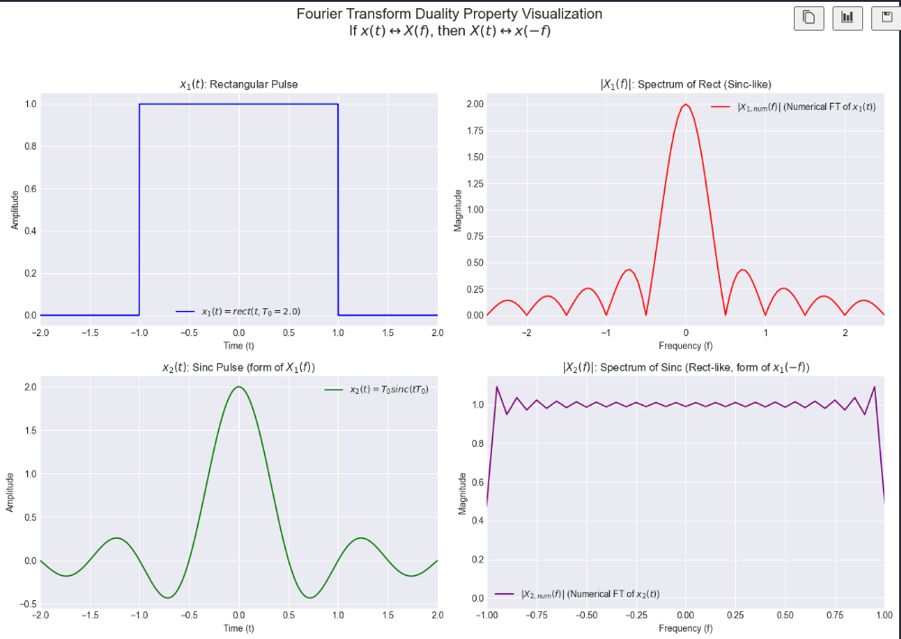
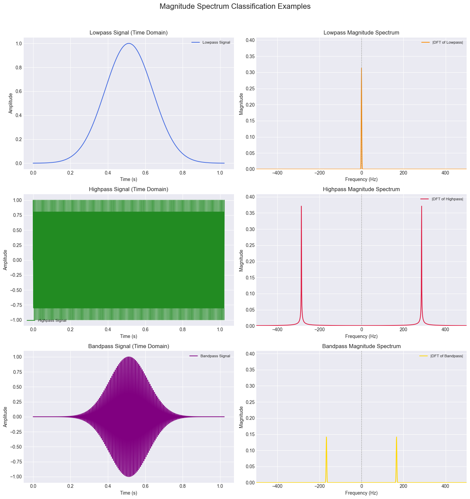

# Spectral Analysis

This chapter is fundamental as it introduces the tools to analyze signals in the **frequency domain**, which tells us about the different **frequency components** present in a signal.

The **Fourier Transform** is a specific method for analyzing a signal by comparing it (measuring its similarity) to a particular family of reference signals: **complex sinusoids** ($e^{j2\pi ft}$).

Signal processing utilizes **various transforms** and techniques that compare a signal to different sets of basis functions or reference signals **to extract different types of information**:
* For example, the **Wavelet Transform** (which appears later in Chapter 3) compares the signal to scaled and shifted versions of a "mother wavelet." 
    * This is useful for analyzing signals with **localized features** in **both time and frequency**.
* In Chapter 2, we discussed different bases like **Walsh-Hadamard functions** or **Legendre polynomials**. 

Representing a signal in these bases also involves comparing the signal to those specific basis functions, typically via inner products, to find the coefficients.

So, the core idea of decomposing or analyzing a signal by measuring its similarity to a set of predefined "pattern" signals is a fundamental concept. The Fourier Transform is a very powerful and widely used instance of this, where the patterns are the everlasting complex sinusoids, making it exceptionally good at revealing the **frequency content of a signal**.

## Fourier Transform (Continuous-Time)

The **Fourier Transform** of a continuous-time signal $x(t)$ is defined as:

$$X(f) = \int_{-\infty}^{\infty} x(t)e^{-j2\pi ft}dt$$
    
This function $X(f)$ is also known as the **spectrum** of the signal $x(t)$.

* **Interpretation (How $X(f)$ is calculated):** The formula shows that $X(f)$ is essentially an **inner product**.

    This inner product measures the **similarity** between the signal $x(t)$ and a complex sinusoid $e^{j2\pi ft}$ (specifically, its conjugate $e^{-j2\pi ft}$ is used in the integral). 
    
    This calculation is performed for **EVERY possible frequency $f$**, effectively "scanning" the signal for all frequency components (entire ***frequency spectrum***).

    * A complex sinusoid $e^{j2\pi ft}$ represents a **pure, single-frequency** oscillation. (IMAGE)
    
* **Core Significance of $X(f)$ (What the Spectrum tells us):**
    * The value $X(f)$ for a specific frequency $f_0$ quantifies **"how much" of that specific frequency component $f_0$ is present** in the overall signal $x(t)$.
    * The **magnitude $|X(f_0)|$** indicates the **strength or prominence** of that frequency component.
        * A **large $|X(f_0)|$** (a "strong" spectral component) means that an oscillation at frequency $f_0$ is a **significant and characteristic part of the signal** $x(t)$.
        * A **small $|X(f_0)|$** (a "weak" spectral component) means that oscillations at frequency $f_0$ contribute very little to the signal $x(t)$.
    * The **phase of $X(f_0)$** tells us how the sinusoidal component at frequency $f_0$ is aligned (phase-shifted) relative to a reference. (ELABORATE)

### Inverse Fourier Transform (IFT)

The **Inverse Fourier Transform (IFT)** allows us to **reconstruct the original signal** $x(t)$ from its **spectrum** $X(f)$:

$$x(t) = \int_{-\infty}^{\infty} X(f)e^{j2\pi ft}df$$

The goal of transforms like the Fourier Transform is to represent data in a different domain (the frequency domain, in this case) to:
* **Reveal hidden characteristics**: such as periodicities or dominant frequencies that are not obvious in the time-domain representation.
* **Simplify certain operations**: For example, convolution in the time domain becomes multiplication in the frequency domain (as we'll see in properties).

### Key Idea of Spectral Analysis

The goal of transforms like the Fourier Transform is to represent data in a different domain (the frequency domain, in this case) to **reveal different characteristics** or to **simplify certain operations**.

### Properties of the Fourier Transform

1.  **Spectrum and Energy Distribution**:
    * $X(f)$ is called the **spectrum** of the signal.
    * ***What it does?***: It indicates how much oscillatory behavior at each frequency $f$ is contained in the signal $x(t)$.
    * The squared magnitude, $|X(f)|^2$, is a measure of the signal's **energy at the frequency $f$**.

2.  **Parseval's Relation**:
    For signals with **finite energy**, the **total energy in the time domain equals the total energy in the frequency domain**:

    $$\int_{-\infty}^{\infty}|x(t)|^{2}dt = \int_{-\infty}^{\infty}|X(f)|^{2}df$$

    * **Significance**: This is a **crucial property**! It means the Fourier Transform is an **energy-preserving transformation**. 
    
        The spectrum $X(f)$ (specifically $|X(f)|^2$) shows how the **global energy** of the original signal $x(t)$ is distributed across the different frequencies.
    * *(Recalling our previous discussion: The energy $|x(t)|^2$ (like $x^H x$ for discrete signals) is the sum/integral of squared magnitudes. Parseval's relation links this time-domain energy directly to the sum/integral of squared magnitudes of the frequency components, $|X(f)|^2$. This solidifies the interpretation of $|X(f)|^2$ as energy density in frequency.)*

**Example: Fourier Transform of a Rectangular Pulse** (IMAGE)
* A rectangular pulse in the time domain, $x(t) = A \cdot \text{rect}_T(t)$ (a pulse of amplitude $A$ and duration $T$), has a Fourier Transform given by:
    $X(f) = AT \text{sinc}(\pi Tf) = AT \frac{\sin(\pi Tf)}{\pi Tf}$
    The $\text{sinc}$ function has a characteristic shape with a main lobe and decaying side lobes. This means even a simple, time-limited pulse contains an infinite range of frequencies, though their strength diminishes for higher frequencies.

### More Properties of the Fourier Transform (Continuous-Time)

These properties describe how the Fourier Transform behaves with common signal operations and what symmetries exist. Understanding these properties is crucial for manipulating signals in both time and frequency domains and for simplifying the analysis of systems.

1.  **Area Properties**:
    * The value of the spectrum at zero frequency, $X(0)$, is equal to the total area (integral) of the time-domain signal $x(t)$:
        $$X(0) = \int_{-\infty}^{\infty} x(t)dt$$
    * Conversely, the value of the time-domain signal at $t=0$, $x(0)$, is equal to the total area (integral) of its spectrum $X(f)$:
        $$x(0) = \int_{-\infty}^{\infty} X(f)df$$
    * This is a **unique property** for the frequency $f = 0$ and time $t = 0$
        * When you set $f=0$, the exponential term of complex sinusoid $e^{-j2\pi (0)t}$ becomes $e^0 = 1$.
        * So, the formula simplifies to $X(0) = \int_{-\infty}^{\infty} x(t) \cdot 1 \cdot dt = \int_{-\infty}^{\infty} x(t)dt$.
        * Same for $t=0$, the exponential term $e^{j2\pi f(0)}$ becomes $e^0 = 1$.
        * So, the formula simplifies to $x(0) = \int_{-\infty}^{\infty} X(f) \cdot 1 \cdot df = \int_{-\infty}^{\infty} X(f)df$.

2.  **Conjugate Symmetry**:
    * If the time-domain signal $x(t)$ is **real-valued**, then its Fourier Transform $X(f)$ exhibits conjugate symmetry:
        $$X(-f) = X^*(f)$$
    * This means that for real signals, the negative frequency part of the spectrum is redundant; it can be determined from the positive frequency part. 
    
        The magnitude spectrum will be symmetric ($|X(-f)| = |X(f)|$), and the phase spectrum will be anti-symmetric ($\angle X(-f) = -\angle X(f)$).

        

3.  **Delay (Time Shift)**:
    * If a signal $x(t)$ is shifted in time by $\tau$, its Fourier Transform is multiplied by a complex exponential representing a linear phase shift:
        $$\mathcal{F}\{x(t-\tau)\} = X(f)e^{-j2\pi f\tau}$$
    * This means a delay in the time domain does not change the magnitude of the spectrum, but it does affect its phase.
    * Used in **modulation** and **filtering application**.

    

4.  **Modulation (Frequency Shift)**:
    * If a signal $x(t)$ is multiplied by a complex exponential $e^{j2\pi f_0 t}$ (which is modulation), its **spectrum is shifted in frequency**:
        $$\mathcal{F}\{x(t)e^{j2\pi f_0 t}\} = X(f-f_0)$$
    * This property is fundamental to radio communications, where signals are modulated to different carrier frequencies.

    

5.  **Duality**:
    * There's a **strong symmetry between the time and frequency** domains. 
    
        If $X(f)$ is the Fourier Transform of $x(t)$, then the Fourier Transform of the function $X(t)$ (where we've replaced $f$ with $t$) is related to $x(-f)$ (the original time signal with $t$ replaced by $-f$):

        $$\text{If } X(f) = \mathcal{F}\{x(t)\}, \text{ then } \mathcal{F}\{X(t)\} = x(-f)$$

    * This implies that any property that holds for the time-to-frequency transformation has a corresponding dual property for the frequency-to-time transformation. 
    
    As shown below:
    * Rectangular pulse in time having a sinc spectrum.
    * Rectangular spectrum in frequency would correspond to a sinc-shaped pulse in time.

    

### Convolution Property

The convolution property states how the Fourier Transform behaves when two signals are convolved in the time domain.

* **Time-Domain Convolution:**
    The convolution of two signals $x(t)$ and $y(t)$ is defined as:
    
    $$z(t) = x(t) * y(t) = \int_{-\infty}^{\infty} x(\tau)y(t-\tau)d\tau$$

    Convolution is a fundamental operation that describes how the output of a *linear time-invariant* (LTI) system is **related to its input and impulse response**.

#### Frequency-Domain Multiplication
The Fourier Transform of the convolution of two signals is the **product of their individual Fourier Transforms**:

$$\mathcal{F}\{x(t) * y(t)\} = Z(f) = X(f)Y(f)$$

This property is **incredibly powerful** because it transforms a relatively **complex operation** in the time domain (convolution, which involves an integral and a flip-and-slide operation) into a **much simpler operation** in the frequency domain (point-wise multiplication).

This is the cornerstone of analyzing LTI systems in the frequency domain. 

* In the **time domain**, if $x(t)$ is the input to an LTI system with impulse response $h(t)$, the output is: $y(t) = x(t) * h(t)$. 
    
* In the **frequency domain**, this becomes $Y(f) = X(f)H(f)$ where $H(f)$ is the system's frequency response (the Fourier Transf. of $h(t)$). 
    
* **Consequences**: This makes it much easier to understand how a system modifies the frequency components of an input signal.

#### Duality (Multiplication in Time)
There's a **dual property**: multiplication in the time domain corresponds to convolution in the frequency domain (often with a scaling factor depending on the FT definition).
$$\mathcal{F}\{x(t)y(t)\} = Z(f) = X(f) * Y(f) = \int_{-\infty}^{\infty} X(\nu)Y(f-\nu)d\nu$$
(The slide uses this form. Sometimes a $1/(2\pi)$ scaling factor appears if using angular frequency $\omega$ instead of $f$).
* **Significance of Dual Property:** This is important in understanding phenomena like windowing (multiplying a signal by a window function in time) and its effect on the spectrum (convolution of their spectra, which can lead to spectral leakage). It's also key in amplitude modulation.

### Correlation Property

Correlation measures the **similarity** between two signals **as one is shifted relative to the other**.

* **Time-Domain Cross-Correlation:**
    The cross-correlation of two signals $x(t)$ and $y(t)$ is often defined as:
    $$R_{xy}(t) = z(t) = \int_{-\infty}^{\infty} x^{*}(\tau)y(t+\tau)d\tau$$
    (Note: The definition can vary slightly, sometimes $y(\tau-t)$ or $x(t+\tau)y^*(\tau)$ is used. The slide uses $x^*(\tau)y(t+\tau)$.)

* **Frequency-Domain Relationship:**
    The Fourier Transform of the cross-correlation is related to the product of their Fourier Transforms, with one of them conjugated:
    $$\mathcal{F}\{R_{xy}(t)\} = Z(f) = X^*(f)Y(f)$$

* **Significance:**
    * Correlation is used to **detect the presence of a known signal within another signal**, to **find time delays** between signals, and in system identification.
    * The **Wiener-Khinchin theorem** relates the autocorrelation of a signal (correlation of a signal with itself) to its power spectral density (for random signals) or energy spectral density (for deterministic signals). The energy spectral density is $|X(f)|^2$. If $y(t)=x(t)$, then $R_{xx}(t) \leftrightarrow |X(f)|^2$. This is a direct consequence of the correlation property: $X^*(f)X(f) = |X(f)|^2$.

These two properties, convolution and correlation, are **workhorses in signal processing** theory and applications.

### Change of Scale (Scaling Property)

This property describes how **scaling the time axis** of a signal **affects its Fourier Transform**.

* **Time-Domain Scaling:**
    If we have a signal $x(t)$ and we scale its time axis by a factor $\alpha$ (where $\alpha$ is a real, non-zero constant), we get a new signal $x(\alpha t)$.
    * If $|\alpha| > 1$, the signal $x(\alpha t)$ is a **compressed** version of $x(t)$ in time (it happens faster).
    * If $0 < |\alpha| < 1$, the signal $x(\alpha t)$ is an **expanded** or **stretched** version of $x(t)$ in time (it happens slower).

* **Frequency-Domain Effect:**
    The Fourier Transform of the time-scaled signal $x(\alpha t)$ is related to the original spectrum $X(f)$ as follows:
    $$\mathcal{F}\{x(\alpha t)\} = \frac{1}{|\alpha|}X\left(\frac{f}{\alpha}\right)$$

* **Significance and Interpretation:**
    * **Inverse Relationship:** This property highlights a fundamental inverse relationship between the "width" or "scale" of a signal in the time domain and the "width" or "scale" of its spectrum in the frequency domain.

        * **Time Compression leads to Frequency Expansion:** If you compress a signal in time (make it shorter, $|\alpha| > 1$), its spectrum expands in frequency (becomes wider). The $1/|\alpha|$ term also scales the amplitude of the spectrum down.
        * **Time Expansion leads to Frequency Compression:** If you expand a signal in time (make it longer, $0 < |\alpha| < 1$), its spectrum compresses in frequency (becomes narrower). The $1/|\alpha|$ term scales the amplitude of the spectrum up.

        

    * **Conservation of Energy (related):** While the amplitude of the spectrum changes by $1/|\alpha|$, the **overall energy relationship** (*Parseval's theorem*) **still holds**. The scaling factor $1/|\alpha|$ for the amplitude and $1/\alpha$ for the frequency axis in $X(f/\alpha)$ ensures this.

    * **Uncertainty Principle:** This is a direct mathematical manifestation of the time-frequency uncertainty principle we discussed earlier. A signal cannot be arbitrarily narrow in both time and frequency simultaneously. **If you squeeze it in one domain, it bulges out in the other**.

    * **Practical Examples:**
        * Playing a sound recording faster ($|\alpha| > 1$) not only shortens its duration but also shifts its frequencies upwards (pitches become higher), and the spectrum effectively spreads out.
        * If you have a short pulse (narrow in time), its spectrum will be wide, meaning it contains a broad range of frequencies needed to construct those sharp changes. A long, slowly varying signal will have a spectrum concentrated at lower frequencies (narrow in frequency).

### Periodization Property

This property describes what happens to the spectrum when a **finite-length signal is made periodic in the time domain**.

* **Time-Domain Periodization:**
    Let $g(t)$ be a finite-length signal, for instance, non-zero only for $t \in [-T_g/2, T_g/2]$ and zero elsewhere (finite support signal).
    
    We can create a periodic signal $x(t)$ by summing infinite, shifted copies of $g(t)$, where the copies are spaced $T$ seconds apart. This is called periodization with period $T$ ($T$ is the ***Fundamental Period***):
    $$x(t) = \sum_{k=-\infty}^{\infty} g(t-kT)$$
    The slide notes, "Every periodic signal can be written in this form," meaning **any periodic signal can be thought of as the periodization of one of its fundamental periods**.

* **Frequency-Domain Effect:**
    If $G(f) = \mathcal{F}\{g(t)\}$ is the Fourier Transform of the single, finite-length segment $g(t)$, then the Fourier Transform of the periodic signal $x(t)$ is:
    $$X(f) = \mathcal{F}\left\{\sum_{k=-\infty}^{\infty} g(t-kT)\right\} = \frac{1}{T}\sum_{k=-\infty}^{\infty} G\left(\frac{k}{T}\right)\delta\left(f-\frac{k}{T}\right)$$
    Where $\delta(f)$ is the Dirac delta function (an impulse in the frequency domain).

    

* **Significance and Interpretation:**
    * **Discrete Spectrum:** The spectrum $X(f)$ of a periodic signal $x(t)$ is **no longer a continuous function** of frequency. Instead, it consists of a **series of impulses** (Dirac deltas) located at **discrete frequencies** $f = k/T$. 

        These frequencies are integer multiples of the **fundamental frequency** $1/T$. These multiples are called **harmonics**.

    * **Amplitudes of Harmonics:** The "strength" or amplitude of each impulse at $f = k/T$ is given by $\frac{1}{T}G\left(\frac{k}{T}\right)$. This means the amplitudes are determined by sampling the Fourier Transform $G(f)$ of the original single period $g(t)$ at these harmonic frequencies $k/T$, and then scaling by $1/T$.

    * **Fourier Series Connection:** This result is precisely what the Fourier Series representation of a periodic signal tells us: a periodic signal can be decomposed into a sum of sinusoids (or complex exponentials) at its fundamental frequency and its harmonics. The coefficients of the Fourier Series are directly related to these $G(k/T)$ values.

    * **From Continuous to Discrete Spectrum:** Periodization in one domain (time) leads to a form of discretization (sampling with impulses) in the other domain (frequency). This is a manifestation of the duality between time and frequency.

This property is fundamental because many signals we analyze are either periodic or are treated as periodic when we use tools like the DFT (which implicitly assumes periodicity).

### Sampling Property (SFACIOLAMENTO INIZIATO)

This property describes what happens to the spectrum of a continuous-time signal when it is sampled in the time domain.

* **Time-Domain Sampling:**
    Sampling a continuous-time signal $x(t)$ means observing its values only at discrete time instants, typically $nT$, where $T$ is the **sampling period** and $n$ is an integer.
    
    Mathematically, the sampled signal $x_s(t)$ can be represented as the product of the original signal $x(t)$ and an impulse train (also known as a Dirac comb or Shah function):
    $$x_s(t) = x(t) \sum_{k=-\infty}^{\infty} \delta(t-kT) = \sum_{k=-\infty}^{\infty} x(kT)\delta(t-kT)$$
    This means $x_s(t)$ is a series of impulses, where the strength (area) of the impulse at $t=kT$ is equal to the value of the original signal $x(kT)$ at that instant.

* **Frequency-Domain Effect:**
    If $X(f) = \mathcal{F}\{x(t)\}$ is the Fourier Transform of the original continuous-time signal $x(t)$, then the Fourier Transform of the sampled signal $x_s(t)$ is a **periodization of $X(f)$**:
    $$X_s(f) = \mathcal{F}\{x_s(t)\} = \frac{1}{T}\sum_{k=-\infty}^{\infty} X\left(f-\frac{k}{T}\right)$$
    Here, $1/T$ is the **sampling frequency**, often denoted as $F_s$. So, $X_s(f) = F_s \sum_{k=-\infty}^{\infty} X(f-kF_s)$.

    

* **Significance and Interpretation:**
    * **Spectrum Replication:** Sampling in the time domain causes the original spectrum $X(f)$ to be **replicated (repeated) in the frequency domain** at integer multiples of the sampling frequency $F_s = 1/T$. Each replica is also scaled by $1/T$ (or $F_s$).
    * **From Continuous to Periodic Spectrum:** Sampling in one domain (time) leads to periodization in the other domain (frequency). This is the dual of the periodization property (where periodization in time led to a discrete/sampled spectrum).
    * **Nyquist-Shannon Sampling Theorem (MORE LATER):** This property is the basis for the famous Nyquist-Shannon Sampling Theorem.
        * If the original signal $x(t)$ is **bandlimited** (meaning its spectrum $X(f)$ is zero for frequencies $|f| > B$, where $B$ is the maximum frequency component), then the replicas of $X(f)$ in $X_s(f)$ will be separated in frequency if the sampling frequency $F_s = 1/T$ is high enough.
        * Specifically, to avoid overlap between the replicas (a phenomenon called **aliasing**), the sampling frequency $F_s$ must be at least twice the maximum frequency $B$ in the signal: $F_s \ge 2B$. This $2B$ is known as the Nyquist rate.
        * If aliasing occurs (because $F_s < 2B$), the replicas overlap, and it becomes impossible to perfectly reconstruct the original signal $x(t)$ (or its spectrum $X(f)$) from the sampled signal $x_s(t)$ by simple filtering. High frequencies from the original signal get "folded" into lower frequency ranges, masquerading as lower frequencies.
    * **Digital Signal Processing Foundation:** This property explains how a continuous signal can be converted to a discrete sequence of samples (which is what computers process) and under what conditions the original continuous signal can be perfectly reconstructed from these samples.

This property is absolutely critical for understanding how analog signals are converted to digital signals and the potential pitfalls (like aliasing) if sampling is not done correctly.

Okay, we've covered the Sampling Property, which is a critical link between continuous-time signals and their discrete-time representations. This naturally leads us to the next section in your slides (page 53):

## From Continuous-Time SP to Discrete-Time SP

**QUESTION:** The key question posed is: How can we extend Fourier analysis (which we've been discussing for continuous-time signals) to **discrete-time signals**?

**ANSWER**: This sets the stage for introducing the **Discrete Fourier Transform (DFT)**, which is the primary tool for spectral analysis of **finite-length discrete-time signals**.

To do this, we first need to define an appropriate set of basis functions for discrete-time signals, analogous to the complex exponentials $e^{j2\pi ft}$ used in the continuous FT.

### Discrete Fourier Basis

* For a finite-length discrete-time signal of $N$ points, the **discrete Fourier basis functions** are given by complex exponentials:

    $$
    \large w_k[n] = e^{j\frac{2\pi}{N}kn} = \cos\left(\frac{2\pi}{N}kn\right) + j\sin\left(\frac{2\pi}{N}kn\right)
    $$

    where both $n$ (the time-domain index) and $k$ (the frequency-domain index) range from $0, ..., N-1$.

* **Vector Representation:** Each basis function $w_k[n]$ for a fixed $k$ can be thought of as a vector of $N$ complex values:
    $$
    \Large w_k = \begin{bmatrix} 1 & e^{j\frac{2\pi}{N}k} & e^{j\frac{2\pi}{N}2k} & \cdots & e^{j\frac{2\pi}{N}(N-1)k} \end{bmatrix}^T \in \mathbb{C}^N
    $$
    There are $N$ such basis vectors, for $k=0, ..., N-1$.

* **Orthogonality:** These $N$ basis vectors are **orthogonal** to each other. The inner product $(w_k, w_l)$ is:
    $$
    \large(w_k, w_l) = \sum_{n=0}^{N-1} (w_k[n])^* w_l[n] = \sum_{n=0}^{N-1} e^{-j\frac{2\pi}{N}kn} e^{j\frac{2\pi}{N}ln} = \sum_{n=0}^{N-1} e^{j\frac{2\pi}{N}(l-k)n}
    $$
    This sum equals:
    * $N$, if $k=l$ (so $||w_k||^2 = N$)
    * $0$, if $k \ne l$

    This orthogonality is crucial, as it **allows us to easily find the coefficients** when we expand a signal in this basis.

Next image shows examples of these discrete Fourier basis functions (their real and imaginary parts) for $N=32$ and different values of $k$. 

They **represent discrete-time sinusoids of different frequencies**.

## Discrete Fourier Transform (DFT)

The DFT transforms a finite-length discrete-time signal (time domain) into an alternative representation of the same length (discrete frequency domain).

* **Discrete Fourier Transform (Analysis Formula):**
    This formula calculates the DFT coefficients $X[k]$ from the discrete-time signal $x[n]$ (which has $N$ samples, $n=0, ..., N-1$).
    $$\Large X[k] = (w_k, x)^* = \sum_{n=0}^{N-1} x[n] (w_k[n])^* = \sum_{n=0}^{N-1} x[n]e^{-j\frac{2\pi}{N}kn}$$
    $$\large k = 0, ..., N-1$$
    * **Interpretation:** Each DFT coefficient $X[k]$ is calculated by taking the inner product of the signal $x[n]$ with the conjugate of the $k^{th}$ discrete Fourier basis vector $w_k[n]$. 
        * *Note*: The slide has $(w_k,x)$ which usually implies $w_k^* x$. The formula shown is $x[n] (e^{j\frac{2\pi}{N}kn})^* = x[n]e^{-j\frac{2\pi}{N}kn}$, which is the standard definition for the DFT analysis equation).
    * $X[k]$ represents the amplitude and phase of the $k^{th}$ discrete frequency component present in the signal $x[n]$.

* **Inverse Discrete Fourier Transform (IDFT) (Synthesis Formula):**
    This formula reconstructs the original discrete-time signal $x[n]$ from its DFT coefficients $X[k]$.
    $$x[n] = \frac{1}{N}\sum_{k=0}^{N-1} X[k]w_k[n] = \frac{1}{N}\sum_{k=0}^{N-1} X[k]e^{j\frac{2\pi}{N}kn}$$
    for $n = 0, ..., N-1$.
    * **Interpretation:** The signal $x[n]$ is synthesized by summing up all the discrete Fourier basis functions $w_k[n]$, each weighted by its corresponding DFT coefficient $X[k]$ and then scaled by $1/N$. 
    
        The **$1/N$ scaling factor** is necessary because the basis vectors $w_k[n]$ are orthogonal but **not orthonormal** (their squared norm is $N$, not 1).

**Key Points:**
* The DFT takes an $N$-point time-domain sequence $x[n]$ and produces an $N$-point frequency-domain sequence $X[k]$.
* $X[k]$ is called the **spectrum** of the discrete-time signal $x[n]$.
* The DFT is fundamental for performing spectral analysis on digital computers.

### Discrete Fourier Transform in Matrix Form

The DFT operation can be expressed concisely using **matrix multiplication**:

* **DFT Matrix (W):**
    Let $W$ be an $N \times N$ matrix whose columns are the **discrete Fourier basis vectors** $\large w_k$.
    
    However, the standard DFT matrix (often denoted as $W$ or $F_N$) is usually defined such that its $(k,n)^{th}$ element is $W_{kn} = e^{-j\frac{2\pi}{N}kn}$ (for the analysis/forward DFT) or $e^{j\frac{2\pi}{N}kn}$ (for the synthesis/inverse DFT, sometimes with a $1/N$ factor).

    Let's clarify based on the **slide's notation**:

    * The slide says: 
        * "Let $\large \mathbf{W}=[w_{1}w_{2}...w_{N-1}]\in\mathbb{C}^{N\times N}$ be the matrix collecting the Fourier basis vectors in its columns".
    * Recall $\large w_k[n] = e^{j\frac{2\pi}{N}kn}$. So, the $k^{th}$ column of this $W$ matrix (if $k$ is column index) would be the vector $w_k$.

* **Matrix Form of DFT (Analysis):**
    The DFT coefficients $X[k]$ (forming a vector $\hat{\mathbf{x}}$) can be obtained from the input signal vector $\mathbf{x}$ using matrix multiplication.
    The slide uses the formulation:
    $$\Large \hat{\mathbf{x}} = \mathbf{W}^H \mathbf{x}$$
    Where:
    * $\Large \hat{\mathbf{x}}$ is the column vector of DFT coefficients $X[k]$.
    * $\Large \mathbf{x}$ is the column vector of the time-domain signal samples $x[n]$.
    * $\large \mathbf{W}$ is the $N \times N$ matrix whose columns are the discrete Fourier basis vectors $w_k$ (where the $n^{th}$ element of column $k$ is $w_k[n] = e^{j\frac{2\pi}{N}kn}$). 
    * $\large \mathbf{W}^H$ is the Hermitian transpose (conjugate transpose) of $\mathbf{W}$. 
        * The $(k,n)^{th}$ element of $\mathbf{W}^H$ is $(w_k[n])^* = e^{-j\frac{2\pi}{N}kn}$.
        * This matrix $\mathbf{W}^H$ is the **DFT analysis matrix**. 
        * When it multiplies $\mathbf{x}$, it performs the summations $\sum_{n=0}^{N-1} x[n]e^{-j\frac{2\pi}{N}kn}$ to give each $X[k]$. 

* **Matrix Form of IDFT (Synthesis):**
    The IDFT is $\large x[n] = \frac{1}{N}\sum_{k=0}^{N-1} X[k]e^{j\frac{2\pi}{N}kn}$.
    
    Matrix form can be written as:
    
    $$
    \Large \mathbf{x} = \frac{1}{N} \mathbf{W} \hat{\mathbf{x}}
    $$
     
    where $W$ is the matrix whose $(n,k)^{th}$ element is $e^{j\frac{2\pi}{N}nk}$ (i.e., its columns are the basis vectors $w_k$). This matches the slide.

**Significance of Matrix Form:**
* It provides a compact way to represent the DFT and IDFT.
* It highlights that the DFT is a **linear transformation**.
* It's useful for theoretical analysis and for understanding the computational complexity.

### The Fast Fourier Transform (FFT)

The Fast Fourier Transform (FFT) is **not** a different type of transform from the DFT but it is simply a collection of highly **efficient algorithms** for **computing the DFT** and its **inverse IDFT**.

* **Computational Complexity:**
    * If you compute the DFT directly using the summation formula $X[k] = \sum x[n]e^{-j\frac{2\pi}{N}kn}$ for each of the $N$ values of $X[k]$, each summation involves $N$ complex multiplications and $N-1$ complex additions. 
    
        Doing this for all $N$ coefficients results in a complexity on the order of $\large O(N^2)$ operations.
    * The FFT algorithms cleverly **exploit the symmetries and periodicities** of the complex exponential terms $\Large e^{-j\frac{2\pi}{N}kn}$ (the "twiddle factors" [*Fattori di manipolazione*]) to reduce the number of redundant calculations.
    * **FFT algorithms reduce the complexity** to be on the order of $\large O(N \log N)$ operations.

* **Efficiency for Powers of 2:** FFT algorithms are particularly efficient when the length of the data sequence $N$ is a **power of 2** (given the "divide-and-conquer" strategy of the algoritm). If $N$ is not a power of 2, techniques like zero-padding are often used, or more general FFT algorithms for composite numbers are employed.

In summary:
* **Matrix form** provides a theoretical view of the DFT as a **linear transformation**.
* **FFT** provides the practical, computationally **feasible means** to calculate it.

### Relation between FT and DFT (RIGUARDARE, forse sbagliata la spiegazione, forse sbagliate le consegne che indicano i disegni)

1.  **Top-Left: Fourier Transform of a continuous function $s(t)$**
    * Continuous-time Fourier Transform $S(f)$ of $s(t)$. $S(f)$ is a continuous function of frequency, typically shown as a smooth curve (e.g., a Gaussian-like shape in the diagram).
        * This is the ideal, continuous-world scenario: $s(t) \leftrightarrow S(f)$.

2.  **Top-Right: Transform of the periodic summation of $s(t)$ (aka "Fourier Series Coefficients")**
    * This considers a signal formed by taking $s(t)$ and making it periodic with some period $P$, periodic signal is $s_P(t) = \sum_k s(t-kP)$.
    * As we learned from the **Periodization Property**, the spectrum of such a periodic signal becomes discrete. It consists of impulses (or spectral lines) at frequencies $k/P$ (harmonics of $1/P$).
    * The amplitudes of these impulses are proportional to $S(k/P)$ – samples of the original continuous spectrum $S(f)$ taken at the harmonic frequencies.
    * This is essentially what the **Fourier Series** gives you: a set of discrete coefficients representing a periodic continuous-time signal. The diagram labels this $S(k)$.

3.  **Bottom-Left: Transform of periodically sampled $s(t)$ (aka "Discrete-Time Fourier Transform" - DTFT)**
    * This considers taking the original continuous-time signal $s(t)$ and sampling it in the time domain with a sampling period $T$ (sampling frequency $F_s = 1/T$). 
    
        Let the sampled signal be $s_{sampled}(t) = \sum_n s(nT)\delta(t-nT)$.
    * As we learned from the **Sampling Property**, the **spectrum of sampled signal**, $S_{1/T}(f)$ (the slide uses this notation), becomes a **periodic replication of the original spectrum** $S(f)$. 
    
        Replicas of $S(f)$ are centered at multiples of the sampling frequency $F_s = 1/T$.
    * This $S_{1/T}(f)$ is a continuous but periodic function of frequency. 
    
        This is the **Discrete-Time Fourier Transform (DTFT)** of the sequence of samples $s[n]=s(nT)$.

4.  **Bottom-Right: Transform of both periodic sampling and periodic summation (aka "Discrete Fourier Transform" - DFT)**
    * This is where the DFT comes in. The DFT operates on a **finite number of samples**, $s[n]$ (say, $N$ samples, for $n=0, ..., N-1$). 
        * **IMPORTANT**\
        Crucially, when you compute the N-point DFT of an N-point sequence $s[n]$, the DFT inherently **treats this finite $N$-point sequence as one period of an infinitely periodic discrete sequence**, this imply, also, the discretization of the spectrum.

            * **WHERE DOES PERIODICITY COME FROM**?\
                **DFT Basis function** $\Large e^{j\frac{2\pi}{N}kn}$, which are periodic with a period $N$ in the time index $n$. When you express a finite N-point sequence ($s[n]$ in this case) as a sum of N-periodic basis functions (which is what IDFT does), the sum itself will also be N-periodic. (CHECK)

    * Effectively, the DFT can be understood as the result of performing **both operations**:
        * **Sampling in time:** This makes the spectrum periodic (as in step 3).
        * **Windowing/Assuming periodicity in time:** When we take $N$ samples for the DFT, we are implicitly dealing with a signal that is either finite in duration or is **assumed** to be **one period of an $N$-point periodic sequence**. 
        
            Making a signal periodic in the time domain (with period $N T_s$, where $T_s$ is the sampling interval) makes its spectrum discrete (sampled in frequency, as in step 2).

    * So, the DFT $S_N(k)$ (as labeled in the diagram) is a **discrete and periodic representation in the frequency domain**. It consists of $N$ discrete frequency samples.
    * The diagram shows these $N$ samples $S_N(k)$ as essentially samples of one period of the periodic spectrum $S_{1/T}(f)$ from step 3.
    * The slide's caption: "The DFT is a discrete version (i.e. samples) of the periodization of the continuous-time signal spectrum, where samples are collected over a single period."
        * This means: Take $S(f)$ (from step 1). Periodize it due to time sampling (step 3, giving $S_{1/T}(f)$). Then, sample this periodic spectrum $S_{1/T}(f)$ to get the DFT coefficients $S_N(k)$.

**In essence**

The DFT $X[k]$ of a sequence of $N$ samples $x[n]$ can be thought of as $N$ samples of one period of the DTFT $X(e^{j\omega})$ of that sequence. And the DTFT $X(e^{j\omega})$ is, in turn, a scaled and periodic version of the continuous-time Fourier Transform $X_c(f)$ of an underlying analog signal from which $x[n]$ was derived, assuming proper sampling.

This diagram is a very concise way to show how these different Fourier representations relate to each other through operations of sampling and periodization in both domains.

### Remark on DTFT vs. DFT

**1. Discrete-Time Fourier Transform (DTFT)**

* **Input Signal $x[n]$:**
    * Applies to a discrete-time sequence $x[n]$ of **infinite length** 
        * The sequence can also be finite length but padded with zeros, so also infinite.
* **Frequency Domain Representation $X(e^{j\omega})$:**
    * The DTFT $X(e^{j\omega})$ is a **continuous function of frequency** $\omega$ 
        * $\omega$ is the normalized angular frequency, $\omega = 2\pi f T_s$, where $T_s$ is the sampling period.
    * $X(e^{j\omega})$ is always **periodic with period $2\pi$** in $\omega$ (or period $F_s = 1/T_s$ if using unnormalized frequency $f$).
* **Formula**: $$X(e^{j\omega}) = \sum_{n=-\infty}^{\infty} x[n]e^{-j\omega n}$$
* **Computability:**
    * Since it's a continuous function of frequency (and potentially an infinite sum if $x[n]$ is infinite), you **cannot compute** its value at *every* frequency point directly on a computer.
* **What it represents:**
    * It's the full spectrum of a discrete-time sequence, showing how its energy or power is distributed over a continuous range of frequencies (within one period, e.g., $\omega$ from $-\pi$ to $\pi$).

**2. Discrete Fourier Transform (DFT)**

* **Input Signal $x[n]$:**
    * Applies to a discrete-time sequence** $x[n]$ of $N$ points, **finite length**.
* **Frequency Domain Representation $X[k]$:**
    * The DFT $X[k]$ is a **discrete sequence** of $N$ frequency components (for $k=0, 1, ..., N-1$).
    * Both the input sequence $x[n]$ and its DFT $X[k]$ are implicitly treated as **periodic with period $N$**.
* **Formula**: $$X[k] = \sum_{n=0}^{N-1} x[n]e^{-j\frac{2\pi}{N}kn}$$
* **Computability:**
    * The DFT is **directly computable** on a computer, especially efficiently using Fast Fourier Transform (FFT) algorithms. This is what is actually implemented in software.
* **What it represents:**
    * The $N$ points of the DFT $X[k]$ represent $N$ **samples of one period of the DTFT spectrum** of the $N$-point input sequence. Specifically, $X[k] = X(e^{j\omega})|_{\omega = \frac{2\pi k}{N}}$ for $k=0, ..., N-1$ (assuming $x[n]$ is zero outside $0 \le n < N$ for the DTFT, or is $N$-periodic).

**Key Differences Summarized:**

| Feature             | DTFT ($X(e^{j\omega})$)                                 | DFT ($X[k]$)                                                                    |
| :------------------ | :------------------------------------------------------ | :------------------------------------------------------------------------------ |
| **Input Signal** | Infinite or finite discrete-time sequence $x[n]$        | Finite-length ($N$-point) discrete-time sequence $x[n]$                         |
| **Time Domain** | Aperiodic (generally)                                   | Implicitly Periodic with period $N$                                             |
| **Frequency Domain**| Continuous function of frequency                        | Discrete sequence of $N$ frequency samples                                      |
| **Spectrum Period** | Periodic with period $2\pi$ (for $\omega$) or $F_s$ (for $f$) | Periodic with period $N$ (for index $k$)                                         |
| **Computability** | Theoretical tool; not directly computed in its entirety | Directly computable (efficiently via FFT)                                       |
| **Represents** | True spectrum of a discrete-time sequence             | Samples of one period of the DTFT of the $N$-point (or $N$-periodic) sequence |

### Properties of the Discrete Fourier Transform (DFT)

These properties are **analogous to those of the continuous-time** FT but are **adapted** for finite-length discrete sequences.

Let $x[n]$ be an $N$-point discrete-time sequence, and $X[k]$ be its $N$-point DFT.

1.  **Spectrum Interpretation**:
    * The coefficients $X[k]$ (for $k=0, ..., N-1$) are referred to as the **spectrum** of the discrete-time signal $x[n]$.
    * Each $X[k]$ shows **how much oscillatory behavior at the discrete frequency** $\Large \frac{2\pi}{N}k$ (radians per sample) is contained in the signal $x[n]$. 
        * This is because $X[k]$ is derived from the inner product of $x[n]$ with the $k^{th}$ discrete Fourier basis function $e^{j\frac{2\pi}{N}kn}$.

2.  **Energy Distribution**:
    * The squared magnitude $|X[k]|^2$ is a measure (up to a scale factor $N$) of the signal's **energy at the discrete frequency $\frac{2\pi}{N}k$**.

3.  **Parseval's Relation for DFT**:
    Discrete equivalent version of Parseval's relation for the continuous FT. 
    
    It states that the energy of the signal in the time domain is related to the energy in the DFT domain:
    $$\large ||x||^2 = \sum_{n=0}^{N-1} |x[n]|^2 = \frac{1}{N} \sum_{k=0}^{N-1} |X[k]|^2 = \frac{1}{N} ||\hat{x}||^2$$
    (where $\hat{x}$ is the vector of DFT coefficients $X[k]$).
    * **Significance**: This is a crucial energy conservation property. It shows how the total energy of the discrete-time signal $x[n]$ is distributed among its $N$ discrete frequency components $X[k]$. The $1/N$ factor arises from the definition of the DFT and IDFT (specifically, the $1/N$ in the IDFT formula).
    * *(Recalling our earlier discussions: The energy $||x||^2 = \sum |x[n]|^2$ is calculated using squared magnitudes. Parseval's relation for DFT shows that this energy is preserved (up to the $1/N$ scaling) when we transform to the frequency domain coefficients $X[k]$. So, $\frac{1}{N}|X[k]|^2$ can be interpreted as the **energy contribution from the $k^{th}$ frequency component.**)*

## Spectrum Classification

Analyzing the spectrum (typically the magnitude of the DFT coefficients, $|X[k]|$) allows us to understand the **fundamental frequency characteristics** of a signal and classify it.

### Magnitude Spectrum

**Magnitude Spectrum ($|X[k]|$)**: The magnitude of a signal's spectrum represents the **energy distribution in frequency** for that signal. 
* For the continuous FT, it was $|X(f)|$.

It's usual to broadly classify discrete-time signals into **three classes** based on **where most of their energy is concentrated in the frequency domain**:

* **Lowpass Spectrum**:
    * A signal has a lowpass spectrum if most of its energy is concentrated at **low frequencies** (frequencies close to DC or $f=0$).
    * High-frequency components are significantly attenuated or absent.
    * The example image shows a spectrum that is strong near the center (DC) and drops off for higher positive and negative frequencies.

* **Highpass Spectrum**:
    * A signal has a highpass spectrum if most of its energy is concentrated at **high frequencies**.
    * Low-frequency components (including DC) are significantly attenuated or absent.
    * The example image shows a spectrum that is weak near the center (DC) and becomes stronger for higher positive and negative frequencies (approaching the Nyquist frequency or $\pi$ in normalized frequency).

* **Bandpass Spectrum**:
    * A signal has a bandpass spectrum if most of its energy is concentrated within a **specific band of frequencies**, not around DC and not necessarily at the highest frequencies.
    * Frequencies outside this band (both lower and higher) are attenuated.
    * The example image shows a spectrum that is strong in a certain range away from DC, and weaker at DC and very high frequencies.

Understanding these classifications is important because many signal processing operations, like filtering, are designed to selectively pass or attenuate signals based on whether they are lowpass, highpass, or bandpass in nature.

### Phase Spectrum

While the magnitude spectrum $|X[k]|$ (or $|X(f)|$) tells us the strength or energy of each frequency component, the **phase spectrum** provides information about the **relative alignment or timing of these components**.

* **Definition**: The phase of each spectrum coefficient, denoted by $\angle X[k]$ (or $\angle X(f)$ for continuous FT), represents the **relative alignment of each complex exponential basis function $e^{j\frac{2\pi}{N}kn}$ with the oscillation at the frequency $\frac{2\pi}{N}k$ contained in the signal**.
    * In simpler terms, for each frequency component, the phase tells you its "starting point" or **shift in time relative to a reference** (e.g., relative to a pure cosine wave which has zero phase at $t=0$).

* **Importance of Phase**:
    * This alignment (the phase information) is crucial because it determines the **shape of the signal in the discrete-time domain**.
    * Even if two different signals have the exact same magnitude spectrum (meaning they are composed of the same frequencies with the same strengths), if their **phase spectra are different**, their **time-domain waveforms will look very different**.

* **Example from the Slides**:
    * The slides present an example of a 64-periodic discrete-time signal:
        $$\large x[n]=\sum_{i=0}^{3}\frac{1}{2i+1}\sin\left(\frac{2\pi}{64}(2i+1)n+\phi_{i}\right)$$
    * It's highlighted that the **magnitude of the spectrum of this signal is independent of the phases $\phi_i$** of the individual sinusoidal components.
    * Slides shows **two cases** with different sets of $\phi_i$ values:
        * **Case 1 (slide 67):** $\phi_i = 0$ for all $i$.
        * **Case 2 (slide 68):** $\phi_i = 2\pi i/3$ for $i=0,1,2,3$.
    * "DFT coefficients magnitude" plot (the magnitude spectrum) is the same.
    * "Signal in time" plot and the "DFT coefficients phase" plot (the phase spectrum), howeverm are **distinctly different**. 
    
        This visually demonstrates that **changing the phases** $\phi_i$ **dramatically alters the time-domain shape** of the signal, even though the energy at each frequency remains the same.

    
    

    

**Key Takeaway:**
Both magnitude and phase information are generally needed to fully describe a signal. 
* **Magnitude spectrum** tells you "what frequencies are present and how strong they are" 
* **Phase spectrum** tells you "how these frequencies are aligned or timed relative to each other," which dictates the signal's actual appearance in time. 
    * Ignoring phase information can lead to a complete loss of the signal's original structure.

## Time-Frequency Analysis

* **Limitation of Global Fourier Transform:**
    * The standard Fourier Transform (or DFT) provides a **global** representation of a signal's frequency content. It tells you *what* frequencies are present in the entire signal and their overall strength and phase.
        * **Crucial Point**: However, it **doesn't tell you *when*** those frequencies occur.
    * The example given is a piece of music: 
        * A global FT can show all the notes (frequencies) played, but it loses the information about their order, duration, and timing, which constitutes the melody and rhythm.

* **The Need for Time-Frequency Representation:**
    * For many signals, especially non-stationary ones (signals whose frequency content changes over time, like speech, music, or seismic signals), we need a representation that shows how the spectral content evolves over time.
    * The question posed is: "There exists a time-frequency representation of a signal, in which both time and frequency information are readily apparent?"

This leads to the introduction of the **Spectrogram**.

### The Spectrogram

* **Basic Idea:** The spectrogram is the simplest and one of the most common time-frequency transformations. The core idea involves:
    * **Splitting the signal** into small, consecutive (and possibly overlapping) segments or "chunks" of length $N$.
    * Computing the **DFT of each chunk** independently.

This process is formally known as the **Short-Time Fourier Transform** (STFT)

* **Short-Time Fourier Transform (STFT):**
    The formula for the STFT coefficients $S[k, m]$ is given as:
    $$ \large S[k, m] = \sum_{n=0}^{N-1} x[mM + n] w[n] e^{-j\frac{2\pi}{N}nk} $$
    
    * $\large m$ is the **time index of the chunk** (it steps along the signal).
    * $\large M$ is the **hop size** or **step size** between the start of consecutive chunks. 
        * If $M < N$, the chunks overlap. 
        * If $M=N$, they are consecutive without overlap.
    * $\large N$ is the **length of each chunk** (and the size of the DFT computed for that chunk).
    * $\large k$ is the **frequency index** for the DFT of that chunk.

    Note: The slide formula $S\large [k, m] = \sum_{n=0}^{N-1} x[mM +n]e^{-j\frac{2\pi}{N}nk}$ **doesn't explicitly show a window function** $\large w[n]$, but **it's a crucial part of STFT**. \
    Usually, each chunk $x[mM+n]$ is multiplied by a window function $w[n]$ before taking the DFT. \
    This window function is typically localized in time, like a Hann or Hamming window, to reduce spectral leakage. If no window is explicitly mentioned, it implies a **rectangular window**.

* **Matrix Representation:**
    The result of the STFT, $S[k,m]$, is a **2D matrix** where:
    * One dimension represents time (indexed by $m$) 
    * The other dimension represents frequency (indexed by $k$).

    The slide mentions: "In matrix notation we have $\large S = W_N X_{chunks}$" 
    * This is a conceptual representation, where $W_N$ is the DFT matrix and $X_{chunks}$ represents the matrix of **windowed signal chunks**.
    
    The spectrogram is an $\large N \times \lfloor L/M \rfloor$ matrix, where $L$ is the total length of the signal $x[n]$.

    $$ \Large
        X_{chunks} = \begin{bmatrix}
        x[0] & x[M] & x[2M] & \cdots & x[mM] \\
        x[1] & x[M+1] & x[2M+1] & \cdots & x[mM+1] \\
        \vdots & \vdots & \vdots & \ddots & \vdots \\
        x[N-1] & x[M+N-1] & x[2M+N-1] & \cdots & x[mM+N-1]
        \end{bmatrix}
    $$

#### What is the Spectrogram?

Typically, the **spectrogram** is a visual representation of the **squared magnitude** of the STFT coefficients, i.e., $|S[k,m]|^2$. 

It's often plotted as an image where:
* The x-axis is time ($m$).
* The y-axis is frequency ($k$).
* The color or intensity at each point $(m,k)$ represents the **power or energy of the signal** at that **specific time and frequency**.

### Time-Frequency Localization of Signals

This section discusses the inherent **trade-offs of spectrogram** in trying to pinpoint signal characteristics in both time and frequency simultaneously using the STFT.

* **Local Spectrum:** Each column of the STFT matrix $S[k,m]$ (where $m$ is the time chunk index and $k$ is the frequency index) represents the **local spectrum** for a time interval of length $N$ (the chunk size or window length).

* **Time Resolution:**
    * We can therefore say that the **time resolution** of the spectrogram is approximately $N$ samples. \
    
        This means the STFT can distinguish events in time that are separated by roughly $N$ samples. 
        * If $N$ is small, you have good time resolution (you can see rapid changes in time).

* **Frequency Resolution:**
    * The **frequency resolution** of the spectrogram (for each $N$-point DFT) is $2\pi/N$ (in radians per sample) or $F_s/N$ (in Hz, where $F_s$ is the sampling frequency).

        This means the STFT can distinguish frequency components that are separated by roughly $F_s/N$ Hz. 
        * If $N$ is large, you have good frequency resolution (you can see fine details in frequency).

* **The Trade-off (Uncertainty Principle):**
    * Herein lies the **fundamental trade-off**:
        * If you want to **increase frequency resolution** (see finer details in frequency), you need to make $\large N$ **larger** (use longer analysis windows). 
            * However, doing so **degrades time resolution** (**you lose precision** in pinpointing when those frequencies occur because you're averaging over a longer time).
        * Conversely, if you want to **achieve fine resolution in time** (see rapid changes), you need to make $\large N$ **smaller** (use shorter analysis windows). 
            * But this means the corresponding spectral information for each "time slice" will be very coarse (**poor frequency resolution**).
    * The slide mentions: "Choose a window where signal is constant and stable to get peak." This implies that for reliable frequency estimation within a window, the signal's properties shouldn't change much within that window.
    * This problem is a particular instance of a general **uncertainty principle** for time-frequency analysis: 
    
        **You cannot simultaneously achieve arbitrarily high resolution in both the time domain and the frequency domain.**

This trade-off is a critical limitation of the STFT and spectrogram. If a signal has components that are short in duration but also have a narrow frequency bandwidth, or if it has components that are very close in frequency but occur at slightly different times, the STFT with a fixed window size $N$ might struggle to represent them accurately.

This limitation directly motivates the development of more advanced time-frequency analysis techniques, like **wavelets**.

### Wavelets

* **Motivation (Overcoming STFT Limitation):**
    * The STFT uses a fixed window size, which means it analyzes the signal with a **fixed time and frequency resolution** across all frequencies.
    * This is problematic for signals that have both:
        * **Short**, **transient bursts** (which require good time resolution, i.e., short windows).
        * **Long**, **quasi-stationary components** (which require good frequency resolution, i.e., long windows).
    * With STFT, you can optimize for one or the other, but **not both simultaneously** for all parts of the signal.

* **The Wavelet Approach (Multi-Resolution Analysis):**
    * To overcome this, wavelets enable a **multi-resolution analysis**.
    * The core idea is to use:
        * **Short windows at high frequencies** (to get good time resolution for fast-changing, high-frequency events).
        * **Long windows at low frequencies** (to get good frequency resolution for slow-changing, low-frequency events).
    * This adaptive windowing is the key advantage of wavelet analysis over STFT.

* **Defining Wavelets:**
    * Wavelets are functions generated from a single prototype function called the **mother wavelet**, denoted as $h(t)$ (or $\psi(t)$ in much of the literature).
    * The family of wavelets is created by **scaling** and **translating** (shifting) this mother wavelet:
        $$\Large h_{a,\tau}(t) = \frac{1}{\sqrt{a}}h\left(\frac{t-\tau}{a}\right)$$
        Where:
        * $h_{a,\tau}(t)$ is a **specific wavelet** in the family.
        * $h(t)$ is the **mother wavelet**.
            * It's a prototype function that is well-localized in both time and frequency, and typically has an average value of zero.
        * $a$ is the **scale factor** ($a > 0$):
            * If $a < 1$, the wavelet is **compressed** (shorter duration) and corresponds to analyzing **high frequencies**.
            * If $a > 1$, the wavelet is **stretched** (longer duration) and corresponds to analyzing **low frequencies**.

            
        * $\tau$ (tau) is the **translation factor** (or delay/shift)
            * Shifts the wavelet along the time axis, allowing analysis at different time locations.
        * The $1/\sqrt{a}$ **factor for energy normalization**.
            * This ensure that all wavelets in the family have the same energy regardless of the scale $a$.

    

* **Choosing a Mother Wavelet:**
    * **General principle**: Select the mother wavelet whose shape **best matches the features** or transients you expect in your signal.
    * This is because a good match will lead to the **sparsest representation** of the signal in terms of its wavelet coefficients.
        * The signal's features will be captured by a few large coefficients.
    * The output of a wavelet transform is often visualized as a **scalogram** (a time-scale representation, more later), and a sparse representation here means most of the scalogram would be near zero, with **significant energy concentrated** where the **wavelet matches signal features**. 
        * This aligns with Ockham's Razor for choosing efficient representations.

    

### Continuous Wavelet Transform (CWT)

* **Wavelets as a Family of Basis Functions:**
    The **collection of scaled and translated wavelets**, $\large h_{a,\tau}(t) = \frac{1}{\sqrt{a}}h\left(\frac{t-\tau}{a}\right)$, forms a family of basis functions. 
    * Though for CWT, they are often an overcomplete set rather than a strict orthogonal basis like in some discrete wavelet transforms.

* **CWT Definition (Analysis Formula):**
    
    The **Continuous Wavelet Transform** (**CWT**) of a signal $x(t)$ is defined as:
    $$\Large CWT_{x}(\tau,a) = \int_{-\infty}^{\infty}x(t)h_{a,\tau}^{*}(t)dt = \frac{1}{\sqrt{a}}\int_{-\infty}^{\infty}x(t)h^{*}\left(\frac{t-\tau}{a}\right)dt$$
    Where:
    * $\large CWT_{x}(\tau,a)$ are the **wavelet coefficients**.
    * $\Large \tau$ (tau) is the translation (**time shift**).
    * $\Large a$ is the **scale** ($a > 0$).
    * $\large h_{a,\tau}^{*}(t)$ is the **complex conjugate** of the scaled and translated mother wavelet.
    * $\large h^{*}(\cdot)$ is the **complex conjugate** of the mother wavelet $h(\cdot)$.

* **Interpretation:**
    The CWT coefficient $CWT_{x}(\tau,a)$ represents an **inner product** between the signal $x(t)$ and the wavelet basis function $h_{a,\tau}(t)$ (specifically, its conjugate) characterized by the scale $a$ and translation $\tau$.
    * It measures the **similarity** or correlation between the signal and the wavelet at that specific scale $a$ and time location $\tau$.
    * A **large magnitude** for $CWT_{x}(\tau,a)$ indicates that the signal $x(t)$ has a feature around time $\tau$ that **strongly matches the shape of the wavelet** at scale $a$.

* **Inverse CWT (Synthesis Formula):**
    The original signal $x(t)$ can be **reconstructed from its wavelet coefficients** using the inverse CWT:
    * Though this often requires specific conditions on the mother wavelet, known as admissibility conditions

    $$\Large x(t) = c \int_{a>0}\int_{-\infty}^{\infty}CWT_{x}(\tau,a)h_{a,\tau}(t)\frac{dad\tau}{a^{2}}$$

    *Note*:
    * The slide has $h_{a,\tau}^{*}(t)$ in the synthesis integral. Standard synthesis often uses $h_{a,\tau}(t)$ or a related "synthesis wavelet." 
    * The constant $c$ depends on the mother wavelet used.
* **Interpretation:** The signal $x(t)$ is reconstructed by summing (integrating) all the wavelet basis functions $h_{a,\tau}(t)$, each weighted by its corresponding CWT coefficient $CWT_{x}(\tau,a)$, with an additional $1/a^2$ weighting factor in the integral.

The CWT provides a **two-dimensional representation** (time $\tau$ and scale $a$) of a one-dimensional signal $x(t)$, showing how the signal's components vary across different scales (frequencies) and time locations.

The **scalogram** is a specific visualization or quantity derived from the CWT, representing the energy or power of the signal in the time-scale plane. 
* It's typically what you plot as an image to see the time-frequency (or time-scale) behavior.

### The Scalogram

* **Definition**: The squared modulus of the CWT coefficients, i.e., $\large |CWT_{x}(\tau,a)|^{2}$, is called the **scalogram**.

* **Energy Preservation**:
    * The slide mentions that the CWT (when defined appropriately, often implying an admissible mother wavelet) behaves like an orthonormal basis decomposition in terms of energy preservation.
    * The total energy of the signal $E_x$ can be related to an integral of the scalogram over the time-scale plane:
        $$\int_{a>0}\int_{-\infty}^{\infty}|CWT_{x}(\tau,a)|^{2}\frac{dad\tau}{a^{2}}=E_{x}$$
        (This formula assumes specific normalization and admissibility conditions for the wavelet).

* **Interpretation**: Similarly to the spectrogram (which shows energy distribution in the time-frequency domain for STFT), the **scalogram describes how the signal's energy is distributed over the time-scale domain**.
    * It provides a visual representation of which scales (related to frequencies) are prominent at which time locations.

* **Key Difference from Spectrogram (Resolution)**:
    * The crucial advantage highlighted is that, in contrast to the spectrogram, the energy in the scalogram is distributed with **different resolutions**. 
    
        This directly relates to the **multi-resolution property of wavelets**:
        * At **small scales** '$a$' (**high frequencies**), you get **good time resolution** and **coarser frequency/scale resolution**.
        * At **large scales** '$a$' (**low frequencies**), you get **good frequency/scale resolution** and **coarser time resolution**.

#### The Scalogram vs. Spectrogram: Time-Frequency Resolution

1.  **STFT (Diagram a):**
    * The STFT (which leads to the spectrogram $|S[k,m]|^2$ or $|Sf(u,\zeta)|^2$ in the slide's notation) uses a **fixed-size window**.
    * This results in a **uniform tiling** of the time-frequency plane. 
        * All analysis windows (the "tiles") have the **same dimensions** in time and frequency.
    * **Consequence:** The time resolution and frequency resolution are fixed across all frequencies.
        * If you choose a **short window** for **good time** resolution, you get poor frequency resolution for all frequencies.
        * If you choose a **long window** for **good frequency** resolution, you get poor time resolution for all frequencies.

2.  **CWT (Diagram b):**
    * The CWT (which leads to the scalogram $|Wf(a,b)|^2$ or $|CWT_x(\tau,a)|^2$) uses wavelets whose **duration changes with scale (and thus frequency)**.
    * This results in a **non-uniform, adaptive tiling** of the time-frequency (or more accurately, time-scale) plane:
        * **High Frequencies (Small Scales 'a'):** Wavelets are **compressed** (short in time). 
            * This gives **good time resolution** (narrow tiles in the time dimension) but **poor frequency resolution** (wide tiles in the frequency dimension). 
            * This is good for **localizing fast, transient events**.
        * **Low Frequencies (Large Scales 'a'):** Wavelets are **stretched** (long in time). 
            * This gives **poor time resolution** (wide tiles in the time dimension) but **good frequency resolution** (narrow tiles in the frequency dimension). 
            * This is good for precisely **identifying low-frequency components** that are typically **longer-lasting**.

**Key Advantage of CWT/Scalogram shown here:**
The adaptive tiling of the CWT is its main strength. It provides a more flexible way to analyze signals that have features of different durations and frequency characteristics. It automatically adjusts its "view" to be appropriate for high-frequency (short-duration) events and low-frequency (long-duration) events.

The slides then show exercises (slides 80-81) demonstrating scalograms for chirp signals and ECG signals, which often have these kinds of mixed characteristics.

## 2D Discrete Fourier Transform

The Fourier analysis concepts we've been discussing can be extended from 1D signals (like time series) to **2D signals**, with **images** being a primary example. 

* **Input Signal**: A 2D signal, such as an image, can be represented as a **2D array of values** $X[m,n]$ (or $X$ in the slide, likely a typo and should be $x[m,n]$ or $f[m,n]$ for the input signal in spatial domain), where $m$ and $n$ are spatial indices (e.g., row and column). The slide denotes this as $X \in \mathbb{C}^{M \times N}$, meaning it's an $M \times N$ matrix of complex values (though grayscale images are typically real-valued, color images can be represented with multiple components).

* **2D DFT (Analysis Formula)**:
    The 2D DFT transforms the spatial domain signal $X[m,n]$ into a 2D frequency domain representation $\hat{X}[k,l]$ (or $F[k,l]$ often). The formula is a direct extension of the 1D DFT:
    $$\hat{X}[k,l] = \sum_{m=0}^{M-1}\sum_{n=0}^{N-1}X[m,n]e^{-j2\pi\left(\frac{k}{M}m+\frac{l}{N}n\right)}$$
    for $k=0, ..., M-1$ and $l=0, ..., N-1$. 
    * Here, $k$ and $l$ are the discrete frequency indices in the two spatial directions.
    * The terms $e^{-j2\pi\frac{k}{M}m}$ and $e^{-j2\pi\frac{l}{N}n}$ represent discrete complex sinusoids (or spatial frequencies) in the $m$ and $n$ directions, respectively.

* **Inverse 2D DFT (IDFT) (Synthesis Formula)**:
    This formula reconstructs the original 2D signal $X[m,n]$ from its 2D DFT coefficients $\hat{X}[k,l]$:
    $$X[m,n] = \frac{1}{MN}\sum_{k=0}^{M-1}\sum_{l=0}^{N-1}\hat{X}[k,l]e^{j2\pi\left(\frac{k}{M}m+\frac{l}{N}n\right)}$$
    

* **Interpretation**:
    The 2D DFT represents the 2D signal (e.g., an image) as a sum of 2D complex sinusoidal basis functions, each with a specific spatial frequency in the horizontal and vertical directions. 
    * $\hat{X}[k,l]$ gives the amplitude and phase of the 2D sinusoid with spatial frequencies $(k/M, l/N)$.
    * Low values of $k$ and $l$ correspond to low spatial frequencies (slow variations in intensity across the image).
    * High values of $k$ and $l$ correspond to high spatial frequencies (rapid variations, edges, textures).