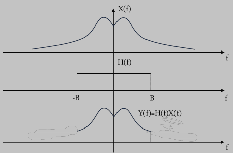
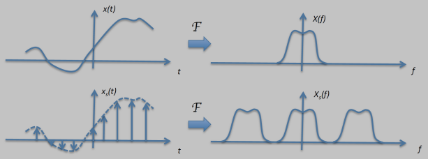
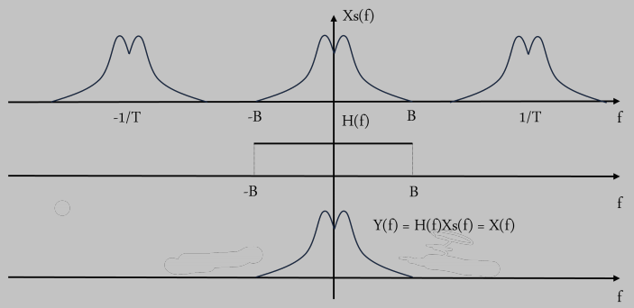

# Linear Processing (TO REVISE)

This chapter focuses on how signals are transformed by an important class of systems known as **Linear Time-Invariant (LTI) systems**. 

We'll define what makes a system LTI and explore two key characterizations: 
* **Impulse response** for time-domain analysis (using convolution)
* **Frequency response** (the Fourier Transform of the impulse response) for understanding how systems act on different frequencies

This understanding will be applied to practical examples like **filters** (e.g., low-pass, high-pass). 

The chapter will also bridge continuous-time concepts to the discrete-time domain, revisiting **sampling theory**, and then delve into **discrete-time LTI systems**, including discrete convolution and frequency analysis using tools like the DFT, touching upon concepts like **circular convolution**.

In short, it's about understanding and analyzing how LTI systems modify signals in both time and frequency domains, for both continuous and discrete signals.

---

## Linear and Time-Invariant Systems

* **System Definition**: A system that takes an input signal $\large x(t)$ and transforms it into an output signal $\large y(t)$. 

    This is represented as $$\Large y(t) = \mathcal{L}\{x(t)\}$$ where $\large \mathcal{L}$ is the **operator representing the system**.

### Property of LTI systems

* **Linearity**: A system is **linear** if it satisfies the **superposition principle**. 

    This means that if you have two inputs $x_1(t)$ and $x_2(t)$ producing outputs $y_1(t)$ and $y_2(t)$ respectively, and $a_1$ and $a_2$ are any constants, then the input $a_1x_1(t) + a_2x_2(t)$ must produce the output $a_1y_1(t) + a_2y_2(t)$.
    
    The **formal condition** is: 
    
    $$\Large \mathcal{L}\{a_1x_1(t) + a_2x_2(t)\} = a_1\mathcal{L}\{x_1(t)\} + a_2\mathcal{L}\{x_2(t)\} = a_1y_1(t) + a_2y_2(t)$$ 
    
    for all $\large x_1(t)$, $\large x_2(t)$, $\large a_1$, and $\large a_2$.

* **Time-Invariance**: A system is **time-invariant** if its **behavior does not change over time**. 

    This means that if an input $x(t)$ produces an output $y(t)$, then a time-shifted version of that input $\large x(t-t_0)$ will produce the same output, **but shifted by the same amount**, $\large y(t-t_0)$, for any $\large x(t)$ and any time shift $\large t_0$.
    
    The formal condition is: 
    
    $$
    \Large \text{If } y(t) = \mathcal{L}\{x(t)\}, \text{ then } \mathcal{L}\{x(t - t_0)\} = y(t - t_0)
    $$

    for all $\large x(t)$ and $\large t_0$.

Systems that possess both these properties (linearity and time-invariance) are called **Linear Time-Invariant (LTI) systems**. 
* They are particularly **important** because they are much **easier to analyze** and are widely used in signal processing.

---

### Impulse Response

* **Convolution Operation**: For LTI system, its output $\large y(t)$ can always be expressed as a function of the input $\large x(t)$ through a mathematical operation called **convolution**:
    $$\Large y(t) = \int_{-\infty}^{\infty} h(\tau)x(t-\tau)d\tau = \int_{-\infty}^{\infty} x(\tau)h(t-\tau)d\tau$$
    This is often written as $\large y(t) = h(t) * x(t)$ or $\large y(t) = x(t) * h(t)$.

    * **How it works**: 
    
        1.  **Reflection (Flipping):** Take one of the signals, say $\large h(\tau)$, and reflect it about the $\large \tau=0$ axis to get $\large h(-\tau)$.
        2.  **Shifting:** Shift this reflected signal $\large h(-\tau)$ by $\large t$ units along the $\large \tau$-axis. 
            * If $\large t$ is **positive**, this is a shift to the **right**; 
            * If $\large t$ is **negative**, it's a shift to the **left**. 
            
            The shifted signal is now $\large h(t-\tau)$ (as a function of $\large \tau$).

        3.  **Multiplication:** Multiply the original input signal $\large x(\tau)$ by this flipped and shifted signal $\large h(t-\tau)$. This product is a function of $\large \tau$.
        4.  **Integration:** Integrate the resulting product $\large x(\tau)h(t-\tau)$ with respect to $\large \tau$ over all possible values of $\large \tau$ (from $\large -\infty$ to $\large \infty$).
    
**IMPORTANT TO NOTE**:
* **Instant Output**: The single value obtained from this definite integral is the output of the system $\large y(t)$ at that **specific time** $\large t$. 
* **Full Output**: To find the complete output signal $\large y(t)$, **this entire process is repeated for every possible value of** $\large t$.

#### Definition of Impulse Response $\large h(t)$

The function $\large h(t)$ in the convolution integral is called the **impulse response** of the LTI system. \
It is defined as the **output of the system when the input is a Dirac delta function $\large \delta(t)$** (an impulse centered at $\large t=0$):
    $$\Large h(t) = \mathcal{L}\{\delta(t)\}$$

The Dirac delta function $\large \delta(t)$ is a theoretical signal that is zero everywhere except at $\large t=0$, where it is infinitely high, yet its integral $\large \int \delta(t)dt = 1$.

**Significance of $\large h(t)$**:
* **CRUCIAL**: The impulse response $\large h(t)$ **completely characterizes in time domain** an LTI system.
* **CONSEQUENCE**: Once you know the impulse response $\large h(t)$ of an LTI system, you can determine its output $\large y(t)$ for **any** input signal $\large x(t)$ using the convolution integral. 
    * This is powerful because **you don't need to know the internal workings or physical structure of the system**; its impulse response provides a complete external description of its behavior.

---

### Frequency Response

While the impulse response characterizes an LTI system in the time domain, the **frequency response** fully characterizes it in the **frequency domain**.

* **Analyzing LTI Systems in Frequency Domain**: LTI systems can also be analyzed by examining how they affect different frequency components of an input signal.
* **Frequency response** $\large H(f)$ of an LTI system is defined as the **Fourier Transform of its impulse response $\large h(t)$**:
    $$\Large H(f) = \mathcal{F}\{h(t)\} = \int_{-\infty}^{\infty} h(t)e^{-j2\pi ft}dt$$
* **Output Spectrum**: If an input signal $\large x(t)$ (which has a Fourier Transform $\large X(f)$) is applied to an LTI system, the Fourier Transform of the output signal $\large Y(f)$ is given by the product of the input signal's spectrum $\large X(f)$ and the system's frequency response $\large H(f)$:
    $$\Large Y(f) = X(f)H(f)$$
    This is a direct consequence of the **convolution property of the Fourier Transform**, for which:
    * **Convolution in time** becomes **Multiplication in frequency**: 
    $$\Large x(t) * h(t) \leftrightarrow X(f)H(f)$$

**Significance of $\large H(f)$**:
* The frequency response $\large H(f)$ **completely describes** how an LTI system affects the **frequency components** of any input signal.
    * The **magnitude** $|H(f)|$ indicates **how much the system amplifies or attenuates** each frequency $f$.
    * The **phase** $\angle H(f)$ indicates the **phase shift** that the system introduces at each frequency $f$.
    
This provides a very powerful and often simpler way to understand and analyze system behavior compared to time-domain convolution, especially when dealing with **filtering operations**.

### Filters

Filters are a fundamental application of LTI systems, designed to selectively modify the frequency content of a signal. They pass certain frequencies while attenuating (blocking) others. 

The **frequency response** $\large H(f)$ of a filter is what defines its **filtering characteristics**.

The slides discuss three ideal types of filters:

#### Low-pass Filter
* **Function**: A low-pass filter allows low-frequency components of a signal to pass through unaltered (or with a certain gain) up to a **cutoff frequency** (let's call it $\large B$ Hz), while completely blocking (setting to zero) all frequencies higher than $\large B$.
* **Frequency Response $\large H(f)$**: For an ideal low-pass filter, the frequency response is a rectangular function in the frequency domain:
    $$\Large H(f) = \text{rect}_{2B}(f)$$
    This means:
    * $\large H(f)=1$ for $\large |f| \le B$ (1 or some constant gain)
    * $\large H(f)=0$ for $\large |f| > B$.
* **Impulse Response $\large h(t)$**: The impulse response of an ideal low-pass filter is the Inverse Fourier Transform of its rectangular frequency response, which is a sinc function:
    $$\Large h(t) = 2B \text{sinc}(2\pi Bt)$$
    * *Note*: 
        * Assuming $\large \text{sinc}(x) = \frac{\sin(x)}{x} \Rightarrow h(t) = 2B \text{sinc}(2\pi Bt)$. 
        * Assuming $\large \text{sinc}(x) = \frac{\sin(\pi x)}{\pi x} \Rightarrow \large h(t) = 2B \text{sinc}(2Bt)$).
* **Effect**: If an input signal $\large x(t)$ passes through this filter, its output spectrum will be $\large Y(f) = X(f)H(f)$, meaning any frequency components $\large X(f)$ where $\large |f| > B$ will be eliminated.

    

#### High-pass Filter
* **Function**: It allows high-frequency components (above **cutoff frequency** $\large B$) to pass through, while blocking low-frequency components (below $\large B$).
* **Frequency Response $\large H(f)$**: For an ideal high-pass filter, the frequency response can be thought of as **$1$ minus the response of an ideal low-pass filter**:
    $$\Large H(f) = 1 - \text{rect}_{2B}(f)$$
    This means:
    * $\large H(f)=0$ for $\large |f| \le B$
    * $\large H(f)=1$ for $\large |f| > B$.
    
* **Impulse Response $\large h(t)$**: The impulse response is the Inverse Fourier Transform of this $\large H(f)$:
    $$\Large h(t) = \delta(t) - 2B \text{sinc}(2\pi Bt)$$
    * *Note*: Again, assuming a definition for sinc, anyway, key concept is it's a **Dirac delta minus the impulse response of the low-pass filter**.
* **Effect**: It removes the DC component and low-frequency variations from a signal, emphasizing rapid changes or high-frequency oscillations.

    

#### Band-pass Filter
* **Function**: A band-pass filter allows frequencies within a specific range (a "***band***") to pass through, while blocking frequencies outside that band (both lower and higher). 

    This band is typically defined by a **center frequency** $\large f_0$ and a **bandwidth**.
    * Let's say the filter passes frequencies in the ranges $\large [f_0 - B, f_0 + B]$ and $\large [-f_0 - B, -f_0 + B]$ for a real filter with a symmetric spectrum.
* **Frequency Response $\large H(f)$**: For an ideal band-pass filter centered at $\large f_0$ with a passband width of $\large 2B$, its frequency response consists of two rectangular functions in the frequency domain:
    $$\Large H(f) = \text{rect}_{2B}(f - f_0) + \text{rect}_{2B}(f + f_0)$$
    This means:
    * $\large H(f)=1$ for $\large f_0 - B \le |f| \le f_0 + B$
    *  $\large H(f)=0$ otherwise.
* **Impulse Response $\large h(t)$**: The impulse response is the Inverse Fourier Transform of this $\large H(f)$:
    $$\Large h(t) = 4B \text{sinc}(2\pi Bt)\cos(2\pi f_0 t)$$
    * *Note*: This form suggests the sinc function is multiplied by a cosine, which shifts the low-pass sinc spectrum to be centered around $\large \pm f_0$.
* **Effect**: It **isolates a specific band of frequencies**. This is common in radio receivers to select a particular station, or in audio processing to isolate specific frequency ranges.

    

#### Ideality and Reality of filters
These "ideal" filters have perfectly sharp cutoffs in the frequency domain, which leads to impulse responses that are infinitely long in the time domain (due to the sinc functions). 
* **IMPORTANT**: Real-world filters can only **approximate** these ideal characteristics.

### From continuous to discrete-time

Many signals that describe physical phenomena are initially **continuous-time** (also called **analog**) signals. For example:
* Audio signals are continuous-time analog pressure waves.
* Images represent continuous-space analog scenes of light.
* Radio signals are analog electromagnetic waves propagating through time and space.

To process these signals using a computer, they must necessarily be **discretized**. This discretization process involves two main aspects:

1.  **Sampling (Domain Discretization):** This refers to discretizing the domain of the signal (e.g., time or space). 
    * For a continuous-time signal $\large x(t)$, sampling means observing its value only at specific, discrete time instants.
2.  **Quantization (Codomain Discretization):** This refers to discretizing the range or values of the signal. The amplitude of each sample is approximated by one of a finite set of possible values.

### Sampling

* **Definition**: The process of discretizing the **domain of a signal** (e.g., time) is called **sampling**.
* **Process for Continuous-Time Signals**: When sampling a continuous-time signal $\large x(t)$, we observe its value at specific, discrete time instants. These instants are typically uniformly spaced, occurring at $\large nT$, where:
    * $\large n$ is an integer ($\large ..., -1, 0, 1, 2, ...$).
    * $\large T$ is a fixed time interval called the **sampling period**.
* **Resulting Discrete-Time Signal**: This process generates a discrete-time signal, denoted as $\large x[n]$, where each sample $\large x[n]$ is equal to the value of the continuous-time signal at the corresponding sampling instant:
    $$\large x[n] = x(nT)$$
* **Sampling Frequency**: The reciprocal of the sampling period, $\large F_s = 1/T$, is known as the **sampling frequency** or sampling rate (measured in **samples per second**, or ***Hertz***, *Hz*).

**QUESTION:** Is it possible to **recover** the original analog signal $\large x(t)$ from its samples $\large x[n] = x(nT)$?

**Effect of Sampling in the Frequency Domain** (*Recap from Chapter 3, slide 47*):

As we saw earlier, the process of sampling can be modeled by multiplying the continuous-time signal $\large x(t)$ with an impulse train $\large \sum_{k=-\infty}^{\infty} \delta(t-kT)$. 

The sampled signal $\large x_s(t)$ is then:
$$\Large x_s(t) = x(t) \sum_{k=-\infty}^{\infty} \delta(t-kT) = \sum_{k=-\infty}^{\infty} x(kT)\delta(t-kT)$$
The Fourier Transform of this sampled signal, $\large X_s(f)$, is a periodized version of the original signal's spectrum $\large X(f)$:
$$\Large X_s(f) = \frac{1}{T}\sum_{k=-\infty}^{\infty} X\left(f-\frac{k}{T}\right) = F_s\sum_{k=-\infty}^{\infty} X(f-kF_s)$$
where $\large F_s = 1/T$ is the ***sampling frequency***.

* **Significance**: This means sampling in the time domain leads to **replication of the spectrum in the frequency domain** at integer multiples of the sampling frequency $\large F_s$.

This relationship between time-domain sampling and frequency-domain periodization is key to understanding when and how $\large x(t)$ can be recovered. 

The possibility of recovery depends on whether these **replicated spectra overlap**.

### Sampling Example Scenarios

Let's examine the different cases for sampling, based on slides 111, 112, and 113, to understand how the original signal can be recovered.

These scenarios hinge on the relationship between the signal's **bandwidth** (let's say its spectrum $\large X(f)$ is zero for $\large |f| > B$) and the **sampling frequency** $\large F_s = 1/T$.

---
#### Case 1 (Slide 106): Signal is Band-limited and $\large T \le \frac{1}{2B}$ (i.e., $\large F_s \ge 2B$)

* The original signal $\large x(t)$ is ***B-band-limited*** to $\large B$ Hz
    * **Condition**: $\large X(f) = 0$ for $\large |f| > B$ 

    The sampling period $\large T$ is chosen such that the sampling frequency $\large F_s = 1/T$ is greater than or equal to **twice the maximum frequency** $\large B$ ($\large F_s \ge 2B$). This is known as the **Nyquist-Shannon sampling criterion**.
* **Effect on Spectrum $\large X_s(f)$**: Because $\large F_s \ge 2B$, the replicas of the original spectrum $\large X(f)$ in $\large X_s(f)$ (which are centered at multiples of $\large F_s$) **do not overlap**. There is a gap (or at least no overlap) between the end of one replica (at $\large B + kF_s$) and the start of the next (at $\large (k+1)F_s - B$).

* **Reconstruction**:
    * Since the baseband spectrum (the replica of $\large X(f)$ centered at $\large f=0$) is undistorted and separate from other replicas, **we can perfectly recover the original spectrum** $\large X(f)$ from $\large X_s(f)$.
    * This is done by applying an **ideal low-pass filter** to $\large X_s(f)$ with a cutoff frequency of $\large B$ (or any frequency between $\large B$ and $\large F_s - B$). This filter will pass the central replica of $\large X(f)$ and eliminate all other higher-frequency replicas.
    * Once $\large X(f)$ is recovered, the original signal $\large x(t)$ can be **recovered via the Inverse Fourier Transform**.
        * The slide shows this: applying a low-pass filter and then rescaling the amplitude (to account for the $\large 1/T$ factor in $\large X_s(f)$) recovers the original spectrum $\large X(f)$.

    

---

#### Case 2 (Slide 107): Signal is Band-limited and $\large T > \frac{1}{2B}$ (i.e., $\large F_s < 2B$)

* **Condition**: The original signal $\large x(t)$ is still band-limited to $\large B$ Hz, but the sampling frequency $\large F_s = 1/T$ is chosen to be **less than twice the maximum frequency** $\large B$ ($\large F_s < 2B$). 
    * This **violates the Nyquist-Shannon criterion**.
* **Effect on Spectrum $\large X_s(f)$**: Because $\large F_s < 2B$, the replicas of $\large X(f)$ in $\large X_s(f)$ now **overlap**. 
    * The tail of one replica extends into the region of the adjacent replica, this overlapping is called ***aliasing***.
* **Reconstruction**:
    * Due to the overlap (*aliasing*), the original spectrum $\large X(f)$ in the baseband (around $\large f=0$) is **corrupted by contributions from the tails of neighboring replicas**
        * Specifically, from $\large X(f-F_s)$ and $\large X(f+F_s)$.
    * It is **impossible** to perfectly recover the original $\large X(f)$ from the aliased $\large X_s(f)$ using a simple low-pass filter, because the high-frequency components of $\large x(t)$ have "folded over" and "disguised" themselves as lower frequencies.
        * This, translate in **loss of information**.

    

---
#### Case 3 (Slide 108): Signal $\large x(t)$ is not band-limited

* **Condition**: The original signal $\large x(t)$ is **not band-limited**, meaning its spectrum $\large X(f)$ extends indefinitely (or at least beyond $\large F_s/2$ for any chosen $\large F_s$).
* **Effect on Spectrum $\large X_s(f)$**: Regardless of how high you make the sampling frequency $\large F_s$, the infinitely wide replicas of $\large X(f)$ in $\large X_s(f)$ will **always overlap**. 
    * **Aliasing is inevitable** in this case.
* **Reconstruction**:
    * **In theory**: Perfect reconstruction of the original $\large x(t)$ from its samples is **theoretically impossible** if the signal is truly not band-limited.
    * **In practice**: Most real-world signals are approximately band-limited or have energy that diminishes rapidly at high frequencies. An "***anti-aliasing filter***" (a low-pass filter) is often applied to the continuous-time signal *before* sampling to forcibly band-limit it and prevent significant aliasing. 
        * This introduces some loss of the original high-frequency content (*truncation*) but prevents more severe aliasing distortion.

    

---

These three cases highlight the importance of the signal's bandwidth and the sampling frequency. 

The **Nyquist-Shannon sampling theorem** formalizes the conditions for perfect reconstruction.

### Nyquist-Shannon Sampling Theorem

The **Sampling Theorem**, provides the theoretical foundation for converting continuous-time signals into discrete-time signals and vice-versa.

* **Statement of the Theorem**:
    If a signal $\large x(t)$ contains **no frequencies higher than $\large B$ Hz** (i.e., it is band-limited to $\large B$), it is completely determined by its samples collected at a rate of $\large 2B$ samples per second, meaning samples taken $\large T = \frac{1}{2B}$ seconds apart.

* **Interpolation Formula (Reconstruction Formula)**:
    The theorem also provides the formula to perfectly reconstruct the original continuous-time signal $\large x(t)$ from its samples $\large x[n] = x(n/(2B))$. 
    
    This is achieved by using a ***sinc interpolation***:
    $$\Large x(t) = \sum_{n=-\infty}^{\infty} x\left(\frac{n}{2B}\right) \text{sinc}\left(2\pi B\left(t - \frac{n}{2B}\right)\right)$$
    
    * Note: Assuming the definition $\large \text{sinc}(y) = \frac{\sin(y)}{y}$. If $\large \text{sinc}(y) = \frac{\sin(\pi y)}{\pi y}$, the argument of the sinc would be $\large 2B(t - n/(2B))$ or $\large (2Bt - n)$.
    
    Each sample $\large x(n/(2B))$ is weighted by a shifted sinc function, and these are summed up to reconstruct the continuous signal. 
    * The sinc function acts as an **ideal interpolation kernel**.

    * ***Interpolation***: Process of reconstructing a continous signal $\large x(t)$ from its discrete samples $\large x[n]$, it estimates values between known sample points to restore the original, or at least approximated, version of the continous signal.

* **Proof Sketch (from the slide)**:
    The proof outlined on the slide refers back to **Case 1** of sampling, where the sampling frequency $\large F_s = 1/T \ge 2B$.
    1. In this case, the spectrum of the sampled signal, $\large X_s(f) = F_s \sum_k X(f - kF_s)$, has non-overlapping replicas of the original spectrum $\large X(f)$.
    2. To recover $\large X(f)$ from $\large X_s(f)$, we multiply $\large X_s(f)$ by the frequency response of an ideal low-pass filter $\large H_{LP}(f)$ (which is a rectangular function of width $\large 2B$ (or $\large F_s$) and appropriate height $T = 1/F_s$ to counteract the $\large F_s$ scaling in $\large X_s(f)$).
    3. In the time domain, this multiplication in frequency corresponds to convolving the sampled signal $\large x_s(t)$ (which is a train of impulses $\large \sum x(nT)\delta(t-nT)$) with the impulse response of the ideal low-pass filter, $\large h_{LP}(t)$.
    4. The impulse response of an ideal low-pass filter with cutoff $\large B$ is a sinc function: $\large h_{LP}(t) = 2B \text{sinc}(2\pi Bt)$ (again, depending on sinc definition).
    5. The convolution $x_s(t) * h_{LP}(t)$ results in the summation formula given above:
    $$\large x(t) = \left( \sum_{n=-\infty}^{\infty} x(nT)\delta(t-nT) \right) * h_{LP}(t) = \sum_{n=-\infty}^{\infty} x(nT)h_{LP}(t-nT)$$
    Substituting $\large T=1/(2B)$ and the form of $\large h_{LP}(t)$ leads to the interpolation formula.

**Key Implications**:
* The Sampling Theorem sets the **minimum sampling rate** ($\large 2B$, the Nyquist rate) required to perfectly reconstruct a **band-limited signal** from its samples.
* It provides the "***how-to***" for reconstruction: ***ideal low-pass filtering*** or, equivalently, ***sinc interpolation***.
* It's a cornerstone of digital signal processing, justifying the entire process of converting analog signals to digital samples for processing and then potentially converting them back to analog.

### Discrete-time LTI systems

The concepts of linearity and time-invariance apply to discrete-time systems in a way that is directly **analogous to continuous-time systems**.

**System Definition**: A discrete-time system is a mapping that transforms an input discrete-time signal $\large x[n]$ into an output discrete-time signal $\large y[n]$. 

$$\Large y[n] = \mathcal{L}\{x[n]\}$$

where $\large \mathcal{L}$ is the system operator.

**Conditions**:

* **Linearity**: A discrete-time system is **linear** if the principle of superposition holds. 

    Formal condition is:
    $$\large \mathcal{L}\{a_1x_1[n] + a_2x_2[n]\} = a_1\mathcal{L}\{x_1[n]\} + a_2\mathcal{L}\{x_2[n]\} = a_1y_1[n] + a_2y_2[n]$$ 
    
    for all $\large x_1[n], x_2[n], a_1, a_2$.

* **Time-Invariance**: A discrete-time system is **time-invariant** (or shift-invariant) if its **behavior doesn't change with a shift in time**.
    
    Formal condition is: 
    
    $$\large \text{If }y[n] = \mathcal{L}\{x[n]\} \Rightarrow \large \mathcal{L}\{x[n - k]\} = y[n - k]$$
     
    for all $\large x[n]$ and integer $\large k$.

Discrite-time systems that satisfy both linearity and time-invariance are called **Discrete-time LTI systems**.

Just like their continuous-time counterparts, these systems are easier to analyze and play a significant role in discrete-time signal processing.

* **Output via Linear Convolution**:
    The output $\large y[n]$ of a discrete-time LTI system can always be expressed as a function of its input $\large x[n]$ through a **linear convolution operation**:
    $$\Large y[n] = \sum_{k=-\infty}^{\infty} h[k]x[n-k]$$
    This is also commonly written as $\large y[n] = h[n] * x[n]$ or $\large x[n] * h[n]$.

* **Discrete Impulse Response $\large h[n]$**:
    * The sequence $\large h[n]$ in this summation is the **discrete impulse response** of the system.
    * It is defined as the output of the system when the input is a discrete-time impulse (Kronecker delta function) $\large \delta[n]$:
        $$\Large h[n] = \mathcal{L}\{\delta[n]\}$$
        where $\large \delta[n] = 1$ for $\large n=0$ and $\large \delta[n] = 0$ for $\large n \ne 0$.

* **Frequency Domain (for finite-length signals)**:
    The slide then considers the case where the input signal $\large x[n]$ and the impulse response $\large h[n]$ are defined over a finite number of points, say $\large N$. Their $\large N$-point DFTs are:
    * Input spectrum: $\Large X[k] = \sum_{n=0}^{N-1} x[n]e^{-j2\pi kn/N}$ for $\large k = 0, ..., N-1$.
    * System's frequency response: $\Large H[k] = \sum_{n=0}^{N-1} h[n]e^{-j2\pi kn/N}$ for $\large k = 0, ..., N-1$. 
        * $\large H[k]$ is the DFT of the finite-length $\large h[n]$

### Discrete-time LTI systems Frequency Behavior

* **Frequency Domain Relationship**:
    Just like in the continuous-time case, if you take the DFT of the output $\large y[n]$ of a discrete-time LTI system, it relates very simply to the DFTs of the input $\large x[n]$ and the impulse response $\large h[n]$.
    If $\large X[k]$ is the DFT of $\large x[n]$ and $\large H[k]$ is the DFT of $\large h[n]$ (for finite-length $\large N$-point sequences), then the DFT of the output, $\large Y[k]$, is given by their product:
    $$\large Y[k] = H[k]X[k]$$
    for $\large k = 0, ..., N-1$.
    * This means that the frequency response $\large H[k]$ (which is the DFT of the impulse response) directly multiplies the input spectrum $\large X[k]$ to produce the output spectrum $\large Y[k]$.

* **The Question of Convolution**:
    A key question arises: If multiplication in the frequency domain ($\large Y[k] = H[k]X[k]$) corresponds to convolution in the time domain, what kind of convolution is $\large y[n]$ when we are dealing with DFTs of finite-length sequences?
* **Circular Convolution**:
    It turns out that for finite-length sequences and their DFTs, this multiplication in the frequency domain corresponds to **circular convolution** in the time domain, not linear convolution.
    $$\large y[n] = \sum_{m=0}^{N-1} h[m]x[[n-m]]_N$$
    where $\large x[[n-m]]_N = x[(n-m) \text{ mod } N]$. 
    
    This means the sequence $\large x[n]$ is treated as if it's periodically extended with period $\large N$. The $\large [[n-m]]_N$ notation indicates that the index is taken modulo $\large N$.

**Significance of Circular Convolution**:
* When using DFTs to analyze or implement LTI systems (whose natural behavior is linear convolution), one must be aware that direct multiplication of DFTs implies circular convolution.
* If linear convolution is desired, techniques like zero-padding the time-domain sequences $\large x[n]$ and $\large h[n]$ to a sufficient length (at least $\large N_x + N_h - 1$) before taking the DFTs are necessary to ensure that the circular convolution result matches the linear convolution result.

### Two-dimensional linear processing

The concepts of LTI systems, impulse response, and convolution can be extended from 1D signals to 2D signals, such as images.

* **2D LTI System Input-Output Relation**:
    For a two-dimensional LTI system, the output $\large y(t_1, t_2)$ is related to the input $\large x(t_1, t_2)$ through a 2D convolution with the system's 2D impulse response $\large h(t_1, t_2)$:
    $$\large y(t_1,t_2) = \int_{-\infty}^{\infty}\int_{-\infty}^{\infty} h(\tau_1, \tau_2)x(t_1 - \tau_1, t_2 - \tau_2)d\tau_1 d\tau_2$$
    This is often written as $\large y(t_1,t_2) = h(t_1,t_2) ** x(t_1,t_2)$, where $\large **$ denotes 2D convolution.

* **2D Frequency Response**:
    The 2D Fourier Transform of the impulse response $\large h(t_1,t_2)$ gives the 2D frequency response of the system, $\large H(f_1, f_2)$.
* **Output Spectrum**:
    Similar to the 1D case, the 2D Fourier Transform of the output signal, $\large Y(f_1, f_2)$, is the product of the 2D Fourier Transform of the input signal, $\large X(f_1, f_2)$, and the system's 2D frequency response $\large H(f_1, f_2)$:
    $$\large Y(f_1, f_2) = H(f_1, f_2)X(f_1, f_2)$$

**Discrete Case (Implicit)**:
While the slide presents the continuous-time formulation, these concepts directly apply to discrete 2D signals (images) as well:
* For discrete images $\large x[m,n]$ and $\large h[m,n]$, the output $\large y[m,n]$ is given by a 2D discrete convolution (a summation).
* The 2D DFT of $\large y[m,n]$, denoted $\large Y[k,l]$, is the product of the 2D DFT of $\large x[m,n]$ (i.e., $\large X[k,l]$) and the 2D DFT of $\large h[m,n]$ (i.e., $\large H[k,l]$).
    $$\large Y[k,l] = H[k,l]X[k,l]$$
    This multiplication of 2D DFTs corresponds to 2D *circular* convolution in the spatial domain if not handled with appropriate padding.

These 2D linear processing concepts are **fundamental in image processing** for tasks like filtering, blurring, sharpening, and deblurring.